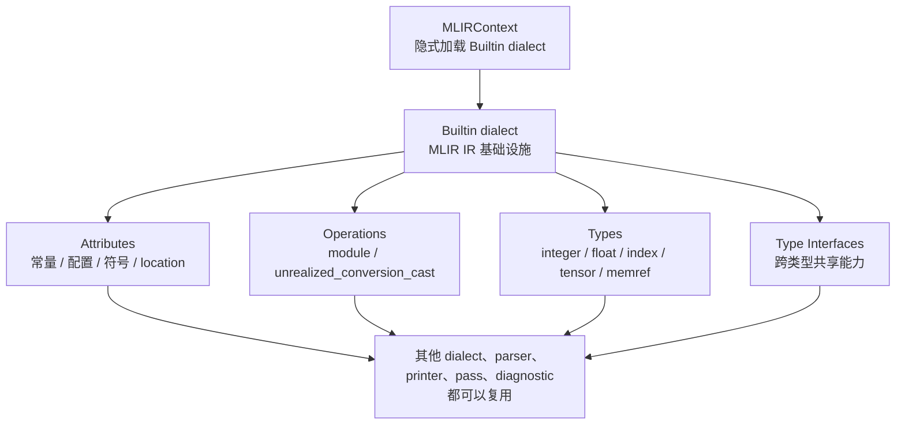
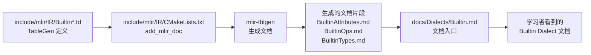
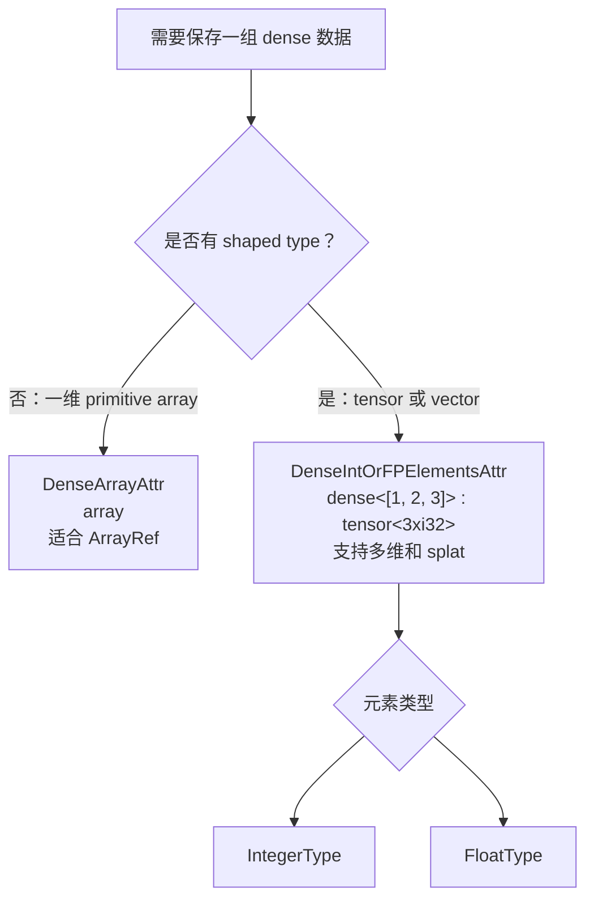
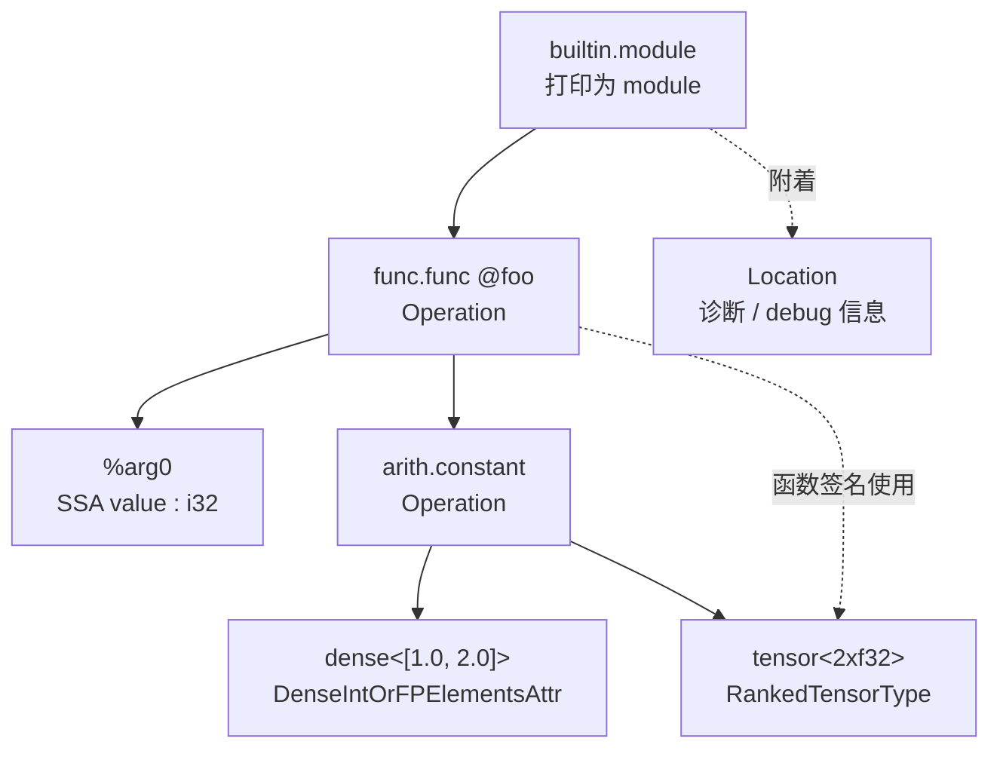
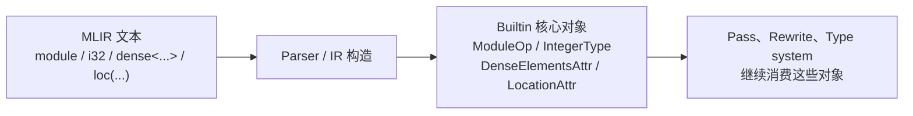

# Builtin Dialect 文档总结与翻译

原始入口文档：

```text
docs/Dialects/Builtin.md
```

相关生成文档来源：

```text
include/mlir/IR/BuiltinAttributes.td
include/mlir/IR/BuiltinLocationAttributes.td
include/mlir/IR/BuiltinOps.td
include/mlir/IR/BuiltinTypes.td
include/mlir/IR/BuiltinTypeInterfaces.td
```

`Builtin.md` 本身很短，但它通过 `[include "..."]` 引入由 TableGen 生成的
Attributes、Location Attributes、Ops、Types、Type Interfaces 文档。因此学习
Builtin dialect 时，不应该只看 `docs/Dialects/Builtin.md` 这个壳文件，也要看
`include/mlir/IR/Builtin*.td`。

先用一张图建立整体印象：Builtin dialect 不是某一个具体领域的 dialect，而是
MLIR IR 自己依赖的基础层。



## 一、Builtin dialect 是什么

Builtin dialect 包含 MLIR IR 最核心的一组：

```text
Attributes
Operations
Types
Type Interfaces
```

这些组件被大量 dialect、pass、parser、printer、symbol table、diagnostic 和
type system 复用。很多 builtin 组件不是某个领域 dialect 的抽象，而是 MLIR
核心 IR 自己成立所必需的基础设施。

因此：

```text
Builtin dialect 会被每个 MLIRContext 隐式加载。
```

这意味着普通用户不需要手动注册 builtin dialect，也能直接使用：

```mlir
module {
  func.func @foo()
}
```

这里的 `module` 就是：

```text
builtin.module
```

Builtin dialect 的影响范围非常大，而 MLIR 又强调可扩展性，所以文档强调：

```text
任何想加入 builtin dialect 的新东西都会被严格审查。
```

原因是：一旦某个概念进入 builtin，它就变成全局基础设施，所有 dialect 和工具
都可能依赖它。普通领域概念更应该放到自己的 dialect，而不是放进 builtin。

## 二、Builtin.md 的文档结构

文档阅读路径可以看成下面这条链：`.td` 是定义来源，`CMake` 调用
`mlir-tblgen` 生成各个 Markdown 片段，`Builtin.md` 再通过 include 组合它们。



`docs/Dialects/Builtin.md` 的结构是：

```text
Builtin Dialect
  Attributes
  Location Attributes
  DistinctAttribute
  Operations
  Types
  Type Interfaces
```

其中大部分内容通过 include 生成：

```markdown
[include "Dialects/BuiltinAttributes.md"]
[include "Dialects/BuiltinLocationAttributes.md"]
[include "Dialects/BuiltinOps.md"]
[include "Dialects/BuiltinTypes.md"]
[include "Dialects/BuiltinTypeInterfaces.md"]
```

这些 `BuiltinAttributes.md`、`BuiltinOps.md` 等不是源码树里手写的普通文档，
而是由 CMake 规则从 `.td` 文件生成的。对应规则在：

```text
include/mlir/IR/CMakeLists.txt
```

核心规则类似：

```cmake
add_mlir_doc(BuiltinAttributes BuiltinAttributes Dialects/ -gen-attrdef-doc)
add_mlir_doc(BuiltinOps BuiltinOps Dialects/ -gen-op-doc)
add_mlir_doc(BuiltinTypes BuiltinTypes Dialects/ -gen-typedef-doc)
add_mlir_doc(BuiltinTypes BuiltinTypeInterfaces Dialects/ -gen-type-interface-docs)
```

所以阅读 builtin 文档时，最重要的源码入口是：

```text
include/mlir/IR/BuiltinAttributes.td
include/mlir/IR/BuiltinLocationAttributes.td
include/mlir/IR/BuiltinOps.td
include/mlir/IR/BuiltinTypes.td
include/mlir/IR/BuiltinTypeInterfaces.td
```

## 三、Attributes

Builtin attributes 是 MLIR 最基础的属性系统。Attribute 通常表示：

```text
编译期常量数据
类型参数
符号引用
布局信息
字典配置
源位置信息
```

它们是不可变对象，存储在 `MLIRContext` 中，常用于 Operation 的属性列表。

常见 builtin attribute 包括：

```text
AffineMapAttr
ArrayAttr
DenseArrayAttr
DenseIntOrFPElementsAttr
DenseStringElementsAttr
DenseResourceElementsAttr
DictionaryAttr
FloatAttr
IntegerAttr
IntegerSetAttr
OpaqueAttr
SparseElementsAttr
StridedLayoutAttr
StringAttr
SymbolRefAttr
TypeAttr
UnitAttr
```

### 3.1 AffineMapAttr

`AffineMapAttr` 用来保存一个 `AffineMap`。

语法：

```mlir
affine_map<(d0) -> (d0)>
affine_map<(d0, d1, d2) -> (d0, d1)>
```

常见用途：

```text
memref layout
affine dialect map
编译期索引映射描述
```

它实现了 `MemRefLayoutAttrInterface`，所以可以作为 memref 的布局属性。

### 3.2 ArrayAttr

`ArrayAttr` 是 attribute 的数组。

语法：

```mlir
[]
[10, i32]
[affine_map<(d0, d1) -> (d0)>, i32, "name"]
```

它适合表达：

```text
一组属性
一组类型参数
一组配置项
ODS 中 ArrayAttr 约束的参数
```

### 3.3 DenseArrayAttr

`DenseArrayAttr` 表示一维 dense primitive array。

语法：

```mlir
array<i8>
array<i32: 10, 42>
array<f64: 42., 12.>
```

它和 `DenseIntOrFPElementsAttr` 的区别是：

```text
DenseArrayAttr:
  一维 flat array
  面向 C++ API 暴露 ArrayRef<T>
  没有 splat 存储优化

DenseIntOrFPElementsAttr:
  多维 tensor/vector elements
  有 shaped type
  可以表达 splat
```

常见子类包括：

```text
DenseI8ArrayAttr
DenseI16ArrayAttr
DenseI32ArrayAttr
DenseI64ArrayAttr
DenseF32ArrayAttr
DenseF64ArrayAttr
```

### 3.4 DenseIntOrFPElementsAttr

`DenseIntOrFPElementsAttr` 表示 dense 的多维整数或浮点 elements。

语法：

```mlir
dense<42> : tensor<4xi32>
dense<[1, 2, 3]> : tensor<3xi32>
dense<[[1.0, 2.0], [3.0, 4.0]]> : tensor<2x2xf32>
```

它的类型必须是：

```text
tensor type
vector type
```

元素类型通常是：

```text
IntegerType
FloatType
```

这类 attribute 常用于：

```mlir
%cst = arith.constant dense<[1, 2, 3]> : tensor<3xi32>
```

也就是把一个编译期常量 tensor/vector 放进 IR。

两种 dense attribute 的选择，可以用“数据形状”来判断：



### 3.5 DenseStringElementsAttr

`DenseStringElementsAttr` 表示 dense 的字符串 elements。

它和 `DenseIntOrFPElementsAttr` 类似，但元素是 string。

适合保存：

```text
字符串 tensor
字符串表
模型或 dialect 特定的字符串常量集合
```

### 3.6 DenseResourceElementsAttr

`DenseResourceElementsAttr` 表示存放在外部 resource 中的 dense elements。

它不是把所有数据直接内联进 IR 文本，而是通过 resource handle 引用外部数据。

适合：

```text
大权重
大常量
不适合直接打印到 .mlir 文本里的数据
```

这是处理大规模模型常量时很重要的机制。

### 3.7 DictionaryAttr

`DictionaryAttr` 是命名属性集合。

它本质上类似：

```text
ArrayRef<NamedAttribute>
```

常见用途：

```text
Operation 的属性字典
函数参数属性
函数返回值属性
dialect 自定义配置
```

MLIR operation 的属性列表在语义上就是一个 dictionary。

### 3.8 FloatAttr / IntegerAttr

`FloatAttr` 保存一个浮点值：

```mlir
42.0 : f32
```

`IntegerAttr` 保存一个整数值：

```mlir
42 : i32
true
```

它们都带类型。也就是说 attribute 不只是保存裸值，还保存值所属的 MLIR type。

例如：

```text
IntegerAttr:
  type = i32
  value = 42
```

### 3.9 IntegerSetAttr

`IntegerSetAttr` 保存一个 `IntegerSet`。

它常用于 affine 相关约束表达，例如：

```text
索引约束
循环约束
整数关系集合
```

### 3.10 OpaqueAttr

`OpaqueAttr` 表示未注册 dialect 的 attribute，或者无法解析成已知 attribute
类的属性。

它保存：

```text
dialect namespace
opaque data
type
```

用途是让 parser/printer 能保留未知 dialect 的属性文本。

### 3.11 SparseElementsAttr

`SparseElementsAttr` 表示稀疏多维 elements。

它通常包含：

```text
indices
values
shaped type
```

适合表达大部分元素为默认值的 tensor/vector 常量。

### 3.12 StridedLayoutAttr

`StridedLayoutAttr` 表示 shaped type 的 strided layout。

典型用于 memref：

```mlir
memref<4x8xf32, strided<[8, 1], offset: 0>>
```

它描述：

```text
offset
strides
```

这个属性是理解 memref layout 的关键。

### 3.13 StringAttr

`StringAttr` 保存字符串。

例子：

```mlir
"hello"
```

它也可以带 type，但普通字符串属性通常不显式写 type。

### 3.14 SymbolRefAttr

`SymbolRefAttr` 保存对 symbol operation 的引用。

常见例子：

```mlir
func.call @foo() : () -> ()
```

这里 `@foo` 在内部就是 symbol reference。

`SymbolRefAttr` 可以表达 nested symbol：

```text
@module::@func
```

它和 `SymbolTable`、`SymbolOpInterface` 密切相关。

### 3.15 TypeAttr

`TypeAttr` 保存一个 MLIR Type。

常见用途：

```text
把 type 当成 operation attribute 保存
ODS 中 TypeAttrOf<...>
函数类型属性
```

例如 `func.func` 的函数类型通常作为属性保存。

### 3.16 UnitAttr

`UnitAttr` 是没有 payload 的 attribute。

它常用来表示 flag：

```mlir
some.op {some_flag}
```

如果某个属性只需要表达“存在/不存在”，就可以使用 `UnitAttr`。

## 四、Location Attributes

Builtin 文档单独列出 Location Attributes，因为它们也是 attribute，但语义上表示
source location。

Operation 可以带 location：

```mlir
%0 = arith.addi %a, %b : i32 loc("add here")
```

Location attributes 用于：

```text
诊断信息
错误定位
debug info
IR 打印
source mapping
```

主要 location attribute 包括：

```text
CallSiteLoc
FileLineColRange
FusedLoc
NameLoc
OpaqueLoc
UnknownLoc
```

### 4.1 CallSiteLoc

`CallSiteLoc` 表示调用点位置。

它包含：

```text
callee location
caller location
```

用于表达：

```text
这个 IR 来自某个被调用函数，同时调用发生在另一个位置
```

这对 inline 后的诊断很重要。

### 4.2 FileLineColRange

`FileLineColRange` 表示文件、行、列范围。

它包含：

```text
filename
start line
start column
end line
end column
```

常见打印类似：

```mlir
loc("file.mlir":10:5)
```

### 4.3 FusedLoc

`FusedLoc` 把多个 location 合成一个。

用途：

```text
一个新 op 由多个旧 op 合成
一个优化结果对应多个源位置
融合、canonicalization、lowering 后保留多来源信息
```

### 4.4 NameLoc

`NameLoc` 给 location 加一个名字。

例如：

```mlir
loc("my_name")
```

它常用于给值、操作或中间结果附加可读名字。

### 4.5 OpaqueLoc

`OpaqueLoc` 保存一个外部系统的位置指针或 opaque 标识。

适合：

```text
外部 frontend 的 AST node
外部 debug object
不能直接序列化成 MLIR 标准 location 的位置
```

### 4.6 UnknownLoc

`UnknownLoc` 表示未知位置。

当没有 source location 时，MLIR 仍然需要一个合法 location 对象，此时通常使用：

```cpp
builder.getUnknownLoc()
```

## 五、DistinctAttribute

`DistinctAttribute` 用于给一个 attribute 包一层唯一身份。

文档中的语法是：

```text
distinct-id ::= integer-literal
distinct-attribute ::= `distinct` `[` distinct-id `]<` attribute `>`
```

例子：

```mlir
#distinct = distinct[0]<42.0 : f32>
#distinct1 = distinct[1]<42.0 : f32>
#distinct2 = distinct[2]<array<i32: 10, 42>>
```

重点是：

```text
多个 DistinctAttribute 可以指向同一个底层 attribute，
但每个 DistinctAttribute 实例都有不同身份。
```

例如：

```mlir
distinct[0]<42.0 : f32>
distinct[1]<42.0 : f32>
```

底层值都是：

```text
42.0 : f32
```

但两个 distinct attribute 不是同一个身份。

### 5.1 为什么需要 DistinctAttribute

它可以给 operation 分组。

例如，假设一些 memory operation 属于同一个 alias group，可以给同组 operation
挂同一个 `DistinctAttribute`：

```text
alias group A -> distinct[0]<...>
alias group B -> distinct[1]<...>
```

这样即使底层 payload 一样，也能区分不同 group。

### 5.2 unique id 什么时候确定

文档强调：

```text
create 函数每调用一次都会分配新的 DistinctAttribute 实例。
实例地址可作为临时唯一标识。
最终打印出来的编号在 pretty printing 阶段生成。
```

这样做的原因是保证打印结果 deterministic，即使多个 distinct attribute 是并行创建的。

这个机制类似 SSA value 名字：

```text
内存里先有对象身份，
打印时再分配稳定文本编号。
```

## 六、Operations

Builtin dialect 的 operation 很少，但非常核心：

```text
builtin.module
builtin.unrealized_conversion_cast
```

源码定义在：

```text
include/mlir/IR/BuiltinOps.td
lib/IR/BuiltinDialect.cpp
```

### 6.1 builtin.module

`builtin.module` 是顶层容器 operation。

例子：

```mlir
module {
  func.func @foo()
}
```

完整名字是：

```text
builtin.module
```

但 builtin dialect 是默认 dialect，所以通常打印为：

```text
module
```

`ModuleOp` 的 traits 包括：

```text
AffineScope
IsolatedFromAbove
NoRegionArguments
SymbolTable
Symbol
OpAsmOpInterface
GraphRegionNoTerminator
```

这些 trait 说明它的语义：

下面把一个最小 IR 的“容器关系”和“附着关系”分开看：Operation 是树的节点，
而 Type、Attribute、Location 是附着在节点或 SSA value 上的描述信息。



```text
AffineScope:
  module 内部可以作为 affine scope。

IsolatedFromAbove:
  module 内部的 operation 不能隐式捕获 module 外部定义的 SSA value。

NoRegionArguments:
  module 的 body region 没有 region arguments。

SymbolTable:
  module 内部可以管理 symbol。

Symbol:
  module 自己也可以是一个 symbol。

GraphRegionNoTerminator:
  module region 是 graph region，不要求 terminator。
```

`ModuleOp` 只有一个 region，region 里有一个 block，block 里可以放任意 operation。

### 6.2 module 的 symbol name

`ModuleOp` 可以有可选 symbol name：

```mlir
module @my_module {
}
```

对应属性：

```text
sym_name
sym_visibility
```

因为 module 实现了 symbol 相关接口，所以可以被其他 symbol reference 引用。

### 6.3 为什么 pass pipeline 常写 builtin.module(...)

`mlir-opt` pipeline 里常见：

```bash
-pass-pipeline='builtin.module(func.func(cse,canonicalize))'
```

这里的 `builtin.module(...)` 表示：

```text
这个 pipeline 锚定在 builtin.module operation 上运行。
```

如果 pass 是：

```cpp
OperationPass<func::FuncOp>
```

那么需要嵌套到：

```text
builtin.module(func.func(pass-name))
```

如果 pass 是：

```cpp
OperationPass<ModuleOp>
```

则可以直接：

```text
builtin.module(pass-name)
```

### 6.4 builtin.unrealized_conversion_cast

`unrealized_conversion_cast` 表示尚未真正实现的类型转换。

它的作用不是执行运行时 cast，而是在 IR conversion 过程中临时连接不同类型系统。

例子：

```mlir
%result = unrealized_conversion_cast %operand : !foo.type to !bar.lowered_type
```

它支持：

```text
0 -> 1
1 -> 1
1 -> N
N -> 1
N -> M
```

文档中的例子包括：

```mlir
%result = unrealized_conversion_cast to !bar.tuple_type<>

%result1 = unrealized_conversion_cast %operand : !foo.type to !bar.lowered_type

%results2:2 = unrealized_conversion_cast %tuple_operand
  : !foo.tuple_type<!foo.type, !foo.type> to !foo.type, !foo.type

%result3 = unrealized_conversion_cast %operand, %operand
  : !foo.type, !foo.type to !bar.tuple_type<!foo.type, !foo.type>
```

### 6.5 unrealized_conversion_cast 和 materialization

在 DialectConversion 里，如果 type conversion 需要在旧类型和新类型之间临时连接，
框架可能插入：

```mlir
builtin.unrealized_conversion_cast
```

这通常表示：

```text
类型转换关系还没有被最终合法 lowering 消除。
```

最终 pipeline 里通常需要：

```text
reconcile-unrealized-casts
```

来清理这些 cast。

如果最终 IR 里还残留大量 unrealized cast，通常说明：

```text
conversion pipeline 不完整
source/target type materialization 没处理好
某些 op 没有被完全 lowering
```

## 七、Types

Builtin types 是 MLIR 类型系统的基础。

常见类型包括：

```text
complex
float types
function
graph
index
integer
memref
none
opaque
ranked tensor
tuple
unranked memref
unranked tensor
vector
```

源码定义在：

```text
include/mlir/IR/BuiltinTypes.td
include/mlir/IR/BuiltinTypes.h
lib/IR/BuiltinTypes.cpp
```

### 7.1 ComplexType

语法：

```mlir
complex<f32>
complex<i32>
```

`complex<T>` 表示复数，由两个 `T` 组成：

```text
real part
imaginary part
```

元素类型必须是 integer scalar 或 floating-point scalar。

### 7.2 Floating-point types

Builtin dialect 定义了大量浮点类型，包括传统 IEEE 类型和 ML/AI 常用低精度类型。

常见类型：

```text
f16
bf16
f32
f64
f80
f128
tf32
```

低精度浮点：

```text
f8E5M2
f8E4M3
f8E4M3FN
f8E5M2FNUZ
f8E4M3FNUZ
f8E4M3B11FNUZ
f8E3M4
f4E2M1FN
f6E2M3FN
f6E3M2FN
f8E8M0FNU
```

命名大致表示：

```text
E = exponent bits
M = mantissa bits
FN = finite values only, no infinity
FNUZ = finite values only, no negative zero
```

这些类型对 AI compiler 很重要，因为模型权重、activation 和矩阵乘常使用
低精度浮点。

### 7.3 FunctionType

`FunctionType` 表示从一组输入类型到一组结果类型的映射。

语法大致是：

```mlir
(i32, f32) -> f64
(i32, f32) -> (f64, i1)
```

它通常用于：

```text
func.func 的函数签名
call-like op 的 callee type
函数类型属性
```

例如：

```mlir
func.func @foo(%arg0: i32) -> f32
```

内部函数签名就是 `FunctionType`。

### 7.4 GraphType

`GraphType` 和 `FunctionType` 类似，也是 inputs 到 results 的映射。

它用于 graph 风格抽象，不如 `FunctionType` 常见。

### 7.5 IndexType

`index` 是平台相关位宽的整数类类型。

语法：

```mlir
index
```

它常用于：

```text
loop induction variable
memref/tensor dimension
affine/scf indexing
shape calculation
```

注意：

```text
index 不是固定 i32 或 i64。
```

它的具体位宽取决于目标平台或 lowering 策略。

### 7.6 IntegerType

整数类型语法：

```mlir
i1
i8
i16
i32
i64
si32
ui32
```

MLIR 整数类型可以带 signedness semantics：

```text
signless
signed
unsigned
```

最常见的是：

```text
i32
```

也就是 signless integer。

为什么有 signless？

因为很多 IR operation 自己决定如何解释整数，例如：

```mlir
arith.divsi
arith.divui
arith.cmpi slt
arith.cmpi ult
```

同一个 `i32` 可以被 signed op 或 unsigned op 以不同语义解释。

### 7.7 MemRefType

`memref` 表示对内存区域的 shaped reference。

例子：

```mlir
memref<4x8xf32>
memref<?x?xf32>
memref<4x8xf32, strided<[8, 1], offset: 0>>
memref<4xf32, 1>
```

它包含：

```text
shape
element type
layout
memory space
```

`memref` 和 `tensor` 的关键区别：

```text
tensor:
  value semantics
  更偏数学值
  通常不可变

memref:
  reference semantics
  指向内存
  可 load/store
```

### 7.8 NoneType

`none` 是 unit type。

语法：

```mlir
none
```

它表示没有有意义 payload 的类型，使用场景相对少。

### 7.9 OpaqueType

`OpaqueType` 表示未注册 dialect 的 type。

语法大致包含：

```text
dialect namespace
opaque type data
```

它用于保留未知 dialect 的 type 文本，保证 parser/printer 可以 round-trip。

### 7.10 RankedTensorType

`tensor` 表示固定 rank 的多维数组值。

例子：

```mlir
tensor<4xf32>
tensor<4x8xf32>
tensor<?x8xf32>
tensor<*xf32>
```

严格来说：

```text
tensor<4x8xf32> 是 RankedTensorType
tensor<*xf32> 是 UnrankedTensorType
```

Ranked tensor 包含：

```text
rank
shape
element type
encoding attribute
```

`?` 表示动态维度：

```mlir
tensor<?x8xf32>
```

rank 已知是 2，但第 0 维大小运行时才知道。

### 7.11 TupleType

`tuple` 是固定大小的类型集合。

例子：

```mlir
tuple<i32, f32>
tuple<tensor<4xf32>, i1>
```

它表示多个类型组合成一个类型。

在很多 lowering 中，tuple 可能会被展开成多个 SSA value。

### 7.12 UnrankedMemRefType

语法：

```mlir
memref<*xf32>
```

它表示 rank 未知的 memref。

包含：

```text
element type
memory space
```

但不包含静态 rank。

### 7.13 UnrankedTensorType

语法：

```mlir
tensor<*xf32>
```

它表示 rank 未知的 tensor。

这和：

```mlir
tensor<?x?xf32>
```

不同：

```text
tensor<?x?xf32>:
  rank 已知是 2，每一维大小动态。

tensor<*xf32>:
  rank 自身也未知。
```

### 7.14 VectorType

`vector` 表示 SIMD vector 类型。

例子：

```mlir
vector<4xf32>
vector<4x8xf32>
vector<[4]xf32>
```

它用于：

```text
SIMD
vector dialect
lowering 到 LLVM vector
GPU/CPU 向量化
```

`vector` 和 `tensor` 都可以有 shape，但语义不同：

```text
tensor:
  抽象数学数组值

vector:
  更接近目标硬件或中间层 SIMD 值
```

## 八、Type Interfaces

Builtin type interfaces 定义了一些跨类型共享的能力。

主要包括：

```text
VectorElementTypeInterface
FloatTypeInterface
MemRefElementTypeInterface
PtrLikeTypeInterface
ShapedTypeInterface
```

### 8.1 VectorElementTypeInterface

表示某个 type 可以作为 vector element type。

例如：

```mlir
vector<4xf32>
vector<4xi32>
```

这里 `f32`、`i32` 都是合法 vector element type。

### 8.2 FloatTypeInterface

浮点类型接口。

它提供浮点语义相关查询，例如：

```text
getFloatSemantics()
```

不同 float type 可以通过这个接口暴露自己的 APFloat semantics。

### 8.3 MemRefElementTypeInterface

表示某个 type 可以作为 memref element type。

例如：

```mlir
memref<4xf32>
memref<4xi32>
```

### 8.4 PtrLikeTypeInterface

表示指针类 type。

它用于把某些类型统一看成 pointer-like 类型，方便 data layout、lowering 或
target-specific 逻辑处理。

### 8.5 ShapedTypeInterface

表示 shaped type 的通用接口。

典型 shaped type：

```text
RankedTensorType
UnrankedTensorType
MemRefType
UnrankedMemRefType
VectorType
```

它抽象了：

```text
rank
shape
element type
dynamic dimension
```

所以很多分析和变换可以不关心具体是 tensor、memref 还是 vector，只通过
`ShapedTypeInterface` 处理。

## 九、Builtin dialect 和 MLIR 核心 IR 的关系

Builtin dialect 不是普通业务 dialect。

普通 dialect 可能定义：

```text
linalg.matmul
arith.addi
func.func
memref.load
```

Builtin dialect 定义的是更底层的 IR 基础：

```text
module 容器
基础属性
基础类型
source location
unrealized conversion cast
```

可以把它理解为：

```text
MLIR IR 的地基层。
```

如果没有 builtin dialect，很多基础语法都无法表达：

```mlir
module {
}
```

```mlir
tensor<4xf32>
```

```mlir
"hello"
```

```mlir
loc("file.mlir":1:1)
```

## 十、和你最近学习内容的联系

### 10.1 pass pipeline

你之前遇到过：

```text
expected pass pipeline to be wrapped with the anchor operation type
```

这是因为 pipeline 需要锚定到 operation，例如：

```bash
-pass-pipeline='builtin.module(func.func(cse,canonicalize))'
```

这里的 `builtin.module` 就来自 builtin dialect。

### 10.2 rewrite pattern

你写的：

```mlir
%0 = arith.addi %arg0, %c0 : i32
```

里面虽然 op 是 `arith.addi`，但类型和 attribute 很多来自 builtin：

```text
i32              -> Builtin IntegerType
function type    -> Builtin FunctionType
module           -> Builtin ModuleOp
location         -> Builtin LocationAttr
```

### 10.3 dialect conversion

DialectConversion 中经常出现：

```mlir
unrealized_conversion_cast
```

它就是 builtin op，用来临时连接 source type 和 target type。

如果 conversion 后还残留：

```mlir
builtin.unrealized_conversion_cast
```

通常说明转换链还没有完全收敛。

### 10.4 canonicalize / cse

`canonicalize` 和 `cse` 通常跑在：

```text
builtin.module
func.func
```

这两个 anchor 中，`builtin.module` 是整个 IR 文件最常见的顶层容器。

## 十一、阅读源码建议

按这个顺序看最合适：

```text
1. docs/Dialects/Builtin.md
2. include/mlir/IR/BuiltinDialect.td
3. include/mlir/IR/BuiltinOps.td
4. include/mlir/IR/BuiltinTypes.td
5. include/mlir/IR/BuiltinAttributes.td
6. include/mlir/IR/BuiltinLocationAttributes.td
7. include/mlir/IR/BuiltinTypeInterfaces.td
8. lib/IR/BuiltinDialect.cpp
9. lib/IR/BuiltinTypes.cpp
10. lib/IR/BuiltinAttributes.cpp
```

如果只想快速建立概念：

```text
先理解 builtin.module、IntegerType、IndexType、TensorType、MemRefType、
DenseElementsAttr、DictionaryAttr、SymbolRefAttr、LocationAttr。
```

这些会在几乎所有 MLIR 学习任务里反复出现。

## 十二、最小例子

下面这个 IR 同时包含多个 builtin 概念：

```mlir
module @example {
  func.func @foo(%arg0: i32) -> tensor<2xf32> {
    %cst = arith.constant dense<[1.0, 2.0]> : tensor<2xf32>
    return %cst : tensor<2xf32>
  }
}
```

对应关系：

```text
module @example
  -> builtin.module

@example / @foo
  -> symbol / SymbolRefAttr 相关机制

i32
  -> Builtin IntegerType

tensor<2xf32>
  -> Builtin RankedTensorType + Builtin Float32Type

dense<[1.0, 2.0]> : tensor<2xf32>
  -> DenseIntOrFPElementsAttr

函数签名 (%arg0: i32) -> tensor<2xf32>
  -> FunctionType
```

## 十三、总结

最后用一张“从文本到核心对象”的速记图收束：



Builtin dialect 的核心作用是：

```text
提供 MLIR IR 自身不可或缺的基础 operation、attribute、type 和 interface。
```

它不是用来承载普通业务语义的地方。普通编译器语义应该进入对应 dialect，例如
`arith`、`func`、`memref`、`tensor`、`linalg`、`scf` 等。

最重要的几个概念是：

```text
builtin.module:
  顶层 IR 容器，也是 pass pipeline 最常见 anchor。

builtin.unrealized_conversion_cast:
  dialect conversion 中的临时类型桥。

Builtin attributes:
  表达编译期常量、符号引用、字典、类型、布局、location。

Builtin types:
  表达 MLIR 基础类型系统，包括 integer、float、index、tensor、memref、vector。

Location attributes:
  支撑诊断和 debug source mapping。

Type interfaces:
  给 shaped type、float type、vector element type 等提供统一抽象。
```

学习 MLIR 时，Builtin dialect 是理解 IR 文本、pass pipeline、type system、
attribute system 和 dialect conversion 的基础。
