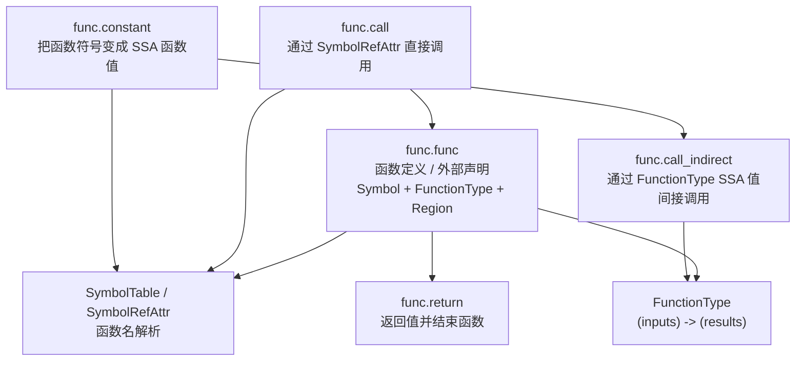
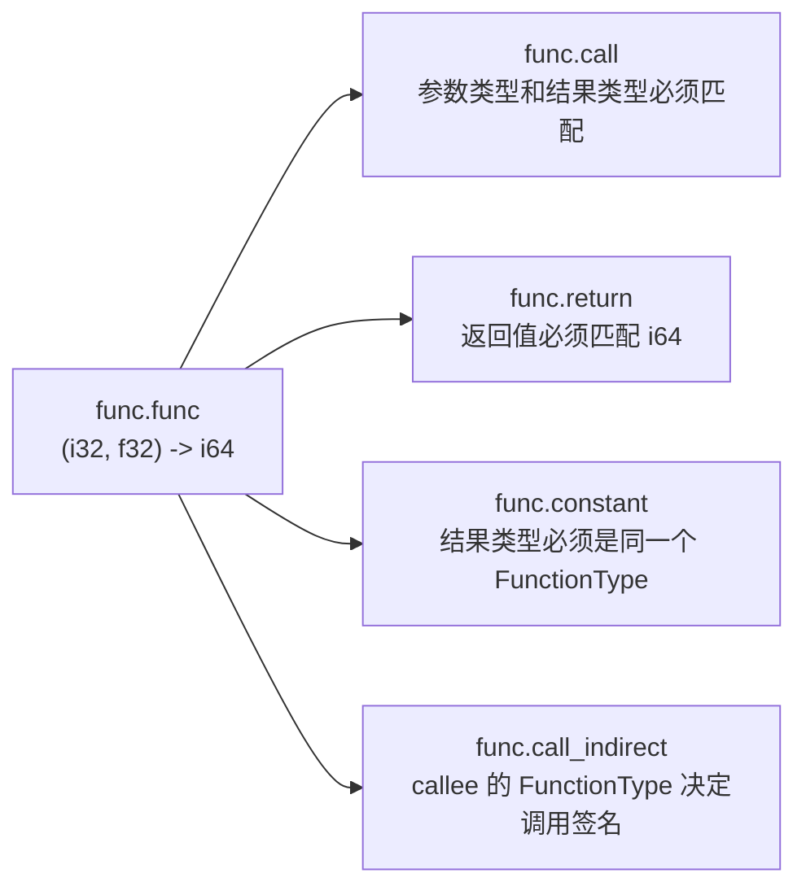
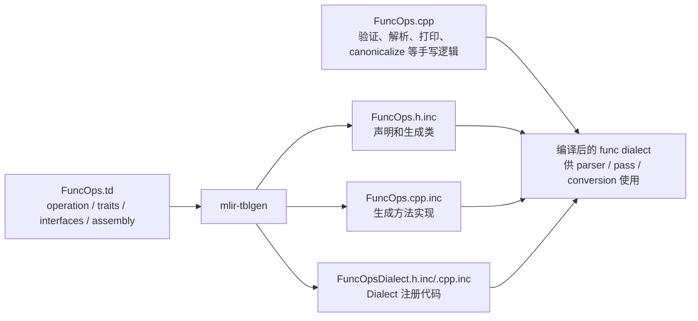

# Func Dialect

原始文档：

```text
docs/Dialects/Func.md
```

核心 ODS 定义：

```text
include/mlir/Dialect/Func/IR/FuncOps.td
```

实现和生成规则：

```text
lib/Dialect/Func/IR/FuncOps.cpp
include/mlir/Dialect/Func/IR/CMakeLists.txt
```

## 一、Func dialect 解决什么问题

`func` dialect 提供 MLIR 中比较通用的函数抽象，主要描述：

```text
函数定义或函数声明
直接函数调用
间接函数调用
函数符号转成 SSA 中的函数值
函数返回
```

它不是某一种硬件或语言的最终 ABI，而是很多 lowering、inlining、调用图分析和
类型转换都可以使用的中间层函数模型。

当前 dialect 的 operation 可以概括为：



核心理解是：

```text
func.func 是被定义/声明的函数。
func.call 是按名字调用函数。
func.constant 是把函数名字物化成 SSA 中的函数值。
func.call_indirect 是通过这个函数值调用。
func.return 是函数内部的终结 operation。
```

## 二、函数的基本 IR 结构

最小函数例子：

```mlir
func.func @add(%lhs: i32, %rhs: i32) -> i32 {
  %result = arith.addi %lhs, %rhs : i32
  return %result : i32
}
```

可以按下面的层次理解：

```text
func.func @add
  ├── SymbolName: @add
  ├── FunctionType: (i32, i32) -> i32
  └── Region
      └── Block
          ├── Block arguments: %lhs : i32, %rhs : i32
          ├── arith.addi
          └── func.return
```

函数参数在文本中写成：

```mlir
func.func @add(%lhs: i32, %rhs: i32) -> i32
```

但内部不是把参数作为普通 attribute 保存，而是作为函数 body 第一个 block 的
block arguments。函数的返回类型则保存在 `FunctionType` 中，`func.return` 必须
与它匹配。

## 三、func.func：函数定义和外部声明

### 3.1 函数定义

带 body 的 `func.func` 是一个包含单个 SSACFG region 的 operation：

```mlir
func.func @square(%x: i32) -> i32 {
  %y = arith.muli %x, %x : i32
  return %y : i32
}
```

`FuncOp` 的关键 traits/interface 包括：

```text
FunctionOpInterface
IsolatedFromAbove
AffineScope
AutomaticAllocationScope
OpAsmOpInterface
```

其中最重要的是 `IsolatedFromAbove`：

```text
函数内部不能隐式捕获函数外部的 SSA value。
```

错误的思路：

```mlir
// %outside 由函数外部产生，不能直接被函数体隐式使用。
func.func @bad() {
  arith.addi %outside, %outside : i32
  return
}
```

正确的方式是把值作为参数传入：

```mlir
func.func @good(%x: i32) {
  %y = arith.addi %x, %x : i32
  return
}
```

函数需要访问外部实体时，通常使用符号或 attribute 建立显式连接，例如
`func.call @callee(...)`。

### 3.2 外部函数声明

没有 body 的 `func.func` 是外部声明：

```mlir
func.func private @abort()
func.func private @print_i32(i32)
```

可以把它理解成：

```text
有名字
有 FunctionType
没有 Region body
isDeclaration() / isExternal() 为 true
```

外部声明常用于：

```text
模块外部实现的运行库函数
稍后由 ABI lowering 处理的函数
跨模块可见的符号
```

### 3.3 函数属性

函数本身、参数和结果可以携带 dialect attribute：

```mlir
func.func @foo(%x: i32 {mydialect.readonly})
    -> i32 {mydialect.result_kind = "value"} {
  return %x : i32
}
```

ODS 中对应的字段主要是：

```text
sym_name       -> 函数符号名
function_type  -> FunctionType
sym_visibility -> public / private / nested 等可见性
arg_attrs      -> 参数 attribute 字典数组
res_attrs      -> 结果 attribute 字典数组
no_inline      -> 禁止 inline 的标记
```

参数和结果 attribute 的数组位置必须与函数签名中的参数/结果位置对应。

## 四、FunctionType 是函数调用的契约

函数类型表达为：

```text
(输入类型...) -> (结果类型...)
```

例如：

```mlir
func.func @mix(i32, f32) -> (i64, index)
```

它的 `FunctionType` 是：

```text
(i32, f32) -> (i64, index)
```

这个类型同时约束：

```text
func.func 的签名
func.call 的 operands 和 results
func.call_indirect 的 callee、operands 和 results
func.constant 产生的 SSA 函数值
func.return 的 operands
```

因此可以把 `FunctionType` 看成函数系统中的统一契约：



## 五、func.call：按符号直接调用

例子：

```mlir
func.func @add(%a: i32, %b: i32) -> i32 {
  %r = arith.addi %a, %b : i32
  return %r : i32
}

func.func @main(%x: i32, %y: i32) -> i32 {
  %r = func.call @add(%x, %y) : (i32, i32) -> i32
  return %r : i32
}
```

`func.call` 的关键字段是：

```text
callee   -> FlatSymbolRefAttr，例如 @add
operands -> 实际参数 SSA values
results  -> 调用结果 SSA values
```

验证过程大致是：

```text
1. 查找 callee symbol。
2. 确认它解析到一个 FuncOp。
3. 检查 operand 数量是否等于函数输入数量。
4. 检查每个 operand 类型是否匹配。
5. 检查 result 数量和类型是否匹配。
```

所以这段是错误的：

```mlir
%r = func.call @add(%x) : (i32) -> i32
```

因为 `@add` 需要两个输入，而调用只提供了一个 operand。

`func.call` 实现了 `CallOpInterface` 和 `SymbolUserOpInterface`，因此通用的调用
分析、符号解析、inlining 等基础设施可以识别它。

## 六、func.constant：把函数符号转成 SSA 函数值

MLIR 不允许 SSA operand 直接指向一个函数 operation。为了让函数可以进入 SSA
数据流，需要显式使用 `func.constant`：

```mlir
%fn = func.constant @add : (i32, i32) -> i32
```

这里：

```text
@add                         -> SymbolRefAttr
%fn                          -> SSA value
%fn 的类型                   -> (i32, i32) -> i32
```

`func.constant` 会验证：

```text
@add 必须能解析到一个 func.func。
声明的 FunctionType 必须与 @add 的函数类型完全一致。
```

这样设计与 MLIR 的多线程编译模型有关：不让 SSA value 直接持有函数 operation
引用，可以简化 IR 的并发访问和符号管理。

## 七、func.call_indirect：通过函数值间接调用

例子：

```mlir
func.func @add(%a: i32, %b: i32) -> i32 {
  %r = arith.addi %a, %b : i32
  return %r : i32
}

func.func @main(%x: i32, %y: i32) -> i32 {
  %fn = func.constant @add : (i32, i32) -> i32
  %r = func.call_indirect %fn(%x, %y)
      : (i32, i32) -> i32
  return %r : i32
}
```

direct call 和 indirect call 的区别：

```text
func.call:
  callee 是符号属性。
  例如 @add。

func.call_indirect:
  callee 是一个 FunctionType SSA value。
  例如 %fn。
```

`func.call_indirect` 的第一个 operand 是 callee，后续 operands 才是实参：

```text
operands = [%fn, %x, %y]
         = [callee, arg0, arg1]
```

它通过 `TypesMatchWith` 保证：

```text
callee 的输入类型 == 实际参数类型
callee 的结果类型 == call_indirect 的结果类型
```

如果 `func.call_indirect` 的 callee 最终被 `func.constant` 固定为一个函数符号，
Func dialect 自带的 canonicalization 可以把它折叠成 `func.call`：

```text
func.constant @add + func.call_indirect
                 ↓ canonicalize
func.call @add
```

## 八、func.return：函数的终结 operation

`func.return` 只能出现在 `func.func` 内部：

```mlir
func.func @id(%x: i32) -> i32 {
  return %x : i32
}
```

它具有：

```text
HasParent<FuncOp>
ReturnLike
Terminator
Pure
```

验证逻辑在 `lib/Dialect/Func/IR/FuncOps.cpp` 中，核心规则是：

```text
return operand 数量 == 外层函数结果数量
return operand[i] 类型 == 函数结果类型[i]
```

因此：

```mlir
func.func @bad() -> i32 {
  return
}
```

会因为缺少返回值而验证失败。

无返回值函数则写成：

```mlir
func.func @log() {
  return
}
```

## 九、从 ODS 到生成代码

Func dialect 的 operation 不是手写完整 C++ 类，而是主要由 `FuncOps.td` 描述：



对应 CMake 规则是：

```cmake
mlir_tablegen(FuncOps.h.inc -gen-op-decls)
mlir_tablegen(FuncOps.cpp.inc -gen-op-defs)
mlir_tablegen(FuncOpsDialect.h.inc -gen-dialect-decls)
mlir_tablegen(FuncOpsDialect.cpp.inc -gen-dialect-defs)
add_mlir_dialect_tablegen_target(MLIRFuncOpsIncGen)
add_mlir_doc(FuncOps FuncOps Dialects/ -gen-op-doc)
```

学习 `Func` dialect 时可以采用这条源码路径：

```text
docs/Dialects/Func.md
  ↓
include/mlir/Dialect/Func/IR/FuncOps.td
  ↓
include/mlir/Dialect/Func/IR/FuncOps.h
  ↓
lib/Dialect/Func/IR/FuncOps.cpp
  ↓
FunctionOpInterface / CallOpInterface / SymbolTable
```

## 十、和 pass、conversion 的关系

### 10.1 pass pipeline anchor

因为 `func.func` 是一个 operation，所以 pass 可以锚定在它上面：

```bash
-pass-pipeline='builtin.module(func.func(canonicalize))'
```

含义是：在 `builtin.module` 下找到函数 operation，在每个 `func.func` 内运行
`canonicalize`。

### 10.2 inlining 和调用分析

`func.call` 的调用目标是符号，`FuncOp` 实现了函数相关 interface，因此通用
inliner 和调用图基础设施可以理解：

```text
调用者是谁
被调用者是谁
参数/结果类型是什么
函数是否有 body
函数是否是 external declaration
```

### 10.3 lowering

Func dialect 往往是较高层的函数表示，后续可以 lowering 到：

```text
LLVM dialect
EmitC
SPIR-V 或其他目标相关 dialect
```

因此不要把 `func.func` 直接等同于 LLVM IR 的最终函数。它首先是 MLIR 中间层的
通用函数语义，目标 ABI 由后续 conversion 决定。

## 十一、最小完整例子

```mlir
module {
  func.func @add(%a: i32, %b: i32) -> i32 {
    %r = arith.addi %a, %b : i32
    return %r : i32
  }

  func.func @main(%x: i32, %y: i32) -> i32 {
    %direct = func.call @add(%x, %y) : (i32, i32) -> i32
    %fn = func.constant @add : (i32, i32) -> i32
    %indirect = func.call_indirect %fn(%x, %y)
        : (i32, i32) -> i32
    return %direct : i32
  }
}
```

对应关系：

```text
module
  -> builtin.module

func.func @add
  -> 一个有 body 的 FuncOp

func.call @add
  -> 通过 @add 符号直接调用

func.constant @add
  -> 通过 @add 符号生成 FunctionType SSA value

func.call_indirect %fn
  -> 通过 SSA 函数值间接调用

func.return
  -> 检查返回值与函数结果签名一致，并结束 block
```

## 十二、总结

`Func` dialect 的核心可以压缩成一句话：

```text
用 FunctionType 描述调用契约，用 FuncOp 保存函数，用 SymbolRef 做直接调用，
用 func.constant + call_indirect 表达函数值和间接调用，用 func.return 结束函数。
```

最重要的区别：

```text
func.func       = 函数本体/声明
func.call       = 符号直接调用
func.constant   = 符号 -> SSA 函数值
func.call_indirect = SSA 函数值调用
func.return     = 返回并结束函数
```

当你看到一段 MLIR 中的函数代码时，建议按这个顺序分析：

```text
1. 先看 func.func 的名字和 FunctionType。
2. 判断它是否有 body，还是 external declaration。
3. 看 block arguments 是否对应输入类型。
4. 看 func.call 的符号是否能解析到目标 FuncOp。
5. 遇到 func.constant 时，检查 FunctionType 是否匹配目标函数。
6. 最后检查每个 func.return 是否匹配函数结果类型。
```
