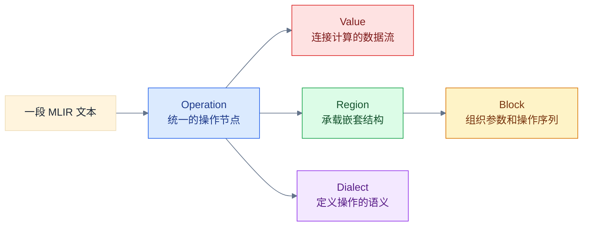

# 图解 MLIR：阅读地图

## 这套图解解决什么问题

这套文章用一段持续演化、可以通过 `mlir-opt` 验证的 IR，依次解释
`Operation`、`Value`、`Region`、`Block` 和 `Dialect` 如何共同组成 MLIR。

它不会把类名和语法规则孤立地罗列出来，而是反复观察同一个例子：先看文本，
再看内存对象关系，最后回到源码确认。读完第一册，你应该能够回答“这一段 IR
在内存中由什么对象组成”，并知道下一步该去哪个头文件验证。

## 适合谁阅读

- 知道编译器和 IR 的基本概念，但还无法独立阅读 MLIR。
- 看过零散的 MLIR API，却没有形成完整对象关系。
- 希望从可运行例子进入 MLIR 源码，而不是从类定义开始背诵。

## 第一册的主线



先检查从“一段 MLIR 文本”指向 `Operation` 的箭头：文本中的计算节点和结构节点
都先被解析为统一的操作对象。再检查从 `Operation` 出发的四条关系；它们分别引出
后续的 `Value`、`Region`/`Block` 和 `Dialect` 章节。

## 推荐阅读顺序

1. [为什么 MLIR 中一切都是 Operation](01_Why_Everything_Is_An_Operation.md)
2. Value 如何把计算连接成 SSA 数据流
3. Region 为什么让结构可以递归嵌套
4. Block 如何容纳参数和有序操作
5. Dialect 如何赋予 Operation 名字与语义
6. 从文本到对象树：完整走读 `accumulate.mlir`

第一阶段只完成第 1 章；其余标题是阅读路线预告，不代表内容已经落盘。

进入变换主题时有两条配套路线：

- [Phase 1 CUDA/Triton Kernel 基础](Phase1Fundamentals/00_Reading_Map.md)：从 GPU 执行模型、
  正确测量、CUDA tiled matmul 到 Triton fused linear。
- [Transformation 机制小册](Transformation/00_Reading_Map.md)：按 Pass、Pattern、Conversion、
  Transform Dialect 分机制深入。
- [Phase 2 Transformation Bridge](Phase2Bridge/00_Reading_Map.md)：按 GPU CodeGen Phase 2 的
  Week 5–10 实验与 Exit Gate 串联图解。

## 图中的颜色约定

| 颜色 | 表示的对象或语境 |
|---|---|
| 蓝色 | `Operation`，包括计算节点和结构节点 |
| 绿色 | `Region`，表示嵌套结构的区域 |
| 黄色 | `Block`，表示参数和有序操作序列 |
| 红色 | `Value` 与 SSA 数据流 |
| 紫色 | `Dialect`、类型及具体语义 |
| 灰色 | 源码、工具、位置信息等上下文 |

不同图会省略与当前问题无关的关系，但同一种颜色始终保持同一种语义。

## 如何运行配套示例

第一册共享的源文件是 [`examples/accumulate.mlir`](examples/accumulate.mlir)。
从 `llvm-project` 仓库根目录运行：

```bash
build/bin/mlir-opt \
  mlir/LearningSteps/IllustratedMLIR/examples/accumulate.mlir \
  -o /tmp/illustrated-mlir-accumulate.mlir
```

命令成功且没有诊断，表示示例能够被当前构建的解析器读取，并通过已注册操作的验证。
输出文件同时展示 `mlir-opt` 规范化打印后的 SSA 名称和操作格式。

## 当前完成状态

| 内容 | 状态 |
|---|---|
| 共享示例 `accumulate.mlir` | 已完成并通过 `mlir-opt` |
| 第 1 章：Operation 心智模型 | 已完成 |
| 第 2—6 章 | 待后续阶段展开 |
