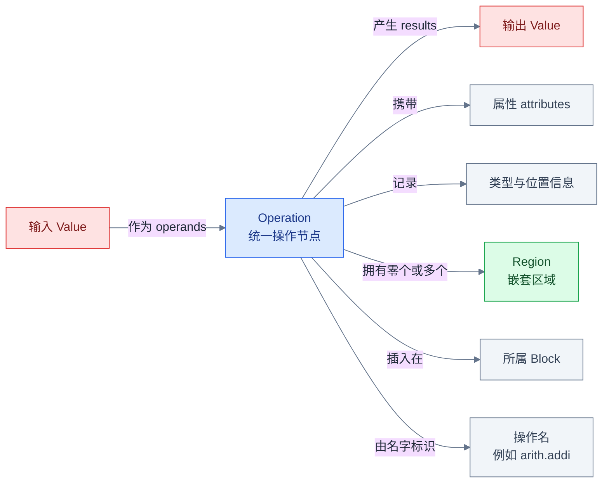
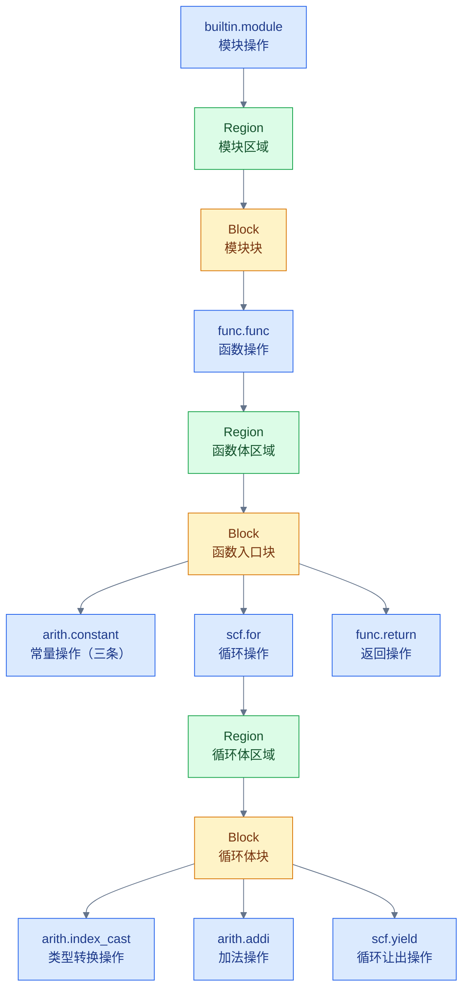
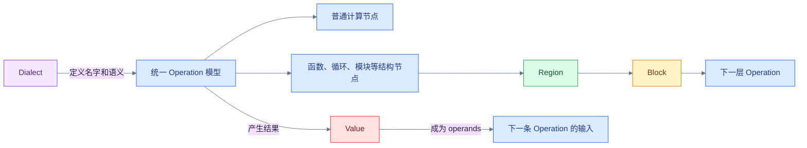

# 为什么 MLIR 中一切都是 Operation

## 从一个反直觉的问题开始

打开 [`accumulate.mlir`](examples/accumulate.mlir)，会看到常量、加法、函数、循环和
模块。为什么性质如此不同的东西，都可以叫作 Operation？函数和循环难道不应该是
比“指令”更高一层的特殊语法结构吗？

这个问题很重要，因为它决定了我们如何阅读 MLIR：如果把 `func.func`、`scf.for`
当成解析器临时识别的关键字，就会错过 MLIR 最核心的统一抽象；如果把“一切都是
Operation”无限扩大，又会误以为 `Value`、`Type`、`Region` 和 `Block` 也继承自
`Operation`。本章要把这条边界画清楚。

## 先说结论：Operation 是统一的 IR 节点

MLIR 用 `Operation` 表示可执行的计算节点，也用它表示模块、函数、循环等结构节点。
因此 `arith.addi` 和 `func.func` 在语义上差别很大，在内存中却都具有统一的
`Operation` 基础表示：都有名字，可以有输入、结果、属性、位置信息和嵌套 Region。

这里的“一切”特指**可执行和结构性的 IR 节点**。`Type`、`Attribute`、`Region`、
`Block` 和 `Value` 都是独立的 IR 概念，并不是 Operation。统一模型的价值在于，
通用遍历、打印、诊断和重写基础设施可以先处理 `Operation`，需要具体语义时再进入
某个 Dialect 定义的操作类型。

## 一条 Operation 里面有什么



先沿红色节点检查数据流：operands 和 results 建立的是 Operation 与 `Value` 的关系，
输入和输出并不内嵌成另一条 Operation。再沿绿色节点检查结构：嵌套代码从 Operation
拥有的 Region 进入，Region 内部还要经过 Block 才能到达下一层 Operation。

一条 Operation 的通用构成包括：

- 唯一的操作名，例如 `arith.addi`；名字中的前缀通常是 Dialect 命名空间。
- 零个或多个 operand，以及零个或多个 result；二者通过 `Value` 形成 SSA 数据流。
- 属性、结果类型和源位置等描述信息。
- 控制流后继 Block（仅某些操作需要）。
- 零个或多个 Region，用来承载函数体、循环体等嵌套结构。
- 一个所属 Block；顶层 Operation 在构造或转移过程中也可能暂时没有父 Block。

## 函数和循环为什么也能是 Operation

传统 IR 容易让人把“指令”和“函数容器”看成两套对象。MLIR 选择让结构节点也遵守
Operation 模型：`func.func` 通过 Region 拥有函数体，`scf.for` 通过 Region 拥有
循环体，`builtin.module` 通过 Region 拥有顶层 Block。这样，新的 Dialect 可以定义
自己的结构操作，而不必修改一套固定的编译器 AST 节点枚举。

下面是本册共享的完整示例：

```mlir
module {
  func.func @accumulate(%n: index) -> i32 {
    %c0 = arith.constant 0 : i32
    %lb = arith.constant 0 : index
    %step = arith.constant 1 : index

    %result = scf.for %i = %lb to %n step %step
        iter_args(%sum = %c0) -> i32 {
      %value = arith.index_cast %i : index to i32
      %next = arith.addi %sum, %value : i32
      scf.yield %next : i32
    }

    return %result : i32
  }
}
```

文本中的主要节点可以逐个归入 Dialect，而不需要发明“非 Operation 的特殊语法节点”：

| 文本中的节点 | 所属 Dialect | 为什么是 Operation |
|---|---|---|
| `module` | `builtin` | 容纳顶层 Region 的结构节点 |
| `func.func` | `func` | 描述函数并拥有函数体 Region |
| `arith.constant` | `arith` | 产生 SSA 结果的计算节点 |
| `scf.for` | `scf` | 描述循环并拥有循环体 Region |
| `arith.addi` | `arith` | 消费两个 Value 并产生一个 Value |
| `scf.yield` | `scf` | 将循环体结果交回父操作 |
| `func.return` | `func` | 从函数返回 Value |

`module` 是 `builtin.module` 的自定义简写语法。打印时省略 `builtin.` 前缀，不会改变
它属于 Builtin Dialect 的事实。类似地，示例中的 `return` 由 `func.func` 的默认
Dialect 规则解析为 `func.return`。

## 把 accumulate.mlir 还原成对象树



从顶部向下检查蓝、绿、黄三种节点是否交替遵守所有权链：Operation 拥有 Regions，
Region 拥有 Blocks，Block 再拥有一列有序的 Operations。`scf.for` 的循环体不是
它直接保存的任意子 Operation 数组；必须经过循环 Region 和循环体 Block，才能到达
`arith.index_cast`、`arith.addi` 和 `scf.yield`。

图中把三条连续的 `arith.constant` 合并为一个显示节点，只是为了节省版面；真实对象树
中它们是函数入口 Block 中三个按顺序排列、彼此独立的 Operation。

## Operation 与 Op 不是同一个层次

阅读 MLIR C++ 代码时，经常同时看到 `Operation *` 和 `arith::AddIOp`。它们不是两棵
分别拥有生命周期的 IR 树：

```text
Operation
  运行时的通用 IR 对象，保存名字、输入、结果、属性、Region 等统一数据。

arith::AddIOp / func::FuncOp / scf::ForOp
  面向具体操作的轻量 C++ 包装，提供类型安全访问器和语义接口，底层仍指向 Operation。
```

`Operation` 负责通用存储和所有权；具体 `Op` 包装器让代码能够调用诸如循环上下界、
函数符号名等类型安全接口。包装器通常具有值语义，可以从 `Operation *` 检查并构造，
但不会因此复制或另外拥有底层 IR 节点。Toy 教程对 Operation 通用组成和 Dialect 注册
过程的说明，是理解这两层 API 的合适入口。

## 回到 C++ 源码验证

不要只记住图，应该用当前 checkout 中的定义验证每条所有权关系：

| 要验证的事实 | 当前源码入口 |
|---|---|
| `Operation` 的通用存储和访问接口 | [`include/mlir/IR/Operation.h`](../../include/mlir/IR/Operation.h) |
| `Region` 保存 Block 列表 | [`include/mlir/IR/Region.h`](../../include/mlir/IR/Region.h) |
| `Block` 保存参数和有序 Operation 列表 | [`include/mlir/IR/Block.h`](../../include/mlir/IR/Block.h) |
| `Value`、`BlockArgument`、`OpResult` | [`include/mlir/IR/Value.h`](../../include/mlir/IR/Value.h) |
| `builtin.module` 的定义 | [`include/mlir/IR/BuiltinOps.td`](../../include/mlir/IR/BuiltinOps.td) |

可以重点查找这些证据：`Operation` 的 trailing storage 包含 Region 和 operand 等通用数据；
`Region::getBlocks()` 返回 Block 列表；`Block::getOperations()` 返回有序 Operation 列表；
`Value` 的底层实现由 `BlockArgument` 或 `OpResult` 表示。`BuiltinOps.td` 中的 `ModuleOp`
则明确声明一个 body Region。

进一步阅读：

- [IR 结构技术总结](../Foundations/Step1_IR_Structure_Summary.md)
- [ODS Operation 定义总结](../ODS/Operations_Summary.md)
- [Builtin Dialect 总结](../Dialects/Builtin_Dialect_Summary.md)
- [Phase 2 核心基础设施总结](../Transforms/Phase2_Core_Infrastructure_Summary.md)
- [Understanding the IR Structure](../../docs/Tutorials/UnderstandingTheIRStructure.md)
- [Toy 教程第 2 章](../../docs/Tutorials/Toy/Ch-2.md)

## 三个常见误区

1. **“一切都是 Operation”，所以 Value 也是 Operation。** 错。`Value`、`Type`、
   `Attribute`、`Region` 和 `Block` 都有自己的职责和表示，不是 Operation。
2. **`func.func` 和 `scf.for` 只是语法层的特殊关键字。** 错。它们是已注册操作的
   文本形式，解析后仍进入统一 Operation 模型，并由各自 Dialect 提供具体语义。
3. **父 Operation 直接保存所有子 Operation。** 错。递归结构通过
   Operation → Region → Block → Operation 形成；Operation 不直接保存任意子
   Operation 数组。

## 一张图总结本章



先看上半条结构链：统一模型同时容纳计算节点和结构节点，结构节点通过 Region、Block
递归到下一层 Operation。再看下半条数据链：Operation 的 result 是 Value，Value 又成为
下一条 Operation 的 operand。最后看紫色箭头：Dialect 为具体 Operation 提供名字和语义，
但不改变底层的统一表示。

## 本章验证记录

验证环境：

- `build/bin/mlir-opt --version`：LLVM 23.0.0git，Optimized build。
- `/home/fuhao/.npm-global/bin/mmdc --version`：11.12.0。

使用的 IR 解析与验证命令：

```bash
build/bin/mlir-opt \
  mlir/LearningSteps/IllustratedMLIR/examples/accumulate.mlir \
  -o /tmp/illustrated-mlir-accumulate.mlir
```

结果：退出码为 0，无解析或 verifier 诊断；规范化输出仍包含 `func.func`、
`arith.constant`、`scf.for`、`arith.index_cast`、`arith.addi`、`scf.yield` 和
`func.return`（打印为 `return`）。

使用的图表渲染命令：

```bash
mkdir -p /tmp/illustrated-mlir-chapter1/assets
/home/fuhao/.npm-global/bin/mmdc \
  -i mlir/LearningSteps/IllustratedMLIR/01_Why_Everything_Is_An_Operation.md \
  -o /tmp/illustrated-mlir-chapter1/rendered.md \
  -a /tmp/illustrated-mlir-chapter1/assets -t default -b white
```

结果：使用沙箱外无头浏览器渲染，退出码为 0；三个 Mermaid fence 均生成 SVG，
没有图表语法诊断。

## 继续阅读

下一章将把本章图里的红色关系放大：区分 `OpResult` 与 `BlockArgument`，并沿
def-use 链观察 `accumulate.mlir` 中的 SSA `Value` 如何把多条 Operation 连接起来。
在继续之前，请尝试只看对象树图，指出 `scf.for` 的输入、结果、Region 和所属 Block。
