# Phase 1 图解：CUDA 与 Triton Kernel 基础

## 这套小册解决什么问题

本册对应
[`Phase1_CUDA_Triton_Kernel_Fundamentals.md`](../../Plans/GPU_CodeGen/Phases/Phase1_CUDA_Triton_Kernel_Fundamentals.md)，
把 Week 1–4 从任务清单展开成可以执行、验证和复盘的 GPU 基础路线。


Phase 1 的主线是“先正确，再测量，再优化”：

```text
环境可复现
  → 输入/输出语义固定
  → CPU/PyTorch reference 正确
  → CUDA 错误与越界检查通过
  → warmup + 同步 + GPU 计时
  → profiler 证据
  → 参数 ablation
  → 解释结果而不是只报最快数字
```

## 阅读顺序

1. [Week 1：CUDA 执行模型与 Vector Add](01_CUDA_Execution_and_Vector_Add.md)
2. [Week 2：RTX 4090 验收与 GPU 测量纪律](02_GPU_Measurement_Discipline.md)
3. [Week 3：Reduction、Naive Matmul 与 Tiled Matmul](03_Reduction_and_CUDA_Matmul.md)
4. [Week 4：Triton Blocked Model 与 Fused Linear](04_Triton_and_Fused_Linear.md)

## 每章产出

| 周次 | 代码产出 | 证据产出 | Exit Gate |
|---|---|---|---|
| Week 1 | CUDA vector add、CMake | 本地环境、执行层级图、错误检查 | 能解释 hierarchy，边界 case 正确 |
| Week 2 | event timing、环境脚本 | CSV、memcheck、`.ncu-rep` | RTX 4090 与 profiler 权限真实可用 |
| Week 3 | reduction、naive/tiled matmul | 非整除测试、TFLOPS、ncu | 能解释 tiling、coalescing 和瓶颈 |
| Week 4 | Triton add/softmax/matmul/fused linear | correctness、autotune、benchmark | 独立实现 fused linear 并说明精度 |

## 统一实验目录

```text
LearningSteps/GPUCodeGenCapstone/
├── README.md
├── progress.md
├── environment/
│   ├── local.md
│   └── rtx4090.md
├── cuda/
│   ├── CMakeLists.txt
│   ├── vector_add.cu
│   ├── reduction.cu
│   ├── matmul_naive.cu
│   └── matmul_tiled.cu
├── triton_kernels/
│   ├── vector_add.py
│   ├── fused_softmax.py
│   ├── matmul.py
│   └── fused_linear.py
├── scripts/
├── profiles/
│   └── ncu/
├── results/
│   └── experiments/
└── docs/
    └── cuda_kernel_notes.md
```

目录名不是形式要求：环境、源码、原始 profiler report、结构化 CSV 和解释性笔记必须分开，
才能追溯“这条结论来自哪次运行、哪个二进制、哪台机器”。

## 证据链

```mermaid
flowchart LR
    ENV["环境快照<br/>GPU/driver/CUDA/commit"] --> BIN["可复现构建"]
    BIN --> CORR["CPU/PyTorch reference<br/>correctness"]
    CORR --> SAFE["CUDA errors + memcheck"]
    SAFE --> TIME["同步后的 event/do_bench"]
    TIME --> CSV["median/P20/P80"]
    CSV --> PROF["ncu report"]
    PROF --> NOTE["瓶颈解释与下一假设"]

    classDef code fill:#dcfce7,stroke:#16a34a,color:#14532d;
    classDef measure fill:#fef3c7,stroke:#d97706,color:#78350f;
    classDef context fill:#f1f5f9,stroke:#64748b,color:#334155;
    class ENV,BIN context;
    class CORR,SAFE code;
    class TIME,CSV,PROF,NOTE measure;
```



缺少任意一环时，性能数字都难以复现或解释。特别是：

- 只运行 `ncu --query-metrics` 不能证明有 performance-counter 权限；
- 只比较一次 wall-clock 不能证明 kernel latency；
- 只测整除尺寸不能证明边界正确；
- 只看 occupancy 不能单独确定瓶颈；
- 只报告最快 autotune config 会掩盖测试空间和失败组合。

## 图中颜色

| 颜色 | 含义 |
|---|---|
| 绿色 | CUDA kernel、设备执行与内存层级 |
| 黄色 | 计时、Profiler、CSV 和性能证据 |
| 紫色 | Triton program、blocked model 与配置 |
| 蓝色 | MLIR/后续编译器阶段 |
| 灰色 | 环境、构建、host 代码与控制流程 |

---

下一章：[Week 1：CUDA 执行模型与 Vector Add →](01_CUDA_Execution_and_Vector_Add.md)

