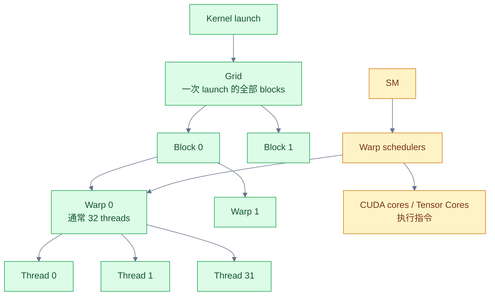
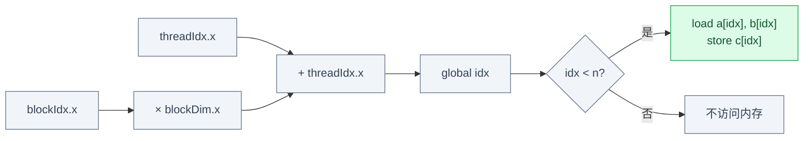
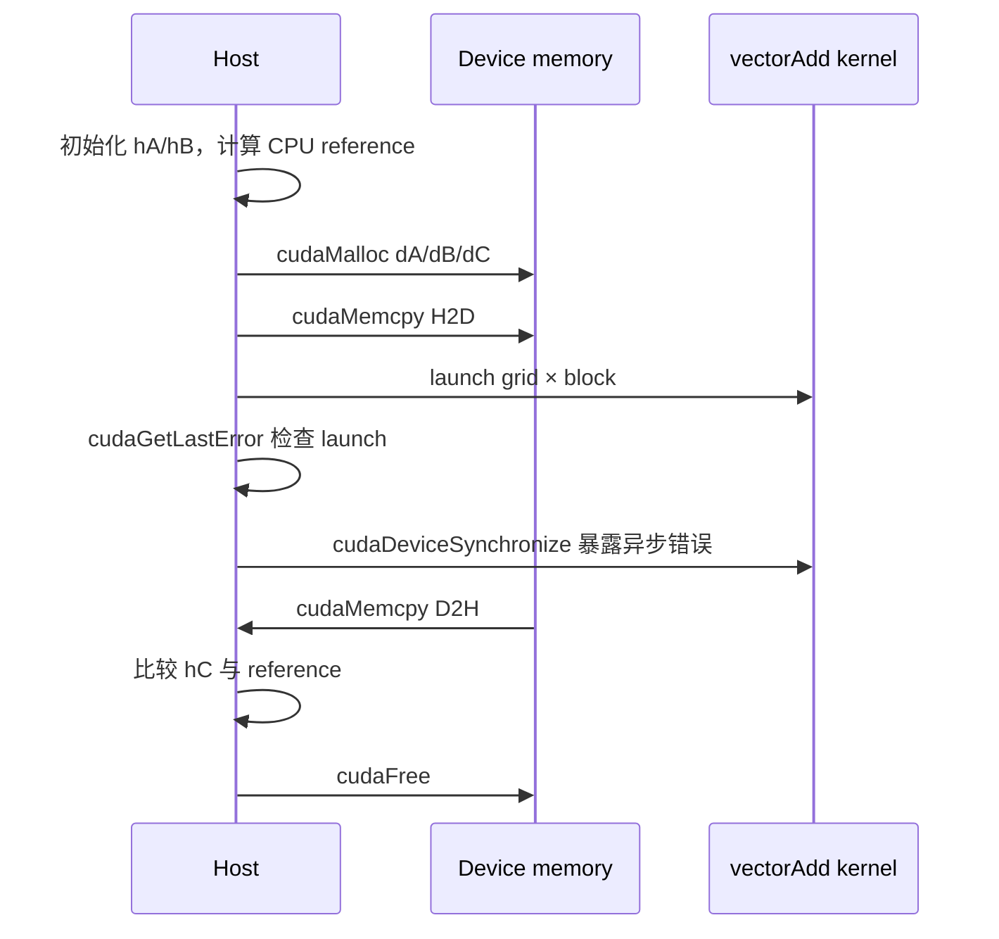
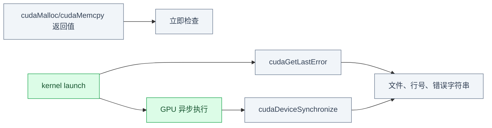

# Week 1：CUDA 执行模型与 Vector Add

## 执行层级



| 层级 | 软件含义 | 关键资源/约束 |
|---|---|---|
| Grid | 一次 kernel launch 的全部工作 | grid dimensions |
| Block | 可协作的一组 threads | shared memory、barrier，调度到一个 SM |
| Warp | 硬件执行/调度的一组 threads | SIMT divergence、active lanes |
| Thread | 一个逻辑执行实例 | registers、local state |
| SM | 驻留并执行多个 blocks/warps | registers、shared memory、warp slots |

Block 不是固定绑定到某个 CUDA core；它被调度到 SM，SM 内的 warp scheduler 选择 ready warps
发射指令。Tensor Core 也不是“每个 thread 独占一个”的资源。

## Vector Add 的索引

```cpp
__global__ void vectorAdd(const float *a, const float *b,
                          float *c, int64_t n) {
  int64_t idx =
      static_cast<int64_t>(blockIdx.x) * blockDim.x + threadIdx.x;
  if (idx < n)
    c[idx] = a[idx] + b[idx];
}
```



Launch：

```cpp
int threads = 256;
int blocks = static_cast<int>((n + threads - 1) / threads);
vectorAdd<<<blocks, threads>>>(dA, dB, dC, n);
```

向上取整会产生多余 threads，所以 `idx < n` 不是优化选项，而是正确性条件。`n=1025` 专门
验证最后一个不完整 block。

## Host/Device 数据流



CPU reference 必须独立计算：

```cpp
for (int64_t i = 0; i < n; ++i)
  reference[i] = a[i] + b[i];
```

不要用 GPU 输出构造 reference，也不要只打印前几个元素。

## CUDA 错误检查

```cpp
#define CUDA_CHECK(expr)                                                \
  do {                                                                  \
    cudaError_t error = (expr);                                         \
    if (error != cudaSuccess) {                                         \
      fprintf(stderr, "%s:%d CUDA error: %s\n",                         \
              __FILE__, __LINE__, cudaGetErrorString(error));           \
      std::exit(EXIT_FAILURE);                                          \
    }                                                                   \
  } while (false)
```

调用：

```cpp
CUDA_CHECK(cudaMalloc(&dA, bytes));
CUDA_CHECK(cudaMemcpy(dA, hA.data(), bytes, cudaMemcpyHostToDevice));

vectorAdd<<<blocks, threads>>>(dA, dB, dC, n);
CUDA_CHECK(cudaGetLastError());       // launch/configuration error
CUDA_CHECK(cudaDeviceSynchronize());  // 异步执行错误
```



只检查 launch 不能发现所有运行期越界；只在程序末尾检查一次又会丢失错误来源。

## 三组边界测试

| `n` | 目的 |
|---:|---|
| 1 | 最小输入、绝大多数 lanes masked |
| 1025 | 非整 block，验证 grid ceil 和边界 |
| `1 << 20` | 正常吞吐规模 |

比较浮点结果：

```cpp
bool close(float actual, float expected) {
  float absError = std::abs(actual - expected);
  float scale = std::max(std::abs(actual), std::abs(expected));
  return absError <= 1e-6f + 1e-5f * scale;
}
```

Vector add 的运算简单，容差应严格；后续 reduction/matmul 由于累加顺序不同，需要重新定义。

## 最小 CMake

```cmake
cmake_minimum_required(VERSION 3.24)
project(GPUCodeGenCapstone LANGUAGES CXX CUDA)

add_executable(vector_add vector_add.cu)
set_target_properties(vector_add PROPERTIES
  CXX_STANDARD 17
  CXX_STANDARD_REQUIRED YES
  CUDA_STANDARD 17
  CUDA_STANDARD_REQUIRED YES)
```

构建：

```bash
cmake -S $CAPSTONE/cuda -B $CAPSTONE/cuda/build -G Ninja
cmake --build $CAPSTONE/cuda/build --target vector_add
$CAPSTONE/cuda/build/vector_add
```

## 环境记录与租赁清单

本地快照：

```bash
uname -a
cmake --version
ninja --version
$MLIR_BIN/mlir-opt --version
$MLIR_BIN/llvm-lit --version
git rev-parse HEAD
```

RTX 4090 验收表必须预留：

```text
GPU exact name
VRAM
driver version
CUDA toolkit/runtime
power limit
SM/memory clocks
temperature
ncu version
nsys version
performance-counter permission
persistent storage path
```

版本号存在不等于工具有权限。Performance counter 必须到 Week 2 用真实 kernel profiling 验证。

## 目录与工件检查

```bash
test -f $CAPSTONE/cuda/vector_add.cu
test -f $CAPSTONE/environment/local.md
test -f $CAPSTONE/environment/rtx4090.md
test -f $CAPSTONE/progress.md
find $CAPSTONE -maxdepth 2 -type d | sort
```

`progress.md` 应记录命令、返回结果、日期和失败原因，不能只写“完成”。

## 常见错误

| 错误 | 后果 |
|---|---|
| blocks 使用整除而非向上取整 | 尾部元素未计算 |
| 没有 `idx < n` | 非整 block 越界 |
| 只检查 `cudaGetLastError` | 运行期异步错误可能漏掉 |
| D2H 前不建立同步/错误边界 | 错误定位模糊 |
| 没有 CPU reference | “程序没崩”被误当正确 |
| 用裸 wall-clock 测 kernel | 测到 enqueue 或混入拷贝 |

## 源码与文档地图

| 问题 | 阅读入口 |
|---|---|
| Grid/Block/Thread 与硬件执行 | CUDA Programming Guide：Programming Model、Hardware Implementation |
| Kernel/launch syntax | CUDA Programming Guide：Kernels |
| Runtime 错误 | CUDA Runtime API：Error Handling |
| 官方 host/device 流程 | CUDA Samples：vectorAdd |
| CUDA17 target | CMake `CUDA_STANDARD`、`add_executable` |

## Week 1 Exit Gate

- [ ] 能准确解释 grid、block、warp、thread、SM 的关系。
- [ ] `vector_add.cu` 有向上取整、`idx < n`、CPU reference。
- [ ] API、launch 和异步错误都有检查。
- [ ] `n=1/1025/1<<20` 全部通过。
- [ ] CMake 明确请求 C++17/CUDA17。
- [ ] 本地环境包含版本与 Git commit。
- [ ] RTX 4090 租赁验收表已准备。
- [ ] 目录验证命令及输出写入 `progress.md`。

---

上一章：[← Phase 1 阅读地图](00_Reading_Map.md)  
下一章：[Week 2：RTX 4090 验收与 GPU 测量纪律 →](02_GPU_Measurement_Discipline.md)

