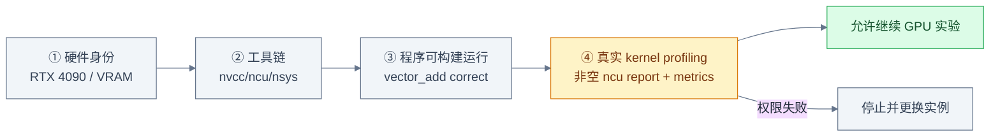
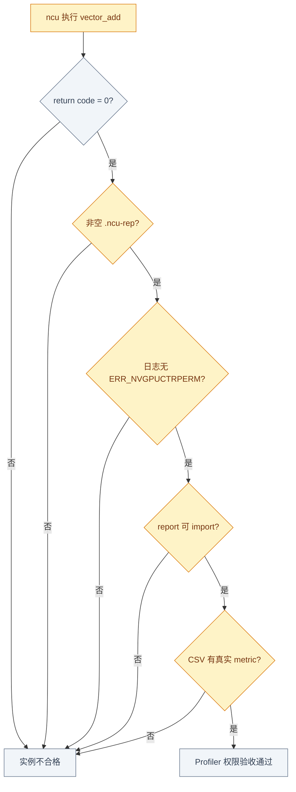
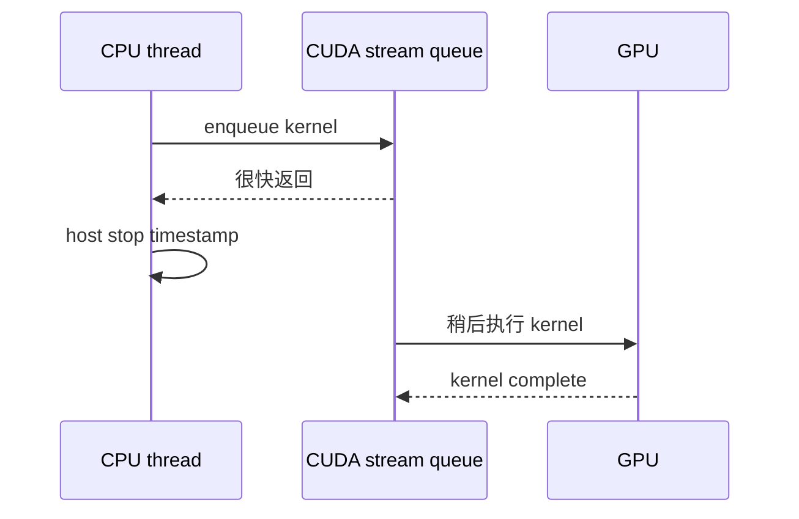
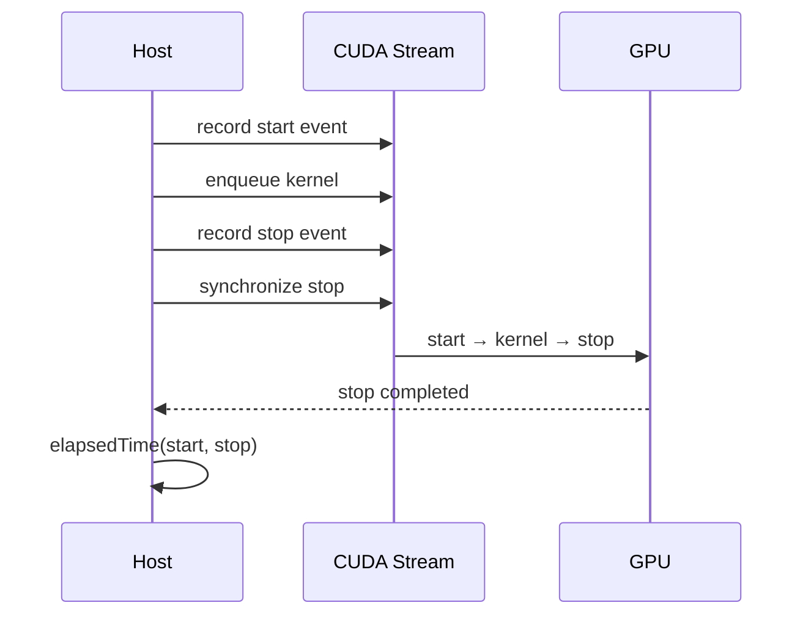
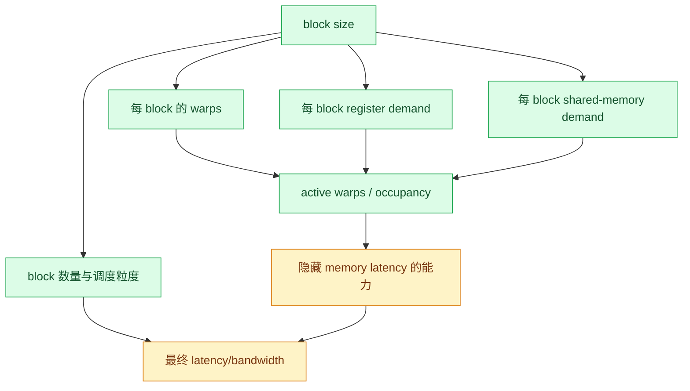

# Week 2：RTX 4090 验收与 GPU 测量纪律

## 租到 GPU 不等于环境可用

完整验收需要四层证据：



`ncu --version` 成功只说明二进制存在；列出 metric 名称也不要求实际访问硬件计数器。必须对真实
kernel 采集 report，才能验证 `ERR_NVGPUCTRPERM` 不会阻塞后续计划。

## 环境验收命令

```bash
nvidia-smi \
  --query-gpu=name,memory.total,driver_version,power.limit,\
clocks.sm,clocks.mem,temperature.gpu \
  --format=csv
nvcc --version
ncu --version
nsys --version

cmake -S $CAPSTONE/cuda -B $CAPSTONE/cuda/build -G Ninja
cmake --build $CAPSTONE/cuda/build --target vector_add
```

真实 profiler smoke test：

```bash
mkdir -p $CAPSTONE/profiles/ncu
ncu --set basic --force-overwrite \
  --export $CAPSTONE/profiles/ncu/week02-permission-smoke \
  $CAPSTONE/cuda/build/vector_add \
  >$CAPSTONE/profiles/ncu/week02-permission-smoke.log 2>&1
ncu_rc=$?

test $ncu_rc -eq 0
test -s $CAPSTONE/profiles/ncu/week02-permission-smoke.ncu-rep
! rg -q ERR_NVGPUCTRPERM \
  $CAPSTONE/profiles/ncu/week02-permission-smoke.log

ncu --import $CAPSTONE/profiles/ncu/week02-permission-smoke.ncu-rep \
  --page raw --csv \
  >$CAPSTONE/profiles/ncu/week02-permission-smoke.csv
test -s $CAPSTONE/profiles/ncu/week02-permission-smoke.csv
rg -q 'sm__|gpu__|dram__|launch__' \
  $CAPSTONE/profiles/ncu/week02-permission-smoke.csv
```



## Correctness 必须先于 Timing

```text
构建成功
  → 三组 size 与 CPU reference 一致
  → CUDA error checks 通过
  → compute-sanitizer 0 errors
  → 才进入 timing 和 profiler
```

如果 kernel 越界或结果错误，任何“更快”都没有意义。Memcheck：

```bash
compute-sanitizer --tool memcheck \
  $CAPSTONE/cuda/build/vector_add
```

它能帮助发现越界、misaligned access 和部分硬件异常，但不能代替数值 reference。

## 为什么 Host Wall Clock 会测错

CUDA kernel launch 通常是异步的：



若用 host timer 包围 launch 而不同步，测到的主要是 enqueue latency，不是 kernel execution。

## CUDA Event Timing

```cpp
cudaEvent_t start, stop;
CUDA_CHECK(cudaEventCreate(&start));
CUDA_CHECK(cudaEventCreate(&stop));

for (int i = 0; i < 20; ++i)
  vectorAdd<<<blocks, threads>>>(dA, dB, dC, n);
CUDA_CHECK(cudaGetLastError());
CUDA_CHECK(cudaDeviceSynchronize());

std::vector<float> samplesUs;
for (int i = 0; i < 100; ++i) {
  CUDA_CHECK(cudaEventRecord(start));
  vectorAdd<<<blocks, threads>>>(dA, dB, dC, n);
  CUDA_CHECK(cudaEventRecord(stop));
  CUDA_CHECK(cudaEventSynchronize(stop));

  float elapsedMs = 0.0f;
  CUDA_CHECK(cudaEventElapsedTime(&elapsedMs, start, stop));
  samplesUs.push_back(elapsedMs * 1000.0f);
}
```



Start、kernel、stop 必须在同一条目标 stream 上保持顺序。Timing 区间只含 kernel；allocation、
初始化、H2D 和 D2H 分开测量和记录。

## Warmup 与统计量

Warmup 处理首次运行中的上下文初始化、代码加载、cache/clock 状态等一次性影响。计划要求：

```text
warmup >= 20
measured iterations >= 100
```

不要只保存平均值。排序样本后记录：

```text
P20：20% 样本不超过该值
Median/P50：中位数
P80：80% 样本不超过该值
```

同一 block size 至少运行三轮，可观察实例噪声、温度、频率变化。

## Vector Add 有效带宽

每个元素：

```text
读 A：4 bytes
读 B：4 bytes
写 C：4 bytes
总流量：12 bytes/element
```

忽略少量控制开销时：

```text
bytes = 3 × n × sizeof(float)
bandwidth_GB/s = bytes / time_seconds / 1e9
```

例如 `n = 2^20`、`time = 20 us`：

```text
bytes = 3 × 1,048,576 × 4 = 12,582,912
GB/s ≈ 12,582,912 / 20e-6 / 1e9 ≈ 629.1
```

这里是 effective bandwidth，不是显存理论峰值，也没有自动计入 cache transaction、ECC 或其他
硬件流量。

## Block-Size Ablation

测试：

```text
64 / 128 / 256 / 512 threads per block
```



Block size 变大不会线性加速：

- 可能提高每 block warp 数；
- 也可能降低一个 SM 同时驻留的 blocks；
- registers/shared memory 可能成为限制；
- 极小输入可能没有足够 blocks 填满 GPU；
- vector add 常受 memory bandwidth/launch latency 限制。

## CSV Schema

```text
timestamp,gpu,driver,cuda,n,block_size,median_us,p20_us,p80_us,bandwidth_gbps
```

建议额外记录：

```text
git_commit,binary_hash,power_limit,sm_clock,temp_c,warmup,iters,run_id
```

CSV 每行代表一个明确实验单元；不要把不同 GPU、版本或 power limit 的数字混在同一比较组中。

## Nsight Compute Report 看什么

```bash
ncu --set basic --target-processes all \
  --export $CAPSTONE/profiles/ncu/week02-vector-add \
  $CAPSTONE/cuda/build/vector_add
```

| 页面/证据 | 用途 |
|---|---|
| Details | sections 汇总与提示 |
| Raw | 原始 metrics，便于精确比较 |
| Source | source/SASS 对应，后续定位指令 |
| Launch statistics | grid/block/register/shared-memory 等 launch 属性 |

不要把单个 occupancy 或 throughput 百分比直接当根因。Profiler 数据应与 kernel 代码、输入规模、
计时结果共同解释。

## 小输入为什么由 Launch Latency 主导

```text
总时间 ≈ 固定 launch/dispatch 开销 + 随 n 增长的执行时间
```

当 `n` 很小时，执行的 load/add/store 很少，固定项占比高；增加带宽或改变 block size不一定明显
改变总时间。此时融合多个小 kernel 往往比微调单个 kernel 更有价值，这也为 Week 4 fused
softmax/linear 建立动机。

## 源码与工具地图

| 问题 | 入口 |
|---|---|
| GPU/driver/clock/power 查询 | NVIDIA SMI 文档 |
| Counter 权限失败 | NVIDIA `ERR_NVGPUCTRPERM` |
| Event 顺序 | CUDA Runtime API：Event Management |
| 正确 timing | CUDA Best Practices：Timing |
| 越界检测 | Compute Sanitizer：Memcheck |
| report export/import | Nsight Compute CLI |
| occupancy/bandwidth | CUDA Best Practices 对应章节 |

## Week 2 Exit Gate

- [ ] GPU exact name 为目标 RTX 4090，环境字段完整记录。
- [ ] `nvcc`、`ncu`、`nsys` 版本已保存。
- [ ] 真实 vector-add profiling 返回 0。
- [ ] `.ncu-rep` 非空、可 import、包含真实 metrics。
- [ ] 日志无 `ERR_NVGPUCTRPERM`。
- [ ] 三组 vector add correctness 通过。
- [ ] Compute Sanitizer 报告 0 errors。
- [ ] Event timing 包含 warmup、同步和至少 100 个样本。
- [ ] block-size ablation 每项至少三轮。
- [ ] CSV 与第一份 ncu report 可追溯到环境和源码。
- [ ] 能解释 launch latency、block-size 非单调性和有效带宽公式。

---

上一章：[← Week 1：CUDA 执行模型与 Vector Add](01_CUDA_Execution_and_Vector_Add.md)  
下一章：[Week 3：Reduction、Naive Matmul 与 Tiled Matmul →](03_Reduction_and_CUDA_Matmul.md)

