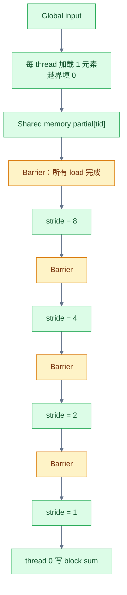
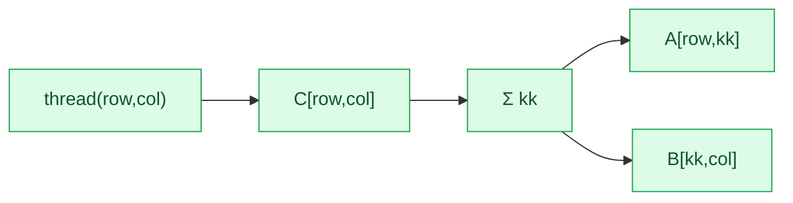
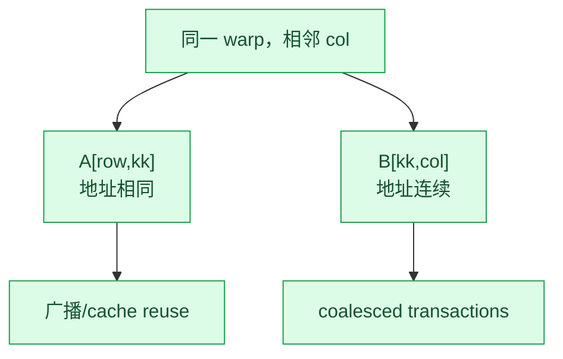
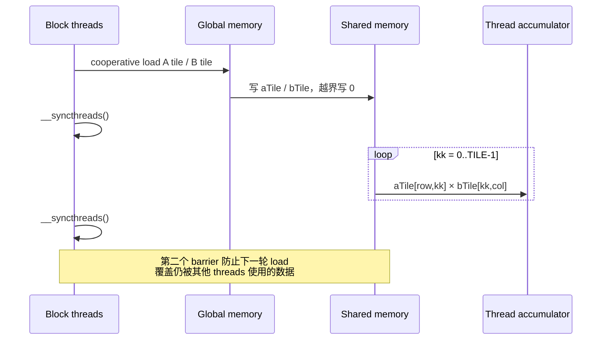
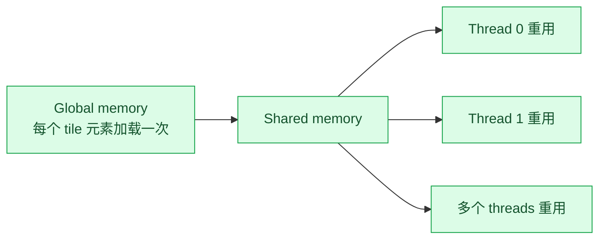
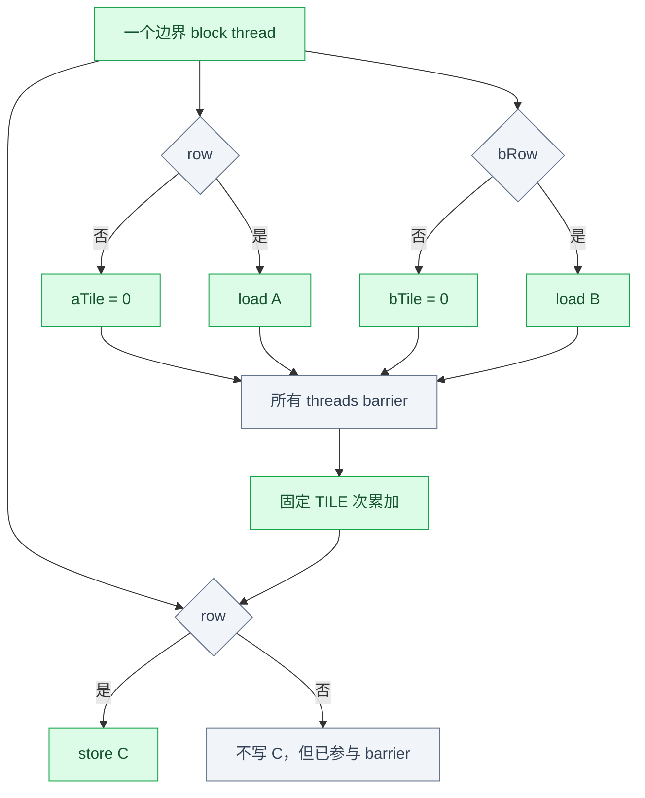
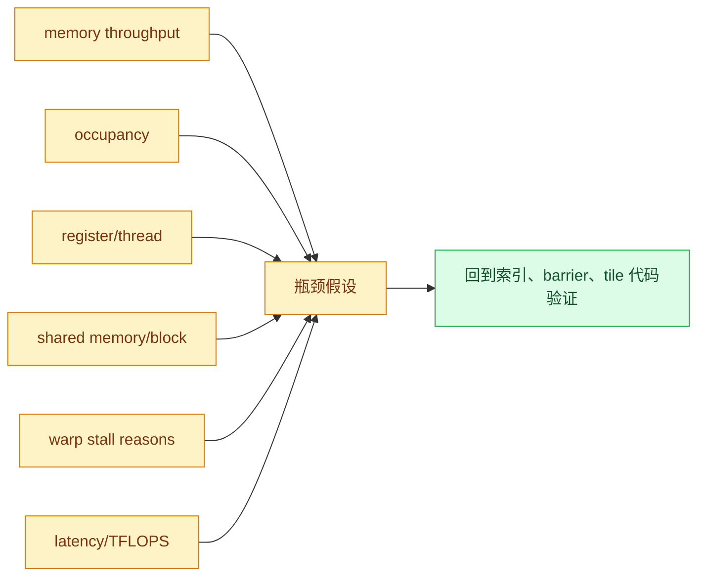

# Week 3：Reduction、Naive Matmul 与 Tiled Matmul

## Shared-Memory Reduction

最小 block 内 reduction：

```cpp
__global__ void reduceBlock(const float *input, float *blockSums,
                            int64_t n) {
  extern __shared__ float partial[];

  unsigned tid = threadIdx.x;
  int64_t idx =
      static_cast<int64_t>(blockIdx.x) * blockDim.x + tid;
  partial[tid] = idx < n ? input[idx] : 0.0f;
  __syncthreads();

  for (unsigned stride = blockDim.x / 2;
       stride > 0; stride >>= 1) {
    if (tid < stride)
      partial[tid] += partial[tid + stride];
    __syncthreads();
  }

  if (tid == 0)
    blockSums[blockIdx.x] = partial[0];
}
```



每轮 barrier 保证：

```text
本轮所有 active threads 的写
  happens-before
下一轮任何 thread 读取这些 partial
```

所有 block threads 都必须走到 `__syncthreads()`。不能写成：

```cpp
if (idx < n) {
  partial[tid] = input[idx];
  __syncthreads(); // 错：部分 thread 可能不进入
}
```

CPU reference 使用 double accumulation：

```cpp
double reference = 0.0;
for (float value : input)
  reference += static_cast<double>(value);
```

GPU FP32 tree reduction 与 CPU double 顺序不同，不能要求 bitwise equality；应记录绝对/相对误差。

## Naive Matmul：一个 Thread 一个输出

固定 row-major：

```text
A[M,K] × B[K,N] → C[M,N]
```

```cpp
__global__ void matmulNaive(const float *a, const float *b,
                            float *c, int m, int n, int k) {
  int col = blockIdx.x * blockDim.x + threadIdx.x;
  int row = blockIdx.y * blockDim.y + threadIdx.y;
  if (row >= m || col >= n)
    return;

  float acc = 0.0f;
  for (int kk = 0; kk < k; ++kk)
    acc += a[row * k + kk] * b[kk * n + col];
  c[row * n + col] = acc;
}
```



Launch：

```cpp
dim3 block(16, 16);
dim3 grid((n + block.x - 1) / block.x,
          (m + block.y - 1) / block.y);
```

## Naive 访存

假设 warp 中相邻 threads 的 `col` 连续、`row` 相同。在同一个 `kk`：

```text
A address = row * K + kk
```

所有 threads 读取同一个 A 元素，适合 broadcast/cache reuse，但每个 thread 的循环仍重复发起逻辑
load。

```text
B address = kk * N + col
```

相邻 threads 读取相邻 B 元素，适合 coalesced global access。



若把 threadIdx.x 映射到 row、threadIdx.y 映射到 col，B load 可能出现大 stride，破坏 coalescing。
必须根据真实 linear thread/warp 排列推导地址，而不是只看二维坐标“似乎对称”。

## Shared-Memory Tiled Matmul

固定 `TILE=16`：

```cpp
template <int TILE>
__global__ void matmulTiled(const float *a, const float *b,
                            float *c, int m, int n, int k) {
  __shared__ float aTile[TILE][TILE];
  __shared__ float bTile[TILE][TILE];

  int row = blockIdx.y * TILE + threadIdx.y;
  int col = blockIdx.x * TILE + threadIdx.x;
  float acc = 0.0f;

  for (int k0 = 0; k0 < k; k0 += TILE) {
    int aCol = k0 + threadIdx.x;
    int bRow = k0 + threadIdx.y;

    aTile[threadIdx.y][threadIdx.x] =
        (row < m && aCol < k) ? a[row * k + aCol] : 0.0f;
    bTile[threadIdx.y][threadIdx.x] =
        (bRow < k && col < n) ? b[bRow * n + col] : 0.0f;
    __syncthreads();

    for (int kk = 0; kk < TILE; ++kk)
      acc += aTile[threadIdx.y][kk] *
             bTile[kk][threadIdx.x];
    __syncthreads();
  }

  if (row < m && col < n)
    c[row * n + col] = acc;
}
```

## 一个 K Tile 内发生什么



第一个 barrier 防止有 thread 在 tile 尚未加载完时开始计算；第二个 barrier 防止较快的 threads
进入下一轮并覆盖 shared memory，而较慢 threads 仍在读取当前 tile。

## Tiling 减少了什么

Naive 情况下，一个 `TILE×TILE` 输出 block 的每个 thread 都独立读取 K 数据：

```text
逻辑 global loads ≈ 2 × TILE² × K
```

Tiled 情况下，每个 K tile 协作加载：

```text
每轮 global loads ≈ 2 × TILE²
K/TILE 轮
总 loads ≈ 2 × TILE × K
```

理想复用倍数约为 `TILE`。实际收益受 cache、transaction、occupancy、register、shared-memory
bank conflicts 和指令开销影响。



## 非整除边界

Case：

```text
(M,N,K) = (127,251,509)
(M,N,K) = (513,769,1025)
```

三种边界必须分开：

| 边界 | Mask |
|---|---|
| 输出行尾 | `row < M` |
| 输出列尾 | `col < N` |
| K 尾 tile 的 A/B load | `k0 + localK < K` |

越界 A/B 输入写入 shared memory 的值必须是 0，这样固定 `kk < TILE` 的 inner loop 才不会读取
未初始化数据。所有 threads 仍要执行两次 barrier，因此不能让输出越界 thread 提前 return。



## Correctness 与性能公式

FP32 matmul reference 可用 CPU double accumulation或可信库路径，并根据 K 设置合理容差。报告：

```text
max absolute error
max relative error
第一个 mismatch 的 row/col/actual/expected
```

Matmul FLOPs：

```text
FLOPs ≈ 2 × M × N × K
effective_TFLOPS = FLOPs / time_seconds / 1e12
```

最小算法数据量近似：

```text
bytes ≈ sizeof(float) × (M×K + K×N + M×N)
```

这不是实际 DRAM traffic；naive 重复 load、cache 和 write policy 会改变真实流量。TFLOPS 与有效
带宽应同时记录。

## Naive/Tiled 实验闭环

```bash
cmake --build $CAPSTONE/cuda/build
compute-sanitizer --tool memcheck \
  $CAPSTONE/cuda/build/matmul_tiled

$CAPSTONE/cuda/build/matmul_naive \
  --m 1024 --n 1024 --k 1024
$CAPSTONE/cuda/build/matmul_tiled \
  --m 1024 --n 1024 --k 1024

ncu --set full --kernel-name regex:matmul \
  --export $CAPSTONE/profiles/ncu/week03-matmul \
  $CAPSTONE/cuda/build/matmul_tiled \
  --m 1024 --n 1024 --k 1024
```

CSV 至少包含：

```text
kernel,M,N,K,tile,median_us,p20_us,p80_us,tflops,
max_abs_error,max_rel_error
```

## NCU 证据如何组合



Occupancy 高不保证快，memory throughput 高也可能只是低效重复流量。Stall reason 是现象，需要
结合指令、依赖链和资源限制解释。

## 为什么仍远离 cuBLAS/Triton

至少包括：

1. 固定 `16×16` tile，没有针对 shape/hardware autotune；
2. 一个 thread 一个标量 accumulator，寄存器级复用有限；
3. 没有 vectorized/global asynchronous copy 或多阶段 pipeline；
4. 没有 Tensor Core/MMA；
5. 没有 shared-memory layout/padding 优化 bank conflicts；
6. 没有 double buffering，load 与 compute 不重叠；
7. 边界和小 shape 没有专门 kernel；
8. 没有 grouped/swizzled block ordering 改善 cache reuse。

## 源码与文档地图

| 问题 | 阅读入口 |
|---|---|
| Shared memory 生命周期 | CUDA Programming Guide：Shared Memory |
| Barrier 语义 | CUDA Programming Guide：Synchronization Functions |
| Matmul 基线 | Programming Guide：Matrix Multiplication 示例 |
| Coalescing | CUDA Best Practices：Coalesced Access |
| Bank conflicts | CUDA Best Practices：Shared Memory and Memory Banks |
| Reduction 变体 | CUDA Samples：reduction |
| Metrics | Nsight Compute Profiling Guide |

## Week 3 Exit Gate

- [ ] block reduction 有越界填 0、每轮正确 barrier 和 CPU double reference。
- [ ] naive matmul 的 row-major 索引可逐式解释。
- [ ] tiled matmul 有 cooperative loads、两次 barrier 和 K-loop。
- [ ] 输出 M/N 边界与 K-tail 分开 mask。
- [ ] 两组非整除 case correctness 和 memcheck 通过。
- [ ] 能说明相邻 warp lanes 的 A/B 地址及 coalescing。
- [ ] naive/tiled 的 latency、TFLOPS、误差写入 CSV。
- [ ] ncu 记录 memory、occupancy、register、shared memory 和 stalls。
- [ ] 能解释 tiled 版本减少的 global loads。
- [ ] 能指出距离 cuBLAS/Triton 至少三个具体原因。

---

上一章：[← Week 2：RTX 4090 验收与 GPU 测量纪律](02_GPU_Measurement_Discipline.md)  
下一章：[Week 4：Triton Blocked Model 与 Fused Linear →](04_Triton_and_Fused_Linear.md)

