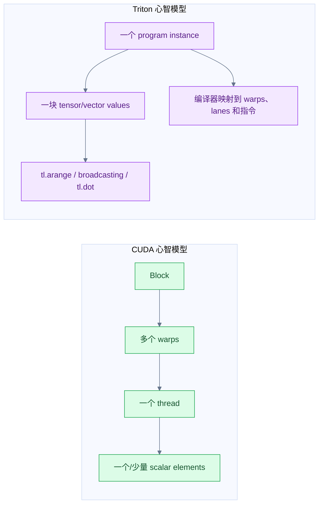
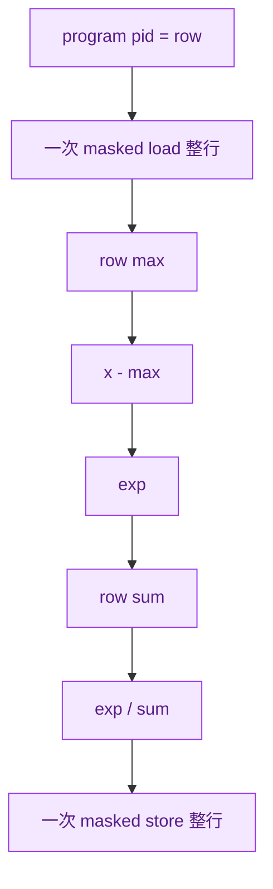
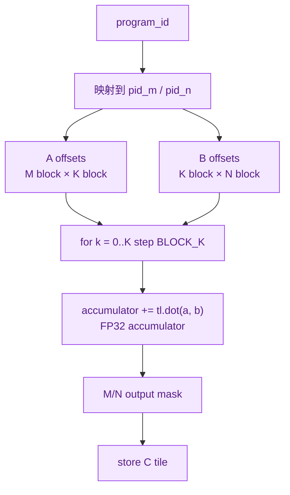
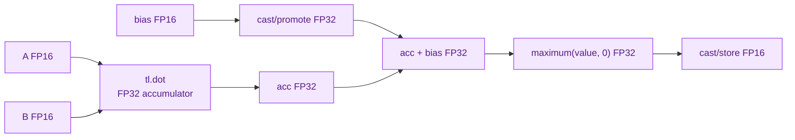
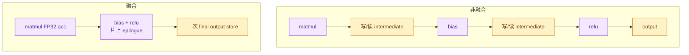
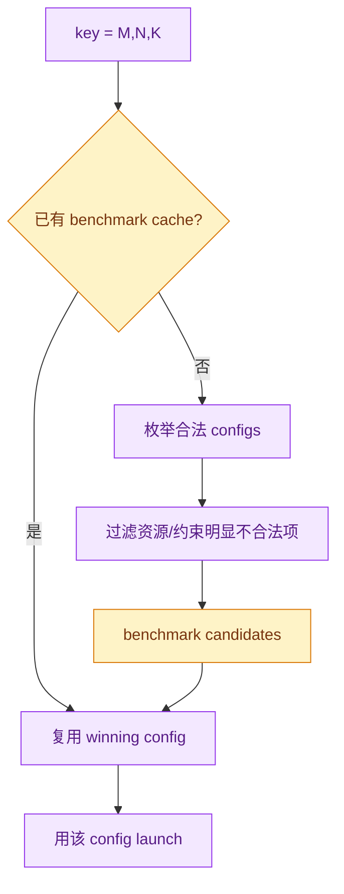

# Week 4：Triton Blocked Model 与 Fused Linear

## CUDA Thread 与 Triton Program Instance



Triton 没有取消 CUDA 硬件层级；它把编程抽象提高到 blocked program instance。程序员描述一块
indices/values，编译器再决定 lane-level 执行。`num_warps` 仍直接影响一个 program instance
使用多少 warps。

## Triton Vector Add

```python
import triton
import triton.language as tl

@triton.jit
def vector_add_kernel(x_ptr, y_ptr, out_ptr, n_elements: tl.constexpr,
                      BLOCK_SIZE: tl.constexpr):
    pid = tl.program_id(axis=0)
    offsets = pid * BLOCK_SIZE + tl.arange(0, BLOCK_SIZE)
    mask = offsets < n_elements
    x = tl.load(x_ptr + offsets, mask=mask)
    y = tl.load(y_ptr + offsets, mask=mask)
    tl.store(out_ptr + offsets, x + y, mask=mask)
```

Launch：

```python
grid = (triton.cdiv(n_elements, BLOCK_SIZE),)
vector_add_kernel[grid](
    x, y, output, n_elements,
    BLOCK_SIZE=1024)
```


CUDA 中通常由每个 thread 算一个 `idx`；Triton 中一个 program instance 构造整块 offsets。Mask
仍然承担非整除边界正确性。

## Fused Softmax 的 Row Mapping

对 `X[rows, cols]`，常见映射：

```text
program_id(0) = row index
一个 program instance 处理一整行
BLOCK_SIZE = next_power_of_2(cols)
offsets = row * stride + arange(0, BLOCK_SIZE)
mask = arange < cols
```



若拆成多个 kernel，可能产生中间 global-memory 往返：

```text
max kernel → 写 max
exp kernel → 读 X/max，写 exp
sum kernel → 读 exp，写 sum
normalize kernel → 读 exp/sum，写 output
```

Fused kernel 尽量让中间值停留在片上表示，只对 X 读一次、output 写一次。实际寄存器/shared
memory 压力可能限制最大 row width，因此 fusion 也有资源边界。

## Triton Blocked Matmul

一个 program instance 计算：

```text
C tile: BLOCK_M × BLOCK_N
```

K 维按 `BLOCK_K` 循环：



核心索引形状：

```python
offs_m = pid_m * BLOCK_M + tl.arange(0, BLOCK_M)
offs_n = pid_n * BLOCK_N + tl.arange(0, BLOCK_N)
offs_k = tl.arange(0, BLOCK_K)

a_ptrs = a_ptr + offs_m[:, None] * stride_am \
               + offs_k[None, :] * stride_ak
b_ptrs = b_ptr + offs_k[:, None] * stride_bk \
               + offs_n[None, :] * stride_bn
```

每轮：

```python
a = tl.load(a_ptrs, mask=(offs_m[:, None] < M) &
                         (k + offs_k[None, :] < K), other=0.0)
b = tl.load(b_ptrs, mask=(k + offs_k[:, None] < K) &
                         (offs_n[None, :] < N), other=0.0)
acc = tl.dot(a, b, acc)
```

最后用 M/N mask 写输出。K-tail mask 与输出 mask 不能混为一谈。

## Grouped Ordering

线性 `pid` 不一定简单按 row-major 映射 tile。Grouped ordering 让一组 M tiles 复用相邻 B tiles，
改善 L2 locality：

```text
普通顺序：
(m0,n0), (m0,n1), ..., (m1,n0), ...

grouped M：
在有限 GROUP_SIZE_M 内组织 pid_m/pid_n，
提高近期访问 A/B tile 的重用机会
```

它改变的是 program instance 的访问顺序，不改变数学结果。

## Fused Linear + Bias + ReLU

固定语义：

```text
A/B/bias storage: FP16
tl.dot accumulator: FP32
bias 转 FP32 后加入
ReLU 在 FP32 上执行
最终 cast/store FP16
```



Epilogue 核心：

```python
bias = tl.load(bias_ptr + offs_n,
               mask=offs_n < N, other=0.0).to(tl.float32)
acc += bias[None, :]
acc = tl.maximum(acc, 0.0)
output = acc.to(tl.float16)
tl.store(c_ptrs, output, mask=c_mask)
```

若在加入 bias 前就把 accumulator cast 到 FP16，或先以 FP16 做 ReLU，会改变计划固定的数值语义。

## Fusion 为什么减少 Global Traffic

非融合：

```text
matmul 写 M×N intermediate
bias kernel 读+写 M×N
relu kernel 读+写 M×N
```

融合：

```text
matmul accumulator 留在片上
load bias
FP32 bias + ReLU
只写最终 M×N output
```



Fusion 也减少 kernel launches。代价可能是更长 live range、更多 registers，以及不同 shape 下的
资源压力。

## Correctness Reference

三组 `(M,N,K)`：

```text
(32,4096,4096)
(512,4096,4096)
(127,251,509)
```

PyTorch reference：

```python
reference = torch.matmul(a.float(), b.float())
reference = reference + bias.float()
reference = torch.relu(reference)
reference = reference.to(torch.float16)

actual = fused_linear(a, b, bias)
torch.testing.assert_close(actual, reference, rtol=..., atol=...)
```

第三组验证 M/N/K 三个维度的 tail masks。容差必须结合 FP16 输入、`tl.dot` 精度配置、FP32
accumulation 和最终 FP16 cast；不能盲目要求 bitwise equality。

报告至少包括：

```text
shape,dtype,max_abs_error,max_rel_error,allclose,rtol,atol
```

## Autotune 搜索空间

```text
BLOCK_M: 32,64,128
BLOCK_N: 32,64,128
BLOCK_K: 32,64
num_warps: 4,8
num_stages: 2,3,4
```

笛卡尔积共有：

```text
3 × 3 × 2 × 2 × 3 = 108 configurations
```

```python
@triton.autotune(
    configs=[...],
    key=["M", "N", "K"],
)
@triton.jit
def fused_linear_kernel(...):
    ...
```



需要关注的资源：

- `BLOCK_M×BLOCK_N` accumulator 大小与 register pressure；
- `BLOCK_K` 与 dot 指令/加载粒度；
- `num_warps` 对并行度和每 warp 工作量的影响；
- `num_stages` 对软件流水线与片上存储的影响；
- 某些组合可能编译失败或超资源。

Autotune key 固定为 `M,N,K` 意味着 dtype、stride/layout、GPU 型号等若变化，必须确认 cache
隔离是否足够；不要跨不兼容实验复用结果。

## `do_bench` 与 CSV

```python
quantiles = [0.5, 0.2, 0.8]
median, p20, p80 = triton.testing.do_bench(
    lambda: fused_linear(a, b, bias),
    quantiles=quantiles,
)
```

返回值应按传入 quantiles 的顺序解包，并用当前 Triton 版本做一个已知样本验证，避免把
P20/P80 列写反。

CSV：

```text
timestamp,gpu,triton,torch,M,N,K,dtype,
BLOCK_M,BLOCK_N,BLOCK_K,num_warps,num_stages,
median_us,p20_us,p80_us,tflops,max_abs_error,max_rel_error
```

Fused linear FLOPs 通常仍以 matmul 主项 `2MNK` 报告；bias/ReLU 的额外 elementwise ops 是否
计入必须明确说明，确保不同实现口径一致。

## CUDA 与 Triton 模型对照

| 问题 | CUDA | Triton |
|---|---|---|
| 工作单位 | thread/block/grid | program instance + blocked tensors |
| 索引 | `blockIdx/threadIdx` | `program_id/arange` |
| 边界 | thread-level `if`/predicate | tensor mask |
| 片上复用 | 显式 shared memory/barriers | blocked values、compiler-managed lowering |
| Matmul | 手写 cooperative load/accumulate | `tl.dot` + block pointers/offsets |
| 调参 | block/tile/register/shared memory | BLOCK sizes、warps、stages、ordering |
| 最终硬件 | NVIDIA SM/warps | 仍然 lower 到目标 GPU 执行模型 |

Triton 更高层，不代表无需理解 coalescing、occupancy、register 和 shared memory；这些约束通过
配置和编译结果继续影响性能。

## 源码与文档地图

| 问题 | 阅读入口 |
|---|---|
| Program instance、mask | Triton Vector Add tutorial |
| Row-wise fusion | Triton Fused Softmax tutorial |
| Block matmul/grouped ordering | Triton Matrix Multiplication tutorial |
| Dot 精度 | `triton.language.dot` API |
| Config/key/cache | `triton.autotune` API |
| 分位数 benchmark | `triton.testing.do_bench` API |
| 浮点比较 | PyTorch Numerical Accuracy |

## Phase 1 Exit Gate

- [ ] 关闭教程后能独立实现 Triton vector add。
- [ ] 能解释 fused softmax 的 program-to-row mapping、padding mask 和流量减少。
- [ ] Triton matmul tutorial 的版本、correctness 和 benchmark 可复现。
- [ ] fused linear 严格遵守 FP16 输入、FP32 accumulator/epilogue、FP16 输出。
- [ ] 三组 shape 均与 PyTorch reference 在记录的容差内一致。
- [ ] M/N/K tail masks 均有非整除 case 覆盖。
- [ ] autotune 覆盖 BLOCK_M/N/K、warps、stages，并过滤明显非法组合。
- [ ] benchmark 正确记录 median/P20/P80，不混入第一次编译。
- [ ] 能解释 CUDA thread-level 与 Triton blocked model 的差异。
- [ ] CUDA tiled matmul 与 Triton fused linear 均能独立实现。
- [ ] 能结合实验解释 coalescing/shared memory/occupancy/tile trade-off。
- [ ] RTX 4090 benchmark 和 ncu 已真实运行，而非只有计划或模拟数字。

未通过以上关键项时，应重复 Week 3–4，不进入 Phase 2。

---

上一章：[← Week 3：Reduction、Naive Matmul 与 Tiled Matmul](03_Reduction_and_CUDA_Matmul.md)  
完成本册：[返回 Phase 1 阅读地图](00_Reading_Map.md) ·
[进入 Phase 2 图解](../Phase2Bridge/00_Reading_Map.md) ·
[查看原始 Phase 1 执行计划](../../Plans/GPU_CodeGen/Phases/Phase1_CUDA_Triton_Kernel_Fundamentals.md)

