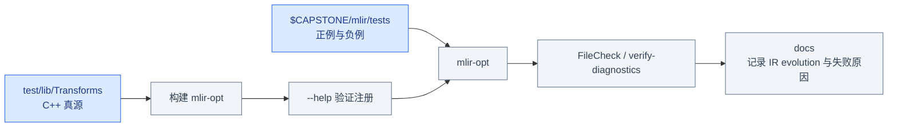

# Phase 2 图解：MLIR Transformation Bridge

## 目标

本册是
[`Phase2_MLIR_Transformation_Bridge.md`](../../Plans/GPU_CodeGen/Phases/Phase2_MLIR_Transformation_Bridge.md)
的图解索引。它不替代每周实验，而是把 Week 5–10 串成一条因果链：

Phase 1 解决了“kernel 如何执行以及怎样正确测量”，Phase 2 开始回答另一个问题：
**编译器如何在保持 SSA 和语义合法的前提下，把一份 IR 逐步改造成更适合执行的形式？**
六周不是六组孤立 API，而是不断扩大 transformation 的作用范围：

```text
读懂一个函数中的关系
  → 改写一个 Operation
  → 识别并融合一条计算链
  → 把整个 dialect 降到合法终点
  → 用 Transform IR 编排结构化变换
  → 把策略固化为可测试的参数化 Pass
```


这条路线的关键不是 API 数量，而是完成判据逐步增强：

| 周次 | 核心问题 | 可验证完成判据 |
|---|---|---|
| Week 5 | IR 中有哪些对象与关系？ | verifier、统计结果、dominance 查询 |
| Week 6 | IR 为什么发生了改变？ | 移除 pattern 后 red，恢复后 green |
| Week 7 | 多 Op rewrite 何时安全？ | 完整 match、负例保持、二次运行稳定 |
| Week 8 | Lowering 何时算完成？ | 所有目标要求的 Operation 都 legal |
| Week 9 | 如何把优化策略写成 IR？ | handle 精确匹配，tiling 前后结构可查 |
| Week 10 | 如何把策略做成参数化 Pass？ | 参数、边界、失败和 IR evolution 全覆盖 |

## 阅读顺序

下面的顺序也是依赖顺序。Week 6 的 rewrite 依赖 Week 5 的 use-def；Week 7 的 chain matcher
把单点 rewrite 扩大到多个 producer/consumer；Week 8 再把“局部成功”提升为“全局 legality
完成”；Week 9–10 则把结构化 tiling 从策略表达推进到 C++ Pass。

1. [SSA、CFG、Dominance 与 Pass Anchor](01_SSA_CFG_Dominance_and_Pass.md)
2. [Rewrite、Fold、Driver：到底是谁改了 IR](02_Rewrite_Fold_and_Driver.md)
3. [Producer–Consumer Chain：先匹配完整，再修改](03_Producer_Consumer_Chain.md)
4. [DialectConversion：Legality、Adaptor 与 Materialization](04_Dialect_Conversion_Bridge.md)
5. [Transform Dialect 与 Tiling Interfaces](05_Transform_and_Tiling.md)
6. [参数化 Tiling 与 IR Evolution](06_Parameterized_Tiling_Evolution.md)

详细机制还可查阅已有的
[`Transformation`](../Transformation/00_Reading_Map.md) 小册。本册重点是将这些机制映射到
Phase 2 每周实验与 Exit Gate。

## 每章现在包含什么

每一章均按同一条内部路线组织：

```text
本章问题
  → 最小心智模型
  → 真实 IR/C++ 样例
  → 失败边界
  → 可执行验证
  → Exit Gate
```

| 章节 | 可运行/可实现内容 | 失败与验证内容 |
|---|---|---|
| Week 5 | 多 Region IR、Value 表、walk/pass 骨架、dominance API | dominance/type verifier 负例、analysis invalidation |
| Week 6 | AddZeroPattern、greedy pass、worklist 时间线 | folding 隔离、red/green、边界测试矩阵 |
| Week 7 | Linalg maps/iterators、只读 matcher、fusion 入口 | multi-use/layout/dtype/effect 负例、终止性 |
| Week 8 | ConversionTarget、LLVMTypeConverter、patterns、adaptor | partial/full、materialization、rollback、illegal-op 测试 |
| Week 9 | tensor matmul、named sequence、tile 结构和 interfaces | 整除/非整除、handle 失效、upstream lit/FileCheck |
| Week 10 | pass options、`tileUsingSCF`、result replacement | 参数/shape 负例、部分 mutation、构建注册、IR snapshots |

每章末尾都有源码阅读地图和可勾选 Exit Gate。Exit Gate 是学习结果的判据，不是阅读完成标记：
只有对应命令、测试和解释都能独立完成时才勾选。

## 统一实验工件

理解机制之后，必须把结论落到可复现实验中。下面的目录约定把“真正参与构建的源码”和
“学习输入、测试及解释”分开，避免示例与真实实现各自演化。

原计划要求将可编译源码和学习记录分开：

```text
test/lib/Transforms/<Pass>.cpp          # 唯一可编译真源
test/lib/Transforms/CMakeLists.txt      # 链接依赖
tools/mlir-opt/mlir-opt.cpp             # pass 注册

$CAPSTONE/mlir/*.mlir                   # 手写/演化输入
$CAPSTONE/mlir/tests/*.mlir             # FileCheck/诊断测试
$CAPSTONE/docs/*.md                     # before/after、失败和结论
```



不要维护两份会独立演化的 C++ 实现。学习目录可以有讲解副本，但必须明确 test-only 工具链中的
文件才是构建与测试所使用的真源。

## 六周共同验证原则

目录只解决“文件放在哪里”，还没有回答“怎样证明 transformation 正确”。六周共用下面的
证据顺序，其中任何一步失败，都不应直接进入性能或后续 lowering 讨论。

```text
先验证输入合法
  → 固定 before IR
  → 只启用目标 transformation
  → 保存 after IR
  → FileCheck 结构
  → 用负例证明拒绝边界
  → 运行第二次检查 fixpoint/稳定性
  → 记录完整命令与失败诊断
```

成功返回值本身不能证明 transformation 正确；至少还要证明：

- 目标结构确实发生预期变化；
- 不该修改的 case 保持不变或得到明确诊断；
- 旧 illegal op、旧 uses 或错误类型没有残留；
- 变化来源可由隔离实验定位；
- 输出能通过 verifier；
- 相同命令能够复现。

## 统一颜色

后续图会在不同抽象层间切换；固定颜色用于提醒当前节点究竟是 payload Operation、SSA Value、
Region/Block，还是控制 transformation 的 driver/context。

| 颜色 | 含义 |
|---|---|
| 蓝色 | Payload `Operation` |
| 红色 | SSA `Value`、use-def、Transform handle |
| 绿色 | `Region` |
| 黄色 | `Block` |
| 紫色 | Dialect、Type、interface、legality |
| 灰色 | Pass、driver、分析、测试和控制上下文 |

---

下一章：[Week 5：SSA、CFG、Dominance 与 Pass Anchor →](01_SSA_CFG_Dominance_and_Pass.md)
