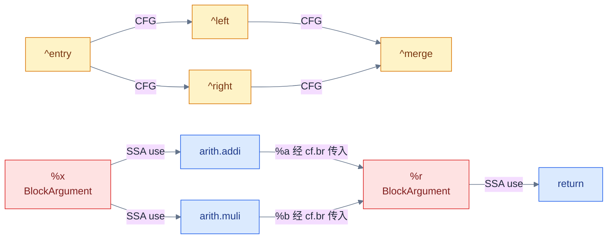
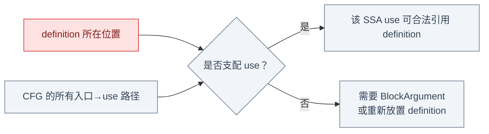
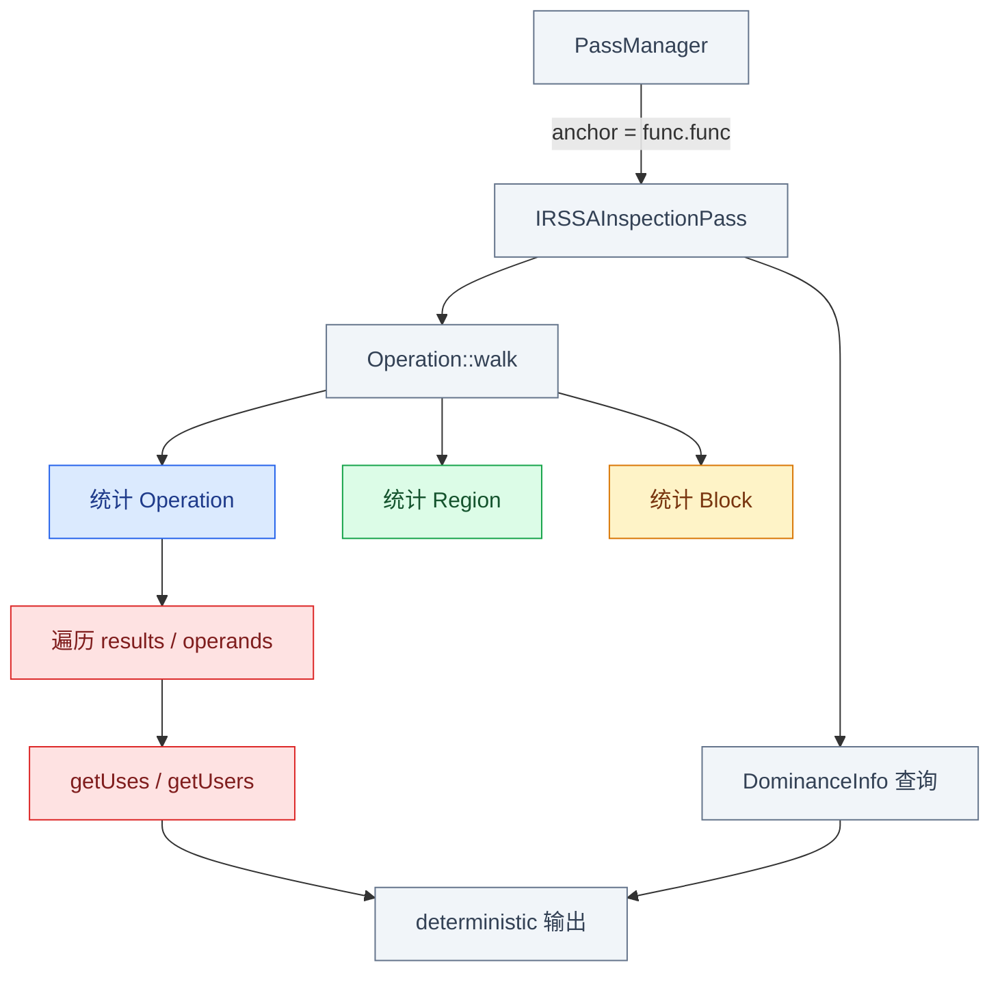
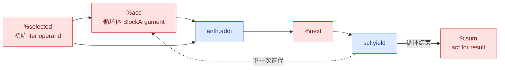

# Week 5：SSA、CFG、Dominance 与 Pass Anchor

## 本章如何承接 Phase 1

Phase 1 主要把程序看成 kernel 和数据；进入 MLIR 后，同一段程序首先表现为 Operation、Region、
Block 和 Value 组成的 IR。后续 rewrite 会替换 Operation、重连 uses，tiling 还会新建 loops 和
Blocks。因此 Week 5 先建立一张不会混淆的“IR 关系地图”，再实现只读 inspection pass 验证它。

本章按两次缩放阅读：

```text
第一次：关系全景
  IR 树 / CFG / SSA / dominance / pass anchor

第二次：落到一个多 Region 样例
  Value 分类 → walk API → inspection pass → verifier/analysis
```

## 一段 IR 中同时存在三种关系

```mlir
func.func @choose(%cond: i1, %x: i32) -> i32 {
  cf.cond_br %cond, ^left, ^right
^left:
  %a = arith.addi %x, %x : i32
  cf.br ^merge(%a : i32)
^right:
  %b = arith.muli %x, %x : i32
  cf.br ^merge(%b : i32)
^merge(%r: i32):
  return %r : i32
}
```



- IR 树回答“对象嵌套在哪里”：Operation → Region → Block → Operation。
- CFG 回答“控制可能走到哪里”：Block → successor Block。
- SSA 回答“值从哪里来、被谁使用”：definition → Value → users。
- Dominance 把 CFG 与 SSA 合在一起，判断一个 definition 是否在所有到达 use 的路径上都先执行。

IR 树告诉我们“对象放在哪里”，CFG 和 SSA 分别给出控制边与数据边。仅知道这两张图还不够：
一个 use 是否合法，需要结合控制路径判断 definition 能否保证先执行，这自然引出 dominance。

## Dominance 为什么是 SSA 合法性的桥



若一个值只在 `^left` 定义，却直接在 `^merge` 使用，从 `^right` 到 `^merge` 的路径没有执行
该定义，因而不满足 dominance。正确做法是让每条前驱边向 `^merge` 的 BlockArgument 传值。

到这里得到的是“应该检查什么”。下一步先从全景看 inspection pass 会收集哪些对象，再讨论
PassManager 到底把它运行在哪个 Operation 上。

## Inspection Pass 实际观察什么



图中的 `walk` 决定单次 pass 能看到的嵌套范围，但单次 pass 的根是谁由 anchor 决定。两者经常
被混淆，所以先确定 anchor，再进入具体 IR。

## FuncOp 与 ModuleOp Anchor

```text
builtin.module                         module pass：运行 1 次
├── func.func @a                      func pass：运行 1 次
│   └── nested regions 均在可见范围
└── func.func @b                      func pass：再运行 1 次
```

`Operation::walk` 会跨越当前 anchor 的 nested regions；PassManager 是否在某种 Operation 上调度
Pass，则由 pipeline anchor 决定。这是“遍历范围”和“Pass 调度范围”的区别。

只读 Pass 可保留已有 analysis；修改 CFG、Operation 顺序或 use-def 后，旧 `DominanceInfo`
可能不再描述当前 IR，应让 analysis invalidation 机制重新计算。

现在已经知道“每个 FuncOp 运行一次，并递归观察其内部”。接下来用一个同时包含 `scf.if`、
`scf.for` 和多用户 Value 的样例，把抽象关系逐个对应到文本 IR。

## 多 Region、BlockArgument 与多用户

Week 5 的练习输入不应只有 CFG。下面这个函数同时覆盖 `scf.if` 的两个 Region、
`scf.for` 的 induction variable/iter argument、一个 Value 的两个 users，以及合法的跨 Block
使用：

```mlir
func.func @walk(%cond: i1, %n: index, %x: i32) -> i32 {
  %selected = scf.if %cond -> (i32) {
    %one = arith.constant 1 : i32
    %a = arith.addi %x, %one : i32
    scf.yield %a : i32
  } else {
    %two = arith.constant 2 : i32
    %b = arith.muli %x, %two : i32
    scf.yield %b : i32
  }

  %c0 = arith.constant 0 : index
  %c1 = arith.constant 1 : index
  %sum = scf.for %iv = %c0 to %n step %c1
      iter_args(%acc = %selected) -> (i32) {
    %next = arith.addi %acc, %selected : i32
    scf.yield %next : i32
  }
  return %sum : i32
}
```

`%selected` 有两个 users：`scf.for` 的初始 iter operand 和循环体中的 `arith.addi`。循环相关
Value 的对应关系是：

| 文本 Value | Value 种类 | Owner/定义点 | 主要 users |
|---|---|---|---|
| `%selected` | `OpResult` | `scf.if` result 0 | `scf.for`、`arith.addi` |
| `%iv` | `BlockArgument` | `scf.for` body block argument 0 | 循环体内使用者 |
| `%acc` | `BlockArgument` | body block argument 1 | `arith.addi` |
| `%next` | `OpResult` | `arith.addi` | `scf.yield` |
| `%sum` | `OpResult` | `scf.for` result 0 | `return` |



这里的虚线是循环携带值的语义关系，不是 `%next` 在内存中直接 RAUW `%acc`。`%acc` 始终是
BlockArgument，`%sum` 始终是 `scf.for` 的 OpResult。

对象关系明确后，才能选择遍历方式：递归统计使用 `walk`，只观察直接子节点则使用显式
Region/Block 循环。

## `Operation::walk` 顺序

```cpp
funcOp.walk<WalkOrder::PreOrder>([](Operation *op) {
  // 先看父 Operation，再进入它的 Regions。
});

funcOp.walk<WalkOrder::PostOrder>([](Operation *op) {
  // 先看 nested Operations，最后看父 Operation。
});
```

`walk` 默认是后序，并包含 root 自身。回调参数决定访问对象：

```cpp
funcOp.walk([](Operation *op) { /* 所有 nested operations */ });
funcOp.walk([](Region *region) { /* 所有 nested regions */ });
funcOp.walk([](Block *block) { /* 所有 nested blocks */ });
funcOp.walk([](arith::AddIOp op) { /* 自动过滤具体 op 类型 */ });
```

若只想统计直接子节点，应手工遍历 `getRegions()`、Region 中的 Block 和 Block 中的
Operation；不要把递归 `walk` 当成“当前一层”。

这些 API 组合起来，就是前面 inspection 数据流图的实际实现。

## Inspection Pass 骨架

```cpp
struct IRSSAInspectionPass
    : PassWrapper<IRSSAInspectionPass,
                  OperationPass<func::FuncOp>> {
  MLIR_DEFINE_EXPLICIT_INTERNAL_INLINE_TYPE_ID(IRSSAInspectionPass)

  void runOnOperation() override {
    func::FuncOp func = getOperation();
    unsigned operations = 0;
    unsigned regions = 0;
    unsigned blocks = 0;
    unsigned results = 0;
    unsigned operands = 0;
    unsigned uses = 0;

    func.walk([&](Operation *op) {
      ++operations;
      regions += op->getNumRegions();
      results += op->getNumResults();
      operands += op->getNumOperands();
      for (Value result : op->getResults())
        uses += llvm::range_size(result.getUses());
    });
    func.walk([&](Block *block) { ++blocks; });

    llvm::outs() << func.getName()
                 << " ops=" << operations
                 << " regions=" << regions
                 << " blocks=" << blocks
                 << " results=" << results
                 << " operands=" << operands
                 << " uses=" << uses << "\n";
  }
};
```

为了让 FileCheck 稳定，输出聚合计数或按 block/op 顺序输出；不要打印裸指针地址，也不要依赖
use-list 的迭代顺序作为语义顺序。

统计只能证明“看到了什么”，还不能证明 IR 合法。最后加入 dominance 查询和 verifier 负例，
让错误关系有可复现的失败证据。

## Dominance 查询与负例

常用检查方式：

```cpp
DominanceInfo dominance(func);
bool blockDom = dominance.dominates(defBlock, useBlock);
bool opDom = dominance.dominates(definingOp, userOp);
bool valueDom = dominance.properlyDominates(value, userOp);
```

具体 overload 应以当前 [Dominance.h](../../../include/mlir/IR/Dominance.h) 为准。Verifier 负例
可以把只在一个分支定义的 Value 直接用于汇合 Block：

```mlir
// expected-error @+1 {{operand #0 does not dominate this use}}
"test.use"(%left_only) : (i32) -> ()
```

另一类负例是分支实参与 BlockArgument 类型不一致：

```mlir
cf.br ^next(%v : i32)
^next(%arg0: f32):
```

运行方式：

```bash
$MLIR_BIN/mlir-opt valid.mlir -verify-each
$MLIR_BIN/mlir-opt invalid.mlir -verify-diagnostics
```

Verifier 负责 IR 当前是否合法；`DominanceInfo` 是 pass 可以查询和缓存的 analysis。既然它是
基于当前 IR 计算出来的，下一问题就是 IR 修改后这份缓存还能不能继续使用。

## Analysis Preservation 与失效


完全只读且不改变 IR 的 pass 可以：

```cpp
markAllAnalysesPreserved();
```

只有在能证明某个分析仍有效时才单独 preserve。修改 successors、移动定义、替换嵌套 Operation
后，旧 dominance 结论可能失效，不能因为 C++ 对象仍存在就继续复用。

至此，本章从“读懂关系”走到了“通过 pass 和 verifier 证明关系”。Week 6 将第一次真正修改
这些关系：替换一个 Operation result，并观察 driver 如何更新 use-list。

## 源码与验证地图

| 要回答的问题 | 阅读入口 |
|---|---|
| Value、OpResult、BlockArgument 如何区分 | `include/mlir/IR/Value.h` |
| walk 顺序和删除限制 | `include/mlir/IR/Visitors.h`、`Operation.h` |
| dominance 查询 | `include/mlir/IR/Dominance.h` |
| Pass anchor、analysis 生命周期 | `docs/PassManagement.md` |
| IR 合法性与 block argument | `docs/LangRef.md` |

## Week 5 Exit Gate

- [ ] 能逐个标出 Value 的 owner、type、definition 和 users。
- [ ] 能区分 OpResult 与 BlockArgument。
- [ ] 能解释 `scf.if` results、`scf.for` iter arguments/yield/results 的对应关系。
- [ ] 能说明 CFG、SSA 与 dominance 各回答什么问题。
- [ ] inspection pass 的输出 deterministic，正例 FileCheck 通过。
- [ ] dominance/type 负例能由 verifier 拒绝。
- [ ] 能解释 FuncOp/ModuleOp anchor、nested walk 和 analysis invalidation。

---

上一章：[← Phase 2 阅读地图](00_Reading_Map.md)  
下一章：[Week 6：Rewrite、Fold、Driver 到底谁改了 IR →](02_Rewrite_Fold_and_Driver.md)
