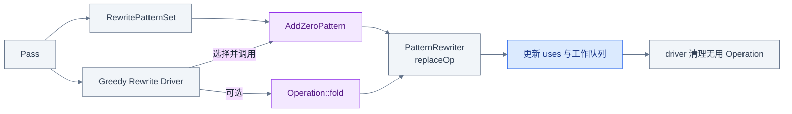
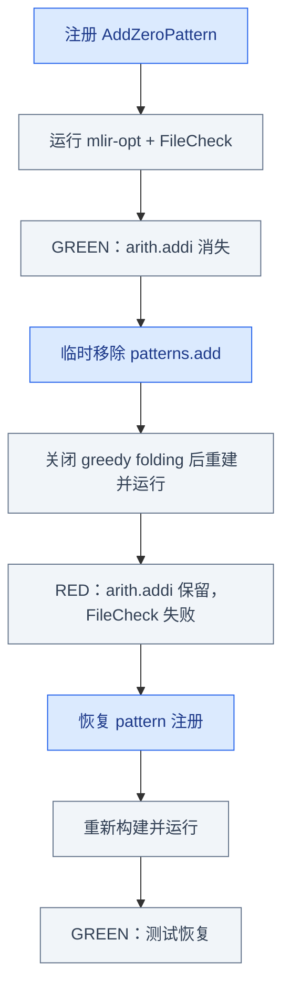
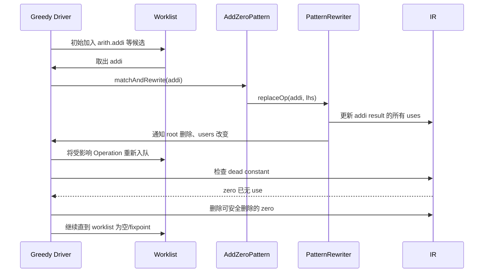

# Week 6：Rewrite、Fold、Driver 到底谁改了 IR

## 从只读检查进入第一次改写

Week 5 的 inspection pass 只读取 Operation 和 use-def；本章开始修改它们。难点并不是写出
`x + 0 = x`，而是区分：这次变化究竟来自自定义 Pattern、Operation fold、greedy driver 还是
DCE。为避免“看到 after IR 就猜原因”，本章先提出归因问题，再用 red/green 实验隔离机制，
最后展开 Pattern 和 worklist 实现。

```text
观察到 addi 消失
  → 隔离可能来源
  → red/green 证明自定义 Pattern
  → 展开 replaceOp 与 worklist
  → 用边界矩阵验证合同
```

## 同一个结果可能来自不同机制

输入：

```mlir
%zero = arith.constant 0 : i32
%sum = arith.addi %x, %zero : i32
return %sum : i32
```

目标：

```mlir
return %x : i32
```



职责不要混在一起：

| 组件 | 负责什么 |
|---|---|
| Pattern | 声明“何时匹配、替换成什么” |
| Rewriter | 以框架可观察的方式修改 IR |
| Driver | 维护 worklist、选择候选、迭代到停止 |
| Fold | Operation 自己提供的局部等价简化 |
| DCE | 删除结果已无 use 且可安全删除的 Operation |

因为多个机制可能产生同一文本结果，单看 after IR 不能证明归因。下一节通过关闭 folding 并移除
pattern，建立一组受控实验。

## Red/Green 如何证明改写来源



如果 folding 没关闭，即使移除自定义 pattern，内建 fold 也可能产生相同输出，red 实验就不能
证明改写来源。`config.enableFolding(false)` 隔离的是 driver folding，不是删除自定义 pattern。

Red/green 证明了“谁触发改写”。接下来先观察一次成功改写在 SSA 上造成什么变化，再给出产生
这次变化的 C++ Pattern。

## `replaceOp` 之后发生什么

```text
改写前：
  %sum = arith.addi %x, %zero
  user(%sum)

replaceOp(addi, %x)

改写后：
  user(%x)
  %sum 的所有 uses 已被更新
  addi 被删除
  %zero 若无其他 use，可由 DCE 删除
```

Pattern 不应直接绕过 rewriter 修改 root。Driver 必须知道哪些 Operation 新建、替换、删除，
才能正确维护工作队列并避免访问悬空对象。

这正是 `PatternRewriter` 出现在 `matchAndRewrite` 参数中的原因。下面把等式、Pattern 注册和
driver 配置放进最小 Pass。

## 最小 Pattern 与 Pass

```cpp
struct AddZeroPattern : OpRewritePattern<arith::AddIOp> {
  using OpRewritePattern::OpRewritePattern;

  LogicalResult matchAndRewrite(
      arith::AddIOp op,
      PatternRewriter &rewriter) const override {
    APInt value;
    if (!matchPattern(op.getRhs(), m_ConstantInt(&value)) ||
        !value.isZero())
      return rewriter.notifyMatchFailure(
          op, "right operand is not integer zero");

    rewriter.replaceOp(op, op.getLhs());
    return success();
  }
};
```

Pass 负责注册并选择 driver：

```cpp
void runOnOperation() override {
  RewritePatternSet patterns(&getContext());
  patterns.add<AddZeroPattern>(&getContext());

  GreedyRewriteConfig config;
  config.enableFolding(false);

  if (failed(applyPatternsGreedily(
          getOperation(), std::move(patterns), config)))
    signalPassFailure();
}
```

`matchAndRewrite` 的契约是：

- 返回 `failure()`：不得改变 IR；
- 返回 `success()`：必须已经完成一次框架可观察的合法修改；
- 所有 root mutation、replacement 和 erasure 都通过 rewriter。

Pattern 只描述单次局部规则；它不会自行遍历所有 Operation，也不会决定何时再次尝试。多次
应用和受影响节点重访由 worklist driver 负责。

## Worklist 时间线



这里的 DCE 不是 Pattern 里显式删除 `%zero`。如果 `%zero` 还有其他 user，它就必须保留：

```mlir
%zero = arith.constant 0 : i32
%a = arith.addi %x, %zero : i32
%b = arith.cmpi eq, %y, %zero : i32
```

改写 `%a` 后 `%zero` 仍被 `%b` 使用，不能删除。

时间线说明了 driver 为什么既能反复应用 Pattern，又能发现 dead constant。现在可以准确划分
Pattern、fold、canonicalization 与 driver 的边界。

## Pattern、Fold、Canonicalization 的区别

```text
Operation::fold
  └─ Operation 自己声明局部常量/恒等式简化

getCanonicalizationPatterns
  └─ Dialect/Operation 提供规范化 patterns

自定义 AddZeroPattern
  └─ 当前 pass 显式注册的规则

Greedy Driver
  └─ 选择上述哪些机制启用、维护 worklist、迭代
```

`enableFolding(false)` 只关闭 greedy driver 主动调用 fold 的路径；它不会删除已加入
`RewritePatternSet` 的 pattern，也不能证明其他 pipeline 阶段没有做 canonicalization。因此
red/green 实验必须使用固定 pipeline。

机制边界明确后，测试就不能只覆盖一个 green case；它需要刻画 Pattern 明确承诺和明确不承诺
的输入空间。

## 测试矩阵

```mlir
// CHECK-LABEL: func.func @rhs_zero
// CHECK-NOT: arith.addi
func.func @rhs_zero(%x: i32) -> i32 {
  %c0 = arith.constant 0 : i32
  %r = arith.addi %x, %c0 : i32
  return %r : i32
}

// CHECK-LABEL: func.func @non_zero
// CHECK: arith.addi
func.func @non_zero(%x: i32) -> i32 {
  %c1 = arith.constant 1 : i32
  %r = arith.addi %x, %c1 : i32
  return %r : i32
}
```

至少覆盖：

| Case | 预期 |
|---|---|
| `i32` 右操作数为 0 | rewrite |
| `i64` 右操作数为 0 | 若 matcher 类型无额外限制，应 rewrite |
| 非 0 常量 | 保留 `arith.addi` |
| 0 有第二个 user | addi 消失，constant 保留 |
| 0 在左操作数 | 只有 pattern 明确支持交换律时才 rewrite |
| shaped integer | 明确支持 dense zero 或明确拒绝，不能静默误判 |

运行闭环：

```bash
cmake --build $MLIR_BUILD --target mlir-opt
$MLIR_BIN/mlir-opt add_zero_pattern_test.mlir \
  -pass-pipeline='builtin.module(func.func(add-zero-pattern))' \
  | $MLIR_BIN/FileCheck add_zero_pattern_test.mlir
```

Week 6 到此完成了一个可归因、可重复、可证明终止的单 Operation rewrite。Week 7 将沿 Week 5
的 defining-op/use-def 关系，把 matcher 从一个 root 扩展到多个 producer/consumer。

## 源码阅读地图

| 主题 | 入口 |
|---|---|
| Pattern 与 rewriter 契约 | `docs/PatternRewriter.md`、`include/mlir/IR/PatternMatch.h` |
| Greedy 配置和入口 | `include/mlir/Transforms/GreedyPatternRewriteDriver.h` |
| worklist、fold、DCE | `lib/Transforms/Utils/GreedyPatternRewriteDriver.cpp` |
| Arith 内建 fold | `lib/Dialect/Arith/IR/ArithOps.cpp` |
| test-only 真源 | `test/lib/Transforms/AddZeroPatternPass.cpp` |

## Week 6 Exit Gate

- [ ] 固定 pipeline 的 green baseline 可复现。
- [ ] folding 关闭后，移除自定义 pattern 会得到 red。
- [ ] 恢复 pattern 后重新 green。
- [ ] 能解释 `replaceOp`、use-list 更新、DCE 和 fold 的分工。
- [ ] multiple-use、non-zero、位宽和 shaped case 有明确测试结果。
- [ ] test-only 可编译真源与学习副本的差异已记录。
- [ ] Pass 运行两次不会产生额外变化或无限增长。

---

上一章：[← Week 5：SSA、CFG、Dominance 与 Pass Anchor](01_SSA_CFG_Dominance_and_Pass.md)  
下一章：[Week 7：Producer–Consumer Chain →](03_Producer_Consumer_Chain.md)
