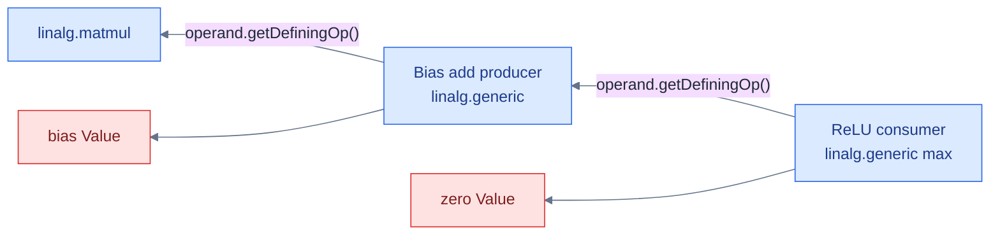
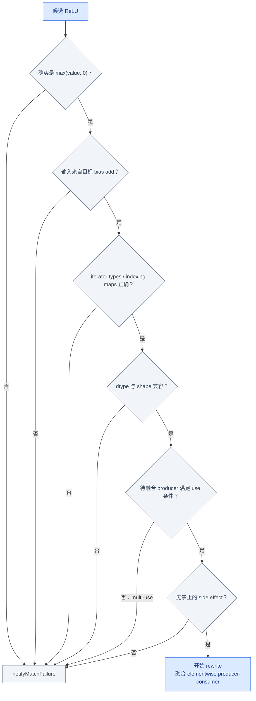
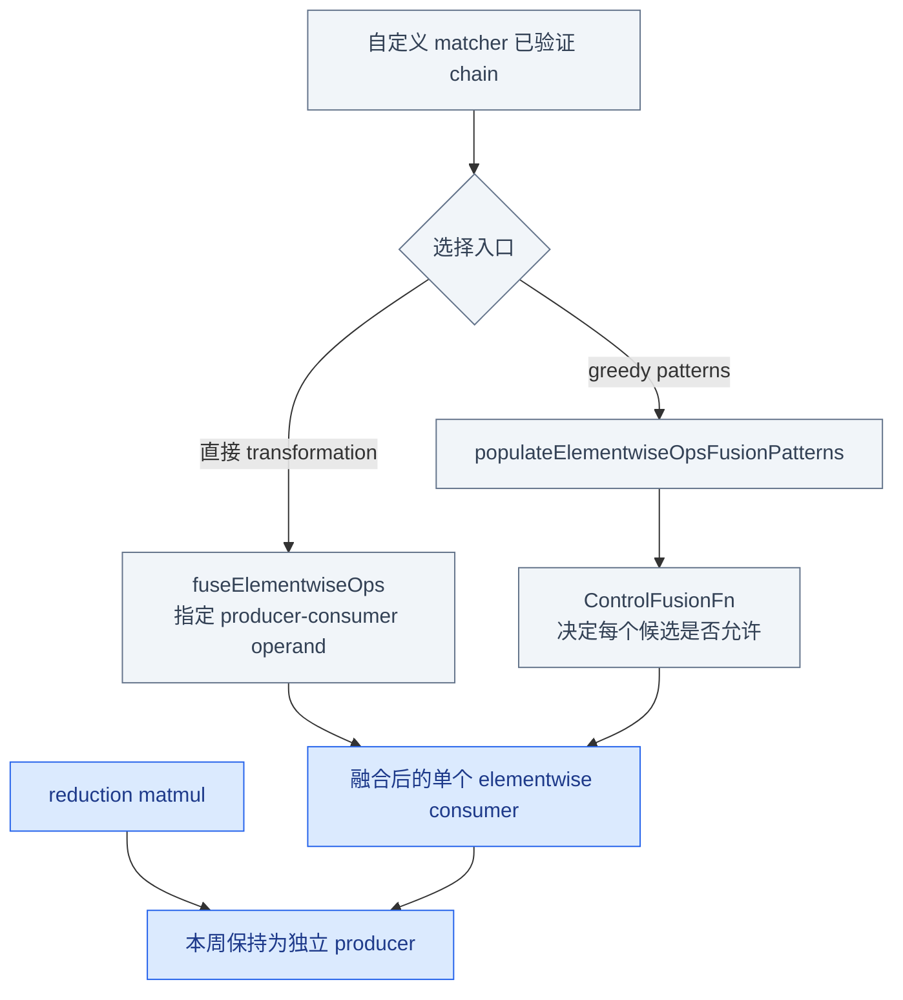

# Week 7：Producer–Consumer Chain

## 从单点 Pattern 扩展到计算子图

Week 6 的 root 只有一个 `arith.addi`，匹配条件都能从该 Operation 自身读取。本章的目标
`matmul → bias add → ReLU` 横跨三个 Operations，匹配器必须沿 SSA use-def 从 consumer
反向寻找 producers，并在任何 mutation 之前证明整条链安全。

本章先用不依赖 Linalg 细节的图解释通用算法，再把它实例化为真实 maps、iterator types 和
fusion API：

```text
通用 chain matcher
  consumer → defining op → defining op
  + single-use / type / effect 门禁

真实 Linalg matcher
  ReLU body → bias broadcast maps → matmul producer
  → 调用 elementwise fusion → 结构性验证
```

## 从 Consumer 反向匹配

目标链：

```text
matmul(A, B) → add broadcast(bias) → max(value, 0)
```



这里先只关心 SSA 边：每取得一个输入 Value，就用 `getDefiningOp()` 向前走一步。找到名字相符
的 Operation 只是候选，能否安全融合还要经过完整门禁。

从最外层 consumer 开始，才能知道“哪个 operand 应该来自 add”，再沿 defining op 回溯完整链。
匹配成功前不能修改 IR。

## 完整匹配门禁



### 为什么 single-use 常是融合条件

如果 add 的结果还有第二个 user：

```text
                 ┌──> ReLU
Bias Add result ─┤
                 └──> Other User
```

删除或把 add 完全内联进 ReLU 会破坏 `Other User`。可以选择保留 producer，但那是另一种
成本模型和 transformation contract，不能静默当成同一个 rewrite。

门禁解决“这一次能不能安全改”。Driver 还需要知道多个候选先试谁，以及反复运行是否会停止，
所以在进入 Linalg 细节前先补上 benefit 和终止性这两个全局约束。

## Benefit 与终止性

`PatternBenefit` 只决定同一 root 上候选 pattern 的优先级，不保证全局最优。终止性需要一个
单调度量，例如：

```text
每次融合使目标 elementwise Operation 数量减少 1
```

二次运行 Pass 后 IR 不再变化，是达到 fixpoint 的直接证据之一。正例检查融合后的结构，负例
检查原链保持；不要只检查 pass 返回 success。

前半章到此建立了与 dialect 无关的 matcher 骨架。下面第二次缩放到真实 Linalg：
“这是 bias broadcast”和“这是 ReLU”必须由 region body、maps 与 iterators 共同证明，不能只看
Operation 名称。

## 真实 Linalg 链包含什么语义

一个 elementwise `linalg.generic` 不因为看起来有 `arith.addf` 就一定是 bias broadcast。Matcher
至少要验证：

```text
inputs / outputs
indexing_maps
iterator_types
region body
yielded value
element type
producer use count
side effects
```

概念输入：

```mlir
%mm = linalg.matmul
    ins(%a, %b : tensor<MxKxf32>, tensor<KxNxf32>)
    outs(%init : tensor<MxNxf32>) -> tensor<MxNxf32>

%biased = linalg.generic
    {indexing_maps = [
       affine_map<(m, n) -> (m, n)>,
       affine_map<(m, n) -> (n)>,
       affine_map<(m, n) -> (m, n)>],
     iterator_types = ["parallel", "parallel"]}
    ins(%mm, %bias : tensor<MxNxf32>, tensor<Nxf32>)
    outs(%empty : tensor<MxNxf32>) {
  ^bb0(%v: f32, %b: f32, %out: f32):
    %r = arith.addf %v, %b : f32
    linalg.yield %r : f32
} -> tensor<MxNxf32>
```

ReLU consumer 还需确认：

```text
region 计算 max(input, 0)
0 的类型与 input element type 一致
不是 min、任意 max、带额外计算或错误 operand
```

这些语义条件逐项落到 typed accessors 和 `notifyMatchFailure`，就得到只读 matcher。

## 只读 Matcher 骨架

```cpp
LogicalResult matchChain(linalg::GenericOp relu,
                         PatternRewriter &rewriter,
                         linalg::GenericOp &biasAdd,
                         linalg::MatmulOp &matmul) const {
  if (!isReluBody(relu))
    return rewriter.notifyMatchFailure(relu, "not max(value, zero)");

  Value reluInput = relu.getDpsInputOperand(0)->get();
  biasAdd = reluInput.getDefiningOp<linalg::GenericOp>();
  if (!biasAdd || !isBiasBroadcastAdd(biasAdd))
    return rewriter.notifyMatchFailure(relu, "expected bias add producer");

  if (!biasAdd->hasOneUse())
    return rewriter.notifyMatchFailure(relu, "bias add has multiple users");

  Value addInput = biasAdd.getDpsInputOperand(0)->get();
  matmul = addInput.getDefiningOp<linalg::MatmulOp>();
  if (!matmul)
    return rewriter.notifyMatchFailure(relu, "expected matmul producer");

  if (!hasCompatibleTypesAndMaps(matmul, biasAdd, relu))
    return rewriter.notifyMatchFailure(relu, "incompatible type or map");

  return success();
}
```

真正实现时应使用当前 checkout 的 typed accessors，并在 `matchChain` 返回 success 之后才执行
任何 mutation。

Matcher 只回答“可不可以融合”，并不要求重新实现上游已有算法。验证成功后，可以选择直接
调用 transformation，也可以把受控条件交给 greedy fusion patterns。

## 两条 Fusion 入口



本周只把 bias add 与 ReLU 合成一个 elementwise consumer。Matmul 带 reduction iterator，把它
强行内联进纯 elementwise region 会改变迭代结构，不属于普通 elementwise fusion 的合同。

选择 fusion 入口后，前面抽象提到的 benefit 才有具体对象：它只排序同一 root 上可尝试的
patterns，不评价整条程序的最终性能。

## PatternBenefit 竞争

假设同一 ReLU root 有两个候选：

```text
Pattern A：只做 max(x, 0) 的简单规范化，benefit = 1
Pattern B：融合 bias + ReLU，benefit = 2
```

Driver 通常先尝试高 benefit 的候选，但 benefit：

- 只比较同一 root 上当前可用候选；
- 不预测后续所有 rewrite；
- 不等于运行成本或 GPU 性能；
- 不保证全局最优解。

若高 benefit pattern 匹配失败，低 benefit pattern 仍可能运行。

最后用负例矩阵证明门禁确实生效，再用结构性 FileCheck 证明正例减少了目标 Operation 数量。

## 负例矩阵

| Case | 拒绝原因 | IR 预期 |
|---|---|---|
| bias add result 有第二个 user | 删除/内联会影响另一 user | 原链保持 |
| bias map 把 `bias[n]` 写成 `bias[m]` | broadcast 语义不同 | 原链保持 |
| bias 是 `f16`，矩阵是 `f32` | dtype contract 不满足 | verifier 或 matcher 拒绝 |
| consumer 是 `max(x, 1)` | 不是 ReLU | 原链保持 |
| generic body 有额外 side effect | 不能安全克隆/融合 | 原链保持 |
| iterator types 不全为 parallel | 不是目标 elementwise 结构 | 原链保持 |

side-effect 检查应结合 `MemoryEffectOpInterface`/辅助 API，而不是只按 Operation 名称建立白名单。

## 结构性 FileCheck

```text
正例：
  CHECK:         linalg.matmul
  CHECK-COUNT-1: linalg.generic
  CHECK:         arith.addf
  CHECK:         arith.maximumf

multi-use 负例：
  CHECK:         linalg.matmul
  CHECK-COUNT-2: linalg.generic
```

实际 CHECK 应围绕函数 label 分组，避免全文件计数被其他测试函数干扰。Pass 再运行一次后，
Operation 数量和结构应不再变化。

本章把 Week 6 的局部等式扩展成了一个受约束的计算子图 rewrite。但它仍只保证选中的链改写
正确，不保证整个 IR 已经达到某个 target dialect。Week 8 将用 legality 定义全局完成条件。

## 源码阅读地图

| 主题 | 入口 |
|---|---|
| Matmul/Generic ODS 定义 | `include/mlir/Dialect/Linalg/IR/LinalgOps.td` |
| fusion API 与 control callback | `include/mlir/Dialect/Linalg/Transforms/Transforms.h` |
| upstream 行为样例 | `test/Dialect/Linalg/fusion-elementwise.mlir` |
| use 查询 | `include/mlir/IR/Value.h` |
| side effects | `include/mlir/Interfaces/SideEffectInterfaces.h` |
| worklist 与迭代上限 | `lib/Transforms/Utils/GreedyPatternRewriteDriver.cpp` |

## Week 7 Exit Gate

- [ ] 能从 ReLU consumer 沿 defining op 找到 bias add 与 matmul。
- [ ] matcher 在 mutation 前检查 operand、maps、iterators、dtype、uses 和 effects。
- [ ] 正例只融合 elementwise bias + ReLU，matmul reduction 保持独立。
- [ ] multi-use、错误 layout/dtype、非 ReLU 和 side-effect 负例保持原 IR。
- [ ] 能解释 PatternBenefit 为什么不保证全局最优。
- [ ] 有明确单调度量证明 rewrite 终止。
- [ ] 结构性 FileCheck 与二次运行测试通过。

---

上一章：[← Week 6：Rewrite、Fold、Driver 到底谁改了 IR](02_Rewrite_Fold_and_Driver.md)  
下一章：[Week 8：DialectConversion Bridge →](04_Dialect_Conversion_Bridge.md)
