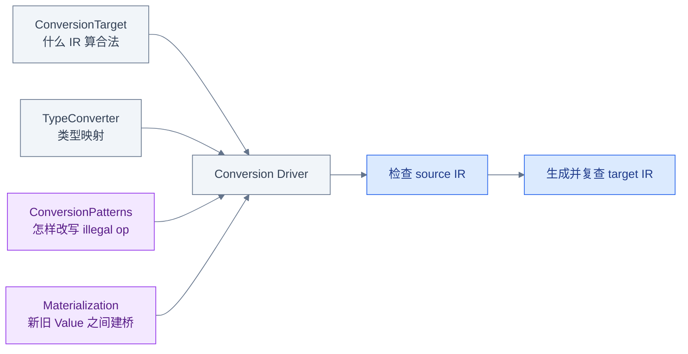
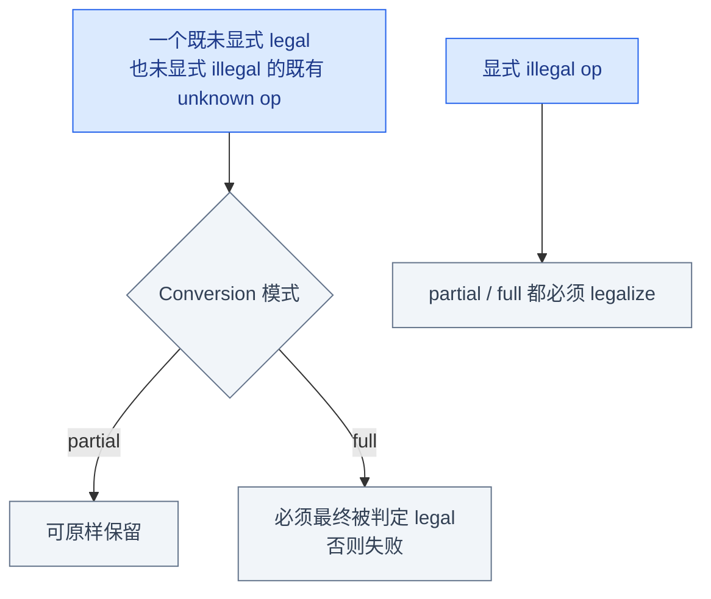
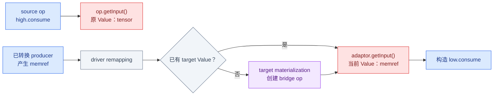
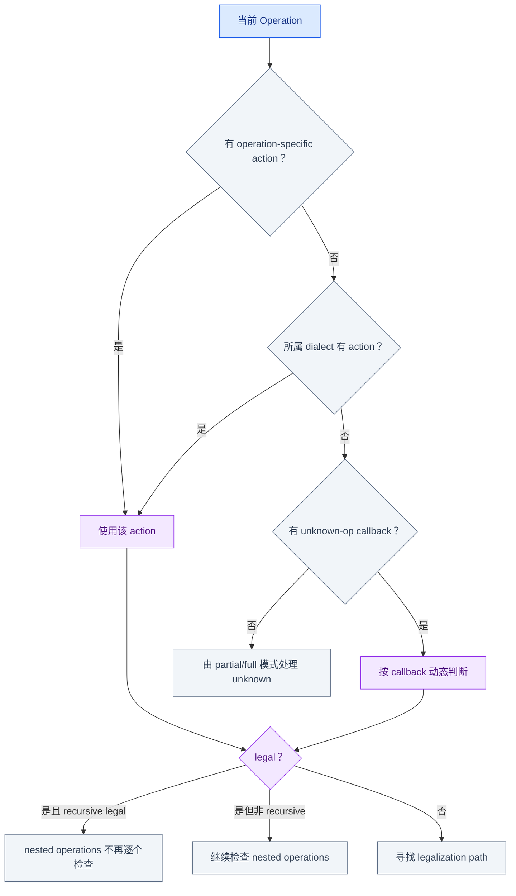
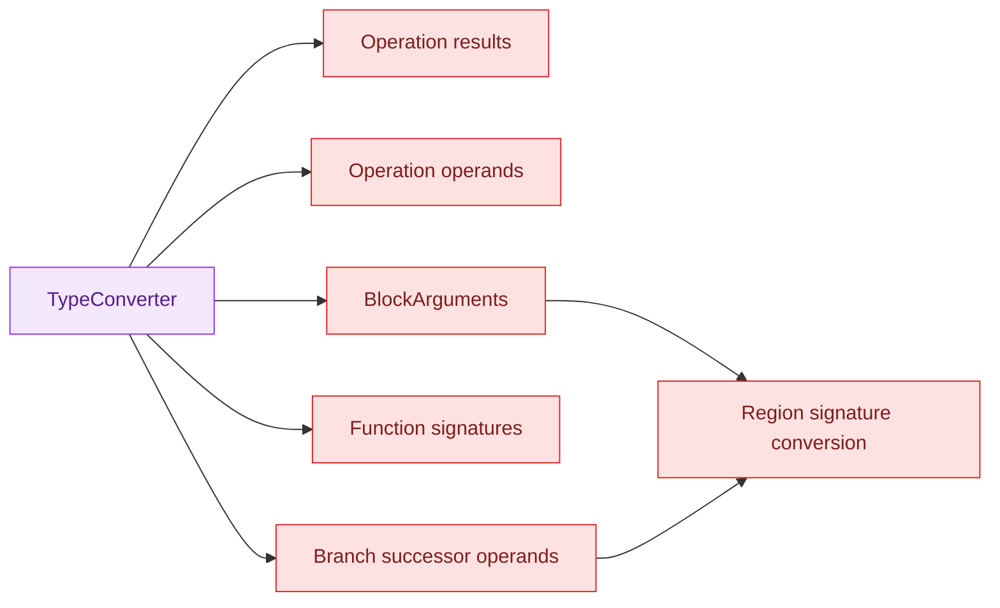
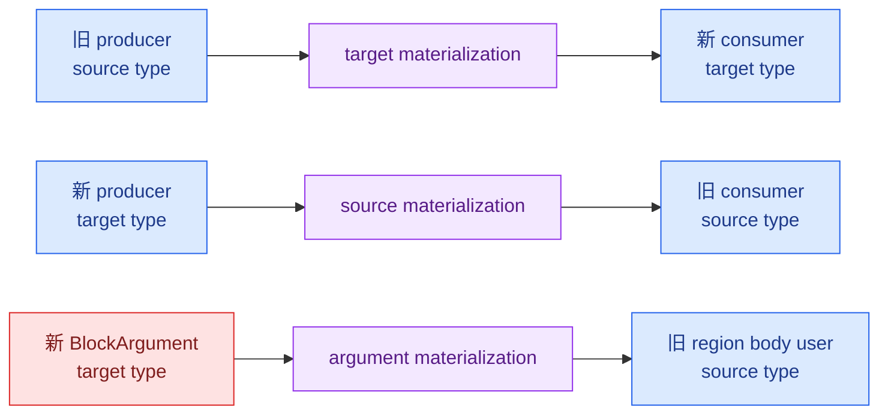

# Week 8：DialectConversion Bridge

## 从局部成功到全局合法终点

Week 7 中某条 fusion pattern 成功，就完成了该局部 transformation；其他 Operation 是否保持原
dialect 并不重要。Dialect Conversion 面向 lowering，完成条件更强：ConversionTarget 要求的
所有 illegal Operations 都必须找到合法化路径。

本章采用“先看全局协作，再逐项展开”的顺序：

```text
鸟瞰：Target / TypeConverter / Pattern / Materialization / Driver
  → 先认识 partial/full 与 adaptor 类型边界
  → 回到 Target，展开 legality 查询
  → 组装最小 conversion pass
  → 展开 signature/materialization/adaptor
  → 用正负例和 rollback 边界收束
```

## 五个角色



Conversion 不以“某条 pattern 成功”为完成，而以最终 legality 为完成。

因此第一个需要确定的不是“有哪些 patterns”，而是 driver 对未被明确判定的 Operation 采取
什么态度，这就是 partial 和 full 的差异。

## Partial 与 Full



用显式 illegal op 无法展示 partial/full 差异，因为两种模式都不允许它残留。

无论哪种模式，producer 和 consumer 的类型转换都可能不同步。为了先建立直觉，下一节预览
driver 如何用 remapping、adaptor 和 materialization 跨越这种边界；其注册细节稍后展开。

## `op`、`OpAdaptor` 与 Materialization



- `TypeConverter` 只回答 `tensor → memref`，不会凭空生成 SSA Value。
- Materialization 生成实际桥接 Operation/Value。
- `op.getInput()` 是 source Operation 的原始 operand。
- `adaptor.getInput()` 是 conversion driver 提供的当前 remapped operand。

临时桥可能表现为 `builtin.unrealized_conversion_cast`。它表达“类型边界已连接，但真实转换语义
尚未落定”，最终应被 reconcile 或替换为合法 materialization。

Materialization 让 IR 在转换途中仍满足类型约束，但 conversion 失败时的状态也因此更复杂。
在进入配置代码前，先记住一个安全原则：不要把框架外副作用纳入 rollback 假设。

## 失败不等于所有外部状态自动回滚

Conversion driver 对其受控 rewrite 有延迟/回滚策略，但不能据此假设诊断、外部容器、统计量或
pattern 自行产生的框架外副作用都会恢复。Pattern 应将所有 IR mutation 交给
`ConversionPatternRewriter`，并在 match 阶段完成所有拒绝条件检查。

完整细节见
[`04_Dialect_Conversion.md`](../Transformation/04_Dialect_Conversion.md)。

前面四节是问题预览。现在从最根本的 `ConversionTarget` 重新展开实现：先决定每个 Operation
是否合法，再为 illegal 分支配置 patterns 和类型转换。

## Legality 的三种配置

```cpp
ConversionTarget target(context);

// Static legality：无条件合法/非法。
target.addLegalDialect<LLVM::LLVMDialect>();
target.addIllegalDialect<arith::ArithDialect>();

// Dynamic legality：根据当前 Operation 状态判断。
target.addDynamicallyLegalOp<func::FuncOp>(
    [&](func::FuncOp op) {
      return typeConverter.isSignatureLegal(op.getFunctionType());
    });

// Recursive legality：容器合法后，整个 nested tree 被视为合法。
target.markOpRecursivelyLegal<MyContainerOp>(
    [](MyContainerOp op) { return op.isOpaque(); });
```

Legality 查询优先级可简化为：



Operation-specific illegal 可以覆盖整个 dialect legal。Recursive legality 也不是“Region 会自动
合法”，而是显式告诉 driver：满足条件的容器及其内部整体无需继续 legalization。

有了 target，下一步把 TypeConverter 和公开 lowering patterns 一起交给 driver，形成最小
Arith/Func/CF-to-LLVM pass。

## Mini Arith-to-LLVM Pass 骨架

```cpp
void runOnOperation() override {
  MLIRContext &context = getContext();
  ModuleOp module = getOperation();

  LLVMTypeConverter typeConverter(&context);
  RewritePatternSet patterns(&context);
  arith::populateArithToLLVMConversionPatterns(typeConverter, patterns);
  populateFuncToLLVMConversionPatterns(typeConverter, patterns);
  cf::populateControlFlowToLLVMConversionPatterns(typeConverter, patterns);

  ConversionTarget target(context);
  target.addLegalDialect<LLVM::LLVMDialect>();
  target.addLegalOp<ModuleOp>();
  target.addIllegalDialect<arith::ArithDialect>();
  target.addIllegalDialect<func::FuncDialect>();
  target.addIllegalDialect<cf::ControlFlowDialect>();

  if (failed(applyFullConversion(
          module, target, std::move(patterns))))
    signalPassFailure();
}
```

准确的 legality 集合取决于 patterns 实际生成哪些辅助 Operation。目标不是“尽量多标 legal”，
而是明确 pass 后允许残留什么。容器 `builtin.module` 可以保持 legal，因为它承载目标 IR，
不意味着其中的 illegal nested ops 自动合法。

这个 pass 骨架看起来只创建了一个 TypeConverter，但它影响的不只是 `arith.addi` 的 result。
函数签名、BlockArguments 和分支传值必须形成一致的新 SSA 图。

## TypeConverter 不只转换 Result



类型映射可能是：

```text
1:1  source type -> 一个 target type
1:N  source type -> 多个 target types
1:0  source type -> 不产生 target value
```

函数签名改变时，入口 BlockArgument 也必须同步改变；分支传入的 successor operands 还要与新
BlockArguments 对齐。这就是 region signature conversion，不能只替换产生结果的 Operation。

当新旧签名和 Operation 不是同时完成转换时，前面预览的 materialization 才真正出现。下面按
桥接方向区分三类，而不是把所有 cast 都叫作同一种 materialization。

## 三类 Materialization

| 类型 | 方向/位置 | 典型场景 |
|---|---|---|
| Target materialization | source Value → target Value | 旧 producer 连接已转换 consumer |
| Source materialization | target Value → source Value | 新 producer 连接尚未转换 consumer |
| Argument materialization | 新 BlockArgument 附近建立旧视图 | Region signature 已转换但内部旧 user 暂存 |



Materialization 回调创建真实 IR；如果没有适用的真实转换，driver 可能暂时用
`builtin.unrealized_conversion_cast` 维护 SSA 类型正确性。最终 pipeline 应 reconcile 可消除
的往返 cast，并确保不允许残留的 cast 不进入最终合法 IR。

TypeConverter 决定期望类型，materialization 提供桥接 Value；ConversionPattern 最终通过
adaptor 接收 driver 计算出的当前 operand 视图。

## Adaptor 在 ConversionPattern 中的实际位置

```cpp
struct LowerAdd
    : OpConversionPattern<arith::AddIOp> {
  using OpConversionPattern::OpConversionPattern;

  LogicalResult matchAndRewrite(
      arith::AddIOp op,
      OpAdaptor adaptor,
      ConversionPatternRewriter &rewriter) const override {
    rewriter.replaceOpWithNewOp<LLVM::AddOp>(
        op, adaptor.getLhs(), adaptor.getRhs());
    return success();
  }
};
```

`op` 用于读取 source Operation 的位置、属性、Region 和原语义；构造 target op 时优先使用
adaptor 的 remapped operands。Adaptor 不是新 Operation，也不拥有 payload Value。

五个角色现在已经串起来，可以用同一组正负例验证：Target 决定是否必须转换，Pattern 决定
是否有路径，TypeConverter/adaptor/materialization 决定类型边能否连接。

## 正例与失败矩阵

| Case | 模式 | 预期 |
|---|---|---|
| 所有 arith/func/cf 都有 lowering | full | 成功，只剩允许的 target/container ops |
| pre-existing unknown op 未配置 action | partial | 可保留 |
| 同一个 unknown op | full | 失败 |
| 显式 illegal op 无 pattern | partial/full | 都失败 |
| dynamic legality callback 返回 false | partial/full | 必须寻找 legalization |
| source type 无 conversion | full | 类型转换或 pattern 失败 |
| materialization 无法创建 bridge | 需要桥接时 | conversion 失败 |

失败测试使用：

```bash
$MLIR_BIN/mlir-opt invalid.mlir \
  -mini-arith-to-llvm -verify-diagnostics
```

成功测试除检查 LLVM op 外，还应断言：

```text
CHECK-NOT: arith.
CHECK-NOT: func.func
CHECK-NOT: cf.
CHECK: llvm.func
```

不要只检查出现了一个 `llvm.add`；其他 illegal op 残留仍表示 full conversion 未完成。

测试验证 IR 结果；最后还要界定失败语义，避免把 driver 可管理的 rewrite rollback 误推广到
日志、计数器或其他框架外状态。

## Rollback 边界

```text
Pattern 的 IR rewrite
  -> 必须交给 ConversionPatternRewriter
  -> driver 才能延迟、撤销或提交其受控修改

框架外副作用
  -> 日志文件、全局计数、外部容器、直接 mutation
  -> 不应假设 conversion failure 会自动恢复
```

Pattern 应先完成所有只读检查，再修改 IR；conversion 返回 failure 也不等于任意外部状态恢复到
调用前。

本章完成了“整个 lowering 何时结束”的判据。Week 9 不再只用固定 C++ pipeline 决定变换顺序，
而是把“匹配哪个 matmul、用什么 tile size”表达成另一套可执行的 Transform IR。

## 源码阅读地图

| 主题 | 入口 |
|---|---|
| conversion modes、materialization | `docs/DialectConversion.md` |
| ConversionTarget/TypeConverter/driver API | `include/mlir/Transforms/DialectConversion.h` |
| LLVMTypeConverter | `include/mlir/Conversion/LLVMCommon/TypeConverter.h` |
| Arith lowering population | `include/mlir/Conversion/ArithToLLVM/ArithToLLVM.h` |
| Func lowering population | `include/mlir/Conversion/FuncToLLVM/ConvertFuncToLLVM.h` |
| CF lowering population | `include/mlir/Conversion/ControlFlowToLLVM/ControlFlowToLLVM.h` |
| 综合测试样例 | `test/lib/Transforms/TestDialectConversion.cpp` |

## Week 8 Exit Gate

- [ ] 能独立配置 static、dynamic、recursive legality。
- [ ] 能说明 legal、illegal、unknown 以及 operation/dialect action 优先级。
- [ ] 能配置 LLVMTypeConverter 与 Arith/Func/CF patterns。
- [ ] 能解释 result、operand、BlockArgument、function signature 为何要一起转换。
- [ ] 能区分 source/target/argument materialization。
- [ ] 能用同一个 unknown op 正确展示 partial/full 差异。
- [ ] 正例证明目标 illegal dialect 消失，负例诊断可验证。
- [ ] 不把 conversion failure 误认为任意外部状态自动 rollback。

---

上一章：[← Week 7：Producer–Consumer Chain](03_Producer_Consumer_Chain.md)  
下一章：[Week 9：Transform Dialect 与 Tiling Interfaces →](05_Transform_and_Tiling.md)
