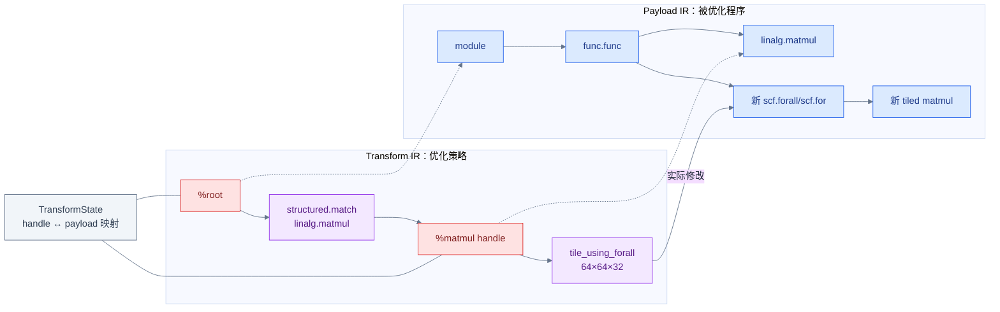
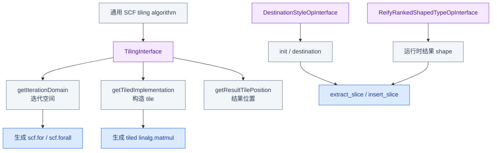
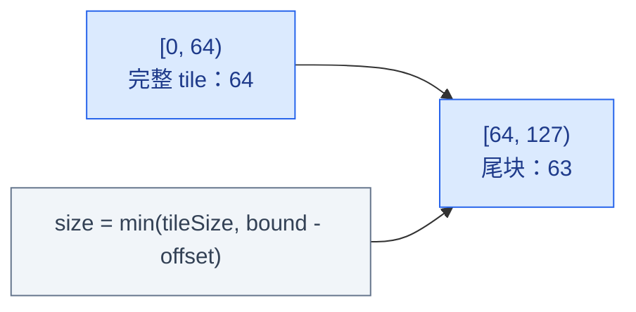
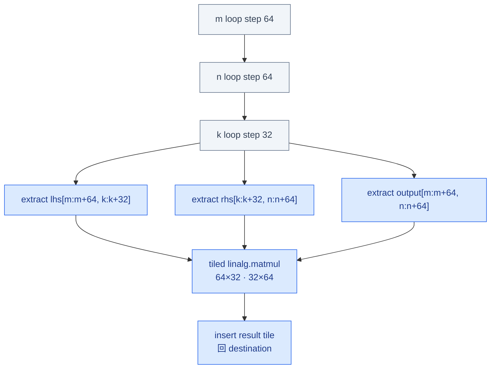
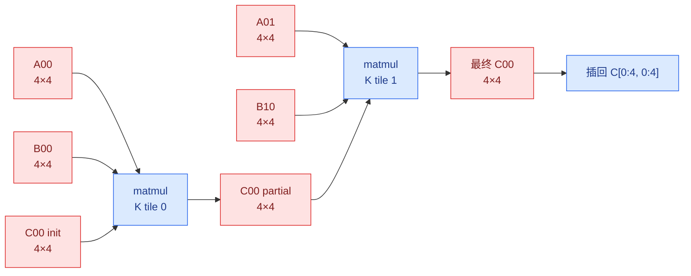

# Week 9：Transform Dialect 与 Tiling Interfaces

## 从固定 Pipeline 到可编排策略

Week 8 的 conversion pass 在 C++ 中固定 target、patterns 和执行入口。本章换一个层次：payload
IR 仍是待优化程序，但“匹配哪个 matmul、选择哪种 loop、tile 多大”写进 Transform IR，由
interpreter 按 handle 映射执行。

本章也分两次缩放：

```text
原理预览
  两套 IR + handle
  通用 tiling 为什么依赖 interfaces
  尾块为什么必须动态收缩

完整实例
  128×256 · 256×512 payload
  named sequence 精确匹配
  for/forall 与 tile 后结构
  handle 生命周期 + FileCheck
```

## 两套 IR 与一组 Handle



Transform handle 是 Transform IR 自己的 SSA Value，其关联对象在 Payload IR 中。红色虚线不是
payload use-def，也没有复制 `linalg.matmul`。

Handle 解决“Transform IR 如何指向 payload 对象”，但 tile operation 仍需要知道任意目标 op
如何暴露迭代空间、destination 和结果 tile。这个通用性来自 interfaces。

## Tiling 为什么依赖 Interface



算法不硬编码每一种 Linalg op，而是向接口询问：

1. 循环空间多大；
2. 给定 offsets/sizes 后怎样创建 tiled implementation；
3. 结果 tile 应插回 destination 的什么位置；
4. 动态 shape 如何重建。

Interface 给出了创建完整 tile 的方法；边界 tile 还必须根据剩余 iteration domain 缩小 size。
先用一维公式建立尾块直觉，再进入三维 matmul 实例。

## 非整除边界

以一维 `N=127`、tile size `64` 为例：

```text
tile 0: offset = 0,  size = min(64, 127 - 0)  = 64
tile 1: offset = 64, size = min(64, 127 - 64) = 63
```



因此 FileCheck 不应只验证整除 shape；还要检查尾块的 `offset`、`size`、`tensor.extract_slice`
以及结果插回逻辑。

原理预览到此结束。下面固定一份 payload IR，把 handle、interface 和尾块逻辑放进同一次
可运行 transformation。

## 最小 Payload IR

计划中的矩阵形状是：

```text
A: 128 × 256
B: 256 × 512
C: 128 × 512
```

```mlir
func.func @matmul(
    %lhs: tensor<128x256xf32>,
    %rhs: tensor<256x512xf32>) -> tensor<128x512xf32> {
  %zero = arith.constant 0.0 : f32
  %empty = tensor.empty() : tensor<128x512xf32>
  %init = linalg.fill ins(%zero : f32)
      outs(%empty : tensor<128x512xf32>)
      -> tensor<128x512xf32>
  %result = linalg.matmul
      ins(%lhs, %rhs
          : tensor<128x256xf32>, tensor<256x512xf32>)
      outs(%init : tensor<128x512xf32>)
      -> tensor<128x512xf32>
  return %result : tensor<128x512xf32>
}
```

`%init` 是 destination/init，不是可以省略的装饰参数。Tensor 语义的 matmul 返回一个新 SSA
Value，tiling 后各个结果 tile 最终要插回共享 destination，形成替换原 `%result` 的 Value。

Payload 确定“改谁”；下一步用 named sequence 建立 `%root → %matmul → tiling` 的策略数据流，
避免依赖文件中只有一个目标 Operation。

## 精确匹配的 Transform IR

```mlir
module attributes {transform.with_named_sequence} {
  // payload func.func 放在这里

  transform.named_sequence @__transform_main(
      %root: !transform.any_op) {
    %matmul = transform.structured.match
        ops{["linalg.matmul"]} in %root
        : (!transform.any_op) -> !transform.any_op

    %tiled, %loops:3 =
        transform.structured.tile_using_for %matmul
        tile_sizes [64, 64, 32]
        : (!transform.any_op)
          -> (!transform.any_op, !transform.any_op,
              !transform.any_op, !transform.any_op)
    transform.yield
  }
}
```

这里的 3 个循环依次对应 matmul iteration domain 的 `m`、`n`、`k`。`m/n` 是 parallel
dimensions，`k` 是 reduction dimension。若使用 `tile_using_forall`，通常优先把可并行维映射
到 forall；具体结果数量和合法的 reduction tiling 形式应以当前 op 定义及 upstream test 为准。

仅按 Operation 名称匹配已经比“取文件中第一个 op”稳定；实际项目还可增加 parent、attribute、
interface 或 shape 约束，避免同时命中不属于本策略的其他 matmul。

同一目标可以由两种 loop form 承载。选择 `for` 还是 `forall` 会改变 loop-carried result 和结果
插回形式，因此应在观察 after IR 之前先区分其语义。

## `scf.for` 与 `scf.forall`

| 形式 | 表达重点 | 结果回写 |
|---|---|---|
| `scf.for` | 顺序循环和 loop-carried values | 常见 `tensor.insert_slice`/yield |
| `scf.forall` | 逻辑并行迭代，可携带 device mapping | `scf.in_parallel` + `tensor.parallel_insert_slice` |

`forall` 表示迭代之间应可并行，不等于已经映射为 CUDA thread。后续还需要 mapping/lowering
明确 block/thread 语义。

Loop form 确定后，就能沿 M/N/K offsets 追踪 operand slices、局部 matmul 和 destination
insertion，看到 tiling 实际新建了什么 IR。

## Tile 后的结构

对于 `64×64×32`，一块计算大致需要：

```text
lhs tile:  tensor<64x32xf32>
rhs tile:  tensor<32x64xf32>
out tile:  tensor<64x64xf32>
```



这是一张语义图，实际 IR 还取决于 reduction tiling strategy、循环类型和 folding。FileCheck
应检查稳定结构，避免把所有临时 SSA 名称写死。

## 一个可手算的矩阵 Tile 示例

先把计划中的大矩阵缩小为：

```text
A: 8×8
B: 8×8
C = A×B: 8×8

tile_sizes = [4, 4, 4]
                  M  N  K
```

三个 tile size 分别表示：

```text
每次计算 C 的 4 行
每次计算 C 的 4 列
每次沿 reduction K 维处理 4 个元素
```

### 矩阵怎样被分块

矩阵 A 沿 M/K 分成四块：

```text
A =
┌─────────┬─────────┐
│ A00     │ A01     │
│ rows0:4 │ rows0:4 │
│ cols0:4 │ cols4:8 │
├─────────┼─────────┤
│ A10     │ A11     │
│ rows4:8 │ rows4:8 │
│ cols0:4 │ cols4:8 │
└─────────┴─────────┘

每个 Aij 都是 4×4。
```

矩阵 B 沿 K/N 分成四块：

```text
B =
┌─────────┬─────────┐
│ B00     │ B01     │
│ rows0:4 │ rows0:4 │
│ cols0:4 │ cols4:8 │
├─────────┼─────────┤
│ B10     │ B11     │
│ rows4:8 │ rows4:8 │
│ cols0:4 │ cols4:8 │
└─────────┴─────────┘

每个 Bij 都是 4×4。
```

输出 C 沿 M/N 分成四个 `4×4` tiles：

```text
C =
┌─────────┬─────────┐
│ C00     │ C01     │
│ rows0:4 │ rows0:4 │
│ cols0:4 │ cols4:8 │
├─────────┼─────────┤
│ C10     │ C11     │
│ rows4:8 │ rows4:8 │
│ cols0:4 │ cols4:8 │
└─────────┴─────────┘
```

### 一个输出 Tile 如何计算

以左上角 `C00` 为例。它覆盖：

```text
C rows [0,4)
C cols [0,4)
```

由于 K 维长度为 8、`tileK=4`，它要分两轮累加：

```text
第 1 轮 K=[0,4)：
  C00_partial = A00 × B00

第 2 轮 K=[4,8)：
  C00 = C00_partial + A01 × B10
```

所以块矩阵乘法为：

```text
C00 = A00×B00 + A01×B10
C01 = A00×B01 + A01×B11
C10 = A10×B00 + A11×B10
C11 = A10×B01 + A11×B11
```



这里 M/N loops 决定当前输出 tile 是 `C00`、`C01`、`C10` 还是 `C11`；K loop 不创建新的
输出位置，而是在同一个输出 tile 上进行 reduction 累加。

### 对应的 offsets 和 sizes

计算 `C00` 时，三层循环的两次 K 迭代是：

| 迭代 | M offset | N offset | K offset | lhs slice | rhs slice | output slice |
|---|---:|---:|---:|---|---|---|
| 0 | 0 | 0 | 0 | `A[0:4, 0:4]` | `B[0:4, 0:4]` | `C[0:4, 0:4]` |
| 1 | 0 | 0 | 4 | `A[0:4, 4:8]` | `B[4:8, 0:4]` | 上轮的 `C00` |

计算右下角 `C11` 时：

| 迭代 | M offset | N offset | K offset | lhs slice | rhs slice | output slice |
|---|---:|---:|---:|---|---|---|
| 0 | 4 | 4 | 0 | `A[4:8, 0:4]` | `B[0:4, 4:8]` | `C[4:8, 4:8]` |
| 1 | 4 | 4 | 4 | `A[4:8, 4:8]` | `B[4:8, 4:8]` | 上轮的 `C11` |

### 对应的简化 IR

下面省略了部分类型和循环携带值，只展示结构：

```mlir
scf.for %m = %c0 to %c8 step %c4
    iter_args(%c_m = %init) -> tensor<8x8xf32> {
  %after_n = scf.for %n = %c0 to %c8 step %c4
      iter_args(%c_n = %c_m) -> tensor<8x8xf32> {

    %c_tile = tensor.extract_slice %c_n[%m, %n] [4, 4] [1, 1]
        : tensor<8x8xf32> to tensor<4x4xf32>

    %reduced = scf.for %k = %c0 to %c8 step %c4
        iter_args(%acc = %c_tile) -> tensor<4x4xf32> {
      %a_tile = tensor.extract_slice %A[%m, %k] [4, 4] [1, 1]
          : tensor<8x8xf32> to tensor<4x4xf32>
      %b_tile = tensor.extract_slice %B[%k, %n] [4, 4] [1, 1]
          : tensor<8x8xf32> to tensor<4x4xf32>

      %next = linalg.matmul
          ins(%a_tile, %b_tile
              : tensor<4x4xf32>, tensor<4x4xf32>)
          outs(%acc : tensor<4x4xf32>)
          -> tensor<4x4xf32>
      scf.yield %next : tensor<4x4xf32>
    }

    %inserted = tensor.insert_slice %reduced into %c_n[%m, %n]
        [4, 4] [1, 1]
        : tensor<4x4xf32> into tensor<8x8xf32>
    scf.yield %inserted : tensor<8x8xf32>
  }
  scf.yield %after_n : tensor<8x8xf32>
}
```

这段简化 IR 展示了四个关键关系：

```text
%m 决定 A/C 的行 offset
%n 决定 B/C 的列 offset
%k 同时决定 A 的列 offset 和 B 的行 offset
%acc 把前一个 K tile 的部分和传给下一个 K tile
```

### 与非整除矩阵的关系

`8×8` 配合 `4×4×4` 时所有 tiles 都完整，因此 size 是常量 4。如果改成：

```text
A: 7×6
B: 6×9
tile_sizes = [4,4,4]
```

最后一组 tile 的 shape 会收缩：

```text
M tail = 7 - 4 = 3
N tail = 9 - 8 = 1
K tail = 6 - 4 = 2
```

例如右下角最后一轮：

```text
A tile: 3×2
B tile: 2×1
C tile: 3×1
```

这就是后文“整除与非整除对照”中
`min(tileSize, bound - offset)` 同时作用于 M、N、K 三个维度的具体含义。

这张具体数据流正好对应前面三个 interfaces 的返回信息。下面把图中的每一步重新映射到接口
职责，以便从输出 IR 反查实现。

## Interface 分工展开

| Interface | Tiling algorithm 向它询问什么 |
|---|---|
| `DestinationStyleOpInterface` | 哪些 operands 是 inputs，哪些是 init/destination |
| `TilingInterface` | iteration domain、iterator types、tiled implementation、result tile |
| `ReifyRankedShapedTypeOpInterface` | 动态结果维度对应哪些 SSA Values |

通用算法的主链：

```text
读取 iteration domain
  → 按 tile size 生成 offsets/sizes
  → 创建 scf loops
  → 为 operands 创建 slices
  → 调 getTiledImplementation
  → 取得 tiled results
  → 插回 destination
  → 产生原 op results 的 replacements
```

接口主链对整除和非整除输入完全相同，差别只在 offsets/sizes。现在把开头的一维尾块公式扩展
到计划要求的 M/N/K 三个维度。

## 整除与非整除对照

对于 `M=128, tileM=64`：

```text
offsets = 0, 64
sizes   = 64, 64
```

对于 `M=127, tileM=64`：

```text
offsets = 0, 64
sizes   = 64, min(64, 127 - 64) = 63
```

完整的 `127×251×509` 还要求分别检查 M、N、K 尾块。FileCheck 应寻找动态/折叠后的
`affine.min`、`arith.min*` 或等价的 bounds 计算，以及相应 `extract_slice` size；具体形式以
当前 checkout 输出为准。

Tiling 会替换原 matmul，因此不仅 payload SSA uses 改变，指向旧 payload Operation 的 Transform
handle 也必须更新或失效。

## Handle 生命周期

`structured.match` 只读 payload 并产生 handle；tiling 会替换原 matmul，因此旧 `%matmul`
handle 通常被消费或失效。后续 transform 必须使用 `%tiled`、`%loops` 等结果 handles。

```text
%matmul ──consume──> tile_using_*
                         ├──> %tiled：新 tiled op
                         └──> %loops：新 loop ops
```

不能把 consume 理解成 Transform SSA Value 从文本中被删除；失效的是它在 TransformState 中
用于访问 payload 对象的合法映射。

最后把 payload 结构和 handle 生命周期同时写入测试：上游 lit 证明接口/transform 基础设施，
自定义 FileCheck 证明当前 shape 和策略的实际输出。

## 运行与 FileCheck

先运行 upstream tests：

```bash
$MLIR_BIN/llvm-lit -sv \
  $MLIR_BUILD/tools/mlir/test/Interfaces/TilingInterface/tile-using-scfforall.mlir
$MLIR_BIN/llvm-lit -sv \
  $MLIR_BUILD/tools/mlir/test/Dialect/Linalg/transform-op-tile.mlir
```

自定义测试至少检查：

```text
CHECK: scf.forall
CHECK: tensor.extract_slice
CHECK: linalg.matmul
CHECK: tensor.parallel_insert_slice
```

若选择 `scf.for`，相应检查 loop 数量、step、`tensor.insert_slice` 和 replacement。检查必须按
实际选择的 loop form 编写，不能同时要求互斥结构。

本章已经能用 Transform IR 试验 tiling 策略。Week 10 会把同样的 interface 调用固化为带
`tile-m/n/k` 参数、诊断和构建注册的 C++ Pass，并继续追踪 bufferization/vectorization。

## 源码阅读地图

| 主题 | 入口 |
|---|---|
| Transform named sequence/match | `docs/Tutorials/transform/Ch1.md` |
| tiling transform | `docs/Tutorials/transform/Ch2.md` |
| DestinationStyle | `include/mlir/Interfaces/DestinationStyleOpInterface.td` |
| Tiling interface contract | `include/mlir/Interfaces/TilingInterface.td` |
| shape reification | `include/mlir/Interfaces/InferTypeOpInterface.td` |
| SCF tiling implementation | `lib/Dialect/SCF/Transforms/TileUsingInterface.cpp` |
| upstream Transform test | `test/Dialect/Linalg/transform-op-tile.mlir` |

## Week 9 Exit Gate

- [ ] 两个 upstream lit 测试通过。
- [ ] 最小 tensor matmul 可解析并通过 verifier。
- [ ] named sequence 精确匹配目标 matmul。
- [ ] 能区分 payload IR、Transform IR、handle 和 TransformState。
- [ ] 能解释 DestinationStyle、Tiling、Reify 三个 interface 的分工。
- [ ] 能画出 loops、operand slices、tiled matmul 和 result insertion。
- [ ] 整除与 `127×251×509` 非整除测试均有结构性 FileCheck。
- [ ] 能说明 tiling 是按接口重建 IR，而不是文本替换。

---

上一章：[← Week 8：DialectConversion Bridge](04_Dialect_Conversion_Bridge.md)  
下一章：[Week 10：参数化 Tiling 与 IR Evolution →](06_Parameterized_Tiling_Evolution.md)
