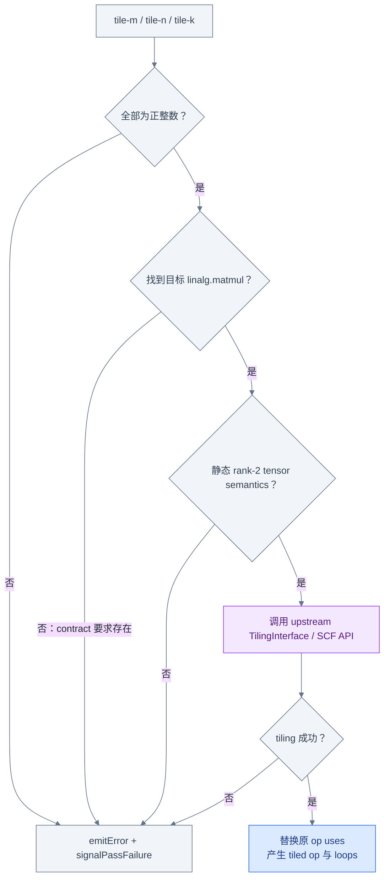
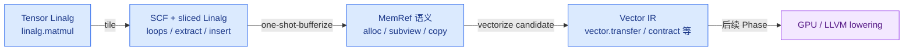
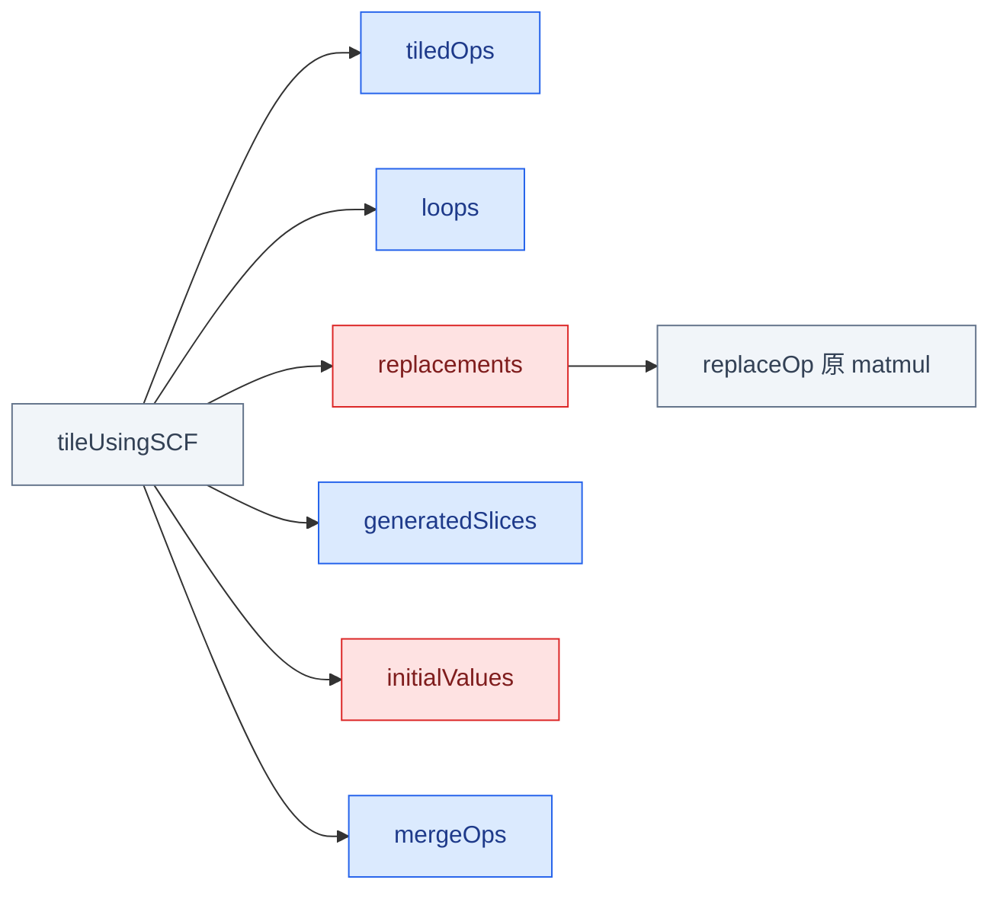
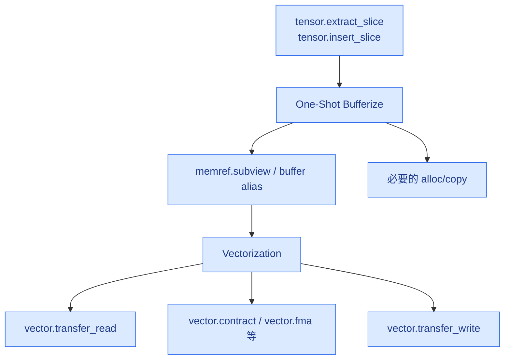

# Week 10：参数化 Tiling 与 IR Evolution

## 从可交互策略到工程化 Pass

Week 9 已证明某个 Transform sequence 能正确 tile matmul；Week 10 的目标不是再发明一次 tiling
算法，而是把同一 `TilingInterface`/SCF API 包装成稳定的 C++ Pass contract：

```text
Transform IR 原型
  固定 target 和 tile sizes
        ↓
C++ Pass 产品化
  options + 前置检查 + diagnostics
  + result replacement + tests + registration
        ↓
后续 pipeline
  bufferization → vectorization
```

本章前四节先给出工程合同全景，随后第二次展开 C++ 实现和测试细节。

## Pass Contract 先于实现



参数为零不仅可能造成无进展循环，也破坏 tiling API 的算法前提，所以必须在修改 IR 前验证。

Contract 决定什么输入可以进入 transformation；成功后的输出还要成为后续 bufferization 和
vectorization 的合法输入，所以先观察整条 IR evolution。

## IR Evolution



每一步回答不同问题：

| 阶段 | 结构变化 | 应观察什么 |
|---|---|---|
| Tiling | 一个大 op 变成循环与多个逻辑 tile | loop step、slice、tiled op、insert |
| Bufferization | tensor value 语义转为 buffer side effect 语义 | allocation、alias、copy、subview |
| Vectorization | 标量/结构化计算映射到向量操作 | vector shape、transfer、contract |
| GPU lowering | 计算与存储映射到设备层级 | thread/block、address space、barrier |

这条演化链要求 tiling 正确替换原结果。否则旧 users、旧 handles 或旧 analysis 都可能继续指向
已经失效的结构。

## Transformation 前后的所有权

```text
原 matmul results
       │
       ├─ tiling result.replacements
       ▼
新 loop / tiled computation 的 results
       │
       └─ rewriter.replaceOp 更新原来的全部 users
```

成功后，原 Operation 不能再被旧指针或旧 Transform handle 当作有效对象使用。CFG、dominance、
alias 等依赖旧结构的 analysis 也可能失效。

Contract、演化目标和所有权明确后，才能设计验证闭环：先构建注册，再分别证明正例、负例、
边界和二次运行。

## 验证闭环


Phase 2 的最终能力不是“能调用 tile API”，而是能解释并证明：

- 谁选择目标、谁修改 IR；
- 新建了哪些 Operation，旧 uses 如何替换；
- 哪些输入必须拒绝；
- failure 前是否已经发生 mutation；
- 哪些 analysis 需要失效；
- tiling 如何改变后续 bufferization/vectorization 的输入形态。

以上是 pass 的外部合同。下面开始第二次展开，从 options 和 `runOnOperation()` 看它如何调用
Week 9 已理解的 SCF tiling API。

## Pass Option 与实现骨架

```cpp
struct MatmulTilingPass
    : PassWrapper<MatmulTilingPass,
                  OperationPass<func::FuncOp>> {
  MLIR_DEFINE_EXPLICIT_INTERNAL_INLINE_TYPE_ID(MatmulTilingPass)

  Option<int64_t> tileM{
      *this, "tile-m", llvm::cl::desc("M tile size"),
      llvm::cl::init(64)};
  Option<int64_t> tileN{
      *this, "tile-n", llvm::cl::desc("N tile size"),
      llvm::cl::init(64)};
  Option<int64_t> tileK{
      *this, "tile-k", llvm::cl::desc("K tile size"),
      llvm::cl::init(32)};

  void runOnOperation() override;
};
```

实现应分成“只读验证”和“执行 mutation”两阶段：

```cpp
void MatmulTilingPass::runOnOperation() {
  func::FuncOp func = getOperation();

  if (tileM <= 0 || tileN <= 0 || tileK <= 0) {
    func.emitError("tile-m, tile-n and tile-k must be positive");
    return signalPassFailure();
  }

  SmallVector<linalg::MatmulOp> targets;
  func.walk([&](linalg::MatmulOp op) {
    if (isSupportedStaticRank2TensorMatmul(op))
      targets.push_back(op);
  });

  if (targets.empty()) {
    func.emitError("expected a supported linalg.matmul target");
    return signalPassFailure();
  }

  // 所有会导致拒绝的条件尽量在这里验证完成。

  IRRewriter rewriter(&getContext());
  for (linalg::MatmulOp matmul : targets) {
    auto tileable = dyn_cast<TilingInterface>(matmul.getOperation());
    if (!tileable) {
      matmul.emitError("expected TilingInterface");
      return signalPassFailure();
    }

    rewriter.setInsertionPoint(matmul);
    SmallVector<OpFoldResult> sizes{
        rewriter.getIndexAttr(tileM),
        rewriter.getIndexAttr(tileN),
        rewriter.getIndexAttr(tileK)};

    scf::SCFTilingOptions options;
    options.setLoopType(scf::SCFTilingOptions::LoopType::ForOp)
           .setTileSizes(sizes)
           .setReductionDims({2});

    FailureOr<scf::SCFTilingResult> tiled =
        scf::tileUsingSCF(rewriter, tileable, options);
    if (failed(tiled)) {
      matmul.emitError("tiling failed");
      return signalPassFailure();
    }

    rewriter.replaceOp(matmul, tiled->replacements);
  }
}
```

这是基于当前 `SCFTilingOptions`/`SCFTilingResult` API 的学习骨架。Reduction strategy、目标集合和
失败原子性必须根据最终 pass contract 固定；不要复制
`TileUsingInterface.cpp` 内部实现。

API 返回的不只是 tiled op。要正确替换原 Operation，必须理解 result 中哪些字段是计算节点、
loops、slices，哪些 Value 专门用于 replacements。

## `SCFTilingResult` 中有什么



- `tiledOps`：tile 内新生成的主要计算；
- `loops`：遍历 tiles 的 loop-like operations；
- `replacements`：与原 op results 一一对应，用于替换原 uses；
- `generatedSlices`：为 operands/results 生成的 slices；
- `initialValues`：传给 destination-style tiled computation 的初始值；
- `mergeOps`：某些 reduction 策略需要的额外合并操作。

最关键的是 `replacements`，而不是随便取 `tiledOps.back()->getResults()` 猜测原结果对应关系。

单个 target 成功不代表整个函数具有事务性。若 target 列表后面还有不支持的 matmul，验证与
mutation 的先后顺序会决定是否留下部分转换。

## 失败原子性

如果 pass 有多个 matmul：

```text
matmul A：支持
matmul B：不支持
```

边遍历边 tile 可能先修改 A，随后在 B 上失败，留下部分转换 IR。更稳妥的合同是：

```text
第一遍：收集并验证所有 targets
第二遍：执行 tiling
```

即使如此，底层 transformation 在中途失败是否完全无 mutation，仍应按 API 契约处理，不能
自行假设事务性。若 pass 要承诺全有或全无，需要更强的设计，例如先克隆验证或使用明确支持
rollback 的框架。

失败语义确定后，负例才能检查真正的 pass contract，而不是碰巧由某个内部 assert 终止。

## 参数与负例测试

```mlir
// RUN: mlir-opt %s \
// RUN:   -pass-pipeline='builtin.module(func.func(matmul-tiling{tile-m=64 tile-n=64 tile-k=32}))' \
// RUN:   | FileCheck %s
```

失败矩阵：

| 输入 | 预期诊断 |
|---|---|
| `tile-m=0` | tile size 必须为正 |
| `tile-n=-1` | tile size 必须为正 |
| 函数内没有 matmul | 缺少目标（若 contract 要求至少一个） |
| memref semantics matmul | 明确拒绝或另设支持路径 |
| 非 rank-2 operand/result | 不支持的 rank |
| 动态 shape | 本阶段 contract 要求静态 shape 时拒绝 |
| op 不实现预期 interface | interface 诊断 |

负例使用 `-verify-diagnostics`，不要依靠 shell 只观察非零返回值。

正例还需要分别锁定完整 tile 和尾块。它们共享 loop/slice 主结构，但边界 size 的表达可能经过
folding，所以检查结构而不是固定 SSA 编号。

## 整除与尾块 FileCheck

整除 case 应检查：

```text
CHECK-COUNT-3: scf.for
CHECK: arith.constant 64
CHECK: arith.constant 32
CHECK: tensor.extract_slice
CHECK: linalg.matmul
CHECK: tensor.insert_slice
```

非整除 case 不要假设所有边界表达式一定打印成同一种 op，应根据当前实际输出锁定稳定结构：

```text
offset 沿 64/64/32 推进
remaining = bound - offset
size = min(tile, remaining)
extract_slice 使用尾块 size
insert_slice 使用相同 offset/size
```

SSA 名称如 `%17` 不稳定，FileCheck 应捕获定义并复用变量：

```text
CHECK: %[[SIZE:.*]] = ...
CHECK: tensor.extract_slice {{.*}} [{{.*}}] [%[[SIZE]]]
```

测试文件只有在 pass 真正进入 `mlir-opt` 构建后才有意义。下一节把源码、CMake、注册和
`--help` 串成一条可复现链。

## 构建与注册

唯一可编译真源：

```text
test/lib/Transforms/MatmulTilingPass.cpp
```

接入流程：

```text
MatmulTilingPass.cpp
  → test/lib/Transforms/CMakeLists.txt
  → tools/mlir-opt/mlir-opt.cpp 中声明/注册
  → 构建 mlir-opt
  → mlir-opt --help 验证参数可见
```

验证命令：

```bash
cmake --build $MLIR_BUILD --target mlir-opt
$MLIR_BIN/mlir-opt --help | rg matmul-tiling
$MLIR_BIN/mlir-opt matmul-tiling-pass.mlir \
  -pass-pipeline='builtin.module(func.func(matmul-tiling{tile-m=64 tile-n=64 tile-k=32}))' \
  | $MLIR_BIN/FileCheck matmul-tiling-pass.mlir
$MLIR_BIN/mlir-opt matmul-tiling-invalid.mlir \
  -pass-pipeline='builtin.module(func.func(matmul-tiling{tile-m=0 tile-n=64 tile-k=32}))' \
  -verify-diagnostics
```

到这里 pass 已完成“输入 → tiling 输出”的闭环。最后继续沿开头的 IR evolution，说明新产生的
slices 和局部 shape 为什么直接影响 bufferization 与 vectorization。

## Tiling 如何改变后续阶段



Tiling 决定局部工作集 shape，因此会影响：

- bufferization 能否把 slice 视为 alias/subview；
- 是否需要额外 allocation/copy；
- vectorization 能选择的 vector shape；
- 边界 tile 是否需要 mask 或动态 transfer；
- 后续 GPU mapping 的线程块粒度。

记录 evolution 时，应保存每阶段独立输出：

```text
00-input.mlir
01-tiled.mlir
02-bufferized.mlir
03-vectorized.mlir
```

每份记录对应的完整 pipeline 和命令，避免只保存最终 IR 后猜测中间变化来源。

每个 snapshot 都改变了后续 analysis 的观察对象。Tiling Pass 不能在大规模新建/替换 IR 后
仍宣称所有旧分析保持有效。

## Analysis Invalidation

Tiling 会新建 loops、slices 和 tiled ops，替换原 op results，并可能改变 nested Regions。
因此：

- 基于 Operation 集合的缓存可能失效；
- dominance 可能需要重新计算；
- alias/bufferization 分析必须针对新 IR 运行；
- 不应 `markAllAnalysesPreserved()`；
- PassManager 会使未明确保留的相关 analysis 失效。

至此，Phase 2 从 Week 5 的只读 use-def inspection，走到一个能修改结构、验证失败边界并向
bufferization/vectorization 交付 IR 的参数化 Pass，形成完整 transformation bridge。

## 源码阅读地图

| 主题 | 入口 |
|---|---|
| SCFTilingOptions/Result/API | `include/mlir/Dialect/SCF/Transforms/TileUsingInterface.h` |
| 实际 tiling 算法 | `lib/Dialect/SCF/Transforms/TileUsingInterface.cpp` |
| Tiling interface | `include/mlir/Interfaces/TilingInterface.h` |
| replacement/mutation 契约 | `include/mlir/IR/PatternMatch.h` |
| Pass option/failure/analysis | `docs/PassManagement.md` |
| Bufferization | `docs/Bufferization.md` |
| Vector dialect | `docs/Dialects/Vector.md` |

## Phase 2 Exit Gate

- [ ] 能从空文件实现带 `tile-m/n/k` 的 matmul tiling pass。
- [ ] 参数在任何 mutation 发生前完成验证。
- [ ] 能解释 `SCFTilingResult` 各字段，使用 `replacements` 更新原 uses。
- [ ] 正例、tile=0、缺目标、非 rank-2 和非整除测试通过。
- [ ] 能说明 transformation failure 是否可能留下部分 IR。
- [ ] 能列出 tiling 新建的 loops、slices、tiled ops 和 insertion ops。
- [ ] 能解释 folding、pattern、conversion、tiling、legality 的区别。
- [ ] 能沿保存的 IR snapshots 说明 tiling 对 bufferization/vectorization 的影响。
- [ ] 能解释哪些 analysis 被 invalidated。

---

上一章：[← Week 9：Transform Dialect 与 Tiling Interfaces](05_Transform_and_Tiling.md)  
完成本册：[返回 Phase 2 阅读地图](00_Reading_Map.md) ·
[查看原始 Phase 2 执行计划](../../Plans/GPU_CodeGen/Phases/Phase2_MLIR_Transformation_Bridge.md)
