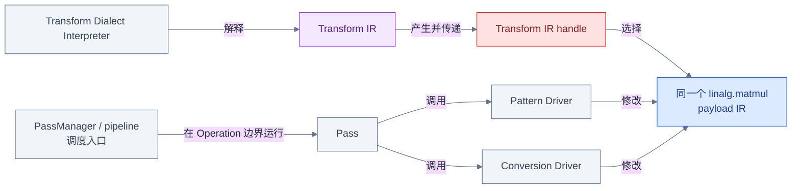

# 图解 MLIR Transformation：阅读地图

## 这套小册解决什么问题

读懂一段 MLIR，不等于知道它为什么会从一种形态变成另一种形态。看到
`linalg.matmul` 被分块、bufferize 或降成循环时，初学者很容易把所有动作都笼统地
叫作“跑了一个 Pass”。这套小册把这句话拆开，分别回答：谁安排执行位置与顺序，谁
安全地完成局部改写，谁检查目标 IR 是否合法，以及谁用另一套 IR 选择和编排变换。

全册共用同一段 tensor 语义的 `linalg.matmul` payload IR（被变换的 IR），每章既给出
对象关系图，也给出能由当前 `mlir-opt` 解析或执行的命令。读者因此可以把图中的控制
关系、终端里的 before/after IR 和当前 checkout 的源码入口逐一对应起来。

## 四个子系统各自负责什么



读图时先区分两类箭头：`PassManager / pipeline → Pass` 以及 `Pass → driver` 是**调度箭头**，
说明控制流在哪里发生；`Pattern Driver → payload IR` 和
`Conversion Driver → payload IR` 是**IR 修改箭头**。另一条路径中，interpreter 解释
Transform IR，handle 选择 payload Operation；选择关系本身不是 SSA 数据流，也不表示
复制了一份 `linalg.matmul`。两条路线最终观察并改变的是同一个蓝色 payload IR。

## 推荐阅读顺序

1. [MLIR 中到底是谁在变换 IR](01_What_Transforms_IR.md)：先建立四个机制的职责边界。
2. [Pass 基础设施](02_Pass_Infrastructure.md)：理解 pipeline、Operation 锚点和运行时机。
3. [PatternRewriter](03_Pattern_Rewriter.md)：理解一条局部规则如何安全修改 IR。
4. [Dialect Conversion](04_Dialect_Conversion.md)：理解 legality 与“降层完成”的判据。
5. [Transform Dialect](05_Transform_Dialect.md)：理解 payload IR、Transform IR、handle 与 interpreter。
6. [端到端 Matmul](06_End_To_End_Matmul.md)：把 tile、bufferize 和 lowering 串成一条可验证时间线。

第 01 章是词汇和边界的入口；第 02—05 章可以独立查阅；第 06 章要求已经能区分“谁
调度”和“谁修改”。

## 按问题查阅

| 你正在追问的问题 | 先读哪一章 | 应重点检查什么 |
|---|---|---|
| 为什么 pass 没有在某个 `func.func` 上运行？ | [02 Pass 基础设施](02_Pass_Infrastructure.md) | pipeline 锚点、嵌套边界、static filtering |
| 为什么 pattern 没匹配，或修改后 driver 状态异常？ | [03 PatternRewriter](03_Pattern_Rewriter.md) | root、`matchAndRewrite`、rewriter 通知、工作队列 |
| 为什么 lowering 留下非法 Operation？ | [04 Dialect Conversion](04_Dialect_Conversion.md) | `ConversionTarget`、dynamic legality、类型桥接 |
| 为什么 Transform IR 能找到 matmul，旧 handle 又为何失效？ | [05 Transform Dialect](05_Transform_Dialect.md) | handle 映射、effects、consume 与 invalidation |
| 一条真实 pipeline 中每步究竟是谁在工作？ | [06 端到端 Matmul](06_End_To_End_Matmul.md) | 每阶段的调度者、修改者和结构断言 |

## 图中的颜色约定

| 颜色 | 固定表示的对象或语境 |
|---|---|
| 蓝色 | `Operation` 与 payload IR |
| 红色 | `Value`、SSA 数据流与 Transform handle |
| 绿色 | `Region` |
| 黄色 | `Block` |
| 紫色 | `Dialect`、`Type` 与具体语义 |
| 灰色 | Pass、driver、工具、源码与其他控制上下文 |

不同章节可以省略与当前问题无关的对象，但不会为 Pass、Pattern、Conversion 或 Transform
Dialect 重新分配颜色。精确标识符保留英文，节点标题、边标签和读图说明使用中文。

## 如何运行共享示例

纯 payload 输入是 [`examples/matmul.mlir`](examples/matmul.mlir)，同时包含 payload IR 与
Transform IR 的输入是
[`examples/matmul_transform.mlir`](examples/matmul_transform.mlir)。从 `llvm-project`
仓库根目录先运行 parser 与 verifier：

```bash
build/bin/mlir-opt \
  mlir/LearningSteps/IllustratedMLIR/Transformation/examples/matmul.mlir \
  -o /tmp/illustrated-transformation-matmul.mlir

build/bin/mlir-opt \
  mlir/LearningSteps/IllustratedMLIR/Transformation/examples/matmul_transform.mlir \
  -o /tmp/illustrated-transformation-matmul-transform.mlir
```

两条命令退出码为 0 且没有诊断，表示当前构建能够解析所有已注册 Operation，并且输入
通过 verifier。后续章节会在 `/tmp` 保存阶段输出；仓库中的两个输入文件始终是共享真源。

## 与现有学习总结的关系

这套小册不替换现有总结。图解章节从一个问题和一段可运行 IR 出发，适合建立执行模型；
总结文档适合回查完整 API、约束和源码细节：

- [PassManagement 学习总结](../../Transforms/PassManagement_Summary.md)
- [OperationPass 并行限制总结](../../Transforms/PassManagement_OperationPass_Restrictions_Summary.md)
- [PatternRewriter 学习总结](../../Transforms/PatternRewriter_Summary.md)
- [Dialect Conversion 学习总结](../../Transforms/DialectConversion_Summary.md)
- [Phase 2 核心基础设施总结](../../Transforms/Phase2_Core_Infrastructure_Summary.md)
- [AI 编译器初学者导读](../../Transforms/Phase2_AI_Compiler_Beginner_Guide.md)

建议第一次学习按本册顺序走，遇到 API 或约束问题再进入对应总结；源码事实则以每章列出的
当前 checkout 官方文档和头文件为准。

## 当前完成状态

| 内容 | 状态 |
|---|---|
| 共享 payload 示例 `matmul.mlir` | 已完成并通过 parser/verifier |
| 共享 Transform 示例 `matmul_transform.mlir` | 已完成并通过 parser/verifier |
| 第 00 章：阅读地图 | 已完成 |
| 第 01 章：四种变换机制分类 | 已完成 |
| 第 02—06 章 | 已完成 |
