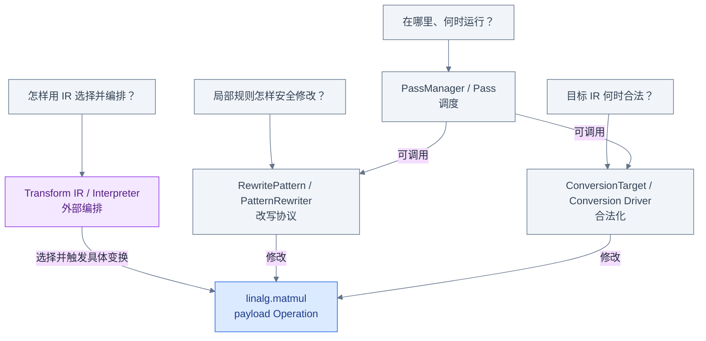
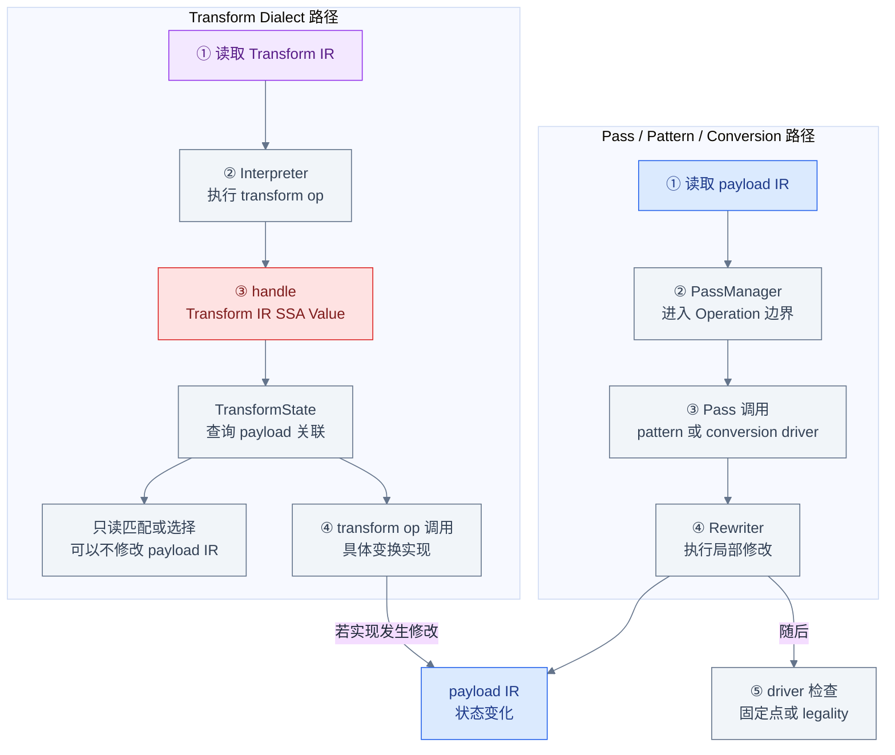
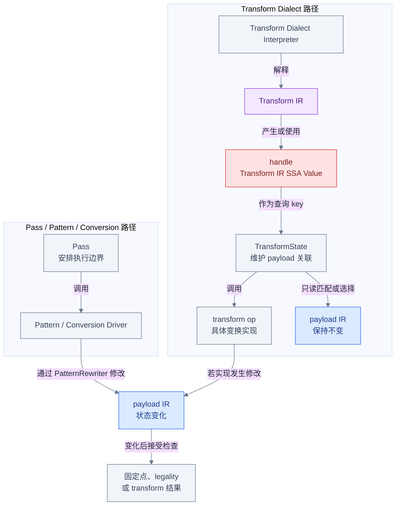

# MLIR 中到底是谁在变换 IR

## 从同一段 Before / After IR 开始

共享输入 [`examples/matmul.mlir`](examples/matmul.mlir) 中有一条没有使用者的常量，
后面才是 tensor 语义的 `linalg.matmul`：

```mlir
// Before
%zero = arith.constant 0.0 : f32
%dead = arith.constant 1 : index
%init = tensor.empty() : tensor<8x4xf32>
%filled = linalg.fill ins(%zero : f32)
    outs(%init : tensor<8x4xf32>) -> tensor<8x4xf32>
%result = linalg.matmul
    ins(%lhs, %rhs : tensor<8x16xf32>, tensor<16x4xf32>)
    outs(%filled : tensor<8x4xf32>) -> tensor<8x4xf32>
```

运行 canonicalization 后，最直观的变化是 `%dead` 消失，而 matmul 仍然存在：

```mlir
// After（省略打印器重新编号后的 SSA 名称）
%zero = arith.constant 0.0 : f32
%init = tensor.empty() : tensor<8x4xf32>
%filled = linalg.fill ins(%zero : f32)
    outs(%init : tensor<8x4xf32>) -> tensor<8x4xf32>
%result = linalg.matmul
    ins(%lhs, %rhs : tensor<8x16xf32>, tensor<16x4xf32>)
    outs(%filled : tensor<8x4xf32>) -> tensor<8x4xf32>
```

仅看 before/after，无法知道是谁决定何时遍历 `func.func`，哪条规则认定常量可删除，
修改如何通知遍历器，也无法说明后续 matmul 被 tile 或 lowering 时如何判断成功。下面四个
机制不是四种同义 API，而是对一次 IR 变换提出的四个不同问题。

## 四个问题对应四个机制

| 机制 | 它回答的问题 | 它不等于什么 |
|---|---|---|
| Pass 基础设施 | 何时、在哪个 Operation 上运行什么？ | 一条具体 RewritePattern |
| Pattern Rewriting | 一条局部规则怎样匹配并安全修改 IR？ | 完整 pipeline 调度器 |
| Dialect Conversion | 怎样判断并完成目标合法化？ | 普通 canonicalization 的别名 |
| Transform Dialect | 怎样用 Transform IR 选择并编排 payload 变换？ | 底层改写算法的替代品 |



先检查四个问题各自只指向一个职责框；再检查 `Pass → Pattern/Conversion` 两条“可调用”边，
它们说明 pass 常常承载 driver，却不等于 driver。最后检查三条汇入蓝色 payload Operation
的边：Transform Dialect 负责选择和触发，真正的局部修改仍可能委托给 pattern、conversion
或其他已有变换实现。

## Pass：安排在哪里和何时运行

Pass 基础设施管理 pipeline、Operation 锚点、嵌套执行、analysis 生命周期、验证和失败
传播。`PassManager` 是顶层入口，`OpPassManager` 表示锚定在某类 Operation 上的一组
passes；具体 `OperationPass` 在符合其静态限制的 Operation 边界运行。

因此“canonicalize 删除了 `%dead`”至少包含两层事实：pipeline 安排 canonicalizer pass
在合适的 Operation 上运行；pass 内部再驱动折叠和 rewrite patterns。Pass 决定执行上下文，
但“无用常量如何被删掉”不是 `PassManager` 自己的一条匹配规则。

## PatternRewriter：执行一条局部改写

`RewritePattern` 描述 root、benefit 和 `matchAndRewrite`；`PatternRewriter` 提供 create、
replace、erase 和 in-place update 等受 driver 观察的修改入口。官方约束要求 pattern 的所有
IR mutation 都通过 rewriter 完成，因为 driver 可能维护工作队列、遍历状态和监听器。

Pattern 也不自行决定整个编译 pipeline。它必须交给 greedy、walk 或 conversion 等具体
pattern driver 应用。Canonicalizer 就使用 greedy driver 反复处理可折叠或可规范化的
Operation，直到达到固定点或资源限制。

## Dialect Conversion：保证目标 IR 合法

Dialect Conversion 仍会使用 conversion patterns 和专用 rewriter，但额外引入
`ConversionTarget`：它明确哪些 Operation/Dialect legal、dynamically legal 或 illegal。
Conversion driver 搜索合法化路径，必要时还通过 `TypeConverter`、region signature
conversion 和 materialization 处理类型边界。

这就是它与普通 canonicalization 的关键区别：canonicalization 是 best-effort 清理，不以
“所有非法 Operation 必须消失”为通用完成条件；full conversion 只有在整个目标范围满足
legality 时才成功。这里还要区分目标与机制：lowering 描述 IR 从较高层表示推进到较低层
表示的目标或状态转换，并不是 Dialect Conversion 框架的同义词。

本册展示的 `--convert-linalg-to-loops` 就是具体反例：当前
[`Loops.cpp`](../../../lib/Dialect/Linalg/Transforms/Loops.cpp) 中的
`lowerLinalgToLoopsImpl` 填充 `LinalgRewritePattern` 后调用 `applyPatternsGreedily`，由 greedy
pattern rewriting 驱动；这条实现路径没有用 `ConversionTarget` 定义 legality。这里列出该
命令，是为了观察 Linalg Operation 变成循环的 lowering 结果，不是用它证明此 pass 使用了
Dialect Conversion 的 legality 框架。

## Transform Dialect：用 IR 编排变换

Transform Dialect 同时处理两套 IR：payload IR 是要改变的程序，Transform IR 是描述选择、
顺序和参数的变换程序。interpreter 执行 `transform.named_sequence`；红色 Transform handle
是 Transform IR 中的 SSA Value，可作为语义引用或查询关联的 key；真正从 Transform IR
Value 到 payload Operation/Value 的关联与映射由 `TransformState` 维护。handle 既不把
payload 复制进 Transform IR，也不是 payload 的普通 SSA 数据。

例如共享文件 [`examples/matmul_transform.mlir`](examples/matmul_transform.mlir) 先用
`transform.structured.match` 找到 `linalg.matmul`，再用
`transform.structured.tile_using_forall` 触发分块。Transform operation 可以调用已有底层
变换实现；它提供的是可编程编排层，不取代 Pass、PatternRewriter 或 Conversion driver。

## 四者如何连接



这张执行时间线有两个入口。上方检查 `PassManager → Pass → driver → rewriter` 的顺序；
下方检查 interpreter 执行 transform op 后，`TransformState` 如何用 handle 查询 payload
关联。只读的 match/select transform 可以在右侧结束而不改变 payload；需要修改时，transform
op 调用具体变换实现，该实现可以使用 rewriting、conversion 或其他 mutation 工具，只有真的
发生修改才汇入中性的“payload IR 状态变化”节点，并不普遍经过 `PatternRewriter`。上方末端
仍区分固定点与 legality，因为 greedy rewrite 和 Dialect Conversion 的成功条件不同。

## 四个最容易混淆的说法

1. **“Pass 就是一条 Pattern。”** 不对。Pass 是在 Operation 边界执行的 pipeline 单元，
   可以手写遍历，也可以调用一个或多个 pattern drivers。
2. **“使用 PatternRewriter 的都是 canonicalization。”** 不对。Conversion driver、许多
   lowering 和普通优化也使用 rewriter；canonicalization 只是特定的 best-effort 清理机制。
3. **“Transform Dialect 直接替代底层算法。”** 不对。它把选择和编排表示成 Transform
   IR，具体 transform operation 仍调用已有实现去改变 payload IR。
4. **“Transform handle 就是 payload 的 SSA Value。”** 不对。它是 Transform IR 中的
   SSA Value，语义上引用一组 payload 对象；关联映射保存在 `TransformState`，handle 被
   consume 后还必须遵守失效规则。

还有一个纯路径名陷阱：`include/mlir/Transform/` **既不是 Pattern Rewriting，也不是
Transform Dialect**；而且当前 checkout 中没有这个单数目录。通用 pattern API 在
`include/mlir/IR/PatternMatch.h`，Transform Dialect 在
`include/mlir/Dialect/Transform/`。不要把旧材料、近似目录名或复数的
`include/mlir/Transforms/` 变换工具集合当作上述任一概念的定义。

## 当前源码入口

| 要核对的事实 | 官方说明 | 当前头文件入口 |
|---|---|---|
| Pass、锚点、嵌套 pipeline 与 analysis | [`docs/PassManagement.md`](../../../docs/PassManagement.md) | [`PassManager.h`](../../../include/mlir/Pass/PassManager.h) |
| Pattern、rewriter 修改约束与 drivers | [`docs/PatternRewriter.md`](../../../docs/PatternRewriter.md) | [`PatternMatch.h`](../../../include/mlir/IR/PatternMatch.h) |
| Conversion modes、legality 与类型转换 | [`docs/DialectConversion.md`](../../../docs/DialectConversion.md) | [`DialectConversion.h`](../../../include/mlir/Transforms/DialectConversion.h) |
| payload/Transform IR、handle 与执行模型 | [`docs/Dialects/Transform.md`](../../../docs/Dialects/Transform.md) | [`TransformInterfaces.h`](../../../include/mlir/Dialect/Transform/Interfaces/TransformInterfaces.h) |

在头文件中分别从 `PassManager`/`OpPassManager`、`RewritePattern`/`PatternRewriter`、
`ConversionTarget`/`applyFullConversion` 和 `TransformState`/`TransformOpInterface` 开始追踪，
就能把上面的职责图落到当前源码对象上。

## 运行共享示例

从 `llvm-project` 仓库根目录先验证纯 payload 输入：

```bash
build/bin/mlir-opt \
  mlir/LearningSteps/IllustratedMLIR/Transformation/examples/matmul.mlir \
  -o /tmp/illustrated-transformation-matmul-parsed.mlir
```

这是本章的 runnable parser 命令；退出码为 0 且没有诊断即表示 parser 与 verifier 接受
共享输入。要观察本章开头的死常量消失，可以运行：

```bash
build/bin/mlir-opt \
  mlir/LearningSteps/IllustratedMLIR/Transformation/examples/matmul.mlir \
  --canonicalize \
  -o /tmp/illustrated-transformation-matmul-canonicalized.mlir
```

本地构建的 `build/bin/mlir-opt --help` 当前注册了以下入口；这里保留 help 中的说明，后续
章节再验证完整 pipeline 和输出结构：

| help 入口 | 当前 help 说明 | 在本册中的角色 |
|---|---|---|
| `--canonicalize` | `Canonicalize operations` | Pass 调用 greedy rewriting 做 best-effort 清理 |
| `--one-shot-bufferize` | `One-Shot Bufferize` | 将 tensor 语义推进到 bufferized IR |
| `--convert-linalg-to-loops` | `Lower the operations from the linalg dialect into loops` | 用 greedy pattern rewriting 展示可观察的 lowering 结果；不作为 `ConversionTarget`/legality 的例证 |
| `--transform-interpreter` | `transform dialect interpreter` | 解释 Transform IR 并作用于 payload IR |

读者看到入口名时应先问它在 pipeline 中扮演什么角色，再问内部调用何种 driver；命令行
上都表现为 `mlir-opt` option，不意味着四个机制处在同一抽象层。

## 一张图总结本章



沿上方检查“Pass 调度、driver 应用、rewriter 修改”三层关系；沿下方检查“interpreter
解释 Transform IR，handle 关联 payload，transform op 再调用具体实现”的编排关系。只读
分支不会汇入状态变化；修改分支也不预设具体实现一定使用 Rewriter。发生变化的路径可以在
同一个蓝色 payload 状态节点汇合，但末端成功判据仍由所用机制决定，不能把固定点、legality
和 transform 结果写成同一个概念。

## 继续阅读

下一章 [Pass 基础设施](02_Pass_Infrastructure.md) 会放大灰色调度路径，解释
`PassManager`、`OpPassManager`、Operation 锚点、analysis 与 failure propagation。之后依次
进入 [PatternRewriter](03_Pattern_Rewriter.md)、
[Dialect Conversion](04_Dialect_Conversion.md)、
[Transform Dialect](05_Transform_Dialect.md)，最后在
[端到端 Matmul](06_End_To_End_Matmul.md) 中重新合并四条观察线。
