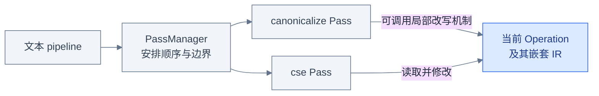
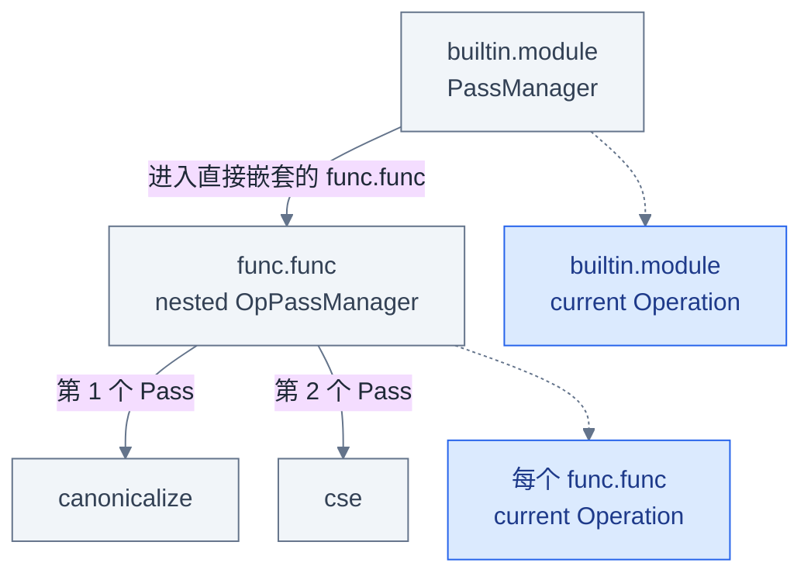
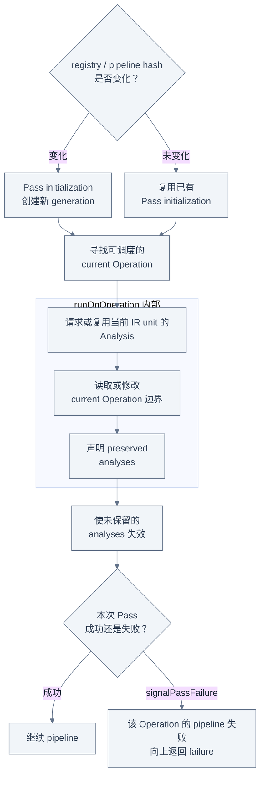
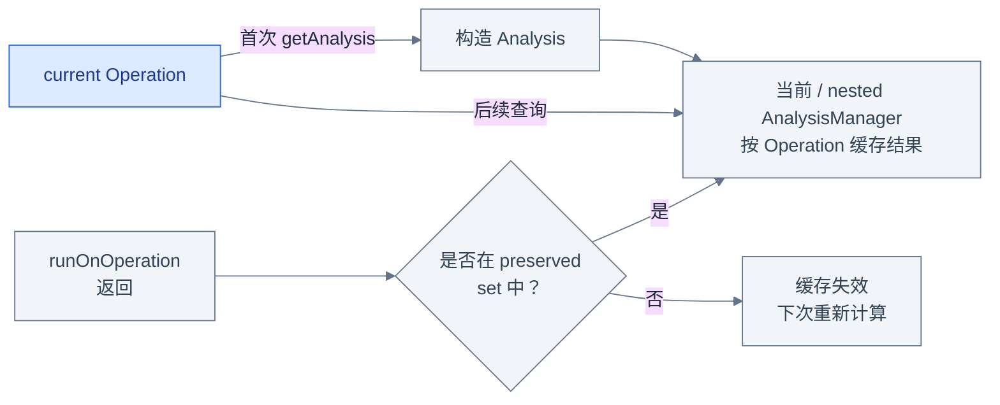
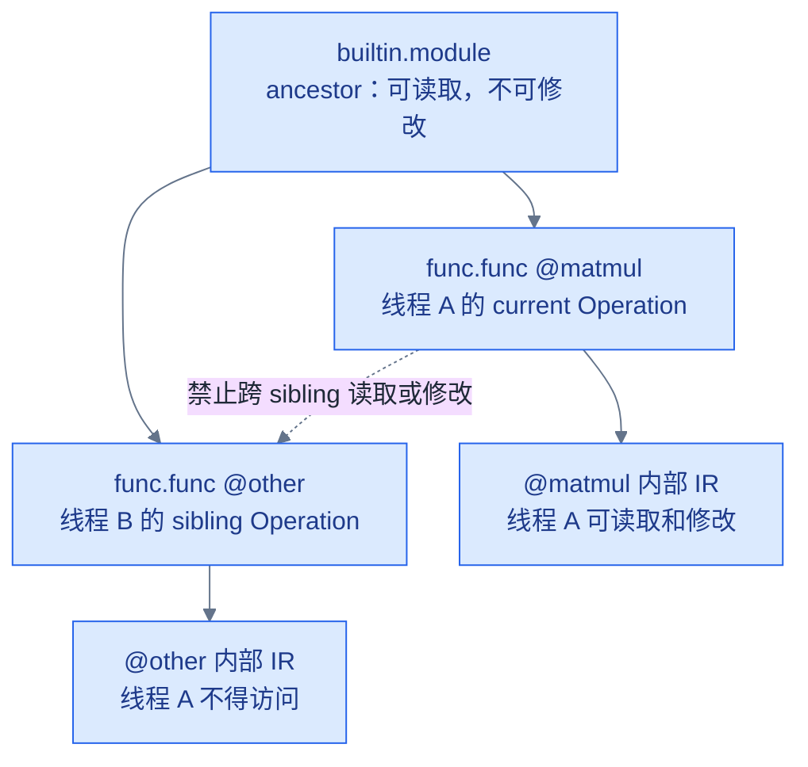
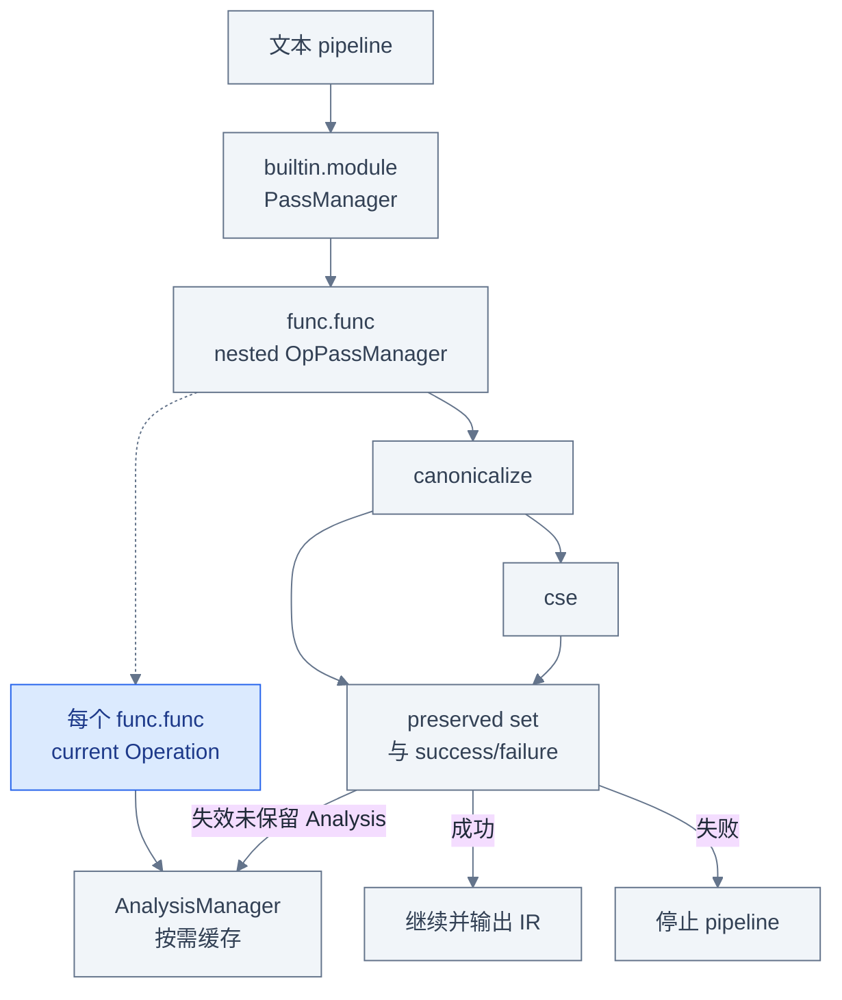

# Pass 基础设施：谁安排变换的执行顺序

## 为什么有 Pattern 还需要 Pass

Pattern 回答的是“一条局部规则怎样匹配并修改 IR”，却不负责决定这条规则何时运行、以
哪个 Operation 为工作边界、前后还要运行哪些变换。Pass 基础设施补上的是调度层：它把
Pass 排成 pipeline，将每段 pipeline 锚定到特定 Operation，并管理 analysis、失败与并行执行。

共享输入 [`examples/matmul.mlir`](examples/matmul.mlir) 中有一个没有使用者的
`arith.constant 1`。本章运行 `canonicalize` 和 `cse` 后，它会消失，而
`linalg.fill` 与 `linalg.matmul` 仍然存在。这个结果说明已注册的 Pass 被调度并改变了输出；
它没有告诉我们 canonicalization 内部使用了哪些 Pattern。局部改写协议留到
[PatternRewriter](03_Pattern_Rewriter.md)，legality 留到
[Dialect Conversion](04_Dialect_Conversion.md)，Transform IR 编排留到
[Transform Dialect](05_Transform_Dialect.md)。



读图时先检查灰色控制边 `文本 pipeline → PassManager → Pass`：这是本章讨论的执行安排。
再检查两条指向蓝色 Operation 的边：Pass 拿到工作边界后可以直接遍历，也可以调用 Pattern
driver 等机制；因此 `Pass` 不是 `Pattern` 的同义词。

## 从一条文本 pipeline 开始

本章使用的文本 pipeline 是：

```text
builtin.module(func.func(canonicalize,cse))
```

官方语法把 pipeline 定义为 `op-anchor(elements...)`。`builtin.module` 和 `func.func` 是
Operation mnemonic，也是各层 `OpPassManager` 的锚点；`canonicalize` 与 `cse` 是已注册的
pass argument。括号可以递归包含另一条 pipeline，所以这条文本并不是“在 module 上依次
执行三个普通 pass”，而是“从 module 边界进入每个符合条件的 `func.func`，再在该函数
边界依次运行两个 Pass”。

同一个结构在 C++ 中可由 `PassManager::on<ModuleOp>(ctx)`、
`pm.nest<func::FuncOp>()` 和两次 `addPass` 构造。文本形式方便命令行复现实验，C++ 形式方便
compiler driver 组合 pipeline；二者描述的是同一类嵌套调度结构。

## PassManager 与 OpPassManager

`PassManager` 是顶层入口，持有整条 pipeline 的全局配置，并提供 `run(Operation *)`。
它本身继承 `OpPassManager`。`OpPassManager` 则是一组锚定在某种 Operation 上执行的 Pass；
它不能独立对任意 IR 调用 `run`，而要作为顶层 `PassManager` 的一部分，或由
`Pass::runPipeline` 动态执行。

本章的结构必须读成：

```text
builtin.module PassManager
  -> func.func nested OpPassManager
    -> canonicalize
    -> cse
```



先检查实线形成的 manager 所有关系：函数层 manager 不是第二个顶层 manager，而是 module
manager 的嵌套成员。再检查虚线对应的执行对象：顶层入口匹配 `builtin.module`，两个 Pass
真正运行时的 current Operation 是每个蓝色 `func.func`。这里的嵌套是 **Operation 执行边界**，
不是为了把命令排版好看的视觉分组。

## Operation 锚点和嵌套 pipeline

精确对比下面两条 pipeline：

| pipeline | `canonicalize` 的 current Operation | `cse` 是否运行 |
|---|---|---|
| `builtin.module(canonicalize)` | 顶层 `builtin.module`，Pass 执行一次 | 否 |
| `builtin.module(func.func(canonicalize,cse))` | 每个由嵌套 manager 调度到的 `func.func`，每个函数依次执行 | 是，紧随同一函数上的 `canonicalize` |

第一条并不等于“自动把 canonicalize 重新锚定到每个函数”。`canonicalize` 是 op-agnostic
Pass，因此可以被添加到 module 层；它以 module 为 current Operation，并可处理其允许范围内
的嵌套 IR。第二条显式建立函数层执行边界：对于多个函数，每个函数都保持完整的
`canonicalize,cse` 局部顺序，而不是先对所有函数做 canonicalize、再对所有函数做 CSE；
不同函数的整段 pipeline 可以异步执行。

对当前共享输入，两条命令可能打印相同 IR：module 层 canonicalizer 也能观察嵌套内容，而且
这个小例子没有为 CSE 准备额外差异。相同输出不意味着调度边界相同；要判断锚点必须读取
pipeline 结构，不能只看 before/after。

锚点还不是任意 Operation 名称都可充当。官方文档要求锚定 pass manager 的 Operation 已注册
且具有 `IsolatedFromAbove` trait，从而为分析、修改和并行执行提供隔离边界。静态类型 Pass
（例如 `OperationPass<func::FuncOp>`）只能调度到支持的 Operation；op-agnostic Pass 则采用
所在 manager 的锚点。若一个 op-agnostic manager 中含有带 static filtering 的 Pass，整组
pipeline 的可调度范围也会被该限制收窄。

## 一次 Pass 执行的生命周期

从整条 pipeline 到一次 `runOnOperation()`，可以沿下面的时间线理解。初始化属于 pipeline
准备阶段，而且不一定每次都重新执行；analysis 查询与 preserve 声明则是 Pass 在
`runOnOperation()` 内主动使用的 API：

```text
Pass initialization (conditional; otherwise reuse)
 -> find eligible current Operation
 -> runOnOperation {
      request/reuse Analysis
      -> inspect/mutate IR
      -> mark preserved analyses
    }
 -> invalidate unpreserved analyses
 -> propagate success/failure
```



读图时先检查顶部 hash 分支：当前 runner 比较 context registry hash 与 pipeline hash；只有
任一发生变化才用新 generation 调用 `initialize(MLIRContext *)`，否则复用已有初始化结果。
初始化尚未绑定 current Operation，不能调用 `getOperation()` 或 `getAnalysis()`。再检查
`runOnOperation 内部` 框：框架先为合格 Operation 建立包含 current Operation、对应
`AnalysisManager`、preserved set 和 failure bit 的执行状态；Pass 在 `runOnOperation()` 内
查询 analysis、处理 IR 并声明 preserved analyses。函数返回后，runner 才使未保留结果失效，
然后继续 verifier/instrumentation 与 success/failure 传播。

## Analysis 如何缓存和失效

Analysis 是对某个 Operation 计算信息、但不修改它的普通类，不是另一种 Pass。
`getAnalysis<T>()` 在本次执行的 `AnalysisManager` 所对应的 current Operation 上按需构造并
缓存 `T`；同一 manager、同一 IR unit 后续查询可复用。
`getCachedAnalysis<T>()` 只查询缓存，不会为了命中而新建 analysis。analysis 还可通过传入的
`AnalysisManager` 请求依赖项，并用 `isInvalidated` 对依赖失效作更细判断。child Operation
使用 nested analysis manager；`PassManager::run` 会为该次顶层执行构造
`ModuleAnalysisManager`，因此这里不是跨所有 Operation、所有 run 共享的一张全局 cache。

缓存正确性的默认策略是保守的：一次 Pass 返回后，runner 会在这次执行对应的 analysis
manager 上使未保留结果失效。只有 Pass 能确认没有破坏某个结果时，才在
`runOnOperation()` 内调用 `markAnalysesPreserved<T>()`；若没有改变任何相关 IR，可调用
`markAllAnalysesPreserved()`。因此流程是“按需计算并缓存 → Pass 声明仍然成立的结果 → 框架
在相应 Operation/manager 范围内丢弃其余缓存”，而不是由框架猜测某次 mutation 是否无害。



检查左侧蓝色 current Operation 是 analysis 的计算对象；灰色 manager 还可为 child Operation
维护 nested map，但不是进程级全局 cache。右侧 preserved 分支控制相应 manager/Operation
范围内的缓存生命期，而不是控制 IR 的生命期。尤其不要把输出中“某个 op 没变”当作缓存
一定被复用的证据：是否 preserve 是 Pass 的源码行为，失效发生在 runner 返回之后。

## Pass Failure 如何传播

Pass 发现前置 invariant 不成立、IR 可能已处于不安全状态时，可以调用
`signalPassFailure()`。它设置当前执行状态的 failure bit；当前 Operation 上的这条 pipeline
不会继续执行后续 Pass，失败逐层汇总，最终 `PassManager::run` 返回 `failure()`。初始化阶段
返回 failure 也会在真正执行 pipeline 前中止。

并行 sibling pipeline 需要额外限定：其中一个失败时，已经调度或正在运行的 sibling 工作
不会被同步立即取消。当前异步 adaptor 让这些工作完成，再汇总 atomic `hasFailure` 并向父级
signal failure。因此 failure 阻止整次运行成功完成，也阻止失败的局部 pipeline 继续向后，
但不能把它描述成“所有线程上的后续工作在失败瞬间全局停止”。

这是受控失败，不等于进程 crash，也不承诺自动回滚已经发生的 IR 修改。调用者必须检查
`LogicalResult`，诊断信息则应在失败点附近发出。若动态 pipeline 由 `Pass::runPipeline`
启动，其 `LogicalResult` 同样要向当前 Pass 传播，常见做法是在动态 pipeline 失败后调用
`signalPassFailure()`。

## 并行执行为什么限制 Pass 的访问范围

当函数层 pipeline 处理多个 sibling `func.func` 时，PassManager 可以让不同 Pass 实例并行
工作。因此在 current Operation 为 `@matmul` 时，Pass 不得检查 sibling Operation 或其内部
状态；可以读取 ancestor 的状态，却不能修改 ancestor/parent block，也不能在其中增删 sibling。
Pass 可以修改嵌套在 current Operation 下面的 IR；对 current Operation 本身，官方规则仅允许
自由修改 attribute，不能修改其 operands 等其他状态。



沿实线检查 IR 父子关系，再看虚线禁区：限制针对 sibling 及其子树，不是说函数 Pass 完全
看不到 parent。与此同时，Pass 不得跨多次 `runOnOperation()` 保留可变状态，不得使用全局
可变状态，并且必须可复制，因为框架可能为并行执行克隆 Pass。更完整的规则、反例和正确
运行层级选择见
[OperationPass 并行限制总结](../../Transforms/PassManagement_OperationPass_Restrictions_Summary.md)。

## 回到 C++ 源码验证

下表把本章的执行模型落到当前 checkout，而不是停留在示意图：

| 要验证的事实 | 当前资料入口 | 建议追踪的标识符 |
|---|---|---|
| current Operation、初始化、analysis 查询、preserve 与 failure bit | [`Pass.h`](../../../include/mlir/Pass/Pass.h) | `PassExecutionState`、`initialize`、`getOperation`、`getAnalysis`、`markAnalysesPreserved`、`signalPassFailure` |
| 顶层入口、锚点、nest 与 pipeline 执行 | [`PassManager.h`](../../../include/mlir/Pass/PassManager.h) | `PassManager`、`OpPassManager`、`nest`、`addPass`、`run` |
| runner 中初始化复用、失效时点与异步失败汇总 | [`Pass.cpp`](../../../lib/Pass/Pass.cpp) | `PassManager::run`、`run`、`runPipeline`、`runOnOperationAsyncImpl` |
| OperationPass 规则、analysis、failure 与文本语法 | [`docs/PassManagement.md`](../../../docs/PassManagement.md) | `Operation Pass`、`Analysis Management`、`Pass Failure`、`Textual Pass Pipeline Specification` |
| 更完整的中文 API 总结 | [PassManagement 学习总结](../../Transforms/PassManagement_Summary.md) | static filtering、dependent dialect、动态 pipeline、instrumentation |

`Pass.h` 中的 `PassExecutionState` 把 Operation 指针与 failure bit、`AnalysisManager`、preserved
analysis set 放在同一次执行状态里；`PassManager.h` 则说明 `PassManager` 继承
`OpPassManager`，以及 `nest` 如何建立下一层 Operation manager；`Pass.cpp` 展示 runner
何时复用初始化、调用 `runOnOperation()`、invalidate 和汇总异步失败。源码对象与前面的
时间线是逐项对应关系，不是图中临时发明的概念。

## 运行共享 matmul 示例

从 `llvm-project` 仓库根目录运行：

```bash
set -euo pipefail

build/bin/mlir-opt \
  mlir/LearningSteps/IllustratedMLIR/Transformation/examples/matmul.mlir \
  --pass-pipeline='builtin.module(func.func(canonicalize,cse))' \
  -o /tmp/illustrated-transformation-pass.mlir
rg -n "func.func @matmul" /tmp/illustrated-transformation-pass.mlir
rg -n "linalg.fill" /tmp/illustrated-transformation-pass.mlir
rg -n "linalg.matmul" /tmp/illustrated-transformation-pass.mlir
! rg -n "arith.constant 1" /tmp/illustrated-transformation-pass.mlir
```

第一条命令接受这条文本 pipeline 并生成输出；后面三个独立的正向断言分别要求函数、
`linalg.fill` 和 `linalg.matmul` 存在，最后的反向断言要求无用 `arith.constant 1` 消失。
这些命令证明 pipeline 可被当前工具执行，并产生上述可观察结果。`func.func` 是执行边界这件事
由文本 pipeline 语义与 PassManager 源码建立，不能仅从最终 IR 反推。

这组 IR 断言 **不能** 证明 analysis 被构造、命中缓存或 preserve。Analysis 的按需缓存与
失效规则来自上述官方文档和源码接口；若要观察具体 analysis 行为，需要 instrumentation、
调试器或针对具体 Pass 的源码证据，不能从最终 IR 反推。

## 三个常见误区

1. **“括号只是文本分组，两个 Pass 仍在 module 上运行。”** 不对。
   `func.func(...)` 创建函数 Operation 的执行边界；两个 Pass 的 current Operation 是各个
   `func.func`，不是顶层 module。
2. **“`builtin.module(canonicalize)` 与嵌套函数 pipeline 等价。”** 不对。前者只在 module
   边界执行一次 canonicalizer；后者在每个函数边界运行 `canonicalize,cse`。小示例输出相同
   也不能抹掉锚点、次数、顺序与潜在并行性的差异。
3. **“最终 IR 没变，就说明所有 Analysis cache 都还有效。”** 不对。Pass 后 analysis 默认
   失效，只有显式 preserved 或 analysis 自身的 `isInvalidated` 判定才能保留结果；最终文本
   不提供缓存命中的证据。

## 一张图总结本章



从上到下检查三层关系：文本 pipeline 先建立 manager 与 Pass 的顺序；nested manager 再把
每次执行绑定到蓝色 `func.func`；每个 Pass 的结果最后决定 analysis cache 是否失效以及
pipeline 是继续还是停止。图中没有从 Analysis 指向 IR mutation 的边，因为 Analysis 只能
计算信息，不能修改 Operation。

## 继续阅读

- [PatternRewriter](03_Pattern_Rewriter.md)：下一章进入 Pass 可能调用的局部改写协议，解释
  Pattern、rewriter 通知和 driver 工作队列。
- [Dialect Conversion](04_Dialect_Conversion.md)：继续区分“Pass 调度成功”与“目标 IR 满足
  legality”。
- [Transform Dialect](05_Transform_Dialect.md)：理解另一套 Transform IR 如何选择并编排
  payload 变换，而不是替代 PassManager。
- [PassManagement 学习总结](../../Transforms/PassManagement_Summary.md)：回查注册、选项、
  instrumentation、timing 与 crash reproducer 等本章未展开的设施。
- [OperationPass 并行限制总结](../../Transforms/PassManagement_OperationPass_Restrictions_Summary.md)：
  结合具体正确/错误代码继续核对 current Operation 的访问与修改范围。
