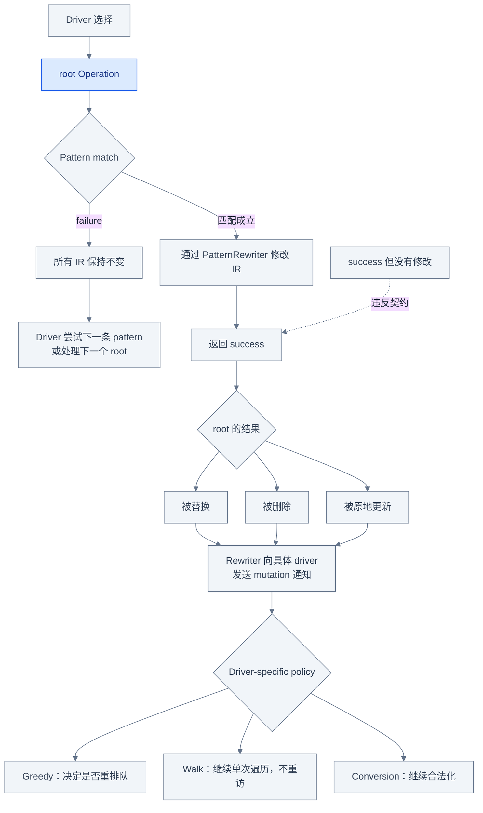
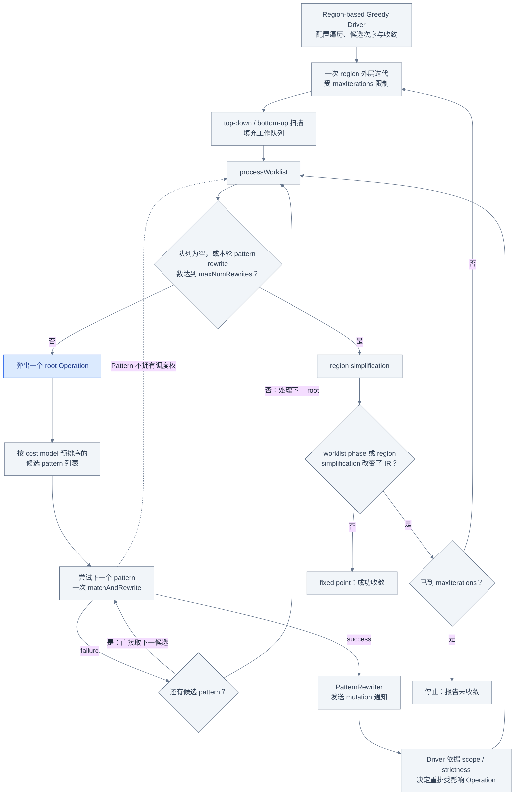
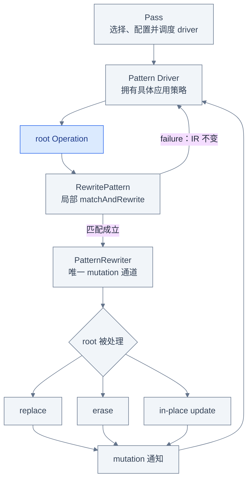

# PatternRewriter：一条局部规则如何安全修改 IR

## 从消失的 dead constant 开始

共享输入 [`examples/matmul.mlir`](examples/matmul.mlir) 的函数开头有一条没有使用者的常量：

```mlir
// Before
%zero = arith.constant 0.0 : f32
%dead = arith.constant 1 : index
%init = tensor.empty() : tensor<8x4xf32>
%filled = linalg.fill ins(%zero : f32)
    outs(%init : tensor<8x4xf32>) -> tensor<8x4xf32>
%result = linalg.matmul
    ins(%lhs, %rhs : tensor<8x16xf32>, tensor<16x4xf32>)
    outs(%filled : tensor<8x4xf32>) -> tensor<8x4xf32>
```

运行内置 `canonicalize,cse` 后，打印器会重新编号 SSA Value，`linalg.fill` 和
`linalg.matmul` 仍在，但 `%dead` 对应的 `arith.constant 1 : index` 已经消失：

```mlir
// After（省略无关内容）
%cst = arith.constant 0.000000e+00 : f32
%0 = tensor.empty() : tensor<8x4xf32>
%1 = linalg.fill ins(%cst : f32)
    outs(%0 : tensor<8x4xf32>) -> tensor<8x4xf32>
%2 = linalg.matmul
    ins(%arg0, %arg1 : tensor<8x16xf32>, tensor<16x4xf32>)
    outs(%1 : tensor<8x4xf32>) -> tensor<8x4xf32>
```

这个变化适合引出本章的问题：局部规则怎样声明“我能处理这个 Operation”，怎样在失败时
保证 IR 不变，又怎样在成功后让遍历器知道哪些 Operation 需要重新检查？答案不是单独一个
`RewritePattern`，而是 pattern、`PatternRewriter` 与 pattern driver 共同遵守的一套协议。

## RewritePattern 描述什么

`RewritePattern` 描述一条**以某个 root Operation 为中心的局部规则**。它通常包含：

- root Operation 名称：driver 只把相应类型的 Operation 交给它；确实要匹配任意类型时，
  必须显式使用 `MatchAnyOpTypeTag`；
- 静态 `PatternBenefit`：供 driver 的 cost model 决定同一 root 上候选 pattern 的尝试次序；
- `matchAndRewrite`：先判断局部结构是否满足条件，匹配成立后再完成修改；
- 可选元数据：debug name、label，以及是否支持 bounded rewrite recursion。

```cpp
struct FoldMyOp : public OpRewritePattern<MyOp> {
  using OpRewritePattern::OpRewritePattern;

  LogicalResult matchAndRewrite(MyOp op,
                                PatternRewriter &rewriter) const override {
    if (!canFold(op))
      return failure();
    rewriter.replaceOp(op, op.getInput());
    return success();
  }
};
```

这里的 root 是被传入的 `MyOp`，不是整个 pass 的 current Operation，也不是 pattern 想要
遍历的任意子树。Pattern 只描述一次局部匹配与修改；把哪些 root 送来、哪条规则先试、成功后
是否再看周围 IR，都属于 driver 的职责。

## matchAndRewrite 的成功契约

`matchAndRewrite` 的返回值不是“条件看起来匹配”，而是这次调用是否**实际修改了 IR**。
完整状态机如下：



沿上支路看，返回 `failure()` 时必须是**所有 IR** 均未改变，而不只是 root 保持原样；普通
rewrite 并不承诺替 pattern 回滚已经做出的任意修改。沿下支路看，一旦返回 `success()`，root
必须被 replace、erase 或 in-place update，而且修改必须已经通过 rewriter 通知 driver。通知
之后并不必然进入工作队列：greedy、walk 与 conversion 根据各自策略选择重排队、继续单次
遍历或继续合法化。图中的虚线特意标出错误状态：“匹配成功但无需修改”仍应返回
`failure()`；`success()` 而 IR 不变会制造虚假进展，破坏 driver 的完成判断。

## 为什么所有修改必须经过 PatternRewriter

`PatternRewriter` 继承 `OpBuilder`，所以能创建 Operation、Type 和 Attribute；但它不只是一个
方便的 builder。它还是 pattern 向 driver 报告 mutation 的协议层。不同 driver 会给 rewriter
安装 listener 或重写通知 hook，以维护工作队列、当前遍历状态、作用域限制和调试检查。

因此下面两段代码的可观察结果也许相似，协议含义却不同：

```cpp
// 错误：绕过 driver 通知。
op->erase();

// 正确：删除前后由 rewriter 发出相应通知。
rewriter.eraseOp(op);
```

创建新 Operation 也必须使用传入的 rewriter。否则 driver 不知道新 Operation 是否应入队；
直接改变 operand、attribute、successor 或 location 同样会绕开 in-place modification 通知。
局部 IR 暂时“看起来对”并不能补回已经失真的 driver 状态。

## replace、erase 与原地修改

成功 rewrite 处理 root 的三种方式有不同前提和通知语义：

| 操作 | 常用 API | 对 root 的结果 | 关键约束 |
|---|---|---|---|
| replace | `replaceOp`、`replaceOpWithNewOp` | 旧结果的 uses 改接到新 Value，旧 root 被删除 | replacement 数量与旧结果对应；新值类型须满足 API/IR 要求 |
| erase | `eraseOp` | root 直接删除 | root 无结果，或所有结果已经没有 uses |
| 原地修改 | `modifyOpInPlace`，或 `startOpModification` 后配对 `finalizeOpModification` / `cancelOpModification` | root 身份保留，属性、location、operand 或 successor 等改变 | transaction 必须 finalize；无法完成时 cancel 恢复通知协议 |

`modifyOpInPlace(op, callback)` 是最不容易漏配对的写法：它在 callback 前调用
`startOpModification`，之后调用 `finalizeOpModification`。手动 transaction 适合修改过程中
可能放弃的情形；如果已经动过 Operation，调用者必须先恢复原状态，再用
`cancelOpModification` 取消这次待完成通知。这里的 “transaction-like” 主要是 driver 通知
协议，不应理解成 generic rewriter 会保存快照，或能在失败后自动回滚任意修改。

无论选择哪一种，创建辅助 Operation、替换 uses 和删除旧 Operation 也都要走 rewriter API。
“root 被处理”与“整个局部子图都自动合法”是两回事；后者需要 pattern 自己维护 IR invariant，
或由更高层的 conversion legality 机制检查。

## Driver 才决定 Pattern 如何被应用

Pattern 集合必须交给具体 driver。Driver 决定遍历范围、访问顺序、pattern cost model、是否
重访变化后的 IR，以及什么叫“完成”。常见 driver 的边界如下：

| Driver | root 如何到来 | 成功后是否重访 | 完成策略 | 适用边界 |
|---|---|---|---|---|
| Greedy driver | region/container 内全部 Operation，或显式 op 列表，进入工作队列 | 会按通知把修改、新建及相关 Operation 重新入队，受 scope/strictness 配置限制 | op-based 版本处理一个 worklist；region-based 版本每轮处理 worklist 后再简化 region。`maxNumRewrites` 限制轮内 pattern rewrites；后者的 `maxIterations` 限制 region 外层轮次 | canonicalization、局部清理、允许渐进改写的 pattern 集合 |
| Walk driver | 对给定 op 的 regions 做 post-order walk，不访问给定 op 本身 | 不重访 modified 或 newly replaced Operation，不支持同一 op 的渐进改写 | 单次 walk；局部按 benefit 选择 | 模式简单、无需重排队时的低开销路径 |
| Conversion driver | 从 conversion scope 中需要合法化的 Operation 出发 | 按合法化搜索与 conversion 状态应用 conversion patterns | 由 `ConversionTarget` 的 legality 和 full/partial/analysis conversion 模式决定 | dialect lowering、类型转换与 legality 驱动的转换 |

三者都可以使用 pattern 与 rewriter，但成功判据不相同。尤其不能把 greedy 的 fixed point
描述成 conversion 的 legality，也不能把 walk driver 当成“更少迭代次数的 greedy”。本章只用
比较表划清职责；`ConversionTarget`、类型桥接和回滚语义留到下一章。

## Greedy Driver 的工作队列

Greedy driver 是最容易被误解成“pattern 自己不断调用自己”的 driver。实际控制流恰好相反：



读图时先区分两层循环。内层 `processWorklist` 弹出 root，并沿 driver 已用 cost model 排好的
候选列表依次尝试；失败直接取下一个候选，不重新计算 cost model。成功 mutation 通过通知让
driver 决定是否重排队。`maxNumRewrites` 在这里限制一次 worklist phase 内成功的 pattern
rewrites。工作队列结束后才做 region simplification；任一 phase 改变 IR 都会触发下一次 region
外层扫描，而 `maxIterations` 限制的是这层迭代，不是同一次扫描中某个 root 被反复重写的次数。

工作队列、初始 traversal、pattern ordering、requeueing 与 convergence policy 都属于 driver。
Pattern 只接收当前 root，执行一次局部尝试，既不把自己排进队列，也不决定下一次访问谁。
虚线不是调度边，而是在强调 pattern **不会自行 schedule**。

当前实现中，in-place modified 和 newly inserted Operation 默认可被重新加入工作队列；erase
会移除被删 Operation，并可能让它的 operand defining ops 重新成为清理候选；replacement 的
新 users 也可受到通知影响。实际集合还受 region scope 与 `GreedyRewriteStrictness` 约束，不能
把示意图误读成“所有相邻 Operation 无条件重跑”。Region-based greedy driver 还会做 folding、
trivially-dead 清理和可配置的 constant CSE，因此一次 `--canonicalize` 的变化不必都来自某条
用户可见的 `RewritePattern`。

## 递归应用与 bounded recursion

一个 pattern 可能再次匹配它刚刚改写后的 root。例如每次只 peel 一次循环，trip count 从
`4 → 3 → 2 → 1`，同一规则会连续成功；从作者角度看度量严格下降，所以递归有界，但 driver
仅看局部 pattern 无法自动证明这一点。

`Pattern` 保存了 `hasBoundedRewriteRecursion` 标志；作者若能证明这种递归安全，可在初始化时
声明：

```cpp
void initialize() {
  setHasBoundedRewriteRecursion();
}
```

这个标志的实际消费者取决于 driver。当前 checkout 中，`DialectConversion.cpp` 的
`OperationLegalizer::canApplyPattern` 会维护 legalization recursion stack：同一 pattern 若已在
该栈中且没有这个标志，就拒绝再次应用；有标志则允许继续递归合法化。对应回归用例是
`test/Transforms/test-legalizer.mlir` 中的 `bounded_recursion`。

当前 greedy 与 walk driver **都不查询** `hasBoundedRewriteRecursion()`。Walk driver 本来就不
重访 modified/newly replaced Operation；greedy 则可以从工作队列再次应用同一 pattern，终止
依赖改写真正推进一个下降度量。`maxNumRewrites` 可以截断一次 worklist phase 内成功的 pattern
rewrites；`maxIterations` 只限制 pattern phase 与 region simplification 之间的外层 region
扫描，不能把它说成同一扫描内的递归深度上限。这个标志本身也不提供终止证明或次数上限；若
改写可能在 `A ↔ B` 间振荡，应修复匹配条件，而不是靠标志掩盖问题。

## 回到 C++ 源码验证

下表把前面的状态机和工作队列落到当前 checkout：

| 要验证的事实 | 当前资料入口 | 建议追踪的标识符 |
|---|---|---|
| pattern 限制、递归、rewriter API 与 driver 分类 | [`docs/PatternRewriter.md`](../../../docs/PatternRewriter.md) | `Restrictions`、`Application Recursion`、`Pattern Rewriter`、`Common Pattern Drivers` |
| success 契约、bounded recursion 标志、replace/erase/in-place API | [`PatternMatch.h`](../../../include/mlir/IR/PatternMatch.h) | `RewritePattern::matchAndRewrite`、`setHasBoundedRewriteRecursion`、`RewriterBase`、`PatternRewriter` |
| greedy 配置、scope、strictness 与公开入口 | [`GreedyPatternRewriteDriver.h`](../../../include/mlir/Transforms/GreedyPatternRewriteDriver.h) | `GreedyRewriteConfig`、`applyPatternsGreedily`、`applyOpPatternsGreedily` |
| 工作队列处理和 mutation listener 回调 | [`GreedyPatternRewriteDriver.cpp`](../../../lib/Transforms/Utils/GreedyPatternRewriteDriver.cpp) | `processWorklist`、`notifyOperationInserted`、`notifyOperationModified`、`notifyOperationErased` |
| bounded recursion 标志在 conversion legalizer 中的当前消费者 | [`DialectConversion.cpp`](../../../lib/Transforms/Utils/DialectConversion.cpp) | `OperationLegalizer::canApplyPattern`、`hasBoundedRewriteRecursion`、`appliedPatterns` |
| canonicalizer 收集 patterns 并调用 greedy driver | [`Canonicalizer.cpp`](../../../lib/Transforms/Canonicalizer.cpp) | `Canonicalizer::initialize`、`Canonicalizer::runOnOperation` |
| dead-op、重排队、walk 不重访与 bounded recursion 的回归证据 | [`canonicalize-dce.mlir`](../../../test/Transforms/canonicalize-dce.mlir)、[`greedy-pattern-rewrite-driver-bottom-up.mlir`](../../../test/IR/greedy-pattern-rewrite-driver-bottom-up.mlir)、[`test-walk-pattern-rewrite-driver.mlir`](../../../test/IR/test-walk-pattern-rewrite-driver.mlir)、[`test-legalizer.mlir`](../../../test/Transforms/test-legalizer.mlir) | dead pure op、in-place update requeue、new op not revisited、`bounded_recursion` |
| 更完整的中文 API 总结 | [PatternRewriter 学习总结](../../Transforms/PatternRewriter_Summary.md) | benefit、debug label、PatternApplicator、driver API |

`PatternMatch.h` 直接写明 `matchAndRewrite` 返回 success 当且仅当修改 IR；同一头文件提供的
rewriter hook 则对应 replace、erase 与原地修改。`GreedyPatternRewriteDriver.cpp` 把 rewriter
listener 接到 driver，并在通知回调里维护工作队列。最后，`Canonicalizer.cpp` 的初始化阶段
从已加载 dialect 和已注册 Operation 收集 canonicalization patterns，执行阶段把冻结后的集合
交给 `applyPatternsGreedily`。这条源码链同时解释了规则、修改协议和调度者，不能只看其中一层。

## 运行内置 canonicalization patterns

从 `llvm-project` 仓库根目录运行读者命令：

```bash
set -euo pipefail

build/bin/mlir-opt \
  mlir/LearningSteps/IllustratedMLIR/Transformation/examples/matmul.mlir \
  --pass-pipeline='builtin.module(func.func(canonicalize,cse))' \
  -o /tmp/illustrated-transformation-pattern.mlir

rg -n "func.func @matmul" /tmp/illustrated-transformation-pattern.mlir
rg -n "linalg.fill" /tmp/illustrated-transformation-pattern.mlir
rg -n "linalg.matmul" /tmp/illustrated-transformation-pattern.mlir
! rg -n "arith.constant 1" /tmp/illustrated-transformation-pattern.mlir
```

本章验证时使用的实际可执行文件是
`/home/fuhao/llvm-project/build/bin/mlir-opt`；上面保留仓库根目录下更便于读者复制的
`build/bin/mlir-opt`。第一条命令运行当前工具中已注册的 `canonicalize` 与 `cse` pass；三个
正向断言分别要求函数、fill 和 matmul 仍在，最后一个反向断言要求 dead constant 消失。

这组证据证明的是：**当前构建中已注册的 canonicalization 路径确实修改了共享 IR，并且随后
的 CSE pipeline 可执行**。结合 `Canonicalizer.cpp`，还能确认 canonicalizer 会收集已注册的
dialect/op canonicalization patterns 并使用 greedy driver。但最终文本本身不能证明删除
`%dead` 的是某条特定 custom pattern；greedy driver 也会执行 trivially-dead 清理、folding
和 constant CSE。它同样不是逐步 debug trace，不能从输出恢复精确的 pattern 尝试顺序。
本章因此不要求 `-debug-only=greedy-rewriter`。

## 四个常见误区

1. **“`matchAndRewrite` 返回 success 只表示条件匹配。”** 不对。Success 当且仅当 IR 已经
   修改；没有 mutation 就必须返回 failure，否则 driver 会看到虚假进展。
2. **“直接调用 `op->erase()` 更简单，结果一样就行。”** 不对。它绕过 rewriter 的 mutation
   通知，可能使工作队列、遍历状态和 listener 失真；创建、替换和原地修改也必须走 rewriter。
3. **“Pattern 会在成功后把自己再次调度，直到不能匹配。”** 不对。Pattern 只处理 driver
   交给它的一次 root；遍历、候选次序、重排队和收敛策略都由具体 driver 所有。
4. **“所有 driver 都用 `setHasBoundedRewriteRecursion()` 防止无限循环。”** 不对。当前
   checkout 是 conversion legalizer 用它放行 recursion stack 中同一 pattern 的再次应用；
   greedy/walk 不查询该标志。它也不提供终止证明，greedy rewrite 仍需真正的下降度量。

## 一张图总结本章



在这张图里，Pass 选择并配置 driver，再调度其进入点；driver 把蓝色 root Operation 交给局部
pattern。Failure 回到 driver 且 IR 不变；匹配成立后，所有修改通过 rewriter，root 被替换、
删除或原地更新，再由 mutation 通知回到 driver，让具体 driver 决定重排队、继续 walk 或继续
合法化。这个闭环解释了安全修改与后续应用策略如何衔接，也再次说明 pattern 本身既不是
pipeline，也不是调度状态的所有者。

## 继续阅读

- [Dialect Conversion](04_Dialect_Conversion.md)：下一章加入 `ConversionTarget`、legality 和
  类型转换，理解 conversion driver 的成功条件为何不同于 greedy fixed point。
- [Transform Dialect](05_Transform_Dialect.md)：理解 Transform IR 如何选择并编排 payload
  变换，而不是把它误认为另一种 `RewritePattern`。
- [端到端 Matmul](06_End_To_End_Matmul.md)：沿共享 matmul 的完整时间线辨认每一步的 pass、
  driver 和实际修改者。
- [Pass 基础设施](02_Pass_Infrastructure.md)：回看 current Operation、pipeline 锚点、analysis
  与 failure 传播，区分 Pass 调度和局部 rewrite。
- [PatternRewriter 学习总结](../../Transforms/PatternRewriter_Summary.md)：继续查阅 pattern
  构造、debug name/label、PatternApplicator 与各类 API。
