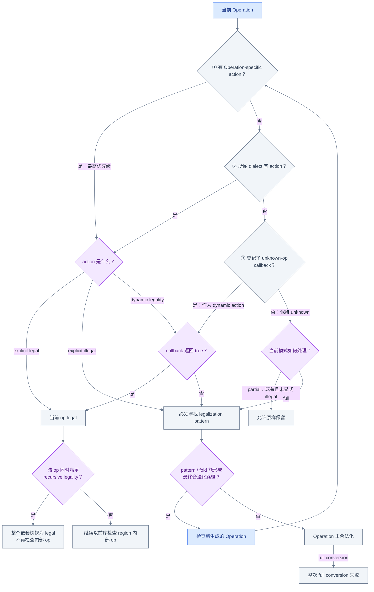
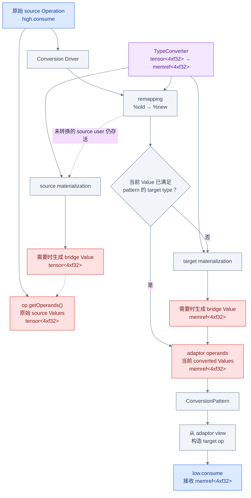
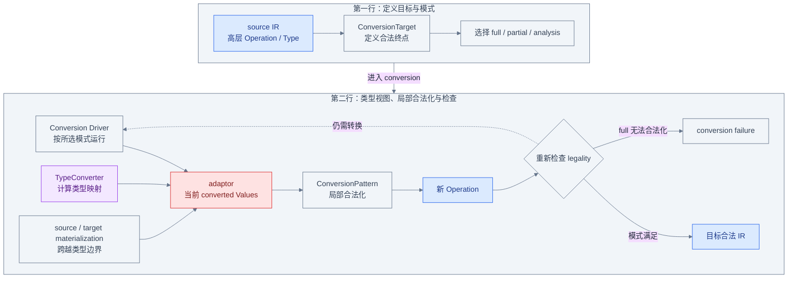

# Dialect Conversion：怎样保证降层后的 IR 合法

这一章把问题从“某条规则能否改写一个 Operation”推进到“整个转换范围是否已经满足目标
IR 的合法性约束”。共享输入仍是 [`examples/matmul.mlir`](examples/matmul.mlir)，但要先划清
证据边界：本章末尾的 One-Shot Bufferize 与 Linalg-to-loops pipeline 用来观察 tensor
`linalg.matmul` 变成 memref 与循环的 **lowering 状态变化**；当前 checkout 中
`convert-linalg-to-loops` 使用普通 `LinalgRewritePattern` 和 greedy driver，并不使用
`ConversionTarget`。Dialect Conversion 自身的 legality、adaptor 和类型桥接语义，将由当前
官方文档、公开头文件、实现和 legalizer 测试独立验证。

## 普通改写为什么不足以表达完整降层

普通 `RewritePattern` 可以把一个局部形状改成另一个局部形状。例如规则成功地把
`high.compute` 换成 `mid.loop`，只说明这次 mutation 成功，不说明 `mid.loop` 对最终目标合法，
也不说明同一函数中另一条 `high.return` 已经被处理。

```text
// 局部改写前
%0 = "high.compute"(%arg0) : (tensor<4xf32>) -> tensor<4xf32>
"high.return"(%0) : (tensor<4xf32>) -> ()

// 某条局部规则成功后
%0 = "mid.loop"(%arg0) : (tensor<4xf32>) -> tensor<4xf32>
"high.return"(%0) : (tensor<4xf32>) -> ()  // 仍可能是 illegal
```

Dialect Conversion 在 pattern rewriting 之上增加 `ConversionTarget` 与 conversion driver：
target 定义终点，driver 检查现有及新生成 Operation 的 legality，并在需要时继续寻找
legalization 路径。于是一次 pattern 的局部 success 和整次 conversion 的 success 是两个
不同判据；局部完全有效的 rewrite 仍可能留下 illegal Operation，令 full conversion 失败。


读图时重点检查 `局部 rewrite 成功 → 继续查询 legality` 这条边。Pattern 的 success 只承诺
它做了真实修改；只有 driver 对转换范围完成 legality 检查，才能决定 conversion 是否成功。

## 三种 Conversion 模式

三种入口共享 legality 与 legalization pattern，但“完成”的定义不同：

| 模式 | C++ 入口 | 对输入 IR 的要求 | 是否真正修改 IR |
|---|---|---|---|
| partial conversion | `applyPartialConversion` | 尽可能合法化；显式 illegal 的既有 op 必须消失，未显式标记 illegal 的既有 unknown op 可以留下 | 是 |
| full conversion | `applyFullConversion` | 所有输入 Operation 都必须成功合法化；unknown 不能作为未被 target 接受的最终输入留下 | 是 |
| analysis conversion | `applyAnalysisConversion` | 分析哪些 Operation 若执行 conversion 可被合法化，并记录到 `ConversionConfig::legalizableOps` | 否 |

默认情况下，三种模式都以前序检查 Operation：先看当前 op，再看其 region 中的 op。Conversion
pattern 也可以调用 `ConversionPatternRewriter::legalize(Operation *)` 或
`ConversionPatternRewriter::legalize(Region *)`，主动先合法化某个 op 或 region，从而改变这一
局部范围的默认顺序。Analysis conversion 不是“先改写再撤销的输出模式”；它以 partial-style
分析收集可合法化 Operation，不把 rewrite 应用到输入 IR。Full 与 analysis conversion 都会因
转换范围内存在 unreachable block 而失败；partial 的公开入口所记录的 failure 边界，是显式
illegal op 无法合法化。

选择模式时不要把 partial 理解成“允许 illegal 残留”。它允许的是未显式标记 illegal 的既有
unknown Operation；target 明确判为 illegal 的 Operation 仍必须被转换。

## ConversionTarget 定义终点

`ConversionTarget` 不描述“如何改”，只描述“什么可以留下”：

```cpp
ConversionTarget target(ctx);
target.addLegalDialect<arith::ArithDialect>();
target.addIllegalDialect<HighDialect>();
target.addDynamicallyLegalOp<func::FuncOp>(
    [&] (func::FuncOp op) {
      return typeConverter.isSignatureLegal(op.getFunctionType());
    });
target.markUnknownOpDynamicallyLegal(
    [](Operation *op) { return op->hasAttr("allow_here"); });
```

`ConversionTarget::getOpInfo` 按固定优先级查找 action：**Operation-specific action → 所属
dialect action → unknown-operation callback**。命中前一层就停止，不再用后一层覆盖。因此即使
整个 dialect 已标记 legal，针对某个 Operation 登记的 explicit illegal 仍然优先，必须被
转换；unknown callback 只处理前两层都没有信息的 Operation。

`Legal` 表示该 Operation 或 dialect 的所有实例都接受；`Illegal` 表示任何实例都必须消除；
`Dynamic` 把实例交给 callback，例如只接受签名已经转换的 `func.func`。前三层均无信息时，
Operation 才是 unknown，而不是默认 legal。`markUnknownOpDynamicallyLegal` 给这一末级 fallback
设置动态判断；callback 返回 false 的实例仍需要合法化。

Recursive legality 是另一个维度。某个 op 必须先是 statically 或 dynamically legal，才能用
`markOpRecursivelyLegal` 声明：当容器本身合法时，它的整个嵌套树也视为合法，即便内部本来
有会被判 illegal 的 op，driver 也不再进入其中要求 conversion。这适合当前阶段视为 opaque
的 region 边界，但也意味着被遮住的非法内容不会得到检查。

## Legality 如何逐个判断 Operation

下面的图把 explicit legal/illegal、dynamic legality、unknown、recursive legality 和 full
conversion failure 放进同一条决策路径：



先检查 `Operation-specific → dialect → unknown callback` 三层查询；第一层命中后不会再落到
legal dialect，所以 explicit illegal op 能覆盖 dialect 的 legal action。再检查 action 分支：
unknown 与 explicit legal 不是一回事。接着检查 `legal → recursive legality → 整个嵌套树`：
只有容器已合法且 recursive 条件满足时，
内部 illegal op 才被整体豁免。最后沿 `局部 pattern 成功 → 检查新 Operation → 仍不可合法化`
走到 failure；新生成的 Operation 会从 Operation-specific action 开始重新走完整三层 lookup，
不会继承 source op 已经得到的 action。这就是为什么一条 locally valid rewrite 不能保证 full
conversion 成功。

当前 [`test-legalizer-full.mlir`](../../../test/Transforms/test-legalizer-full.mlir) 同时提供这些行为的
回归证据：递归合法 module 内部的 `test.illegal_op_f` 可以保留；一个 unknown op 只有满足
dynamic callback 才合法；另一个 unknown op 使 `applyFullConversion` 失败。

## ConversionPattern 与普通 RewritePattern

`ConversionPattern` **继承** `RewritePattern`，所以仍有 root、benefit 和
`matchAndRewrite`，也仍通过 rewriter 创建、替换和删除 IR。它不是另一套无关的 pattern
系统。区别是它只能用于 dialect conversion 的 `apply*Conversion` 入口，并接收
`ConversionPatternRewriter` 与 conversion driver 准备的 remapped operands/adaptor。

Conversion pattern 也不必一步生成 legal op。若 target 只接受 `foo.add`，patterns 可以提供
`bar.add → baz.add` 与 `baz.add → foo.add`；legalizer 会把它们组成路径，并检查中间新 op。
反过来，普通 pattern 即使碰巧生成了合法 Operation，也没有独立的 `ConversionTarget` 完成
判据。Conversion pattern 的额外能力来自 driver 上下文，不是因为 `matchAndRewrite` 的
mutation 契约被取消。

```cpp
struct LowerHighOp : OpConversionPattern<high::ComputeOp> {
  using OpConversionPattern::OpConversionPattern;

  LogicalResult matchAndRewrite(
      high::ComputeOp op, OpAdaptor adaptor,
      ConversionPatternRewriter &rewriter) const override {
    rewriter.replaceOpWithNewOp<low::ComputeOp>(
        op, adaptor.getInput());
    return success();
  }
};
```

这里构造 target op 的输入来自 `adaptor`。`op` 仍用于查看 source Operation 的 attributes、
regions 和原始语义；operand 的“当前转换视图”则由 adaptor 提供。

## Adaptor 为什么不是 op.getOperands()

假设原始 source IR 是：

```mlir
%old = "high.produce"() : () -> tensor<4xf32>
"high.consume"(%old) : (tensor<4xf32>) -> ()
```

前一条 conversion pattern 已把 producer 换成 target 值：

```mlir
%new = "low.produce"() : () -> memref<4xf32>
```

当 consumer pattern 运行时，`op.getOperands()` 仍是 source op 自己记录的原始 operand 视图，
其类型仍是 `tensor<4xf32>`；conversion driver 的 remapping 则知道 `%old` 最新对应 `%new`。
若 consumer pattern 带有把 `tensor<4xf32>` 转成 `memref<4xf32>` 的 `TypeConverter`，adaptor
会得到符合 legalized target type 的当前 Value，必要时先插入 target materialization。因此
构造 target op 通常应使用 adaptor，而不是把 `op.getOperands()` 重新塞进低层 Operation。



读图时对比两条分支：`source op → op.getOperands()` 保留原始 `tensor` 视图；
`driver → remapping → adaptor` 提供当前 `memref` 视图。`TypeConverter` 规定期望类型，target
materialization 在当前值不满足该类型时向 target 侧建桥，source materialization 则让仍存活
的 source user 继续获得原类型。最终 `low.consume` 应沿 adaptor 这条实线构造。

框架只保证 adaptor Value 的类型契约，不保证它一定就是某次 `replaceOp` 传入的那个 Value；
它也可能是暂态 `builtin.unrealized_conversion_cast` 的结果。没有 TypeConverter 的 conversion
pattern 会收到最新 remapping，但特意排除 materialization；如果确实需要原类型，才从 source
op 读取原 operand。

## TypeConverter 如何改变类型

`TypeConverter` 的 conversion callback 只计算类型映射，不创建 IR。映射可以是 1:1、1:N，
也可以产生空类型列表来删除一个输入。若 source type 转成自身，它在该 converter 下是 legal
type。最近注册的 conversion callback 最先尝试；接受 `Value` 的 context-aware callback 可读取
IR，但其结果不能像纯 Type callback 那样完整缓存。

```cpp
TypeConverter converter;
converter.addConversion([](Type type) { return type; });
converter.addConversion([](TensorType type) -> Type {
  return MemRefType::get(type.getShape(), type.getElementType());
});
```

在 conversion pattern 带这个 converter 时，driver 在进入 `matchAndRewrite` 前先为 operand
求 legalized type。若原始 `tensor<4xf32>` 无法转换，pattern 根本不会被调用；若能转换，
adaptor 的对应 Value 保证具有期望的 `memref<4xf32>` 类型。TypeConverter 还提供
`isLegal(Type)`、`convertSignatureArgs` 和 `convertBlockSignature` 等工具，但“算出新 Type”
不等于“已经存在一个该 Type 的 SSA Value”，后者需要 materialization 或其他 conversion
pattern 生成的 replacement。

## Materialization 如何跨越类型边界

Materialization callback 可以通过 `OpBuilder` 真正创建桥接 IR，这正是它与 type conversion
callback 的根本区别：

| 类型 | 方向 | 何时需要 |
|---|---|---|
| target materialization | 当前/未转换 Value → pattern 期望的 target type | 将 source 或另一种 replacement 类型送入正在转换的 target pattern |
| source materialization | replacement Value → 原始 source type | conversion 结束时仍有未转换 source user 需要旧类型 |

以 `tensor<4xf32> → memref<4xf32>` 为例：若 `high.consume` 正在转换而输入仍是 tensor，target
materialization 生成 memref bridge；若 producer 已产生 memref，但一个允许保留的 source user
仍要求 tensor，source materialization 反向生成 tensor bridge。若转换结束仍有 live 类型缺口，
又没有合适 materialization，整次 conversion 失败；
[`test-legalize-type-conversion.mlir`](../../../test/Transforms/test-legalize-type-conversion.mlir)
用 `failed to legalize unresolved materialization` 诊断覆盖了这种失败。

`ConversionConfig::buildMaterializations=false` 只跳过 TypeConverter 注册的 source/target
materialization callbacks；type conversion callbacks 仍会计算 legalized types。需要跨类型
边界但尚未解析的 bridge 会保留为 `builtin.unrealized_conversion_cast`。即使默认构建
materialization，adaptor 中也可能暂时出现这种 cast；不要把它当作 converter 的最终 target
Operation。

## Region Signature Conversion

Block argument 的类型不能只靠替换某个 defining Operation 的结果来改变。Block 可能在 region
之间移动，entry block argument 又常与 `func.func`、循环等容器 Operation 的签名存在语义
联系，所以 region/block signature 必须由 conversion pattern 显式处理。

`rewriter.convertRegionTypes(region, converter, entryConversion)` 为 region 的每个 block 计算
并应用 signature conversion；`rewriter.applySignatureConversion(block, conversion, converter)`
只处理指定 block。`TypeConverter::SignatureConversion` 记录每个原参数如何映射到零个、一个或
多个新参数，或直接映射到 replacement Values。

```text
// 原 block
^bb0(%arg0: tensor<4xf32>, %flag: i1):

// SignatureConversion 后
^bb0(%arg0: memref<4xf32>, %flag: i1):
```

仅改变 block argument 而不处理 successor operands、region entry 语义和仍存活的原类型 uses，
会留下类型断口。`test-legalize-type-conversion.mlir` 的 unstructured control-flow 用例验证了
`cf.br` / `cf.cond_br` 传入的新参数类型，以及 source materialization 如何供应仍要求旧类型的
`test.foo`、`test.bar` users。

## Rollback 与 no-rollback 的观察差异

`ConversionConfig::allowPatternRollback` 默认为 `true`。Rollback mode 允许 legalizer 在一条
pattern 序列走到不可合法化的新 Operation 时回退，尝试另一条 legalization 路径。为便于回退，
部分 mutation 延迟到 conversion 末尾提交；no-rollback mode 则立即应用全部 mutation，通常
更快，也让 IR dump 更接近 driver 的真实当前状态，但不能依靠 backtracking 撤销走不通的路径。

| mutation | rollback mode | no-rollback mode |
|---|---|---|
| Operation insert / move | 立即 | 立即 |
| Operation replace / erase | 延迟 | 立即 |
| in-place modification | 立即 | 立即 |
| Value replacement | 延迟 | 立即 |
| Block signature conversion | 部分延迟 | 立即 |
| Region / block inline | 部分延迟 | 立即 |

因此两种模式中间 dump 的“可见 IR”不同。Rollback mode 下，已调用 `eraseOp` 的 Operation
仍可能被 pattern 或 traversal 看见；已调用 `replaceOp` 后，旧 users 也可能暂时仍连接旧 Value，
映射关系保存在 driver 的内部数据结构中，所以文本 IR 可能混合新旧状态。No-rollback mode
立即改 users，并更常需要暂态 `unrealized_conversion_cast` 保持类型安全。两种模式若成功，
都必须满足同一 conversion target；观察差异不能被解释为最终 legality 不同。

[`test-legalizer-full-rollback.mlir`](../../../test/Transforms/test-legalizer-full-rollback.mlir) 验证
失败时 region inline、block erase 等能够撤销；头文件也明确指出 `replaceUsesWithIf` 在 rollback
mode 不受支持。编写 pattern 时不能依赖“调用 erase 后对象马上不可见”这类只在 no-rollback
mode 成立的观察。

## 回到 C++ 源码验证

| 要验证的事实 | 当前资料入口 | 建议追踪的标识符 |
|---|---|---|
| 三种模式、target、adaptor、rollback、TypeConverter 与 signature conversion | [`docs/DialectConversion.md`](../../../docs/DialectConversion.md) | `Modes of Conversion`、`Remapped Operands / Adaptor`、`Immediate vs. Delayed IR Modification`、`Type Conversion` |
| 类型映射、materialization、conversion pattern 与公开入口 | [`DialectConversion.h`](../../../include/mlir/Transforms/DialectConversion.h) | `TypeConverter`、`ConversionPattern`、`OpConversionPattern`、`ConversionPatternRewriter`、`apply*Conversion` |
| legality action、unknown 与 recursive legality 的公开 API | [`DialectConversion.h`](../../../include/mlir/Transforms/DialectConversion.h) | `ConversionTarget::LegalizationAction`、`markUnknownOpDynamicallyLegal`、`markOpRecursivelyLegal` |
| legalizer 搜索、rewrites 与 rollback 实现 | [`DialectConversion.cpp`](../../../lib/Transforms/Utils/DialectConversion.cpp) | `OperationLegalizer`、`ConversionPatternRewriterImpl`、`IRRewrite`、`rollback` |
| 类型桥接与 region signature 回归 | [`test-legalize-type-conversion.mlir`](../../../test/Transforms/test-legalize-type-conversion.mlir) | unresolved materialization、signature conversion、unstructured CF |
| full conversion、unknown 和 recursive legality 回归 | [`test-legalizer-full.mlir`](../../../test/Transforms/test-legalizer-full.mlir) | `recursively_legal_invalid_op`、`test_unknown_dynamically_legal`、`applyFullConversion failed` |
| rollback 后 IR 恢复回归 | [`test-legalizer-full-rollback.mlir`](../../../test/Transforms/test-legalizer-full-rollback.mlir) | `test_undo_region_inline`、`test_undo_block_erase` |
| 当前 Linalg-to-loops 的真正 driver | [`Loops.cpp`](../../../lib/Dialect/Linalg/Transforms/Loops.cpp) | `LinalgRewritePattern`、`lowerLinalgToLoopsImpl`、`applyPatternsGreedily` |
| 更完整的中文总结 | [Dialect Conversion 学习总结](../../Transforms/DialectConversion_Summary.md) | legality、adaptor、TypeConverter、materialization |

最关键的源码链是：`ConversionPattern` 继承 `RewritePattern`，`OpConversionPattern` 把 driver
给出的 remapped operands 包装成 typed adaptor，`ConversionPatternRewriter` 再提供 signature
conversion 与允许异类型 replacement 的专用 hook；最后 `applyPartialConversion`、
`applyFullConversion` 或 `applyAnalysisConversion` 决定完成条件。不要只看 pattern 类而漏掉
`ConversionTarget`，也不要只看 target 而漏掉 adaptor 的类型契约。

## 运行 matmul lowering

从 `llvm-project` 仓库根目录运行读者命令：

```bash
set -euo pipefail

build/bin/mlir-opt \
  mlir/LearningSteps/IllustratedMLIR/Transformation/examples/matmul.mlir \
  --one-shot-bufferize='bufferize-function-boundaries' \
  --convert-linalg-to-loops \
  -o /tmp/illustrated-transformation-dialect-conversion.mlir

rg -n "memref.alloc" \
  /tmp/illustrated-transformation-dialect-conversion.mlir
rg -n "scf.for" \
  /tmp/illustrated-transformation-dialect-conversion.mlir
! rg -n "linalg.matmul|tensor<" \
  /tmp/illustrated-transformation-dialect-conversion.mlir
```

本章使用当前 checkout 已构建的 `mlir-opt` 验证；正文命令从仓库根目录运行并使用可复制的
`build/bin/mlir-opt` 相对路径。当前输出中函数边界从 tensor 改为 memref，出现
`memref.alloc`；fill 变成两层 `scf.for`，matmul 变成三层 `scf.for`，payload
`linalg.matmul` 与所有 tensor 类型均消失。

这些断言证明 One-Shot Bufferize 与 Linalg-to-loops 暴露了可观察的 lowering 状态转换，**不证明
整个 pipeline 或其中每个 pass 都使用 Dialect Conversion**。尤其当前
[`Loops.cpp`](../../../lib/Dialect/Linalg/Transforms/Loops.cpp) 的 `lowerLinalgToLoopsImpl` 创建
`LinalgRewritePattern` 后直接调用 `applyPatternsGreedily`；没有 `ConversionTarget` 或
`apply*Conversion`。Legality、adaptor 与 rollback 的运行时证据来自前述专用 test pass 和
Dialect Conversion tests，而不是把所有名为 `convert-*` 的 pass 都归类为 conversion driver。

## 四个常见误区

1. **“某个 ConversionPattern 返回 success，full conversion 就成功。”** 不对。Pattern 只完成
   一次局部 mutation；新 op 与范围内其他 op 仍要满足 target，任何无法合法化的 op 都可使 full
   conversion 失败。
2. **“`adaptor` 只是 `op.getOperands()` 的方便别名。”** 不对。后者是 source op 的原始
   operands，前者是 driver remapping 后的当前 converted view；带 TypeConverter 时还保证
   legalized operand types，target op 通常应从 adaptor 构造。
3. **“TypeConverter 返回新 Type，就自动拥有对应的新 Value。”** 不对。Conversion callback
   只计算类型；Value 跨类型边界需要 replacement、source/target materialization，或暂态
   `unrealized_conversion_cast`。
4. **“名字叫 `convert-linalg-to-loops`，所以一定使用 ConversionTarget。”** 不对。当前实现是
   `LinalgRewritePattern + applyPatternsGreedily`。Lowering 是状态目标；Dialect Conversion 是
   可选的实现框架，二者不能按 pass 名称画等号。

## 一张图总结本章



沿主环检查 `driver → pattern → 新 Operation → legality → driver`：conversion 不是“一次替换”，
而是持续到当前模式满足 target。再看下方两条输入边：TypeConverter 决定 adaptor 需要的类型，
materialization 提供跨类型边界的 Value，pattern 才能以 adaptor view 构造 target Operation。
最后分清 success 与 failure 出口，full conversion 的完成条件属于整个目标范围。

## 继续阅读

- 下一章：[Transform Dialect](05_Transform_Dialect.md) 将解释怎样用 Transform IR 和 handle
  选择并编排 payload 变换；它可以触发底层 conversion，却不取代 legality 框架。
- 回看上一章：[PatternRewriter](03_Pattern_Rewriter.md)，比较 greedy driver 的固定点与本章
  conversion driver 的 legality 完成条件。
- 查阅本册入口：[图解 MLIR Transformation 阅读地图](00_Reading_Map.md)。
- 深入 API：[Dialect Conversion 官方文档](../../../docs/DialectConversion.md)、
  [`DialectConversion.h`](../../../include/mlir/Transforms/DialectConversion.h) 与
  [Dialect Conversion 学习总结](../../Transforms/DialectConversion_Summary.md)。
