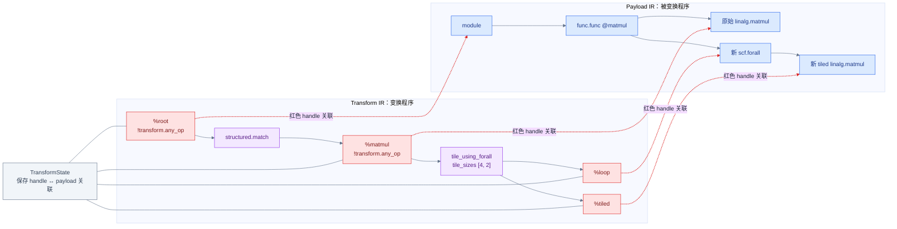
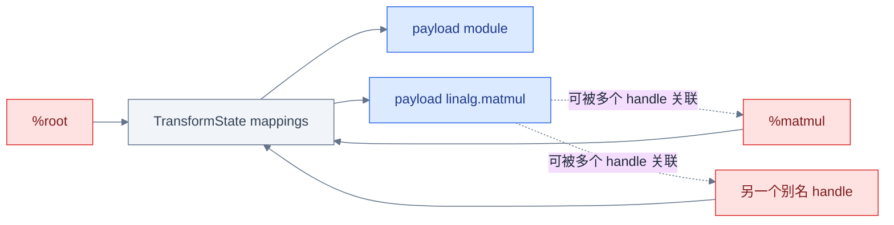
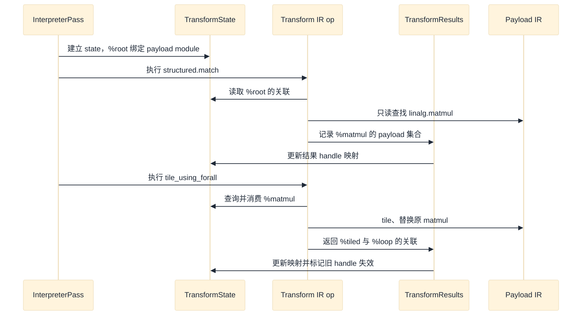
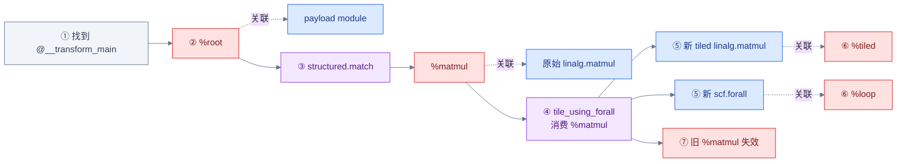
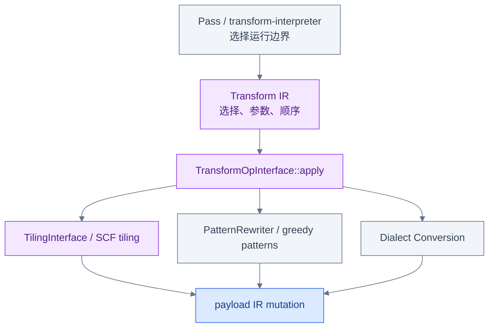
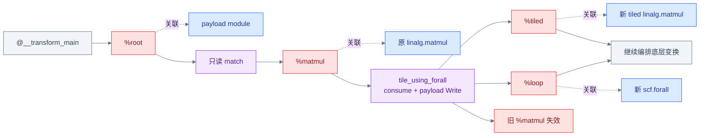

# Transform Dialect：为什么把变换本身也写成 IR

前四章分别回答了 Pass 怎样调度、Pattern 怎样局部改写、Dialect Conversion 怎样检查合法终点。
这一章换一个视角：如果“先找到某一条 `linalg.matmul`，按 `[4, 2]` tile，再继续处理新生成的
循环”也能写成 IR，就可以像阅读普通程序一样阅读、打印和组合变换策略，而不必每改一次策略
就重编译 C++。

共享样例是 [`examples/matmul_transform.mlir`](examples/matmul_transform.mlir)。同一个 module 里
同时放着待修改的函数和 `transform.named_sequence`，但它们是角色完全不同的两套 IR。

## Payload IR 与 Transform IR 是两套 IR

**Payload IR** 是被修改的程序，本例中是 `func.func @matmul` 及其中的 `linalg.matmul`。
**Transform IR** 是描述“选谁、按什么顺序、用什么参数修改”的程序，本例中是
`transform.named_sequence`、`transform.structured.match` 和
`transform.structured.tile_using_forall`。



红色虚线不是 payload 的 SSA use-def 边。`%root`、`%matmul`、`%tiled`、`%loop` 都是
**Transform IR 自己的 SSA Value**；它们的语义是查询 payload 对象时使用的 handle（可理解为
语义 key）。实际关联由 `TransformState` 保存。handle 不拥有 payload Operation，不复制它，
也不是 payload IR 中由 `linalg.matmul` 产生的 tensor SSA Value。

## transform.named_sequence 是执行入口

共享样例的入口是：

```mlir
transform.named_sequence @__transform_main(
    %root: !transform.any_op) {
  // transform ops
  transform.yield
}
```

对 `--transform-interpreter` 而言，默认入口符号名是 `@__transform_main`。第一项参数会绑定到
pass 选定的 payload root；这里没有额外参数，所以 `%root` 关联整个 payload `module`。若以
C++ API 直接调用 `applyTransforms` 或 `applyTransformNamedSequence`，调用方也可以显式给定顶层
transform op 和额外映射，特殊名字是 interpreter pass 的入口约定，不是所有 API 的普遍语法
要求。

`transform.named_sequence` 是一个可打印、函数式的 Transform IR 容器：单 block，末尾必须是
`transform.yield`。它定义命名序列；被 interpreter 选作入口或被 `transform.include` 调用时，
其中的 transform op 才按顺序执行。外层 module 上的 `transform.with_named_sequence` 属性为
存在命名序列的符号表开启相应验证。

## Handle 如何关联 payload Operation

`TransformState` 内部同时维护正向与反向映射：

```text
Transform IR Value  -> [payload Operation *, ...]
payload Operation * -> [Transform IR Value, ...]
```

因此一个 operation handle 可以关联零个、一个或多个 payload Operation；同一个 payload
Operation 也可能被多个 handle 关联。除非某个 transform op 的文档另有保证，不应把这种关联
误当成有稳定顺序的单元素指针。

本例中，入口先建立 `%root → module`。`structured.match` 读取 `%root` 对应范围，寻找名字为
`linalg.matmul` 的 Operation，然后让结果 `%matmul` 关联匹配集合。`!transform.any_op` 是
Transform handle type；更窄的 `!transform.op<"linalg.matmul">` 还能在建立关联时检查 payload
对象种类。类型约束检查的是关联对象，不会把 handle 变成 payload Value。



这张图也解释了为何“只让 `%matmul` 失效”还不够：如果另一个 handle 也指向同一个被删除的
payload op，它同样会悬空。

## Interpreter 如何逐条执行 Transform IR

`InterpreterPass::runOnOperation` 的主路径很短：找到 payload root，找到 transform entry point，
构造入口 bindings，然后调用 `applyTransformNamedSequence`。后者建立 `TransformState` 并通过
`TransformOpInterface` 调用每一条 transform op 的 `apply`；每次返回的 `TransformResults`
再写回 state，成为后续 op 可查询的新映射。



这里“逐条执行”不是把 Transform IR lower 成 payload 指令。Transform IR 仍是描述编译器行为的
IR；interpreter 读取它，具体 transform op 的 C++ `apply` 修改另一边的 payload IR。

## tile_using_forall 修改了什么

输入中的 `linalg.matmul` 计算 `8×16` 与 `16×4` 矩阵。`tile_sizes [4, 2]` 沿结果的两个
parallel 维切块，所以输出覆盖成 `2×2` 个 tile。当前实现调用 SCF tiling 机制，替换原始
matmul，并生成：

- 外层 `scf.forall (%i, %j) in (2, 2)`；
- 对 lhs、rhs 和输出 tile 的 `tensor.extract_slice`；
- forall 内部、形状为 `4×2` 的新 `linalg.matmul`；
- `tensor.parallel_insert_slice` 把每个结果 tile 写回 shared output。

该 transform 的两个结果按 TableGen 定义依次是 `tiled_op`、`forall_op`，所以样例中的
`%tiled` 关联内部新 `linalg.matmul`，`%loop` 关联外层 `scf.forall`。它不是给原 op 原地加一个
属性：当前调用链是 `TileUsingForallOp::apply → tileToForallOpImpl → scf::tileUsingSCF`，其中
`tileToForallOpImpl` 会以 tiling result 的 replacements `replaceOp` 原始 tileable op，结果
handle 必须指向新对象。

## Handle 消耗与失效

完整生命周期如下。红色节点始终是 Transform handle，蓝色节点始终是 payload Operation；
紫色节点是实际执行选择或 mutation 的 transform op。旧 `%matmul` 在 tiling 后不能再读，
新 `%tiled` 与 `%loop` 才是下一步变换的合法起点。



“consume” 是 handle 生命周期契约，不等于“C++ 立刻 delete 这个 SSA Value”。Transform IR
文本仍可打印，但它的 mapping 已被 free；以后拿这个 Value 查询 payload 是非法的。失效还会
覆盖别名 handle，以及关联到被删除 payload op 内部嵌套对象的 handle，因为删除父 op 也会
删除其 regions 中的对象。

interpreter 默认启用 expensive checks。它会记录失效来源，在后续误用时报告“哪个 handle
失效、哪条 transform 消费了它”，把潜在悬空引用从断言或崩溃提前变成诊断。稳定序列可用
`disable-expensive-checks` 换取编译时性能，但这只是关闭动态保护，不会让 use-after-consume
变合法。

## Effects 为什么是正确性契约

每个 Transform op 必须通过 `MemoryEffectsOpInterface` 描述两类资源：

| 资源 | Effect | 本章语义 |
|---|---|---|
| `TransformMappingResource` | `Read` | 查询 operand handle 的关联 |
| `TransformMappingResource` | `Allocate + Write` | 为结果 handle 建立关联 |
| `TransformMappingResource` | `Read + Free` | 消费 operand handle |
| `PayloadIRResource` | `Read` | 检查或选择 payload，不修改 |
| `PayloadIRResource` | `Read + Write` | 修改 payload IR |

`structured.match` 的实现声明 `onlyReadsHandle(current)`、`onlyReadsPayload`、
`producesHandle(results)`：它是**只读选择 transform**，不因为产生新 handle 就修改 payload。
`tile_using_forall` 则声明 `consumesHandle(target)`、只读 tile 参数、`producesHandle(results)`、
`modifiesPayload`：它既修改程序，又使 target 的旧映射失效。

这些 effects 不是注释。它们同时约束执行顺序、handle 的 allocate/read/free 生命周期，并让
TransformState 知道何时必须做 invalidation 检查。把“读取 handle”和“改写 payload”分开后，
编排器才能判断哪些操作可能安全重排，哪些操作绝不能越过 payload mutation。

## Silenceable Failure 与 Definite Failure

Transform op 的执行结果有三态：success、silenceable failure、definite failure。

- **Silenceable failure** 表示这次目标上没有完成预期变换，但容器可能有意恢复。例如某个
  transform 按其自身契约没有匹配到必需目标，或可选变换的前提不满足。诊断可以暂缓，
  `transform.sequence` 可按 failure propagation mode 传播或抑制它；顶层仍未处理的
  silenceable failure 最终会成为失败。
- **Definite failure** 表示无法安全继续，例如 transform 自身的不变量被破坏或内部发生不可
  恢复错误。诊断立即生效，容器必须传播，不能靠 suppress 把它当成功。

`tile_using_forall` 的当前 ODS 文档规定：所有 target 都成功 tile 才成功，否则产生
silenceable failure；不实现 `TilingInterface` 的对象会被忽略并从结果中丢弃。不要因此把
silenceable 理解成“payload 已自动 rollback”。失败类别描述的是控制与诊断能否恢复，不普遍
承诺已发生的 mutation 会撤销；具体 transform 必须维护自己声明的正确性边界。

## Transform Dialect 如何复用底层机制

Transform Dialect 解决的是**选择与编排**，不是重新发明所有变换算法：



最常见的部署方式本身就是一个 pass 运行 interpreter。某条 transform op 的 `apply` 又可以调用
TilingInterface、PatternRewriter、Dialect Conversion 或其他 MLIR 组件。本例的
`tile_using_forall` 复用 SCF tiling；别的 transform extension 可以复用 pattern 或 conversion。
所以 Transform Dialect 没有替代 Pass、Pattern 或 Conversion，而是把何时、对谁、以何参数
调用这些具体机制表示成可组合 IR。

## 回到 C++ 与 TableGen 源码验证

把概念落到当前 checkout，可按这条路径核对：

1. [`TransformOps.td`](../../../include/mlir/Dialect/Transform/IR/TransformOps.td) 定义
   `NamedSequenceOp`：它实现 `FunctionOpInterface`、`TransformOpInterface` 和 effects 接口，
   body 为单 region，说明命名序列被 dispatch 时逐条执行。
2. [`InterpreterPass.cpp`](../../../lib/Dialect/Transform/Transforms/InterpreterPass.cpp) 的
   `InterpreterPass::runOnOperation` 先调用 `detail::findTransformEntryPoint` 选择命名入口，再解析
   bindings，并把 `disableExpensiveChecks` 取反传给 `TransformOptions`。
3. [`TransformInterpreterUtils.h`](../../../include/mlir/Dialect/Transform/Transforms/TransformInterpreterUtils.h)
   声明 `applyTransformNamedSequence`；它接收已经选定的 `transformRoot`，校验入口 bindings，
   必要时链接 transform library symbols，最后委托 `applyTransforms` 执行。
4. [`TransformInterfaces.h`](../../../include/mlir/Dialect/Transform/Interfaces/TransformInterfaces.h)
   的 `TransformState` 定义 `DenseMap<Value, SmallVector<Operation *>>` 正向映射和反向映射；
   `applyTransform`、`getPayloadOps`、`TransformResults` 构成执行与结果回写边界。
5. [`LinalgTransformOps.td`](../../../include/mlir/Dialect/Linalg/TransformOps/LinalgTransformOps.td)
   定义 `TileUsingForallOp` 的 `target`、`tiled_op`、`forall_op` 和 failure contract。
6. [`LinalgTransformOps.cpp`](../../../lib/Dialect/Linalg/TransformOps/LinalgTransformOps.cpp) 的
   `TileUsingForallOp::apply` 调用 tiling helper并把 tiled ops/loops写入结果；`getEffects` 明确
   consume target、produce results、modify payload。

总览语义还可对照官方 [`Transform Dialect`](../../../docs/Dialects/Transform.md) 与
[`Transform 教程 Chapter 1`](../../../docs/Tutorials/transform/Ch1.md)。失效诊断的当前回归样例
位于 [`expensive-checks.mlir`](../../../test/Dialect/Transform/expensive-checks.mlir)。

## 运行 matmul Transform sequence

在 `llvm-project` 仓库根目录执行：

```bash
set -euo pipefail

build/bin/mlir-opt \
  mlir/LearningSteps/IllustratedMLIR/Transformation/examples/matmul_transform.mlir \
  --transform-interpreter \
  -o /tmp/illustrated-transformation-tiled.mlir

rg -n "scf.forall" \
  /tmp/illustrated-transformation-tiled.mlir
rg -n '^[[:space:]]+(%.* = )?linalg\.matmul' \
  /tmp/illustrated-transformation-tiled.mlir
```

本章在当前机器上验证这条命令时，实际调用的是绝对路径
`/home/fuhao/llvm-project/build/bin/mlir-opt`；上面的读者命令保留仓库根目录下可移植的
`build/bin/mlir-opt`。

本 checkout 的实际输出关键行是：

```text
%2 = scf.forall (%arg2, %arg3) in (2, 2) ...
  %5 = linalg.matmul ... tensor<4x16xf32>, tensor<16x2xf32> ...
scf.forall.in_parallel {
```

这同时断言了两件事：外层确实出现 `scf.forall`，内部确实保留一条处理 `4×2` 输出 tile 的
`linalg.matmul`。只检查 op 名字还不够时，可继续检查 `(2, 2)` trip count 和 `4x2` slice
形状。

输出 module 中仍会打印 `transform.named_sequence @__transform_main` 以及两条 transform op。
这是正常的：解释器修改 payload，但命名 Transform sequence 本身仍是 module 中可打印的 IR；
它不是 `@matmul` 运行时会执行的 payload 代码，也不应被当作 tile 失败后残留的指令。

## 四个常见误区

1. **“Transform handle 就是 payload SSA Value。”** 错。它是 Transform IR SSA Value，作为
   `TransformState` 映射的 key；payload tensor Value 属于另一套 use-def 图。
2. **“match 产生 handle，所以它修改了 payload。”** 错。`structured.match` 只读 payload 并
   产生 mapping；是否 mutation 要看 `PayloadIRResource` 上有没有 `Write` effect。
3. **“consume 只让 operand 名字不可读，别名 handle 仍安全。”** 错。指向同一被替换对象或其
   嵌套对象的 handle 也会失效；expensive checks 正是用来诊断这类 use-after-consume。
4. **“Transform Dialect 取代了 Pass、Pattern 和 Conversion。”** 错。interpreter 常由 Pass
   承载，transform op 又调用具体 tiling、rewriting 或 conversion 机制；它增加的是可编排层。

## 一张图总结本章



读图只抓三条线：入口把 `%root` 绑定到 payload；只读 match 建立 `%matmul` 关联；会 mutation 的
tile 消费旧 handle，并返回指向新 tiled op 与 loop 的 handle。effects 把这三步从“约定俗成”
提升为 interpreter 可检查的正确性契约。

## 继续阅读

- 回看 [Pattern Rewriter](03_Pattern_Rewriter.md)：理解 transform op 可能复用的局部 mutation
  契约。
- 回看 [Dialect Conversion](04_Dialect_Conversion.md)：对比“handle 生命周期失败”与“legality
  未满足”这两类不同失败。
- 下一章：[端到端 matmul](06_End_To_End_Matmul.md) 将把 Pass、Transform、Bufferization 和
  Linalg-to-loops 放进同一条可运行时间线。
- 深入扩展机制可继续阅读官方
  [`Transform Dialect Extension`](../../../docs/Tutorials/transform/Ch2.md) 教程。
