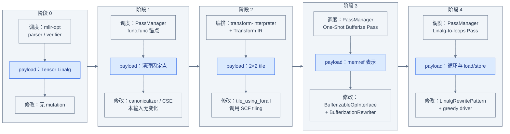

# 端到端复盘：一条 matmul 是怎样被逐步变换的

前五章分别拆开了 Pass、Pattern Rewriting、Dialect Conversion 与 Transform Dialect。本章不再
引入第五套机制，而是固定同一个输入，把每次可观察的 payload IR 变化重新接成一条线。重点
不是背 pass 名字，而是每到一个阶段都回答两件事：**谁安排执行，谁真正修改 Operation？**

## 冻结输入和实验身份

本章的实验身份固定如下。只要其中一项改变，输出差异就不应直接归因于某个机制本身：

| 项目 | 固定值 |
|---|---|
| input | [`examples/matmul_transform.mlir`](examples/matmul_transform.mlir) |
| tool | `build/bin/mlir-opt` |
| Transform tile sizes | `[4, 2]` |
| bufferization | `one-shot-bufferize`，选项 `bufferize-function-boundaries` |
| lowering | `convert-linalg-to-loops` |
| outputs | `/tmp/illustrated-transformation-e2e-*.mlir` |

本文命令都从 `llvm-project` 仓库根目录运行。作者验证时实际使用绝对路径
`/home/fuhao/llvm-project/build/bin/mlir-opt`；正文保留相对路径，便于其他 checkout 复现。

还要先说明一个容易隐藏实验差异的细节：冻结输入已经没有
[`examples/matmul.mlir`](examples/matmul.mlir) 中那条 dead `arith.constant 1`。因此阶段 1 的
`canonicalize,cse` 在本输入上达到 fixed point，规范化打印结果与阶段 0 相同。它仍是检查
Pass pipeline 边界的独立阶段，但**不在最终三-pass 完整命令中重复运行**。

## 阶段 0：原始 Tensor Linalg IR

先只 parse、verify 并打印，不运行显式变换 pass：

```bash
build/bin/mlir-opt \
  mlir/LearningSteps/IllustratedMLIR/Transformation/examples/matmul_transform.mlir \
  -o /tmp/illustrated-transformation-e2e-parsed.mlir
rg -n 'linalg\.fill' /tmp/illustrated-transformation-e2e-parsed.mlir
rg -n 'linalg\.matmul' /tmp/illustrated-transformation-e2e-parsed.mlir
rg -n 'transform\.named_sequence' \
  /tmp/illustrated-transformation-e2e-parsed.mlir
```

实际输出中值得保留的只有下面几行；完整生成文件仍留在 `/tmp`：

```mlir
%1 = linalg.fill ... outs(%0 : tensor<8x4xf32>) -> tensor<8x4xf32>
%2 = linalg.matmul ... outs(%1 : tensor<8x4xf32>) -> tensor<8x4xf32>
transform.named_sequence @__transform_main(%arg0: !transform.any_op) {
  %0 = transform.structured.match ops{["linalg.matmul"]} in %arg0 ...
}
```

这里同时看到了两套 IR：函数中的 tensor/Linalg 是 payload；`transform.named_sequence` 是随后
由 interpreter 解释的 Transform IR。parse 阶段没有把二者合并，也没有执行 sequence。

## 阶段 1：Pass pipeline 清理冗余

用嵌套 pipeline 固定 Pass 的 Operation 锚点：

```bash
build/bin/mlir-opt \
  mlir/LearningSteps/IllustratedMLIR/Transformation/examples/matmul_transform.mlir \
  --pass-pipeline='builtin.module(func.func(canonicalize,cse))' \
  -o /tmp/illustrated-transformation-e2e-clean.mlir
cmp /tmp/illustrated-transformation-e2e-parsed.mlir \
    /tmp/illustrated-transformation-e2e-clean.mlir
```

当前冻结输入的 `cmp` 成功：没有冗余 Operation 可删。这个观察只说明此输入在该 pipeline 下
没有文本变化；不能从“输出相同”反推出 canonicalizer 没有运行，也不能据此声称某条 Analysis
被缓存。调度边界来自 `builtin.module(func.func(...))` 的 pipeline 语义。

Canonicalizer 内部收集已注册 canonicalization patterns，并调用 greedy driver；它还可做
folding、dead-op 清理和 constant CSE。删除 dead `arith.constant 1` 的可运行证据属于
[`03_Pattern_Rewriter.md`](03_Pattern_Rewriter.md) 使用的纯 payload 输入，证据范围不要扩大到
这个已经清理过的冻结输入。

## 阶段 2：Transform IR 选择并 Tile matmul

接着让 interpreter 执行 `@__transform_main`：

```bash
build/bin/mlir-opt \
  mlir/LearningSteps/IllustratedMLIR/Transformation/examples/matmul_transform.mlir \
  --transform-interpreter \
  -o /tmp/illustrated-transformation-e2e-tiled.mlir
rg -n 'scf\.forall' /tmp/illustrated-transformation-e2e-tiled.mlir
rg -n '^[[:space:]]+(%.* = )?linalg\.matmul' \
  /tmp/illustrated-transformation-e2e-tiled.mlir
```

实际 payload 摘要为：

```mlir
%2 = scf.forall (%i, %j) in (2, 2) shared_outs(%out = %1)
    -> (tensor<8x4xf32>) {
  %lhs_tile = tensor.extract_slice ... to tensor<4x16xf32>
  %rhs_tile = tensor.extract_slice ... to tensor<16x2xf32>
  %result_tile = linalg.matmul ... -> tensor<4x2xf32>
  scf.forall.in_parallel {
    tensor.parallel_insert_slice %result_tile into %out ...
  }
}
```

`transform.structured.match` 只读 payload 并建立 handle 映射；
`transform.structured.tile_using_forall` 才消费旧 `%matmul` handle，调用具体 SCF tiling 实现，
以新 `scf.forall` 和 tile 内的新 `linalg.matmul` 替换原始 payload op。也就是说，Transform
Dialect 负责选择与编排，真正 tile 的是 transform op 调用的具体实现，不是 handle 自己修改 IR。

## 阶段 3：Bufferization 改变数据表示

为单独观察数据表示变化，可以停在 bufferization 后：

```bash
build/bin/mlir-opt \
  mlir/LearningSteps/IllustratedMLIR/Transformation/examples/matmul_transform.mlir \
  --transform-interpreter \
  --one-shot-bufferize='bufferize-function-boundaries' \
  -o /tmp/illustrated-transformation-e2e-bufferized.mlir
rg -n 'memref\.alloc' /tmp/illustrated-transformation-e2e-bufferized.mlir
rg -n 'scf\.forall' /tmp/illustrated-transformation-e2e-bufferized.mlir
rg -n '^[[:space:]]+(%.* = )?linalg\.matmul' \
  /tmp/illustrated-transformation-e2e-bufferized.mlir
! rg -n 'tensor<' /tmp/illustrated-transformation-e2e-bufferized.mlir
```

关键输出不再通过 tensor SSA 结果传递矩阵，而是显式操作 buffer：

```mlir
func.func @matmul(%lhs: memref<8x16xf32, ...>, %rhs: memref<16x4xf32, ...>)
    -> memref<8x4xf32> {
  %alloc = memref.alloc() : memref<8x4xf32>
  linalg.fill ... outs(%alloc : memref<8x4xf32>)
  scf.forall (%i, %j) in (2, 2) {
    %lhs_view = memref.subview %lhs[...] ...
    linalg.matmul ... outs(%result_view : memref<4x2xf32, ...>)
  }
}
```

这里 `scf.forall` 与 Linalg 计算结构仍在，变化的是 tensor 到 memref 的数据表示和函数边界。
当前 One-Shot Bufferize Pass 调用 One-Shot Analysis，再通过 `BufferizableOpInterface`、
`BufferizationRewriter` 和自己的 worklist 执行 bufferization。这个具体阶段没有设置
`ConversionTarget`，不能拿它作为 Dialect Conversion legality、adaptor 或 materialization
搜索的运行证据。

## 阶段 4：Linalg Conversion 生成循环

完整命令在 bufferized payload 上继续运行 `convert-linalg-to-loops`：

```bash
build/bin/mlir-opt \
  mlir/LearningSteps/IllustratedMLIR/Transformation/examples/matmul_transform.mlir \
  --transform-interpreter \
  --one-shot-bufferize='bufferize-function-boundaries' \
  --convert-linalg-to-loops \
  -o /tmp/illustrated-transformation-e2e-lowered.mlir
rg -n 'memref\.alloc' /tmp/illustrated-transformation-e2e-lowered.mlir
rg -n 'scf\.forall' /tmp/illustrated-transformation-e2e-lowered.mlir
rg -n 'scf\.for ' /tmp/illustrated-transformation-e2e-lowered.mlir
! rg -n '^[[:space:]]+(%.* = )?linalg\.matmul' \
  /tmp/illustrated-transformation-e2e-lowered.mlir
! rg -n 'tensor<' /tmp/illustrated-transformation-e2e-lowered.mlir
```

最终 payload 的聚焦片段是：

```mlir
%alloc = memref.alloc() : memref<8x4xf32>
scf.for %i = %c0 to %c8 step %c1 {
  scf.for %j = %c0 to %c4 step %c1 {
    memref.store %zero, %alloc[%i, %j] : memref<8x4xf32>
  }
}
scf.forall (%tile_i, %tile_j) in (2, 2) {
  scf.for %i = %c0 to %c4 step %c1 {
    scf.for %j = %c0 to %c2 step %c1 {
      scf.for %k = %c0 to %c16 step %c1 {
        %lhs = memref.load ...
        %rhs = memref.load ...
        %product = arith.mulf %lhs, %rhs : f32
        %sum = arith.addf ...
        memref.store %sum, ...
      }
    }
  }
}
```

这个 pass 名字含有 `Conversion`，但当前实现边界必须按源码而不是名字判断：
`lowerLinalgToLoopsImpl` 注册 `LinalgRewritePattern`，再调用 `applyPatternsGreedily`。它是 greedy
Linalg rewrite，不创建 `ConversionTarget`，也不调用 `applyPartialConversion` 或
`applyFullConversion`。因此阶段 4 **不是** Dialect Conversion legality 框架的实例。

反向断言也有意限定范围。最终文件仍打印 Transform IR 中
`ops{["linalg.matmul"]}` 这个匹配字符串；直接执行 `! rg "linalg.matmul"` 会把这段变换程序
误报成 payload 残留。`^[[:space:]]+(%.* = )?linalg\.matmul` 只匹配实际 payload op 行，且可同时
覆盖有 SSA 结果的 tensor 形式和无结果的 bufferized 形式；独立的 `tensor<` 断言检查数据表示。
两条 absence assertion 必须分别成功，不能用 alternation 让其中一项掩盖另一项。

## 每个阶段是谁调度、谁修改

| 阶段 | 调度者 / 编排者 | mutation mechanism | expected new Operations | expected removed Operations |
|---|---|---|---|---|
| 0：parse | `mlir-opt` parser/verifier | 无 mutation | 输入中的 `linalg.fill`、`linalg.matmul`、`transform.named_sequence` 被构造并打印 | 无 |
| 1：清理 | `PassManager`；`func.func` nested `OpPassManager` | Canonicalizer/CSE；其中 canonicalizer 使用已注册 pattern 与 greedy driver | 本冻结输入无新增 | 本冻结输入无删除；若换成纯 payload 输入则 dead `arith.constant 1` 被删 |
| 2：tile | `transform-interpreter` 承载的 Pass + `@__transform_main` | Transform op 调用 SCF tiling 具体实现并替换原 matmul | `scf.forall`、`tensor.extract_slice`、`tensor.parallel_insert_slice`、tile 内 `linalg.matmul` | 原始未 tile 的 payload `linalg.matmul` 实例 |
| 3：bufferize | `PassManager` 调度 One-Shot Bufferize Pass | One-Shot Analysis + `BufferizableOpInterface` + `BufferizationRewriter` worklist | `memref.alloc`、`memref.subview`、`memref.copy` 等 | tensor 形式的 `tensor.empty`、slice/insert 及 tensor 函数边界 |
| 4：loops | `PassManager` 调度 `convert-linalg-to-loops` Pass | `LinalgRewritePattern` + greedy driver | `scf.for`、`memref.load/store`、`arith.mulf/addf` | payload `linalg.fill` 与 tile 内 `linalg.matmul` |

表中只有“调度者”决定何时进入某个 Operation 边界；只有 mutation mechanism 解释具体 op
怎样被创建、替换或删除。阶段 2 的 Transform ops 调用具体实现，阶段 4 的 greedy pattern
driver 反复应用局部规则。阶段 0 没有 mutation，阶段 1 又恰好没有文本差异，这两种“没变”
也不能混为一谈。

## 四类失败怎样定位

| 症状 | 第一检查边界 | 本例中的适用范围 |
|---|---|---|
| Pass 未执行 | pipeline nesting / Operation anchor | 检查 `builtin.module(func.func(...))` 是否把 Pass 放到支持的 Operation 边界；也检查 pass option 是否真的进入完整命令 |
| local IR unchanged | registered pattern / driver worklist | 阶段 1 先确认 pattern 是否注册、root 是否进入 greedy worklist；但本冻结输入无 dead op，保持不变是预期结果 |
| illegal op remains | `ConversionTarget` / adaptor / `TypeConverter` / materialization | 这是使用 Dialect Conversion driver 时的定位路径；本例阶段 0–4 都不以 `ConversionTarget` legality 为完成条件，不能把阶段 4 的 Linalg 残留问题误归类为 target 配置 |
| Transform sequence fails | entry / handle binding / effects / invalidation | 阶段 2 先查 `@__transform_main`、`%root` 与 `%matmul` 映射，再查 consume/produce effects 和旧 handle 是否被继续使用 |

这四类入口不是按错误文本机械分类，而是按控制边界分类。例如“阶段 4 后还有
`linalg.matmul`”在本例应先查 `LinalgRewritePattern` 是否匹配和 greedy driver 是否运行，
不是凭 pass 名称去找 `ConversionTarget`。只有具体 pipeline 真正调用 `apply*Conversion` 时，
才沿 legality、adaptor、类型转换与 materialization 这条路径继续追踪。

## 完整可复现命令

下面脚本只写 `/tmp`。前三组分别复现 parse、清理固定点、tile，第四组观察 bufferization，
最后一组执行本章要求的完整 lowering 与结构断言。`set -euo pipefail` 使任一正向断言未命中时
立即以非零状态退出；位于 `!` 条件中的反向 `rg` 仍按 Bash 语义正常工作：

```bash
set -euo pipefail

INPUT=mlir/LearningSteps/IllustratedMLIR/Transformation/examples/matmul_transform.mlir

build/bin/mlir-opt "$INPUT" \
  -o /tmp/illustrated-transformation-e2e-parsed.mlir
rg -n 'linalg\.fill' /tmp/illustrated-transformation-e2e-parsed.mlir
rg -n 'linalg\.matmul' /tmp/illustrated-transformation-e2e-parsed.mlir
rg -n 'transform\.named_sequence' \
  /tmp/illustrated-transformation-e2e-parsed.mlir

build/bin/mlir-opt "$INPUT" \
  --pass-pipeline='builtin.module(func.func(canonicalize,cse))' \
  -o /tmp/illustrated-transformation-e2e-clean.mlir
cmp /tmp/illustrated-transformation-e2e-parsed.mlir \
    /tmp/illustrated-transformation-e2e-clean.mlir

build/bin/mlir-opt "$INPUT" --transform-interpreter \
  -o /tmp/illustrated-transformation-e2e-tiled.mlir
rg -n 'scf\.forall' /tmp/illustrated-transformation-e2e-tiled.mlir
rg -n '^[[:space:]]+(%.* = )?linalg\.matmul' \
  /tmp/illustrated-transformation-e2e-tiled.mlir

build/bin/mlir-opt "$INPUT" --transform-interpreter \
  --one-shot-bufferize='bufferize-function-boundaries' \
  -o /tmp/illustrated-transformation-e2e-bufferized.mlir
rg -n 'memref\.alloc' /tmp/illustrated-transformation-e2e-bufferized.mlir
rg -n 'scf\.forall' /tmp/illustrated-transformation-e2e-bufferized.mlir
rg -n '^[[:space:]]+(%.* = )?linalg\.matmul' \
  /tmp/illustrated-transformation-e2e-bufferized.mlir
! rg -n 'tensor<' /tmp/illustrated-transformation-e2e-bufferized.mlir

build/bin/mlir-opt "$INPUT" --transform-interpreter \
  --one-shot-bufferize='bufferize-function-boundaries' \
  --convert-linalg-to-loops \
  -o /tmp/illustrated-transformation-e2e-lowered.mlir
rg -n 'memref\.alloc' /tmp/illustrated-transformation-e2e-lowered.mlir
rg -n 'scf\.forall' /tmp/illustrated-transformation-e2e-lowered.mlir
rg -n 'scf\.for ' /tmp/illustrated-transformation-e2e-lowered.mlir
! rg -n '^[[:space:]]+(%.* = )?linalg\.matmul' \
  /tmp/illustrated-transformation-e2e-lowered.mlir
! rg -n 'tensor<' /tmp/illustrated-transformation-e2e-lowered.mlir
```

## 最终 Operation 清单

最终文件仍包含 payload IR 与 Transform IR，清单也应分开阅读：

| 范围 | 最终保留或新出现的主要 Operation | 已不在该范围中的关键 Operation |
|---|---|---|
| payload 控制结构 | `builtin.module`、`func.func`、`scf.forall`、`scf.for`、`func.return` | payload `linalg.fill`、payload `linalg.matmul` |
| payload 数据与计算 | `arith.constant`、`memref.alloc`、`memref.subview`、`memref.load`、`memref.store`、`memref.copy`、`arith.mulf`、`arith.addf`、`affine.apply` | `tensor.empty`、`tensor.extract_slice`、`tensor.parallel_insert_slice` 与所有 tensor type |
| Transform IR | `transform.named_sequence`、`transform.structured.match`、`transform.structured.tile_using_forall`、`transform.yield` | 无；interpreter 修改 payload，不自动删除命名 sequence |

`scf.forall` 保留的是 tile 之间的并行结构；其内部三层 `scf.for` 展开单个 `4×2` tile 的
matmul 归约，前面的两层 `scf.for` 则展开 fill。最终 Operation 清单描述当前 pipeline 的结果，
不是声称已经 lower 到 LLVM dialect 或机器指令。

## 一张总时间线



从左到右依次检查阶段 0–4；每个阶段列内部都按“调度或编排 → 蓝色 payload 状态 → 实际修改
机制”从上到下排列。尤其检查最后两列：bufferization 的接口/worklist 与 Linalg-to-loops 的 greedy pattern 是两条
不同 mutation 路径；图中没有虚构一条 `ConversionTarget` 边。阶段 2 也没有把 Transform
handle 画成修改器，真正 mutation 的边落在 transform op 调用的 SCF tiling 实现上。

## 本册完成检查

- [x] 先用 [阅读地图](00_Reading_Map.md) 建立四个子系统的职责边界。
- [x] 用 [谁在变换 IR](01_What_Transforms_IR.md) 区分调度、局部改写、合法化和编排。
- [x] 用 [Pass 基础设施](02_Pass_Infrastructure.md) 检查 pipeline nesting 与 Operation anchor。
- [x] 用 [PatternRewriter](03_Pattern_Rewriter.md) 检查 mutation 契约和 driver worklist。
- [x] 用 [Dialect Conversion](04_Dialect_Conversion.md) 检查 legality、adaptor、类型转换和 materialization；同时确认本章具体 lowering 没有冒用该框架。
- [x] 用 [Transform Dialect](05_Transform_Dialect.md) 检查入口、handle、effects 与 invalidation。
- [x] 共享输入保持为仓库真源：[`examples/matmul.mlir`](examples/matmul.mlir) 与 [`examples/matmul_transform.mlir`](examples/matmul_transform.mlir)。
- [x] parsed、clean、tiled、bufferized、lowered 输出只写入 `/tmp`，正文只摘录聚焦 IR。
- [x] 完整复现块以 `set -euo pipefail` fail closed，任何一条正向断言未命中都会使脚本退出非零。
- [x] 完整 pipeline 用三条独立断言检查 `memref.alloc`、`scf.forall`、`scf.for` 分别存在，再用两条独立反向断言检查 payload `linalg.matmul` 与 `tensor<` 分别消失。

到这里，本册建立的不是“所有 transformation 都走同一个 driver”的统一神话，而是一套可重复
使用的定位方法：先找调度边界，再找实际 mutation 机制，最后按该机制自己的成功条件验证结果。
