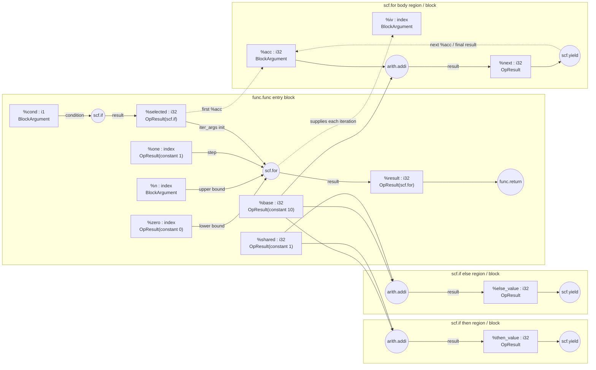

# `ir_ssa_walk.mlir`：SSA use-def 分析

对应输入文件：[`ir_ssa_walk.mlir`](./ir_ssa_walk.mlir)

## 1. 先区分两种 Value

MLIR 中的 `Value` 只有两类来源：

1. **OpResult**：由 operation 产生，例如 `%base = arith.constant ...` 中的 `%base`。
2. **BlockArgument**：由 block 接收，例如函数参数 `%cond`、`%n`，以及循环体参数 `%iv`、`%acc`。

判断方法：看 SSA 名称是否出现在某个 operation 的 `=` 左侧。出现在左侧的是
OpResult；出现在 block/function/region 的参数列表中的是 BlockArgument。

`owner` 的含义也因此不同：

- OpResult 的 owner 是产生它的 operation。
- BlockArgument 的 owner 是它所在的 block；它没有 defining operation。

## 2. 所有 Value 的清单

为了区分两个分支里同名的 operation，下面使用 `then.addi`、`else.addi` 这样的
说明性名字；它们不是源码里的 symbol。

| Value | 类别 | owner | type | 定义位置 | users |
|---|---|---|---|---|---|
| `%cond` | BlockArgument | `func.func` entry block | `i1` | 函数入口 block argument #0 | `scf.if`（condition） |
| `%n` | BlockArgument | `func.func` entry block | `index` | 函数入口 block argument #1 | `scf.for`（upper bound） |
| `%base` | OpResult | `arith.constant 10` | `i32` | `arith.constant` result #0 | `then.addi`、`else.addi`、`loop.addi` |
| `%shared` | OpResult | `arith.constant 1` | `i32` | `arith.constant` result #0 | `then.addi`、`else.addi`，共两个 users |
| `%selected` | OpResult | `scf.if` | `i32` | `scf.if` result #0 | `scf.for`（`iter_args` 初始值） |
| `%then_value` | OpResult | then region 中的 `arith.addi` | `i32` | `arith.addi` result #0 | then region 的 `scf.yield` |
| `%else_value` | OpResult | else region 中的 `arith.addi` | `i32` | `arith.addi` result #0 | else region 的 `scf.yield` |
| `%zero` | OpResult | `arith.constant 0` | `index` | `arith.constant` result #0 | `scf.for`（lower bound） |
| `%one` | OpResult | `arith.constant 1` | `index` | `arith.constant` result #0 | `scf.for`（step） |
| `%result` | OpResult | `scf.for` | `i32` | `scf.for` result #0 | `func.return` |
| `%iv` | BlockArgument | `scf.for` body block | `index` | 循环体 block argument #0 | 无（这个例子没有使用归纳变量） |
| `%acc` | BlockArgument | `scf.for` body block | `i32` | 循环体 block argument #1 | loop body 中的 `arith.addi` |
| `%next` | OpResult | loop body 中的 `arith.addi` | `i32` | `arith.addi` result #0 | loop body 的 `scf.yield` |

注意：`%iv` 即使没有 user，也仍然是合法的 Value。SSA 不要求每个定义都必须被使用。

## 3. SSA use-def 图

实线表示真正的 SSA operand use：箭头从 Value 的定义指向使用它的 operation。
虚线表示 SCF region 的语义映射，它有助于理解循环携带值，但不是额外的
`Value::use`。



### 图中最容易混淆的一点

`%selected` 是 `scf.if` operation 的 OpResult，而不是任意一个 `scf.yield` 的
OpResult。`scf.yield` 本身没有 result；它把 operand 交给拥有 region 的 `scf.if`。

同理，`%result` 的 defining op 是 `scf.for`，不是循环体里的 `scf.yield`；`%acc`
则是循环体的 BlockArgument。三者通过 `scf.for` 的 region 语义联系起来。

## 4. 手工分析步骤

1. 圈出函数签名和 region 入口参数：先登记所有 BlockArgument。
2. 扫描每个带 `=` 的 operation：等号左边的每个 SSA 值都是 OpResult。
3. 给每个 Value 记录类型和 owner。
4. 第二遍扫描所有 operation operands；每出现一次 SSA 名称，就给该 Value
   增加一个 use，并记录使用它的 operation。
5. 最后检查作用域和 dominance：一个 Value 必须在其 user 所在位置可见，并且
   它的定义必须支配该 use。

对 `%shared` 应用第 4 步，可以找到两次 operand use：

```mlir
%then_value = arith.addi %base, %shared : i32
%else_value = arith.addi %base, %shared : i32
```

因此 `%shared` 有两个 uses，也有两个 users。一般情况下要区分这两个概念：同一个
operation 如果把某个 Value 用作两个 operands，会产生两个 uses，但只有一个 user。

## 5. Dominance 检查

`%base` 定义在 `func.func` 的入口 block 中。`scf.if` 的两个 block 和 `scf.for`
的 body block 都嵌套在该定义之后，因此 `%base` 支配三个 `arith.addi` use。

反过来，`%then_value` 只能在 then region 内使用。把它直接用于 else region 或
`scf.if` 之后会违反 region 隔离/作用域规则；必须先通过 `scf.yield` 形成外层的
`%selected`，再在 `scf.if` 后使用。
