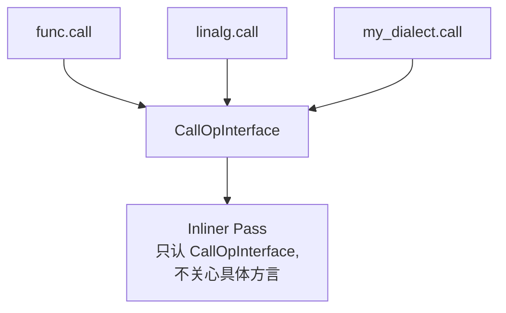
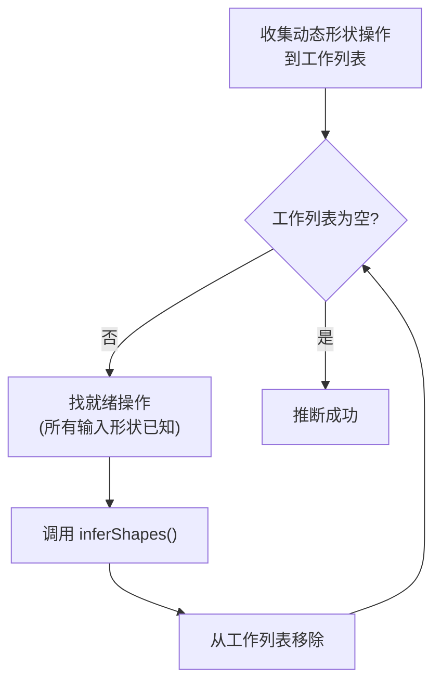
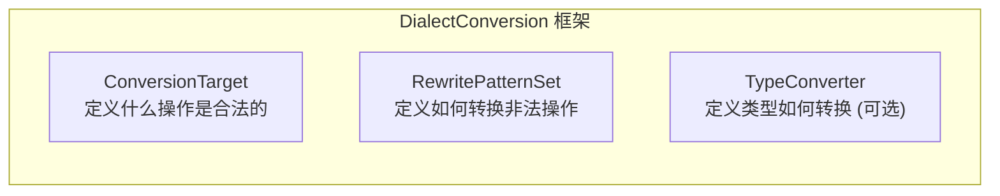
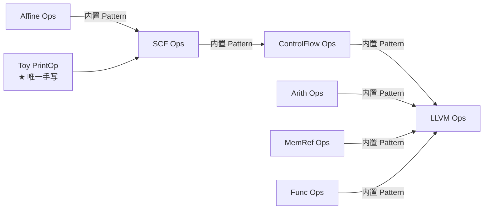
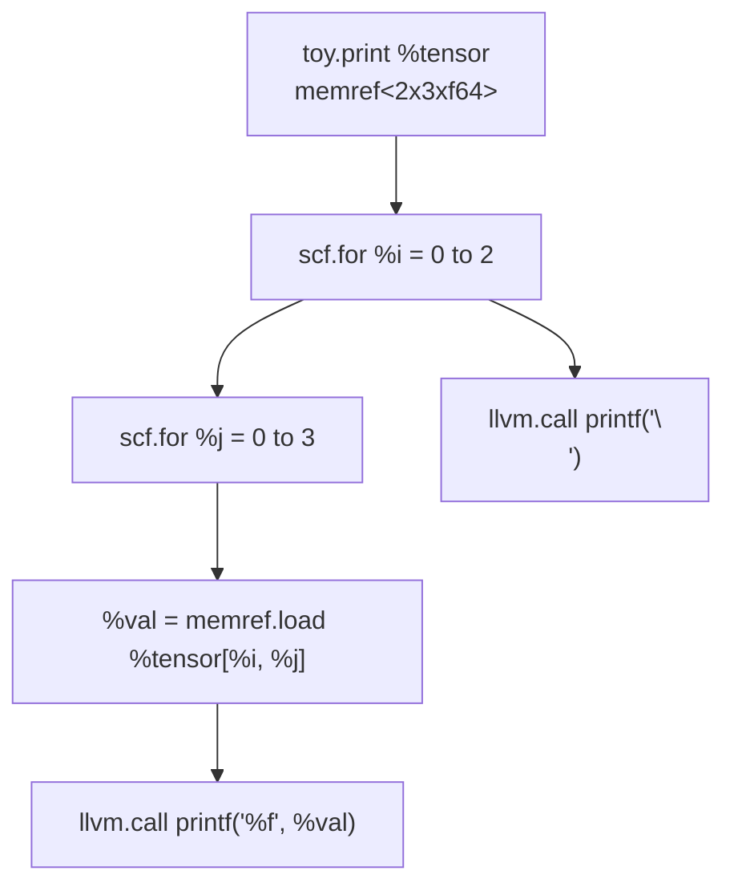
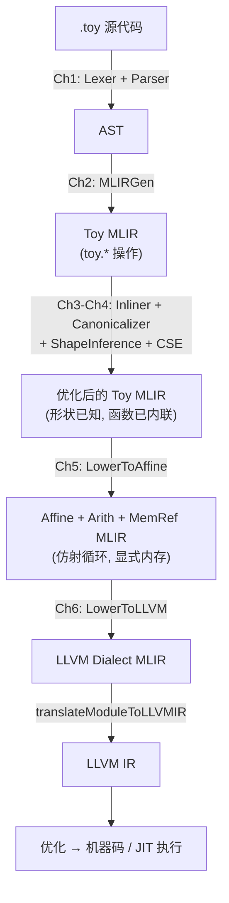

# MLIR Step 4: Toy Tutorial (Ch1-Ch6) - 学习总结

## 概述

Toy Tutorial 是 MLIR 官方的端到端教程，通过构建一个名为 **Toy** 的小型张量语言编译器，完整演示了：


本文档覆盖 **Ch1-Ch6**：
- **Ch1-Ch4**：从语言定义到高层优化和形状推断
- **Ch5**：部分降级到 Affine 方言（DialectConversion 框架）
- **Ch6**：完全降级到 LLVM 方言（传递降级 + JIT 执行）

> Ch7（扩展：结构体类型 + 完整管道）详见 `Step4_Ch7_Code_Structure_Summary.md`

---

## 一、Toy 语言设计

### 1.1 语言特性

Toy 是一个简单的张量语言：

- **唯一类型**：64 位浮点张量（`tensor<*xf64>`），所有值隐式为 double
- **最大维度**：rank ≤ 2
- **值不可变**：每个操作返回新分配的值
- **自动内存管理**：无需手动释放
- **泛型函数**：函数参数是无形状的（unranked），在调用点特化

### 1.2 Toy 语言示例

```toy
# 用户定义的泛型函数
def multiply_transpose(a, b) {
  return transpose(a) * transpose(b);
}

def main() {
  var a = [[1, 2, 3], [4, 5, 6]];   # 形状推断为 <2, 3>
  var b<2, 3> = [1, 2, 3, 4, 5, 6]; # 显式指定形状
  var c = multiply_transpose(a, b);  # 函数调用
  var d = multiply_transpose(b, a);
  print(d);
}
```

### 1.3 内建操作

| 操作 | 说明 |
|------|------|
| `transpose(x)` | 转置张量 |
| `print(x)` | 打印张量 |
| `*` | 逐元素乘法 |
| `+` | 逐元素加法 |

---

## 二、Chapter 1: Toy 语言和 AST

### 2.1 编译器前端

Ch1 实现了 Toy 语言的**词法分析器和递归下降解析器**：


源码文件结构：
```
Ch1/
├── include/toy/
│   ├── Lexer.h       # 词法分析器（单头文件）
│   ├── Parser.h      # 递归下降解析器
│   └── AST.h         # AST 节点定义
├── parser/AST.cpp    # AST 实现
└── toyc.cpp          # 主程序入口
```

### 2.2 AST 结构

```
Module:
  Function
    Proto 'multiply_transpose' @file.toy:4:1
    Params: [a, b]
    Block {
      Return
        BinOp: *
          Call 'transpose' [var: a]
          Call 'transpose' [var: b]
    } // Block
  Function
    Proto 'main' @file.toy:8:1
    Params: []
    Block {
      VarDecl a<>         # 形状自动推断
        Literal: <2, 3>[ [1.0, 2.0, 3.0], [4.0, 5.0, 6.0] ]
      VarDecl b<2, 3>
        Literal: <6>[ 1.0, 2.0, 3.0, 4.0, 5.0, 6.0 ]
      VarDecl c<>
        Call 'multiply_transpose' [var: a, var: b]
    } // Block
```

### 2.3 运行命令

```bash
toyc-ch1 ast.toy -emit=ast    # 输出 AST
```

---

## 三、Chapter 2: 生成 MLIR — 定义 Toy 方言

Ch2 将 AST 翻译成 MLIR，核心是**定义一个新的方言（Dialect）**。

### 3.1 新增文件

```
Ch2/
├── include/toy/
│   ├── Ops.td        # ★ 操作定义（TableGen/ODS）
│   ├── Dialect.h     # 方言 C++ 定义
│   └── MLIRGen.h     # AST → MLIR 转换器
├── mlir/
│   ├── Dialect.cpp   # 方言实现
│   └── MLIRGen.cpp   # AST → MLIR 实现
└── toyc.cpp          # 主程序（增加 -emit=mlir）
```

### 3.2 方言定义（TableGen）

```tablegen
def Toy_Dialect : Dialect {
  let name = "toy";            # 方言命名空间，操作前缀为 "toy."
  let cppNamespace = "::mlir::toy";
}
```

在 C++ 中注册到 MLIRContext：
```c++
context->loadDialect<ToyDialect>();
```

### 3.3 操作定义（ODS 框架）

Toy 方言定义了 **8 个操作**：

| 操作 | ODS 名 | 输入 | 输出 | 说明 |
|------|--------|------|------|------|
| `toy.constant` | ConstantOp | DenseElementsAttr | F64Tensor | 常量张量 |
| `toy.add` | AddOp | 两个 F64Tensor | F64Tensor | 逐元素加法 |
| `toy.mul` | MulOp | 两个 F64Tensor | F64Tensor | 逐元素乘法 |
| `toy.transpose` | TransposeOp | F64Tensor | F64Tensor | 转置 |
| `toy.reshape` | ReshapeOp | F64Tensor | StaticShapeTensor | 重塑形状 |
| `toy.generic_call` | GenericCallOp | SymbolRefAttr + Variadic<F64Tensor> | F64Tensor | 函数调用 |
| `toy.print` | PrintOp | F64Tensor | 无 | 打印 |
| `toy.return` | ReturnOp | Variadic<F64Tensor> | 无 | 返回 |

**以 ConstantOp 为例的完整 ODS 定义**：

```tablegen
def ConstantOp : Toy_Op<"constant", [Pure]> {
  let summary = "constant";
  let description = [{ Constant operation turns a literal into an SSA value... }];

  let arguments = (ins F64ElementsAttr:$value);  // 输入：属性（编译时常量）
  let results = (outs F64Tensor);                // 输出：张量类型

  let hasCustomAssemblyFormat = 1;                // 自定义打印/解析格式
  let hasVerifier = 1;                            // 自定义验证器

  let builders = [
    OpBuilder<(ins "DenseElementsAttr":$value), [{ ... }]>,
    OpBuilder<(ins "double":$value)>              // 标量广播
  ];
}
```

### 3.4 ODS 核心概念

#### 操作的六大组成

```mlir
%t = "toy.transpose"(%tensor) {inplace = true} : (tensor<2x3xf64>) -> tensor<3x2xf64> loc("file":12:1)
 │       │                   │          │              │                        │            │
 结果   操作名             操作数      属性字典        函数类型(输入→输出)       位置信息
```

#### Op vs Operation

| | `Operation` | `Op`（如 `ConstantOp`） |
|---|---|---|
| 性质 | 通用的底层类 | 特定操作的智能指针封装 |
| 信息 | 不透明，无特定操作知识 | 提供类型安全的访问器 |
| 使用 | 通用变换和分析 | 特定操作的处理 |

```c++
// 从通用 Operation 转换到特定 Op
ConstantOp op = llvm::dyn_cast<ConstantOp>(operation);
```

#### 位置信息（Location）

MLIR 中**每个操作必须携带位置信息**（不同于 LLVM 中 debug info 是可选的）：
```c++
// 位置信息不可丢弃，变换时必须传播
builder.create<ConstantOp>(loc("file.toy", line, col), value);
```

#### 自定义汇编格式

ODS 支持两种方式定义打印/解析格式：

**方式一：声明式（推荐）**
```tablegen
def PrintOp : Toy_Op<"print"> {
  let assemblyFormat = "$input attr-dict `:` type($input)";
}
// 打印为：toy.print %val : tensor<2xf64>
```

**方式二：C++ 命令式**
```tablegen
def PrintOp : Toy_Op<"print"> {
  let hasCustomAssemblyFormat = 1;
}
// 在 .cpp 中实现 print() 和 parse() 方法
```

### 3.5 AST → MLIR 转换

`MLIRGen.cpp` 负责将 AST 节点逐个翻译为 MLIR 操作：

```
AST Literal     →  toy.constant + 可选 toy.reshape
AST BinOp(*)    →  toy.mul
AST BinOp(+)    →  toy.add
AST Call('transpose') →  toy.transpose
AST Call(user_func)   →  toy.generic_call
AST VarDecl     →  生成值并记录符号表
AST Print       →  toy.print
AST Return      →  toy.return
AST Function    →  toy.func（带 Region 和 Block）
```

### 3.6 实际运行结果

```bash
toyc-ch2 codegen.toy -emit=mlir
```

```mlir
module {
  toy.func @multiply_transpose(%arg0: tensor<*xf64>, %arg1: tensor<*xf64>) -> tensor<*xf64> {
    %0 = toy.transpose(%arg0 : tensor<*xf64>) to tensor<*xf64>
    %1 = toy.transpose(%arg1 : tensor<*xf64>) to tensor<*xf64>
    %2 = toy.mul %0, %1 : tensor<*xf64>
    toy.return %2 : tensor<*xf64>
  }
  toy.func @main() {
    %0 = toy.constant dense<[[1.0, 2.0, 3.0], [4.0, 5.0, 6.0]]> : tensor<2x3xf64>
    %1 = toy.reshape(%0 : tensor<2x3xf64>) to tensor<2x3xf64>
    %2 = toy.constant dense<[1.0, 2.0, 3.0, 4.0, 5.0, 6.0]> : tensor<6xf64>
    %3 = toy.reshape(%2 : tensor<6xf64>) to tensor<2x3xf64>
    %4 = toy.generic_call @multiply_transpose(%1, %3) : (...) -> tensor<*xf64>
    %5 = toy.generic_call @multiply_transpose(%3, %1) : (...) -> tensor<*xf64>
    toy.print %5 : tensor<*xf64>
    toy.return
  }
}
```

注意：所有张量类型是 `tensor<*xf64>`（无形状），需要后续推断。

---

## 四、Chapter 3: 高层语言特定优化

Ch3 展示了如何利用 Toy 方言的高级语义进行**模式匹配和重写**。

### 3.1 新增文件

```
Ch3/
├── mlir/
│   ├── ToyCombine.cpp   # ★ C++ 重写模式
│   └── ToyCombine.td    # ★ DRR 声明式重写规则
└── toyc.cpp             # 增加 PassManager 和 -opt 选项
```

### 3.2 优化 1：消除冗余转置（C++ 方式）

**模式**：`transpose(transpose(x)) → x`

这个优化在 LLVM IR 层几乎不可能实现（涉及临时数组的循环），但在 Toy IR 层很自然。

```c++
struct SimplifyRedundantTranspose : public mlir::OpRewritePattern<TransposeOp> {
  SimplifyRedundantTranspose(mlir::MLIRContext *context)
      : OpRewritePattern<TransposeOp>(context, /*benefit=*/1) {}

  llvm::LogicalResult matchAndRewrite(TransposeOp op,
                      mlir::PatternRewriter &rewriter) const override {
    // 查找输入是否是另一个 transpose
    Value transposeInput = op.getOperand();
    TransposeOp transposeInputOp = transposeInput.getDefiningOp<TransposeOp>();

    if (!transposeInputOp)
      return failure();  // 不匹配

    // 匹配成功：用内层 transpose 的输入替换外层
    rewriter.replaceOp(op, {transposeInputOp.getOperand()});
    return success();
  }
};
```

**注册到 Canonicalizer**：
```c++
void TransposeOp::getCanonicalizationPatterns(
    RewritePatternSet &results, MLIRContext *context) {
  results.add<SimplifyRedundantTranspose>(context);
}
```

**关键点 — `Pure` trait**：

默认情况下 MLIR 假设操作可能有副作用，不会自动删除死代码。添加 `Pure` trait 后，Canonicalizer 会自动清理无用操作：

```tablegen
def TransposeOp : Toy_Op<"transpose", [Pure]> { ... }
```

**实际效果**：

```mlir
// 输入：
toy.func @transpose_transpose(%arg0: tensor<*xf64>) -> tensor<*xf64> {
  %0 = toy.transpose(%arg0 : tensor<*xf64>) to tensor<*xf64>
  %1 = toy.transpose(%0 : tensor<*xf64>) to tensor<*xf64>
  toy.return %1 : tensor<*xf64>
}

// 优化后（-opt）：
toy.func @transpose_transpose(%arg0: tensor<*xf64>) -> tensor<*xf64> {
  toy.return %arg0 : tensor<*xf64>   // 两个 transpose 全部消除！
}
```

### 3.3 优化 2：消除冗余 Reshape（DRR 方式）

**DRR（Declarative Rewrite Rules）** 是声明式的模式匹配和重写，比 C++ 更简洁：

**模式 1：Reshape(Reshape(x)) → Reshape(x)**

```tablegen
def ReshapeReshapeOptPattern : Pat<(ReshapeOp(ReshapeOp $arg)),
                                   (ReshapeOp $arg)>;
```

**模式 2：形状相同的 Reshape → 直接消除**

```tablegen
def TypesAreIdentical : Constraint<CPred<"$0.getType() == $1.getType()">>;
def RedundantReshapeOptPattern : Pat<
  (ReshapeOp:$res $arg), (replaceWithValue $arg),
  [(TypesAreIdentical $res, $arg)]>;
```

**模式 3：常量 Reshape → 原地修改常量属性**

```tablegen
def ReshapeConstant : NativeCodeCall<"$0.reshape(($1.getType()).cast<ShapedType>())">;
def FoldConstantReshapeOptPattern : Pat<
  (ReshapeOp:$res (ConstantOp $arg)),
  (ConstantOp (ReshapeConstant $arg, $res))>;
```

**实际效果**：

```mlir
// 输入：
toy.func @main() {
  %0 = toy.constant dense<[1.0, 2.0]> : tensor<2xf64>
  %1 = toy.reshape(%0 : tensor<2xf64>) to tensor<2x1xf64>
  %2 = toy.reshape(%1 : tensor<2x1xf64>) to tensor<2x1xf64>  // 冗余
  %3 = toy.reshape(%2 : tensor<2x1xf64>) to tensor<2x1xf64>  // 冗余
  toy.print %3 : tensor<2x1xf64>
}

// 优化后：
toy.func @main() {
  %0 = toy.constant dense<[[1.0], [2.0]]> : tensor<2x1xf64>  // 直接折叠
  toy.print %0 : tensor<2x1xf64>
}
```

### 3.4 两种重写方式对比

| | C++ RewritePattern | DRR (TableGen) |
|---|---|---|
| **适用场景** | 复杂的模式匹配和重写逻辑 | 简单的 DAG 到 DAG 替换 |
| **优点** | 完全灵活，可实现任意逻辑 | 简洁，声明式，自动生成代码 |
| **缺点** | 代码量大，容易出错 | 无法处理复杂逻辑 |
| **示例** | SimplifyRedundantTranspose | ReshapeReshapeOptPattern |

### 3.5 Pass Manager 的使用

```c++
// 在 toyc.cpp 中构建优化 pipeline
mlir::PassManager pm(module->getName());
pm.addNestedPass<mlir::toy::FuncOp>(mlir::createCanonicalizerPass());
```

命令行使用：
```bash
toyc-ch3 input.toy -emit=mlir        # 无优化
toyc-ch3 input.toy -emit=mlir -opt   # 带优化
```

---

## 五、Chapter 4: 接口（Interfaces）与形状推断

Ch4 引入了 MLIR 的**接口机制**，实现通用的内联和形状推断。

### 5.1 新增文件

```
Ch4/
├── include/toy/
│   ├── Passes.h                      # Pass 声明
│   ├── ShapeInferenceInterface.h     # ★ 自定义接口 C++ 头文件
│   └── ShapeInferenceInterface.td    # ★ 自定义接口 ODS 定义
├── mlir/
│   ├── Dialect.cpp                   # 增加内联接口
│   ├── ShapeInferencePass.cpp        # ★ 形状推断 Pass
│   ├── ToyCombine.cpp                # 增加模式
│   └── ToyCombine.td
└── toyc.cpp                          # 增加 inline + shape inference pass
```

### 5.2 接口（Interface）概念

接口是 MLIR 实现**可扩展性**的关键机制：

| 问题 | 解决方案 |
|------|---------|
| 每个方言都要实现自己的内联？ | `DialectInlinerInterface` — 通用内联算法 |
| 每个操作都要自己报告形状？ | `ShapeInferenceOpInterface` — 通用形状推断 |
| 避免为每个方言重复写变换？ | 接口让变换代码**与方言解耦** |

接口分两类：
- **方言接口（Dialect Interface）**：方言级别的行为（如"是否允许内联"）
- **操作接口（Operation Interface）**：单个操作的行为（如"推断输出形状"）

#### 核心设计原理：面向接口编程

**接口的本质作用是让 Pass 与具体操作解耦**。Pass 不直接依赖具体操作，而是面向接口编程：



这意味着：**自定义方言只要实现了对应接口，就能自动受益于 MLIR 已有的 Pass 优化**。

```tablegen
// 你的方言操作只需声明实现接口
def MyCallOp : Op<MyDialect, "call", [CallOpInterface]> {
  // 实现接口要求的方法
}
```

之后 `--inline`、`--canonicalize` 等现有 Pass 就能直接作用于你的操作，**不需要修改任何 Pass 代码**。

#### 开放-封闭原则

接口是 MLIR 实现**开放-封闭原则**的关键设计：
- **对扩展开放**：新操作只需实现接口即可接入已有 Pass
- **对修改封闭**：Pass 本身不需要为新操作做任何改动

### 5.3 实现内联（Inlining）

#### 步骤 1：定义方言内联接口

```c++
struct ToyInlinerInterface : public DialectInlinerInterface {
  // 是否允许内联？Toy 方言全部允许
  bool isLegalToInline(Operation *call, Operation *callable,
                       bool wouldBeCloned) const final { return true; }
  bool isLegalToInline(Operation *, Region *, bool,
                       IRMapping &) const final { return true; }
  bool isLegalToInline(Region *dest, Region *src, bool,
                       IRMapping &) const final { return true; }

  // 处理 return 操作：用返回值替换调用点的结果
  void handleTerminator(Operation *op, ValueRange valuesToRepl) const final {
    auto returnOp = cast<ReturnOp>(op);
    for (const auto &it : llvm::enumerate(returnOp.getOperands()))
      valuesToRepl[it.index()].replaceAllUsesWith(it.value());
  }

  // 类型不匹配时插入 cast 操作
  Operation *materializeCallConversion(OpBuilder &builder, Value input,
                                       Type resultType, Location loc) const final {
    return CastOp::create(builder, loc, resultType, input);
  }
};
```

注册到方言：
```c++
void ToyDialect::initialize() {
  addInterfaces<ToyInlinerInterface>();
}
```

#### 步骤 2：标记调用和被调用操作

在 ODS 中添加接口：

```tablegen
def FuncOp : Toy_Op<"func", [FunctionOpInterface, IsolatedFromAbove]> { ... }

def GenericCallOp : Toy_Op<"generic_call",
    [DeclareOpInterfaceMethods<CallOpInterface>]> { ... }
```

#### 步骤 3：添加类型转换操作

内联时实参类型（如 `tensor<2x3xf64>`）和形参类型（如 `tensor<*xf64>`）可能不匹配，需要 `toy.cast`：

```tablegen
def CastOp : Toy_Op<"cast", [
    DeclareOpInterfaceMethods<CastOpInterface>,
    Pure,
    SameOperandsAndResultShape]
  > {
  let arguments = (ins F64Tensor:$input);
  let results = (outs F64Tensor:$output);
  let assemblyFormat = "$input attr-dict `:` type($input) `to` type($output)";
}
```

#### 步骤 4：添加到 PassManager

```c++
pm.addPass(mlir::createInlinerPass());
```

### 5.4 实现形状推断

#### 步骤 1：定义操作接口（ODS）

```tablegen
def ShapeInferenceOpInterface : OpInterface<"ShapeInference"> {
  let description = [{
    Interface to access a registered method to infer the return types.
  }];
  let methods = [
    InterfaceMethod<"Infer and set the output shape.",
                    "void", "inferShapes">
  ];
}
```

#### 步骤 2：在操作上声明接口

```tablegen
def MulOp : Toy_Op<"mul",
    [..., DeclareOpInterfaceMethods<ShapeInferenceOpInterface>]> { ... }
```

#### 步骤 3：实现 inferShapes

```c++
// MulOp 的形状 = 输入形状
void MulOp::inferShapes() { getResult().setType(getLhs().getType()); }

// TransposeOp 的形状 = 输入形状的转置
void TransposeOp::inferShapes() {
  auto arrayTy = cast<RankedTensorType>(getOperand().getType());
  SmallVector<int64_t, 2> dims(llvm::reverse(arrayTy.getShape()));
  getResult().setType(RankedTensorType::get(dims, arrayTy.getElementType()));
}
```

#### 步骤 4：实现 ShapeInferencePass

形状推断算法使用**工作列表（worklist）**：



```c++
class ShapeInferencePass
    : public mlir::PassWrapper<ShapeInferencePass, OperationPass<FuncOp>> {
  void runOnOperation() override {
    FuncOp function = getOperation();
    // 建工作列表，迭代推断...
    if (ShapeInference shapeOp = dyn_cast<ShapeInference>(op)) {
      shapeOp.inferShapes();
    }
  }
};
```

### 5.5 完整优化 Pipeline

```c++
// toyc.cpp 中的完整优化管线
mlir::PassManager pm(module->getName());

// 1. 内联所有函数调用
pm.addPass(mlir::createInlinerPass());

// 2. 在函数级别做优化
pm.addNestedPass<mlir::toy::FuncOp>(mlir::createCanonicalizerPass());

// 3. 形状推断
pm.addNestedPass<mlir::toy::FuncOp>(mlir::toy::createShapeInferencePass());
```

### 5.6 完整优化效果

**输入代码**：
```toy
def multiply_transpose(a, b) {
  return transpose(a) * transpose(b);
}
def main() {
  var a<2, 3> = [[1, 2, 3], [4, 5, 6]];
  var b<2, 3> = [1, 2, 3, 4, 5, 6];
  var c = multiply_transpose(a, b);
  var d = multiply_transpose(b, a);
  print(d);
}
```

**无优化（Ch2 输出）**：
```mlir
module {
  toy.func @multiply_transpose(%arg0: tensor<*xf64>, %arg1: tensor<*xf64>) -> tensor<*xf64> {
    %0 = toy.transpose(%arg0 : tensor<*xf64>) to tensor<*xf64>
    %1 = toy.transpose(%arg1 : tensor<*xf64>) to tensor<*xf64>
    %2 = toy.mul %0, %1 : tensor<*xf64>
    toy.return %2 : tensor<*xf64>
  }
  toy.func @main() {
    %0 = toy.constant dense<[[...]]> : tensor<2x3xf64>
    %1 = toy.reshape(%0 ...) to tensor<2x3xf64>
    %2 = toy.constant dense<[...]> : tensor<6xf64>
    %3 = toy.reshape(%2 ...) to tensor<2x3xf64>
    %4 = toy.generic_call @multiply_transpose(%1, %3) : ... -> tensor<*xf64>
    %5 = toy.generic_call @multiply_transpose(%3, %1) : ... -> tensor<*xf64>
    toy.print %5 : tensor<*xf64>
    toy.return
  }
}
```

**带优化（Ch4 输出）**：
```mlir
module {
  toy.func @main() {
    %0 = toy.constant dense<[[1.0, 2.0, 3.0], [4.0, 5.0, 6.0]]> : tensor<2x3xf64>
    %1 = toy.transpose(%0 : tensor<2x3xf64>) to tensor<3x2xf64>
    %2 = toy.mul %1, %1 : tensor<3x2xf64>
    toy.print %2 : tensor<3x2xf64>
    toy.return
  }
}
```

**优化做了什么**：
1. **内联**：`multiply_transpose` 的两次调用被展开到 main 中
2. **规范化**：冗余 reshape 被消除，常量 reshape 被折叠
3. **CSE**：两次相同的 transpose(a) 被合并为一次
4. **形状推断**：`tensor<*xf64>` → `tensor<3x2xf64>`，所有形状已知
5. **死代码消除**：被内联后无用的 `multiply_transpose` 函数定义被删除

---

## 六、Chapter 5: 部分降级到 Affine 方言

Ch5 引入了 **DialectConversion 框架**，将 Toy 方言的计算操作降级到 Affine + Arith + MemRef，利用仿射循环实现张量计算。

### 6.1 新增文件

```
Ch5/
├── mlir/
│   └── LowerToAffineLoops.cpp    # ★ Toy → Affine 降级 Pass
├── include/toy/
│   └── Passes.h                  # 新增 createLowerToAffinePass()
└── toyc.cpp                      # 增加 -emit=mlir-affine 选项
```

### 6.2 DialectConversion 框架

这是 MLIR 中**方言间转换**的核心框架，由三个组件构成：



**与 Ch3 的 Pattern Rewriting 的区别**：

| | Ch3: Pattern Rewriting | Ch5: DialectConversion |
|---|---|---|
| 目的 | 同一方言内的等价变换 | 跨方言的降级转换 |
| 类型处理 | 类型不变 | 需要类型转换（tensor → memref） |
| 合法性 | 不关心合法性 | 严格定义合法/非法操作 |
| 框架 | `OpRewritePattern` | `OpConversionPattern` |

### 6.3 定义转换目标（ConversionTarget）

```c++
void ToyToAffineLoweringPass::runOnOperation() {
  // 1. 定义转换目标：哪些方言/操作是合法的
  ConversionTarget target(getContext());

  // 合法方言：Affine、Arith、Func、MemRef
  target.addLegalDialect<affine::AffineDialect, arith::ArithDialect,
                         func::FuncDialect, memref::MemRefDialect>();

  // 非法方言：Toy 方言的所有操作必须被转换
  target.addIllegalDialect<ToyDialect>();

  // 动态合法操作：PrintOp 只有在操作数已经是 memref 时才合法
  target.addDynamicallyLegalOp<toy::PrintOp>([](toy::PrintOp op) {
    return llvm::none_of(op->getOperandTypes(), llvm::IsaPred<TensorType>);
  });
}
```

**关键概念：合法 vs 非法**
- **Legal**：操作在目标方言中存在，不需要转换
- **Illegal**：操作必须被转换为合法操作
- **Dynamically Legal**：根据运行时条件判断是否合法（如操作数类型）

### 6.4 定义转换模式（OpConversionPattern）

#### 通用模板：二元运算降级

```c++
// 模板化：Toy 的二元 Op → Affine 循环 + Arith 运算
template <typename BinaryOp, typename LoweredBinaryOp>
struct BinaryOpLowering : public OpConversionPattern<BinaryOp> {
  LogicalResult matchAndRewrite(BinaryOp op, OpAdaptor adaptor,
                                ConversionPatternRewriter &rewriter) const final {
    auto loc = op->getLoc();

    // 将操作降级为嵌套仿射循环
    lowerOpToLoops(op, rewriter, [&](OpBuilder &builder, ValueRange loopIvs) {
      // 在循环体中：加载两个操作数 → 执行运算 → 返回结果
      auto lhs = affine::AffineLoadOp::create(builder, loc,
                                               adaptor.getLhs(), loopIvs);
      auto rhs = affine::AffineLoadOp::create(builder, loc,
                                               adaptor.getRhs(), loopIvs);
      return LoweredBinaryOp::create(builder, loc, lhs, rhs);
    });
    return success();
  }
};

// 具体实例化
using AddOpLowering = BinaryOpLowering<toy::AddOp, arith::AddFOp>;
using MulOpLowering = BinaryOpLowering<toy::MulOp, arith::MulFOp>;
```

#### 各操作的降级映射

```
toy.constant dense<[[1,2],[3,4]]>
  → memref.alloc() : memref<2x2xf64>
  + affine.store 逐元素写入

toy.add %a, %b : tensor<2x3xf64>
  → memref.alloc() : memref<2x3xf64>        // 分配结果缓冲区
  + affine.for i = 0 to 2 {                  // 外层循环
      affine.for j = 0 to 3 {                // 内层循环
        %lhs = affine.load %a[i, j]
        %rhs = affine.load %b[i, j]
        %sum = arith.addf %lhs, %rhs
        affine.store %sum, %result[i, j]
      }
    }

toy.transpose %x
  → memref.alloc() : memref<NxMxf64>
  + affine.for i = 0 to N {
      affine.for j = 0 to M {
        %val = affine.load %x[j, i]          // 反转索引
        affine.store %val, %result[i, j]
      }
    }

toy.func        → func.func（只保留 main）
toy.return      → func.return
toy.print       → 保留（但操作数从 tensor 变为 memref）
```

#### Tensor → MemRef 类型转换

降级的核心是 **tensor（值语义）→ memref（引用语义）**：

| | Tensor | MemRef |
|---|---|---|
| 语义 | 值类型，不可变 | 内存引用，可变 |
| 内存管理 | 抽象的，无分配/释放 | 显式 alloc/dealloc |
| 访问方式 | 抽象的元素访问 | affine.load / affine.store |
| 适用场景 | 高层 IR（Toy、Linalg） | 低层 IR（Affine、缓冲化后） |

### 6.5 执行部分转换

```c++
// 2. 注册转换模式
RewritePatternSet patterns(&getContext());
patterns.add<AddOpLowering, ConstantOpLowering, FuncOpLowering,
             MulOpLowering, PrintOpLowering, ReturnOpLowering,
             TransposeOpLowering>(&getContext());

// 3. 执行部分转换（允许某些操作保留）
if (failed(applyPartialConversion(getOperation(), target,
                                   std::move(patterns))))
  signalPassFailure();
```

**`applyPartialConversion` vs `applyFullConversion`**：

| | Partial | Full |
|---|---|---|
| 要求 | 非法操作必须被转换，其他可以保留 | **所有**操作都必须合法 |
| 适用 | 分阶段降级 | 最终降级到目标方言 |

### 6.6 优化 Pipeline（Ch5 更新）

```c++
// toyc.cpp 中的 Pipeline 扩展
mlir::PassManager pm(module->getName());

// 阶段 1: 高层优化（同 Ch4）
pm.addPass(mlir::createInlinerPass());
auto &optPM = pm.nest<mlir::toy::FuncOp>();
optPM.addPass(mlir::createCanonicalizerPass());
optPM.addPass(mlir::toy::createShapeInferencePass());
optPM.addPass(mlir::createCanonicalizerPass());
optPM.addPass(mlir::createCSEPass());

// ★ 阶段 2: 降级到 Affine
pm.addPass(mlir::toy::createLowerToAffinePass());
auto &affinePM = pm.nest<func::FuncOp>();

// ★ 降级后的仿射优化
affinePM.addPass(mlir::createCanonicalizerPass());
affinePM.addPass(mlir::createCSEPass());
affinePM.addPass(mlir::createLoopFusionPass());              // 循环融合
affinePM.addPass(mlir::createAffineScalarReplacementPass()); // 标量替换
```

### 6.7 实际降级效果

**输入（Ch4 优化后）**：
```mlir
toy.func @main() {
  %0 = toy.constant dense<[[1.0, 2.0, 3.0], [4.0, 5.0, 6.0]]> : tensor<2x3xf64>
  %1 = toy.transpose(%0 : tensor<2x3xf64>) to tensor<3x2xf64>
  %2 = toy.mul %1, %1 : tensor<3x2xf64>
  toy.print %2 : tensor<3x2xf64>
  toy.return
}
```

**降级到 Affine 后**：
```mlir
func.func @main() {
  %cst = arith.constant 1.000000e+00 : f64
  // ... 更多常量 ...

  // 分配内存缓冲区
  %0 = memref.alloc() : memref<3x2xf64>
  %1 = memref.alloc() : memref<2x3xf64>

  // 初始化输入数据
  affine.store %cst, %1[0, 0] : memref<2x3xf64>
  // ... 逐元素存储 ...

  // 转置：affine.for 嵌套循环，反转索引
  affine.for %arg0 = 0 to 3 {
    affine.for %arg1 = 0 to 2 {
      %2 = affine.load %1[%arg1, %arg0] : memref<2x3xf64>
      affine.store %2, %0[%arg0, %arg1] : memref<3x2xf64>
    }
  }

  // 乘法：affine.for 嵌套循环，逐元素 arith.mulf
  affine.for %arg0 = 0 to 3 {
    affine.for %arg1 = 0 to 2 {
      %2 = affine.load %0[%arg0, %arg1] : memref<3x2xf64>
      %3 = arith.mulf %2, %2 : f64
      affine.store %3, %0[%arg0, %arg1] : memref<3x2xf64>
    }
  }

  toy.print %0 : memref<3x2xf64>    // 注意：操作数变为 memref
  // ... dealloc ...
  return
}
```

### 6.8 命令行使用

```bash
toyc-ch5 input.toy -emit=mlir          # 高层优化后（同 Ch4）
toyc-ch5 input.toy -emit=mlir-affine   # 降级到 Affine 后
toyc-ch5 input.toy -emit=mlir-affine -opt  # 带仿射优化
```

---

## 七、Chapter 6: 完全降级到 LLVM 和代码生成

Ch6 实现了从 MLIR 到 LLVM IR 的**完全降级**，并支持 JIT 执行。

### 7.1 新增文件

```
Ch6/
├── mlir/
│   └── LowerToLLVM.cpp     # ★ 完全降级到 LLVM Dialect
└── toyc.cpp                 # 增加 -emit=llvm 和 -emit=jit 选项
```

### 7.2 核心概念：传递降级（Transitive Lowering）

Ch6 的关键思想是**不需要手写所有转换**。MLIR 已有大量内置转换 Pattern，可以链式组合：



**只需手写 `toy.print` 的降级**，其余全部复用已有 Pattern。

### 7.3 LLVM 降级实现

```c++
void ToyToLLVMLoweringPass::runOnOperation() {
  // 1. 定义转换目标：只有 LLVM 方言合法
  LLVMConversionTarget target(getContext());
  target.addLegalOp<ModuleOp>();

  // 2. 类型转换器：MLIR 类型 → LLVM 类型
  LLVMTypeConverter typeConverter(&getContext());

  // 3. 注册所有转换 Pattern（大部分是复用已有实现）
  RewritePatternSet patterns(&getContext());

  // ★ 传递降级链：复用 MLIR 内置 Pattern
  populateAffineToStdConversionPatterns(patterns);           // Affine → SCF
  populateSCFToControlFlowConversionPatterns(patterns);       // SCF → CF
  cf::populateControlFlowToLLVMConversionPatterns(typeConverter, patterns);  // CF → LLVM
  arith::populateArithToLLVMConversionPatterns(typeConverter, patterns);     // Arith → LLVM
  populateFinalizeMemRefToLLVMConversionPatterns(typeConverter, patterns);   // MemRef → LLVM
  populateFuncToLLVMConversionPatterns(typeConverter, patterns);             // Func → LLVM

  // ★ 唯一手写的 Pattern：toy.print → printf
  patterns.add<PrintOpLowering>(&getContext());

  // 4. 执行完全转换（所有操作必须合法）
  if (failed(applyFullConversion(module, target, std::move(patterns))))
    signalPassFailure();
}
```

### 7.4 PrintOp 降级详解

`toy.print` 是唯一需要手写降级的操作，转换为嵌套 SCF 循环 + `printf` 调用：

```c++
struct PrintOpLowering : public OpConversionPattern<toy::PrintOp> {
  LogicalResult matchAndRewrite(toy::PrintOp op, OpAdaptor adaptor,
                                ConversionPatternRewriter &rewriter) const final {
    auto loc = op->getLoc();
    auto memRefType = cast<MemRefType>(adaptor.getInput().getType());
    auto memRefShape = memRefType.getShape();

    // 1. 获取或插入 printf 函数声明
    auto printfRef = getOrInsertPrintf(rewriter, parentModule);

    // 2. 为每个维度创建嵌套 SCF 循环
    SmallVector<Value, 4> loopIvs;
    for (unsigned i = 0; i != memRefShape.size(); ++i) {
      auto lowerBound = arith::ConstantIndexOp::create(rewriter, loc, 0);
      auto upperBound = arith::ConstantIndexOp::create(rewriter, loc, memRefShape[i]);
      auto step = arith::ConstantIndexOp::create(rewriter, loc, 1);
      auto loop = scf::ForOp::create(rewriter, loc, lowerBound,
                                      upperBound, step);
      loopIvs.push_back(loop.getInductionVar());
      rewriter.setInsertionPointToStart(loop.getBody());
    }

    // 3. 在最内层循环体中：加载元素 → 调用 printf
    auto elementLoad = memref::LoadOp::create(rewriter, loc,
                                               adaptor.getInput(), loopIvs);
    LLVM::CallOp::create(rewriter, loc, getPrintfType(context), printfRef,
                         ArrayRef<Value>({formatSpecifier, elementLoad}));

    // 4. 每行末尾打印换行
    // ...

    rewriter.eraseOp(op);
    return success();
  }
};
```

**降级结果示意**：



### 7.5 JIT 执行

Ch6 新增了 JIT 编译和执行功能：

```c++
int runJit(mlir::ModuleOp module) {
  // 创建 MLIR 执行引擎
  auto maybeEngine = mlir::ExecutionEngine::create(module, engineOptions);
  auto &engine = maybeEngine.get();

  // 调用 JIT 编译后的 main 函数
  auto invocationResult = engine->invokePacked("main");
  if (invocationResult) {
    llvm::errs() << "JIT invocation failed\n";
    return -1;
  }
  return 0;
}
```

### 7.6 完整降级 Pipeline

```c++
// toyc.cpp 中完整的降级 Pipeline
mlir::PassManager pm(module->getName());

// 阶段 1: 高层优化（同 Ch4-Ch5）
pm.addPass(mlir::createInlinerPass());
auto &optPM = pm.nest<mlir::toy::FuncOp>();
optPM.addPass(mlir::createCanonicalizerPass());
optPM.addPass(mlir::toy::createShapeInferencePass());
optPM.addPass(mlir::createCanonicalizerPass());
optPM.addPass(mlir::createCSEPass());

// 阶段 2: 降级到 Affine
pm.addPass(mlir::toy::createLowerToAffinePass());
auto &affinePM = pm.nest<func::FuncOp>();
affinePM.addPass(mlir::createCanonicalizerPass());
affinePM.addPass(mlir::createCSEPass());

// ★ 阶段 3: 完全降级到 LLVM
pm.addPass(mlir::toy::createLowerToLLVMPass());

pm.run(*module);

// 根据选项输出
if (emitAction == Action::DumpLLVMIR) dumpLLVMIR(*module);
if (emitAction == Action::RunJIT) runJit(*module);
```

### 7.7 命令行使用

```bash
toyc-ch6 input.toy -emit=mlir          # 高层优化后
toyc-ch6 input.toy -emit=mlir-affine   # Affine 降级后
toyc-ch6 input.toy -emit=mlir-llvm     # LLVM Dialect（MLIR 形式）
toyc-ch6 input.toy -emit=llvm          # 输出 LLVM IR
toyc-ch6 input.toy -emit=jit           # JIT 编译执行
```

### 7.8 最终输出的 LLVM IR 示例

```llvm
define void @main() {
  %0 = tail call i32 (i8*, ...) @printf(
    i8* getelementptr ([4 x i8], [4 x i8]* @frmt_spec, i64 0, i64 0),
    double 1.000000e+00)
  %1 = tail call i32 (i8*, ...) @printf(
    i8* getelementptr ([4 x i8], [4 x i8]* @frmt_spec, i64 0, i64 0),
    double 4.000000e+00)
  ; ... 更多 printf 调用 ...
  ret void
}

declare i32 @printf(i8*, ...)
@frmt_spec = private unnamed_addr constant [4 x i8] c"%f \0A\00"
```

---

## 八、编译器架构总结

### 8.1 整体流程（Ch1-Ch6 完整链路）



### 8.2 各 Chapter 的核心知识点

| Chapter | 核心知识 | 关键文件 |
|---------|---------|---------|
| **Ch1** | 前端：词法分析 + 递归下降解析 → AST | `Lexer.h`, `Parser.h`, `AST.h` |
| **Ch2** | 方言定义：ODS/TableGen 操作定义 + AST→MLIR | `Ops.td`, `MLIRGen.cpp`, `Dialect.cpp` |
| **Ch3** | 模式匹配重写：C++ RewritePattern + DRR | `ToyCombine.cpp`, `ToyCombine.td` |
| **Ch4** | 接口机制：方言接口 + 操作接口 + 形状推断 | `ShapeInferenceInterface.td`, `ShapeInferencePass.cpp` |
| **Ch5** | DialectConversion：部分降级到 Affine | `LowerToAffineLoops.cpp` |
| **Ch6** | 传递降级：完全降级到 LLVM + JIT 执行 | `LowerToLLVM.cpp` |

### 8.3 关键设计模式

#### ODS 操作定义模式
```
1. 定义方言（Dialect）
2. 定义基类（Toy_Op）
3. 定义每个操作（arguments/results/traits/builders/verifier）
4. 自定义汇编格式（assemblyFormat 或 C++）
5. 用 mlir-tblgen 生成 C++ 代码
```

#### 模式匹配重写模式
```
1. 继承 OpRewritePattern<OpType>
2. 实现 matchAndRewrite()
3. 注册到 getCanonicalizationPatterns()
4. 或用 DRR 声明式定义
```

#### 接口使用模式
```
1. 定义接口（OpInterface / DialectInterface）
2. 在操作上声明接口（DeclareOpInterfaceMethods）
3. 实现 interface 方法
4. 在 Pass 中通过 dyn_cast<InterfaceType>(op) 查询
```

#### DialectConversion 降级模式
```
1. 定义 ConversionTarget（合法/非法操作）
2. 定义 OpConversionPattern（每个操作的转换规则）
3. 可选：定义 TypeConverter（类型映射）
4. 调用 applyPartialConversion 或 applyFullConversion
5. 传递降级：复用 populateXxxPatterns() 已有 Pattern
```

---

## 九、关键要点

### 9.1 为什么在 MLIR 层做优化而不是 LLVM 层？

| 优化 | MLIR 层 | LLVM 层 |
|------|---------|---------|
| `transpose(transpose(x)) → x` | 一条模式匹配规则 | 几乎不可能（涉及嵌套循环和临时数组） |
| `reshape(reshape(x)) → reshape(x)` | DAG 模式匹配 | 无法识别高级语义 |
| 形状推断 | 直接操作 tensor 类型 | LLVM 没有 tensor 概念 |

**核心思想：在保留高层语义信息的阶段做优化**。

### 9.2 接口（Interface）的价值

- **避免代码重复**：一个通用的内联算法服务所有方言
- **解耦**：变换代码不依赖具体方言，通过接口交互
- **可扩展**：新方言只需实现接口就能获得已有变换的支持
- **连接操作与 Pass 优化的桥梁**：接口是操作接入 Pass 优化的统一入口。Pass（如 Inliner、Canonicalizer、形状推断）面向接口编程，任何实现了对应接口的操作都能自动被纳入优化流程，无需修改 Pass 代码

**常见接口与对应 Pass 的映射**：

| 接口 | 接入的 Pass / 分析 | 作用 |
|------|-------------------|------|
| `CallOpInterface` | Inliner Pass | 让操作参与函数内联 |
| `DialectInlinerInterface` | Inliner Pass | 让方言控制内联策略 |
| `ShapeInferenceOpInterface` | ShapeInference Pass | 让操作参与形状推断 |
| `SideEffectInterface` | CSE、死代码消除、内存分析 | 描述操作的内存副作用 |
| `InferTypeOpInterface` | 类型推断相关 Pass | 让操作推断自身输出类型 |
| `Fold` / `hasFolder` | Canonicalizer Pass | 让操作支持常量折叠 |

### 9.3 DialectConversion 框架的价值

- **类型安全的转换**：通过 ConversionTarget 严格定义合法/非法操作，确保转换正确性
- **自动类型转换**：TypeConverter 处理跨方言的类型映射（如 tensor → memref）
- **部分 vs 完全转换**：支持分阶段降级（PartialConversion）或一次性完全降级（FullConversion）
- **与 Pattern Rewriting 互补**：Pattern Rewriting 处理同方言优化，DialectConversion 处理跨方言降级

### 9.4 传递降级的价值

- **复用已有转换**：不需要为每个方言手写到 LLVM 的完整转换链，复用 `populateXxxPatterns()` 即可
- **最小化手写代码**：Ch6 只需手写 `toy.print` 一个 Pattern，其余全部复用
- **分层降级**：Affine → SCF → CF → LLVM，每层只关注自己的转换逻辑

### 9.5 各章节的关键对比

| 维度 | Ch3（Pattern Rewriting） | Ch5（DialectConversion） | Ch6（传递降级） |
|------|--------------------------|--------------------------|----------------|
| **目标** | 同方言内优化 | 跨方言降级 | 完全降级到 LLVM |
| **类型变化** | 无 | tensor → memref | memref → LLVM 指针 |
| **模式基类** | `OpRewritePattern` | `OpConversionPattern` | `OpConversionPattern` |
| **转换函数** | `applyCanonicalizerPass` | `applyPartialConversion` | `applyFullConversion` |
| **手写代码量** | 多（每个优化一个 Pattern） | 中（每个操作一个 Pattern） | 少（复用为主） |

---

## 十、下一步学习

**Step 4 续：Ch7（详见 `Step4_Ch7_Code_Structure_Summary.md`）**：
- 结构体类型（StructType）的自定义类型实现
- 完整的编译器管道代码结构分析

**Step 5+（Phase 2: Core Infrastructure）**：
- 深入理解 `include/mlir/IR/` 中的核心头文件
- 学习 Pass Management 和 Pattern Rewriter 框架
- 理解 Dialect Conversion 机制
