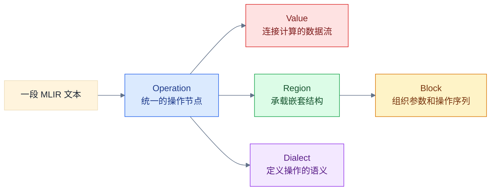

# Illustrated MLIR Phase One Implementation Plan

> **For agentic workers:** REQUIRED SUB-SKILL: Use superpowers:subagent-driven-development (recommended) or superpowers:executing-plans to implement this plan task-by-task. Steps use checkbox (`- [ ]`) syntax for tracking.

**Goal:** Create the Chinese reading map, shared runnable MLIR example, and first diagram-led chapter of the independent `IllustratedMLIR` learning series.

**Architecture:** Keep the existing `LearningSteps/*_Summary.md` files as technical references and add a separate narrative layer under `LearningSteps/IllustratedMLIR/`. One checked-in `accumulate.mlir` example is the source of truth, while Chinese Mermaid diagrams present the same IR through structural and object-model views.

**Tech Stack:** Markdown, Mermaid 11, MLIR textual IR, `mlir-opt`, MLIR C++ headers

---

## File Structure

- Create `mlir/LearningSteps/IllustratedMLIR/00_Reading_Map.md`: Chinese entry point, reading order, color legend, and scope.
- Create `mlir/LearningSteps/IllustratedMLIR/01_Why_Everything_Is_An_Operation.md`: first question-driven chapter and Chinese Mermaid diagrams.
- Create `mlir/LearningSteps/IllustratedMLIR/examples/accumulate.mlir`: runnable IR shared by the first volume.
- Reference but do not modify the existing structure, Operation, Builtin, and Phase 2 summary notes.
- Reference current definitions in `mlir/include/mlir/IR/{Operation,Region,Block,Value}.h` and `BuiltinOps.td`.

## Content Rules

- Reader-facing titles, Mermaid nodes, edges, legends, captions, and walkthroughs are stored in Chinese.
- Exact identifiers such as `Operation`, `builtin.module`, and `%result` remain unchanged and receive Chinese explanations.
- Mermaid uses a light `base` theme, white background, dark text, and stable semantic colors.
- Every diagram is followed by prose that tells the reader which relationship to inspect.
- Phase one explains the Operation model. Value, Region, Block, and Dialect receive previews, not full chapters.

### Task 1: Add and Validate the Shared IR Example

**Files:**
- Create: `mlir/LearningSteps/IllustratedMLIR/examples/accumulate.mlir`

- [ ] **Step 1: Create the approved example**

```mlir
module {
  func.func @accumulate(%n: index) -> i32 {
    %c0 = arith.constant 0 : i32
    %lb = arith.constant 0 : index
    %step = arith.constant 1 : index

    %result = scf.for %i = %lb to %n step %step
        iter_args(%sum = %c0) -> i32 {
      %value = arith.index_cast %i : index to i32
      %next = arith.addi %sum, %value : i32
      scf.yield %next : i32
    }

    return %result : i32
  }
}
```

- [ ] **Step 2: Run the parser and verifier**

```bash
build/bin/mlir-opt \
  mlir/LearningSteps/IllustratedMLIR/examples/accumulate.mlir \
  -o /tmp/illustrated-mlir-accumulate.mlir
rg -n "func.func @accumulate|arith.constant|scf.for|arith.index_cast|arith.addi|scf.yield|return" \
  /tmp/illustrated-mlir-accumulate.mlir
```

Expected: `mlir-opt` exits `0` without diagnostics and all seven operation forms are present.

- [ ] **Step 3: Commit the runnable example**

```bash
git add mlir/LearningSteps/IllustratedMLIR/examples/accumulate.mlir
git commit -m "docs: add illustrated MLIR anchor example"
```

### Task 2: Create the Chinese Reading Map

**Files:**
- Create: `mlir/LearningSteps/IllustratedMLIR/00_Reading_Map.md`

- [ ] **Step 1: Write the opening sections**

Use this content and heading order:

```markdown
# 图解 MLIR：阅读地图

## 这套图解解决什么问题

这套文章用一段持续演化、可以通过 `mlir-opt` 验证的 IR，依次解释
`Operation`、`Value`、`Region`、`Block` 和 `Dialect` 如何共同组成 MLIR。

## 适合谁阅读

- 知道编译器和 IR 的基本概念，但还无法独立阅读 MLIR。
- 看过零散的 MLIR API，却没有形成完整对象关系。
- 希望从可运行例子进入 MLIR 源码，而不是从类定义开始背诵。

## 第一册的主线
```

- [ ] **Step 2: Add the Chinese overview diagram**

````markdown

````

Explain that the arrow from the text to `Operation` is the entry point; the four outgoing relationships become the later chapters.

- [ ] **Step 3: Add reading order, status, legend, and run command**

Add these sections:

```markdown
## 推荐阅读顺序
## 图中的颜色约定
## 如何运行配套示例
## 当前完成状态
```

The reading order lists all six chapters in Chinese, but only chapter 1 is a link. The color table maps blue to Operation, green to Region, yellow to Block, red to Value/SSA, purple to Dialect/type semantics, and gray to source/tool context. Link `examples/accumulate.mlir` and include the Task 1 `mlir-opt` command.

- [ ] **Step 4: Render the embedded diagram**

```bash
mkdir -p /tmp/illustrated-mlir-reading-map/assets
/home/fuhao/.npm-global/bin/mmdc \
  -i mlir/LearningSteps/IllustratedMLIR/00_Reading_Map.md \
  -o /tmp/illustrated-mlir-reading-map/rendered.md \
  -a /tmp/illustrated-mlir-reading-map/assets \
  -t default -b white
```

Expected: exit code `0` and one rendered diagram under the assets directory.

- [ ] **Step 5: Commit the reading map**

```bash
git add mlir/LearningSteps/IllustratedMLIR/00_Reading_Map.md
git commit -m "docs: add illustrated MLIR reading map"
```

### Task 3: Write Chapter 1 Around the Operation Mental Model

**Files:**
- Create: `mlir/LearningSteps/IllustratedMLIR/01_Why_Everything_Is_An_Operation.md`
- Read: `mlir/docs/Tutorials/UnderstandingTheIRStructure.md:25`
- Read: `mlir/docs/Tutorials/Toy/Ch-2.md:35`
- Read: `mlir/include/mlir/IR/Operation.h:84`
- Read: `mlir/include/mlir/IR/Region.h:26`
- Read: `mlir/include/mlir/IR/Block.h:25`
- Read: `mlir/include/mlir/IR/Value.h:96`
- Read: `mlir/include/mlir/IR/BuiltinOps.td:33`

- [ ] **Step 1: Create the question-driven chapter skeleton**

```markdown
# 为什么 MLIR 中一切都是 Operation

## 从一个反直觉的问题开始
## 先说结论：Operation 是统一的 IR 节点
## 一条 Operation 里面有什么
## 函数和循环为什么也能是 Operation
## 把 accumulate.mlir 还原成对象树
## Operation 与 Op 不是同一个层次
## 回到 C++ 源码验证
## 三个常见误区
## 一张图总结本章
## 本章验证记录
## 继续阅读
```

Ask why constants, additions, functions, loops, and modules can all be operations. State precisely that executable and structural IR nodes use the Operation model; `Type`, `Attribute`, `Region`, `Block`, and `Value` are not Operations.

- [ ] **Step 2: Add a Chinese Operation anatomy diagram**

The blue central node is `Operation（统一操作节点）`. Add these relationships with Chinese edge labels:

```text
输入 operands -> Operation
Operation -> 输出 results
Operation -> 属性 attributes
Operation -> 类型与位置信息
Operation -> 零个或多个 Region
Operation -> 所属 Block
Operation -> 操作名，例如 arith.addi
```

Use red for input/output Value nodes, green for Region, and gray for metadata. The prose below explains that operands/results form Value relationships and nested code is reached through Region ownership.

- [ ] **Step 3: Embed and inventory the shared example**

Link `examples/accumulate.mlir`, reproduce it once, and include this exact table:

| 文本中的节点 | 所属 Dialect | 为什么是 Operation |
|---|---|---|
| `module` | `builtin` | 容纳顶层 Region 的结构节点 |
| `func.func` | `func` | 描述函数并拥有函数体 Region |
| `arith.constant` | `arith` | 产生 SSA 结果的计算节点 |
| `scf.for` | `scf` | 描述循环并拥有循环体 Region |
| `arith.addi` | `arith` | 消费两个 Value 并产生一个 Value |
| `scf.yield` | `scf` | 将循环体结果交回父操作 |
| `func.return` | `func` | 从函数返回 Value |

Explain that `module` is custom syntax for `builtin.module`; the omitted prefix does not change dialect ownership.

- [ ] **Step 4: Add the recursive object-tree diagram**

Represent this exact nesting with Chinese descriptions:

```text
builtin.module（模块操作）
  -> Region（模块区域）
    -> Block（模块块）
      -> func.func（函数操作）
        -> Region（函数体区域）
          -> Block（函数入口块）
            -> arith.constant（常量操作）
            -> scf.for（循环操作）
              -> Region（循环体区域）
                -> Block（循环体块）
                  -> arith.index_cast（类型转换操作）
                  -> arith.addi（加法操作）
                  -> scf.yield（循环让出操作）
            -> func.return（返回操作）
```

Use blue for operations, green for regions, and yellow for blocks. Explain that Operation owns Regions, Region owns Blocks, and Block owns an ordered operation list; an Operation does not directly own arbitrary child operations.

- [ ] **Step 5: Explain `Operation` versus typed `Op` wrappers**

```text
Operation
  运行时的通用 IR 对象，保存名字、输入、结果、属性、Region 等统一数据。

arith::AddIOp / func::FuncOp / scf::ForOp
  面向具体操作的轻量 C++ 包装，提供类型安全访问器和语义接口，底层仍指向 Operation。
```

Ground this in `mlir/docs/Tutorials/Toy/Ch-2.md`; do not describe typed wrappers as separately owned IR nodes.

- [ ] **Step 6: Add source anchors and deeper-reading links**

Use this source table:

| 要验证的事实 | 当前源码入口 |
|---|---|
| `Operation` 的通用存储和访问接口 | `include/mlir/IR/Operation.h` |
| `Region` 保存 Block 列表 | `include/mlir/IR/Region.h` |
| `Block` 保存参数和有序 Operation 列表 | `include/mlir/IR/Block.h` |
| `Value`、`BlockArgument`、`OpResult` | `include/mlir/IR/Value.h` |
| `builtin.module` 的定义 | `include/mlir/IR/BuiltinOps.td` |

Link `../Foundations/Step1_IR_Structure_Summary.md`, `../ODS/Operations_Summary.md`, `../Dialects/Builtin_Dialect_Summary.md`, and `../Transforms/Phase2_Core_Infrastructure_Summary.md`.

- [ ] **Step 7: Add misconceptions and the Chinese recap diagram**

Correct these claims:

1. “一切都是 Operation”不表示 `Value`、`Type`、`Attribute`、`Region`、`Block` 也是 Operation。
2. `func.func` 和 `scf.for` 不是只存在于语法层的特殊关键字，而是注册操作的文本形式。
3. Operation 通过 Region 和 Block 间接形成递归树，不是直接保存任意子 Operation 数组。

The final light-theme diagram summarizes in Chinese:

```text
统一 Operation 模型 -> 普通计算节点
统一 Operation 模型 -> 函数、循环、模块等结构节点
结构节点 -> Region -> Block -> 下一层 Operation
Operation 的结果 -> Value -> 下一条 Operation 的输入
Dialect -> 为具体 Operation 定义名字和语义
```

- [ ] **Step 8: Render every diagram in the completed chapter**

```bash
mkdir -p /tmp/illustrated-mlir-chapter1/assets
/home/fuhao/.npm-global/bin/mmdc \
  -i mlir/LearningSteps/IllustratedMLIR/01_Why_Everything_Is_An_Operation.md \
  -o /tmp/illustrated-mlir-chapter1/rendered.md \
  -a /tmp/illustrated-mlir-chapter1/assets -t default -b white
```

Expected: exit code `0`; each Mermaid fence produces a rendered asset with no syntax diagnostic.

- [ ] **Step 9: Record evidence and commit the complete chapter**

Under `本章验证记录`, record the exact `mlir-opt` and `mmdc` commands used, their versions, and whether parsing,
verification, and diagram rendering passed. Do not record a check as passed unless its command exited `0`.

```bash
git add mlir/LearningSteps/IllustratedMLIR/01_Why_Everything_Is_An_Operation.md
git commit -m "docs: explain MLIR operation model with diagrams"
```

### Task 4: Validate Phase One End to End

**Files:**
- Verify: `mlir/LearningSteps/IllustratedMLIR/00_Reading_Map.md`
- Verify: `mlir/LearningSteps/IllustratedMLIR/01_Why_Everything_Is_An_Operation.md`
- Verify: `mlir/LearningSteps/IllustratedMLIR/examples/accumulate.mlir`

- [ ] **Step 1: Re-run MLIR verification**

```bash
build/bin/mlir-opt \
  mlir/LearningSteps/IllustratedMLIR/examples/accumulate.mlir \
  -o /tmp/illustrated-mlir-final.mlir
```

Expected: exit code `0` and no diagnostics.

- [ ] **Step 2: Render all embedded Mermaid diagrams**

```bash
mkdir -p /tmp/illustrated-mlir-render/map/assets
mkdir -p /tmp/illustrated-mlir-render/chapter1/assets
/home/fuhao/.npm-global/bin/mmdc \
  -i mlir/LearningSteps/IllustratedMLIR/00_Reading_Map.md \
  -o /tmp/illustrated-mlir-render/map/rendered.md \
  -a /tmp/illustrated-mlir-render/map/assets -t default -b white
/home/fuhao/.npm-global/bin/mmdc \
  -i mlir/LearningSteps/IllustratedMLIR/01_Why_Everything_Is_An_Operation.md \
  -o /tmp/illustrated-mlir-render/chapter1/rendered.md \
  -a /tmp/illustrated-mlir-render/chapter1/assets -t default -b white
```

Expected: both commands exit `0`; every Mermaid fence produces an artifact; no diagram syntax error is printed.

- [ ] **Step 3: Check Chinese persistence and incomplete-content markers**

```bash
rg -n "[一-龥]" \
  mlir/LearningSteps/IllustratedMLIR/00_Reading_Map.md \
  mlir/LearningSteps/IllustratedMLIR/01_Why_Everything_Is_An_Operation.md
rg -n "T[B]D|T[O]DO|F[I]XME|占位" mlir/LearningSteps/IllustratedMLIR
```

Expected: the first command finds Chinese prose and diagram labels in both files; the second prints nothing. Manually confirm remaining English inside diagrams is an exact technical identifier.

- [ ] **Step 4: Check links, whitespace, and scope**

```bash
test -f mlir/LearningSteps/IllustratedMLIR/examples/accumulate.mlir
test -f mlir/LearningSteps/Foundations/Step1_IR_Structure_Summary.md
test -f mlir/LearningSteps/ODS/Operations_Summary.md
test -f mlir/LearningSteps/Dialects/Builtin_Dialect_Summary.md
test -f mlir/LearningSteps/Transforms/Phase2_Core_Infrastructure_Summary.md
git diff --check HEAD~3..HEAD
```

Expected: every command exits `0`; no Pass, PatternRewriter, or DialectConversion tutorial was added.

- [ ] **Step 5: Record final state**

```bash
git status --short
git log -4 --oneline
```

Expected: clean worktree and the plan plus three phase-one commits at the branch tip.
